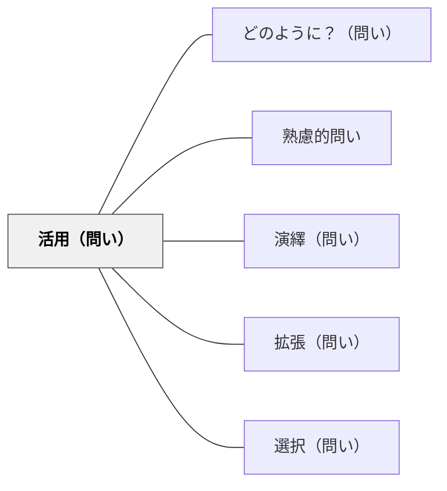

# 活用（問い）

> 「これをどう使えるか？どの場面で役立つか？」と問い、知識を実践へとつなぐ橋を架ける。

## 背景（Context）
学校教育でよく起きる問題に「知っているが使えない」という現象がある。
知識を学ぶことと、その知識を現実の文脈で活用することは異なる認知活動だ。
活用の問いは、学習内容と実際の生活・問題・文脈との橋渡しをする問いだ。
「役に立つ」という実感が学習への内発的動機を高める効果もある。

## 問題（Problem）
学習者が知識・スキル・概念を理解しているように見えるが、それをどの場面でどう使えるかが見えていないとき、どう実践的な転移を促すか。

## 力のかたち（Forces）
- 活用の問いは具体的な文脈を想像させることで、抽象的な理解を実践に着地させる。
- 「どの場面で？」を問うことで、知識の適用条件と範囲が明確になる。
- 活用を問われると、学習者は「自分ごと」として知識を捉え直す。
- 一方で、浅い活用の問い（「日常生活のどこかで使えますか？」）は形式的な答えしか引き出さない。

## 解決（Solution）
「この考えをあなたの〇〇にどう使えそうですか？」「どんな問題を解決するのに役立ちますか？」と具体的な文脈と結びつけて問いかける。
「もし〇〇という状況だったら、今日学んだことをどう使いますか？」とシナリオを設定することも有効だ。
実際のプロジェクトや課題に学びを応用する機会を設け、活用を問いだけで終わらせない。
「どの場面で使えないか？」という逆の問いで適用範囲を精密化させる。

## 結果（Consequences）
学習内容が現実の文脈に根ざし、忘れにくく応用しやすい知識になる。
「学ぶことには意味がある」という感覚が学習への動機を強化する。
知識の転移能力（新しい文脈での適用力）が育まれる。
実践的な失敗と成功の経験が積み重なり、より深い理解が生まれる。

## 関連パタン
- [[パタン/どのように？（問い）]]
- [[パタン/熟慮的問い]] — 親パタン
- [[パタン/演繹（問い）]] — 法則を個別に適用する問い
- [[パタン/拡張（問い）]] — 活用を別のドメインへと広げる問い
- [[パタン/選択（問い）]] — どの場面でどの方法を選ぶかを問う

## クラスター図

## Actionable Insight

- 概念を教えた後に「あなたの生活のどの場面でこれが役立ちそうですか？」と問いかける——具体的な文脈と結びつくことで「知っているだけ」から「使える知識」への転換が始まる
- 「もし〇〇という状況だったら、今日学んだことをどう使いますか？」とシナリオを設定して問う——仮想場面への適用が知識の転移力を育てる
- 「どの場面では使えないか？」という逆の問いを加える——適用の限界を考えることで知識の輪郭が明確になり精度の高い理解が生まれる

## 出典
- [[文献/熟慮的問いのパターンリスト（動画記録）]]
