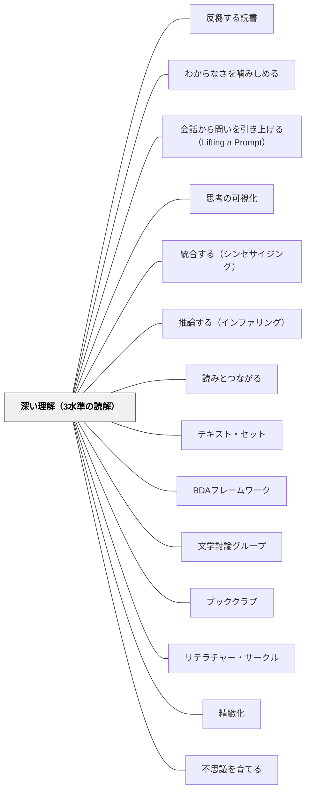

# 深い理解（3水準の読解）

> 「読んだ」は終点ではない——「それが自分にとってどんな意味を持つか」を考えられたとき、初めて本当に読んだことになる。

---

## Pattern Connection

**出典**: Dorn, L. J., & Soffos, C.（2005）*Teaching for Deep Comprehension: A Reading Workshop Approach*. Stenhouse Publishers.（初回統合：2026-05-15 / 全文照合・拡張：2026-05-19）

- **既存パタンとの関連**: [[パタン/推論する（インファリング）]] が第2水準（推論的理解）の方略を扱うのに対して、本パタンは「第1〜第3水準の3層として読解を捉え、第3水準（応用的理解）を明示的に指導する」という視座を提供する。[[パタン/読みとつながる]] の「テキストと自己・他のテキスト・世界をつなぐ」という行為は、本パタンでいう第3水準の読解と重なる——本パタンはその背景にある「なぜつながりを作ることが深い理解を生むのか」の認知的根拠を加える
- **補強された点（2026-05-19）**: Dorn & Soffos の **4種の知識フレームワーク**（汎用的・テキスト・方略的・省察的）が深い理解の「しくみ」を説明する。3水準は「何を読み取るか」の分類、4種の知識は「どんな知識が働いているか」の分類——2つのフレームワークは補完関係にある。省察的知識（Reflective Knowledge）＝メタ認知が働いたとき「深い理解」に到達する
- **補強された点**: [[パタン/BDAフレームワーク]] の After フェーズに「どの水準の理解を目指す活動か」を問う視点が加わった——「要約＝第1水準の確認」「推論の共有＝第2水準の深化」「テキストが自分の生き方に与える影響を語る＝第3水準の到達」という区別が、After の活動設計を精緻化する
- **修正・拡張された点**: 読解指導が「理解できたか」の確認（第1水準チェック）で終わりがちな実践に、「第3水準まで引き上げることを意図して設計する」という目標の転換を促す。また、Dorn & Soffos の3つの問い（「道具が読書の目的になっていないか」「モデルが理解の障壁になっていないか」「理解は本当に教えられるか」）が、既存の全パタンを見直す批評的レンズを提供する
- **他のパタンへの波及**: [[パタン/テキスト・セット]] — 第3水準（比較・判断・評価）はセット内の複数テキストで自然に起動する。[[パタン/ブッククラブ]] / [[パタン/リテラチャー・サークル]] / [[パタン/文学討論グループ]] — 討論が第3水準を引き出す場になる

---

## 背景（Context）

読解を教えるとき、「理解できたか」を確認する問いは多い——「誰が登場しましたか？」「どこで起きましたか？」「何が問題でしたか？」。これらは第1水準（文字通りの理解）の確認だ。

しかし読書の最も豊かな経験は、テキストが自分の思考・判断・価値観・行動に何らかの変化をもたらすときに起きる——「この本を読んで、自分の見方が変わった」「このキャラクターの選択を自分ならどうするか考え続けている」という状態が「深い理解」だ。

Dorn & Soffos（2005）は、理解を3つの水準として整理し、教師が意図的に第3水準へ引き上げる指導をデザインすることを求めた。3水準のフレームワークは「読解の地図」——どこにいるかが分かり、どこへ向かえばいいかが見える。

## 問題（Problem）

読解指導が第1水準（文字通りの理解）の確認で終わると：

- 読書が「正解を答える作業」になり、テキストへの個人的な関与が生まれない
- 推論・評価・判断という高次の思考が授業に入らない
- 「本を読んで考えが変わった・影響を受けた」という深い読書体験が積み重ならない
- テスト形式の発問が読書の動機を外発的なものにする

## 力のかたち（Forces）

- 第1水準なしには第2・3水準はない——「何が起きたか」を押さえることは基盤として必要
- しかし第1水準の確認が授業を支配すると、それ以上に進む時間と動機がなくなる
- 第3水準（応用的理解）は「自由に話していいよ」だけでは起きない——問いの設計と場の構造が必要
- 推論と評価は社会的文脈（討論・ペアトーク・書く）で深まる——一人で黙って読むだけでは第3水準は難しい

## 解決（Solution）

**読解の3水準（文字通り→推論的→応用的）を教師が明示的に意識し、授業・問い・活動を第3水準まで到達するよう設計する。**

---

### 3水準の詳細

**第1水準：文字通りの理解（Literal Comprehension）**

テキストに明示された情報を正確に理解する：

| 問いの例 | 扱う情報 |
|---|---|
| 誰が登場しましたか？ | 登場人物・対象 |
| どこで・いつ起きましたか？ | 場所・時間 |
| 何が起きましたか？ | 出来事・事実 |
| テキストにはどう書かれていましたか？ | 明示された情報 |

**第1水準は「床（フロア）」——ここから始まるが、ここで終わらない。**

---

**第2水準：推論的理解（Inferential Comprehension）**

テキストに書かれていないことを、既有知識＋テキストの手がかりから推論する：

| 問いの例 | 思考プロセス |
|---|---|
| なぜそうしたと思いますか？ | 動機の推論 |
| 次に何が起きると思いますか？ | 予測 |
| 作者はなぜこの言葉を選んだでしょうか？ | 意図の推論 |
| 「〇〇」はどういう意味だと思いますか？ | 文脈からの語義推論 |

→ 詳細は [[パタン/推論する（インファリング）]] を参照

---

**第3水準：応用的理解（Applied Comprehension）**

テキストを比較・判断・評価し、自分の生き方・考え方との関係を見つける：

| 問いの例 | 思考プロセス |
|---|---|
| この本で一番重要だと思うことは何ですか？なぜ？ | 価値判断 |
| 主人公の選択に賛成しますか？あなたならどうしますか？ | 立場の表明 |
| このテーマについて他に読んだ本と比べると？ | テキスト間比較 |
| この本を読んで、あなたの考えは変わりましたか？ | 影響の内省 |
| この本が問いかけていることは何ですか？ | 主題の抽出 |
| この本を誰かに薦めますか？なぜ？ | 評価と推薦 |

**第3水準が「深い理解」——読んだことが思考・判断・価値観に変化をもたらす。**

---

### 3つの問い：教師への批評的レンズ

Dorn & Soffos が教師に突きつける3つの問い：

**問い①「理解は教えることができるか？」**

→ 手順を教えることと、理解を深める支援をすることは別物だ。ストラテジーの手順（「つながりを3つ書きましょう」）を教えても、理解が深まるとは限らない。「手順の習得」が「理解のふりをするスキル」になっていないか確認する。

**問い②「モデルはどのように理解の障壁になるか？」**

→ グラフィック・オーガナイザー・思考フレームは足場として有効だが、それ自体が目的になると問題が起きる。「ベン図を完成させること」が「2つのテキストを比較し理解すること」に替わっていないか確認する。

**問い③「道具はいつ読書の目的になるか？」**

→ クイックライト・ポスト・イット・ダブルエントリーは読みを深めるツール——しかし「ツールを使った証拠として」読書が行われると、ツールが読書を侵食する。「付箋を3枚貼ること」が目標になっていないか。道具は手段、読みが目的。

---

### 水準を引き上げる問いの設計

**Before（読む前）の問い**

| 目的 | 問いの例 |
|---|---|
| 第1水準の準備 | 「この話はどんな話だと思いますか？（表紙・タイトルから）」 |
| 第3水準への予告 | 「読み終えたとき、どんな問いが残りそうですか？」 |

**During（読む間）の問い**

| 目的 | 問いの例 |
|---|---|
| 第1水準の確認 | 「今読んだ部分で、一番重要な出来事は？」 |
| 第2水準を引き出す | 「このキャラクターはなぜそう言ったと思いますか？」 |
| 第3水準を種まき | 「この場面で、あなたはどう感じましたか？」 |

**After（読んだ後）の問い**

| 目的 | 問いの例 |
|---|---|
| 第2水準の深化 | 「作者が伝えたかったことは何だと思いますか？」 |
| 第3水準の到達 | 「この本があなたの考えを変えましたか？どんなふうに？」 |
| 評価・推薦 | 「この本を誰かに薦めますか？どんな理由で？」 |

---

### 4種の知識：深い理解のしくみ

Dorn & Soffos（Ch.2）は、3水準と並行して「リーダーが動員する4種の知識」を説明する。これは「深い理解がどのように起きるか」のメカニズム論だ：

| 知識の種類 | レベル | 内容 |
|---|---|---|
| **汎用的知識（Generic Knowledge）** | Surface | 読書の一般規則（ページの方向・段落構造等）＋世界の背景知識 |
| **テキスト知識（Text Knowledge）** | Surface | 今読んでいる本についての知識——登場人物・語彙・著者のスタイル |
| **方略的知識（Strategic Knowledge）** | Deep | 問題解決の手順——意味が崩れたときにどうするかを知っている |
| **省察的知識（Reflective Knowledge）** | Deep | 自分の理解プロセスを観察・調整する力——メタ認知 |

**深い理解の到達条件**：省察的知識（Reflective Knowledge）が働いたとき。読者が「自分は今推論している」「ここで混乱している」と気づき、それを調整できる状態が深い理解の証拠。

**教師への示唆**：「第3水準の問いを投げる」だけでは深い理解は起きない。読者が「自分の理解を調整する」経験を積む場——1対1カンファリング・文学討論グループ・読書ログへの記録——が省察的知識を育てる文脈になる。

---

### 水準の「地図」を教室に掲示する

3水準の読解を子どもと共有する：

```
私たちの読解の地図

第1水準（文字通り）：テキストに書いてあること
  → 誰が・何を・どこで・いつ

第2水準（推論的）：テキストに書いていないことを考える
  → なぜ・どのように・もしも〜なら

第3水準（応用的）：読んだことが自分にとって何を意味するか
  → どう思う？自分の生活との関係は？この本が大切な理由は？
```

子どもたちが「今、どの水準で話しているか」を自覚できると、討論の質が上がる。

---

## 結果（Consequences）

- 読解の「目的地」が第3水準として明確になり、授業の問いと活動の設計が変わる
- 「正解を言う読書」から「自分の読みを語る読書」へと学習者の立場が変わる
- 3つの問い（道具・モデル・教えること）を自問することで、既存の指導ツールの使い方を批評的に見直せる
- ただし、第3水準は第1・第2水準の基盤なしには到達しない——「なんとなくいいと思う」という第3水準もどきを避けるためには、第1水準の確認と第2水準の推論が先に必要

## 関連パタン
- [[パタン/反芻する読書]]
- [[教科/国語]]
- [[実践/読み語りの実践]]
- [[実践/詩歌の授業（詩を書く・詩を読む）]]
- [[パタン/わからなさを噛みしめる]]
- [[パタン/会話から問いを引き上げる（Lifting a Prompt）]]
- [[パタン/思考の可視化]]
- [[パタン/統合する（シンセサイジング）]]

- [[パタン/推論する（インファリング）]] — 第2水準の詳細：書かれていないことを読む
- [[パタン/読みとつながる]] — 第3水準に直結：自己・他のテキスト・世界とのつながり
- [[パタン/テキスト・セット]] — 第3水準（比較・評価）が複数テキストで起動する
- [[パタン/BDAフレームワーク]] — 各フェーズに3水準を対応させた指導設計
- [[パタン/文学討論グループ]] — 第3水準・省察的知識を引き出す7コンポーネント討論
- [[パタン/ブッククラブ]] / [[パタン/リテラチャー・サークル]] — 第3水準を引き出す社会的文脈
- [[実践/文学討論グループの設計]] — 第3水準を目指す討論の設計
- [[パタン/精緻化]] — 応用的理解は既知の知識と新しい読みの精緻化
- [[パタン/不思議を育てる]] — 第3水準の問いが次の読みの「不思議」になる
- [[パタン/共有読書（Shared Reading）]] — 省察的知識の足場を教師がモデリングする場

---

## クラスター図



## Actionable Insight

- 次の授業の「まとめの問い」を1つ変える——「この話を要約してください（第1水準）」を「この話を読んで、あなたの考えが変わったことはありますか？（第3水準）」に換える
- 「問いの水準チェック」を習慣にする——授業で使う発問を書き出して「第1・第2・第3水準」のどれかを確認する。第1水準の問いが8割なら、1つを第3水準に変える
- 授業の後に Dorn & Soffos の問いを自問する——「今日のツール（付箋・グラフィック・オーガナイザー等）は、理解を深めるために使ったか、完成させるために使ったか？」

---

## 出典
- [[文献/Teaching for Deep Comprehension（Dorn & Soffos）]]

Dorn, L. J., & Soffos, C. (2005). *Teaching for Deep Comprehension: A Reading Workshop Approach*. Stenhouse Publishers.

> 「理解は心の反映だ——読者の思考への窓である。第3水準の理解とは、その窓から見える景色が読者自身の生き方と重なるときに生まれる。」——Dorn & Soffos（2005）
