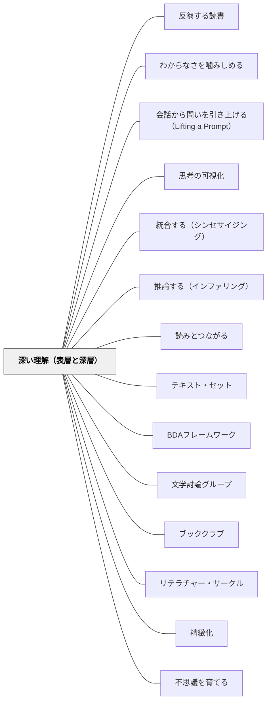

# 深い理解（表層と深層）

> 「読んだ」は終点ではない——書いてあることを思い出せる表層の理解から、本文を越えて考え、書き手の意図と自分の見方を結びつける深層の理解へ。そこまで届いたとき、読んだことが考え方を変える。

---

## Pattern Connection

**出典**: Dorn, L. J., & Soffos, C.（2005）*Teaching for Deep Comprehension: A Reading Workshop Approach*. Stenhouse Publishers.（初回統合：2026-05-15 / 全文照合・拡張：2026-05-19 / 原本照合で二水準に組み直し：2026-09-27）

- **既存パタンとの関連**: Dorn & Soffos は、心は情報を**表層（surface）と深層（deep）の二つの水準**で処理すると言う。[[パタン/推論する（インファリング）]] は、書かれていないことを読んで表層を越える働きを扱う——Dorn & Soffos も、深い理解には推論し、問いをもち、関係する知識源どうしをつなぐことが要ると書く。[[パタン/読みとつながる]] の「テキストと自己・他のテキスト・世界をつなぐ」行為は、深層でいう「書き手の意図と読み手の見方の統合」への入口になる——本パタンはその背景にある「なぜつながりを作ることが深い理解を生むのか」の認知的根拠を加える
- **補強された点**: Dorn & Soffos の **4種の知識**（汎用的＝背景知識・テキスト・方略的・省察的）が深い理解の「しくみ」を説明する。二つの水準は「理解がどこまで届いたか」、4種の知識は「何が組み合わさって深さが生まれるか」——2つの見方は補い合う。4種はパズルのピースのように組み合わさり、一つ欠けても理解の深さが損なわれる。省察的知識は「読むことの究極の目標」とされる
- **補強された点**: [[パタン/BDAフレームワーク]] の After フェーズに「表層の確認か、深層を狙う活動か」を問う視点が加わる——「要約＝表層の確認」「推論の共有・テキストが自分の考えに与えた影響を語る＝深層へ」という区別が、After の活動設計を精緻化する
- **修正・拡張された点**: 読解指導が「理解できたか」の確認（表層のチェック）で終わりがちな実践に、「深層まで届くことを意図して設計する」という目標の転換を促す。Dorn & Soffos 自身、表層の評価（読んだ直後の再話）は役に立つが、理解の過程を読み取る価値には限りがあると書く。また、Dorn & Soffos の3つの問い（「理解は教えられるか」「モデルはいつ理解の障壁になるか」「道具はいつ読書の理由になるか」）が、既存の全パタンを見直す批評的レンズを提供する
- **他のパタンへの波及**: [[パタン/テキスト・セット]] — 比較・判断・評価という深層の問いは、セット内の複数テキストで自然に起動する。[[パタン/ブッククラブ]] / [[パタン/リテラチャー・サークル]] / [[パタン/文学討論グループ]] — Dorn & Soffos は、本について人と話し合うことが理解の深さに大きく影響すると書く。討論が深層を引き出す場になる

---

## 背景（Context）

読解を教えるとき、「理解できたか」を確認する問いは多い——「誰が登場しましたか？」「どこで起きましたか？」「何が問題でしたか？」。これらは表層（文字どおりの理解）の確認だ。

しかし読書の最も豊かな経験は、テキストが自分の思考・判断・価値観・行動に何らかの変化をもたらすときに起きる——「この本を読んで、自分の見方が変わった」「このキャラクターの選択を自分ならどうするか考え続けている」という状態が「深い理解」だ。

Dorn & Soffos（2005）は、心は情報を表層（surface）と深層（deep）の二つの水準で処理すると言う。表層は本文の事実を思い出せる文字どおりの理解、深層は本文を越えて考え、書き手の意図と読み手の見方を統合する概念的な理解で、「深い読み」は私たちの考え方や学び方を変えうる。二つの水準は評価のしやすさも違う。表層は読んだ直後の再話で確かめられるが、深層の解釈は読み手の経験に左右されるので、単純な評価では測りにくい。だから学校は測りやすい表層に寄りやすい。

## 問題（Problem）

読解指導が表層（文字どおりの理解）の確認で終わると：

- 読書が「正解を答える作業」になり、テキストへの個人的な関与が生まれない
- 推論・評価・判断という、本文を越えて考える思考が授業に入らない
- 「本を読んで考えが変わった・影響を受けた」という深い読書体験が積み重ならない——Dorn & Soffos は、表層の読みばかりが続くと知識の伸びが妨げられると書く
- テスト形式の発問が読書の動機を外発的なものにする

## 力のかたち（Forces）

- 表層なしに深層はない——「何が起きたか」を押さえることは基盤として必要
- しかし表層の確認が授業を支配すると、それ以上に進む時間と動機がなくなる。Dorn & Soffos は、表層を越えて考えようとするには動機が要り、深く考える方略をもっていても、その気がなければ表層にとどまると書く
- 深層は「自由に話していいよ」だけでは起きない——問いの設計と場の構造が必要
- 深層は社会的文脈（討論・ペアトーク・書く）で深まる——Dorn & Soffos は、深い理解は文学討論グループや読書記録（literature response logs）に書くといった、ふり返りの機会を通して育つと書く。一人で黙って読むだけでは深層は難しい

## 解決（Solution）

**表層と深層の二つの水準を教師が意識し、表層を足場にしながら、深層まで届く問いと場（話す・書く）を設計する。**

---

### 二つの水準

**表層：文字どおりの理解（Surface level）**

本文に書いてある事実を思い出せる水準。思い出すのは短期記憶なので、読んだばかりかどうかに左右される：

> "The surface level of comprehension is a literal level of understanding represented by the ability to recall factual information from the text."

| 問いの例 | 扱う情報 |
|---|---|
| 誰が登場しましたか？ | 登場人物・対象 |
| どこで・いつ起きましたか？ | 場所・時間 |
| 何が起きましたか？ | 出来事・事実 |
| テキストにはどう書かれていましたか？ | 明示された情報 |

**表層は「床（フロア）」——ここから始まるが、ここで終わらない。**

---

**深層：概念的な理解（Deep level）**

本文を越えて考え、書き手の意図と読み手の見方を統合するところに生まれる水準。複数の情報源を分析・統合した結果として、理解が新しい意味の段階へ引き上げられる：

> "The deep level of comprehension is a conceptual level of understanding that results from the reader's ability to think beyond the text, thus integrating the author's intentions with the reader's point of view."

深層へ向かう問いを、ここでは向きで二つに分けて並べる（この二つの分け方は Dorn & Soffos のものではなく、このページの整理）。

**深層の一——書いていないことを読む（推論）**

Dorn & Soffos は、読むときの推論を「文字どおりの本文を越え、自分の経験と書き手の意図したメッセージのあいだに心の橋を架けること」と説明し、深い理解には推論し、問いをもち、知識源どうしをつなぐことが要ると書く。推論は、表層から深層へ向かう働きだ：

| 問いの例 | 思考プロセス |
|---|---|
| なぜそうしたと思いますか？ | 動機の推論 |
| 次に何が起きると思いますか？ | 予測 |
| 作者はなぜこの言葉を選んだでしょうか？ | 意図の推論 |
| 「〇〇」はどういう意味だと思いますか？ | 文脈からの語義推論 |

→ 詳細は [[パタン/推論する（インファリング）]] を参照

**深層の二——自分の側へ引き寄せる**

テキストを比較・判断・評価し、自分の生き方・考え方との関係を見つける：

| 問いの例 | 思考プロセス |
|---|---|
| この本で一番重要だと思うことは何ですか？なぜ？ | 価値判断 |
| 主人公の選択に賛成しますか？あなたならどうしますか？ | 立場の表明 |
| このテーマについて他に読んだ本と比べると？ | テキスト間比較 |
| この本を読んで、あなたの考えは変わりましたか？ | 影響の内省 |
| この本が問いかけていることは何ですか？ | 主題の抽出 |
| この本を誰かに薦めますか？なぜ？ | 評価と推薦 |

**深層に届いたとき、読んだことが思考・判断・価値観に変化をもたらす。** Dorn & Soffos のいう「深い読み」は、私たちの考え方や学び方を変える可能性をもつ。

---

### 3つの問い：教師への批評的レンズ

Dorn & Soffos は本書の序で、教師たちに投げた3つの問いから始める：

**問い①「理解は教えることができるか？」（Can comprehension be taught?）**

→ Dorn & Soffos は「意味を教えることはできないだろう」と答える。意味は読み手の心の中にしかなく、テキストは意味を刺激できても、意味を作ることはできない。教師にできるのは、子どもの考える過程を動かす条件を整えることで、その最も大事な道具は、本について子どもと話すときの教師の言葉だという。点検の例：ストラテジーの手順（「つながりを3つ書きましょう」）を教えることが、考える条件を整えることの代わりになっていないか。

**問い②「モデルはいつ理解の障壁になるか？」（When does a model become a barrier to comprehension?）**

→ モデルとは、ほかの場面にも使える、よい考え方の具体例のこと。読み手がモデルそのものを目標だと受け取ると、モデルは他人の考えをまねる行動になってしまう。導かれた練習がなければ、モデルは学びの障壁になりうる。だからモデルを見せたら、すぐに練習につなぐ。点検の例：「ベン図を完成させること」が「2つのテキストを比べて理解すること」に替わっていないか。

**問い③「道具はいつ読書の理由になるか？」（When does the tool become the reason for reading?）**

→ 子どもはしばしば、付箋を使うことや読書記録に書くことを読書の目的だと受け取る。道具は大事だが、それが読む理由ではない。「読むこと＝イメージを描くこと」「読むこと＝自分とのつながりを作ること」のように一つの方略だけで読書を捉えると、深い理解が損なわれる。単独の方略ではなく、方略を組み合わせて使うことが深い理解の条件だ。点検の例：「付箋を3枚貼ること」が目標になっていないか。道具は手段、読みが目的。

---

### 水準を引き上げる問いの設計

**Before（読む前）の問い**

| 目的 | 問いの例 |
|---|---|
| 表層の準備 | 「この話はどんな話だと思いますか？（表紙・タイトルから）」 |
| 深層への予告 | 「読み終えたとき、どんな問いが残りそうですか？」 |

**During（読む間）の問い**

| 目的 | 問いの例 |
|---|---|
| 表層の確認 | 「今読んだ部分で、一番重要な出来事は？」 |
| 深層へ（書いていないことを読む） | 「このキャラクターはなぜそう言ったと思いますか？」 |
| 深層へ（自分の側へ引き寄せる）の種まき | 「この場面で、あなたはどう感じましたか？」 |

**After（読んだ後）の問い**

| 目的 | 問いの例 |
|---|---|
| 深層へ（書いていないことを読む） | 「作者が伝えたかったことは何だと思いますか？」 |
| 深層へ（自分の側へ引き寄せる） | 「この本があなたの考えを変えましたか？どんなふうに？」 |
| 評価・推薦 | 「この本を誰かに薦めますか？どんな理由で？」 |

---

### 4種の知識：深い理解のしくみ

Dorn & Soffos（Ch.2）は、表層・深層の二つの水準と並行して「よい読み手が統合する4種の知識」を説明する（Graesser & Clark 1985 を改変）。これは「深い理解がどのように起きるか」のしくみの説明だ。4種の知識はパズルのピースのように組み合わさり、一つが欠けると理解の深さが損なわれる：

| 知識の種類 | 内容 |
|---|---|
| **汎用的知識（Generic Knowledge）** | 読み手の背景知識——世界についての一般的な理論（スキーマ）。信念や見方を含み、本文の解釈に影響する。背景知識が足りないと、理解は表層にとどまる |
| **テキスト知識（Text Knowledge）** | 本文そのもののメッセージについての知識——内容の知識・語彙の意味・文章の構造 |
| **方略的知識（Strategic Knowledge）** | 問題解決の方略の知識——理解をモニターする、意味の通る解決を探す、いろいろな知識源を統合する、自分で修正する |
| **省察的知識（Reflective Knowledge）** | 抽象的に考える力——本文を越えて考え、統合・分析・批評する。読むことの究極の目標 |

**深い理解を可能にする四つの条件**：Dorn & Soffos は、教師たちとの話し合いから次の四つを挙げる。

1. 内容を理解するのに十分な背景知識がある
2. 教材が意味があり、自分にかかわり、動機を引き出すもので、時間をかけて、いろいろな目的で注意を保てる
3. 情報を処理する時間が十分にある——必要に応じて読み返し、はっきりさせ、分析し、調べる時間を含む
4. 内容に関心をもつ他の人と話すことで、知識源どうしの関係に気づき、理解が深まる

**教師への示唆**：「深層の問いを投げる」だけでは深い理解は起きない。Dorn & Soffos は、深い理解は文学討論グループや読書記録に書くといった、ふり返りの機会を通して育つとし、深い思考を評価するには、こうした言葉を使う経験の中で子どもを観察し、やりとりする必要があると書く。

---

### 水準の「地図」を教室に掲示する

二つの水準を子どもと共有する：

```
私たちの読解の地図

表層：テキストに書いてあること
  → 誰が・何を・どこで・いつ

深層：テキストを越えて考えること
  ・書いていないことを読む
    → なぜ・どのように・もしも〜なら
  ・自分の側へ引き寄せる
    → どう思う？自分の生活との関係は？この本が大切な理由は？
```

子どもたちが「今、表層と深層のどちらで話しているか」を自覚できると、討論の質が上がる。

---

## 結果（Consequences）

- 読解の「目的地」が深層として明確になり、授業の問いと活動の設計が変わる
- 「正解を言う読書」から「自分の読みを語る読書」へと学習者の立場が変わる
- 3つの問い（教えること・モデル・道具）を自問することで、既存の指導ツールの使い方を批評的に見直せる
- 深層は測りにくい——再話のような表層の評価だけでは見えないので、討論や読書記録の中で子どもを見る必要がある
- ただし、深層は表層の基盤なしには届かない——「なんとなくいいと思う」という深い理解もどきを避けるためには、何が起きたかを押さえ、書いていないことを推論する段取りが先に必要

## 関連パタン
- [[パタン/反芻する読書]]
- [[教科/国語]]
- [[実践/読み語りの実践]]
- [[実践/詩歌の授業（詩を書く・詩を読む）]]
- [[パタン/わからなさを噛みしめる]]
- [[パタン/会話から問いを引き上げる（Lifting a Prompt）]]
- [[パタン/思考の可視化]]
- [[パタン/統合する（シンセサイジング）]]

- [[パタン/推論する（インファリング）]] — 深層へ向かう働き：書かれていないことを読む
- [[パタン/読みとつながる]] — 深層に直結：自己・他のテキスト・世界とのつながりが、書き手の意図と自分の見方の統合への入口になる
- [[パタン/テキスト・セット]] — 深層の比較・評価が複数テキストで起動する
- [[パタン/BDAフレームワーク]] — 各フェーズで表層・深層のどちらを狙う問いかを区別する指導設計
- [[パタン/文学討論グループ]] — 深層・省察的知識を引き出す7コンポーネント討論
- [[パタン/ブッククラブ]] / [[パタン/リテラチャー・サークル]] — 深層を引き出す社会的文脈
- [[実践/文学討論グループの設計]] — 深層を目指す討論の設計
- [[パタン/精緻化]] — 深層の理解は既知の知識と新しい読みの精緻化
- [[パタン/不思議を育てる]] — 深層の問いが次の読みの「不思議」になる
- [[パタン/共有読書（Shared Reading）]] — 省察的知識の足場を教師がモデリングする場
- [[パタン/ガイデッド・リーディング（小グループの読み指導）]] — 小グループの対話が、表層の確認を越えて深層まで読解を引き上げる場として機能

---

## クラスター図



## Actionable Insight

- 次の授業の「まとめの問い」を1つ変える——「この話を要約してください（表層）」を「この話を読んで、あなたの考えが変わったことはありますか？（深層）」に換える
- 「問いの水準チェック」を習慣にする——授業で使う発問を書き出して、表層か深層（書いていないことを読む／自分の側へ引き寄せる）かを確認する。表層の問いが8割なら、1つを深層の問いに変える
- 授業の後に Dorn & Soffos の問いを自問する——「今日の道具（付箋・グラフィック・オーガナイザー等）は、理解を深めるために使ったか、完成させるために使ったか？」

---

## 出典
- [[文献/Teaching for Deep Comprehension（Dorn & Soffos）]]

Dorn, L. J., & Soffos, C. (2005). *Teaching for Deep Comprehension: A Reading Workshop Approach*. Stenhouse Publishers.——序（3つの問い）、第2章 "Levels of Comprehension"（表層と深層の二つの水準）・"Processing Relationships"（4種の知識）・"Teaching for Self-Reflection"（深い理解を可能にする四つの条件）・"Inferential Thinking"

> 「私たちが深い読みと呼ぶものは、私たちの考え方や学び方を変える可能性をもっている。」——Dorn & Soffos（2005, Ch.2）
>
> "What we call deep reading has the potential to change the way we think and learn."
>
> "The mind stores and processes information at two levels of comprehension: surface and deep."
