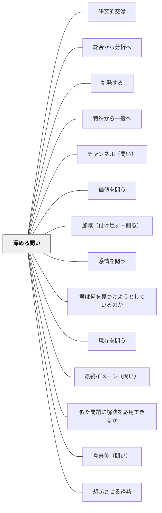

# 深める問い

**一文でいうと**：事実確認で止めず、理由・意味・根拠・別視点へ思考を進める問いを置く。

## 使いどころ・使いすぎ注意

| 観点         | 内容                                             |
| ------------ | ------------------------------------------------ |
| 使いどころ   | 理由・根拠・意味へ進めたいとき。                 |
| 使いすぎ注意 | 問いを重ねすぎると、子どもの思考が追いつかない。 |

> 表面的な答えから核心へ掘り下げる問い。「なぜ？→なぜ？→なぜ？」の連鎖で本質に迫る。

## 背景（Context）

学習者が最初に出す答えは、しばしば表面的・直感的なものである。一度答えが出た後に「本当のところは？」「もっと根本的に考えると？」と問い続けることで、思考の深い層にある本質的な理解に到達できる。

## 問題（Problem）

一度答えが出ると、教師も学習者も「解決した」として次へ進みがちである。表面的な答えで満足してしまうと、概念の核心や根本的な理解には届かない。深める問いがなければ、学習は浅い理解の積み重ねにとどまる。

## 力のかたち（Forces）

- 「なぜ」を繰り返すことで思考が層を深めていく
- 最初の答えを否定せず、さらに掘り下げることが大切
- 途中で「わからない」が出ることも、重要な学習機会である
- 教師自身も答えを知らない問いが最も深い探究を生む

## 解決（Solution）

「もう少し深く考えてみよう」「なぜそうなるの？」「その理由の、さらに根っこにあることは？」と連鎖的に問い続ける。たとえば「なぜ植物は緑色なの？」→「なぜ葉緑素が光を吸収するの？」→「なぜその構造になったの？」と問い続けることで、進化や化学の本質へ導く。「なぜ？」を3〜5回繰り返すと、多くの場合、本質的な問いに到達する。

## 結果（Consequences）

- 表面的な理解から本質的な理解へと深まる
- 「わからない」という境界を意識することで、真の探究が始まる
- 深く考える思考習慣が他の学習にも転移する

## 関連パタン
- [[パタン/研究的交渉]]
- [[パタン/総合から分析へ]]
- [[パタン/挑発する]]
- [[パタン/特殊から一般へ]]
- [[パタン/チャンネル（問い）]]
- [[パタン/価値を問う]]
- [[パタン/加減（付け足す・削る）]]
- [[パタン/感情を問う]]
- [[パタン/君は何を見つけようとしているのか]]
- [[パタン/現在を問う]]
- [[パタン/最終イメージ（問い）]]
- [[パタン/似た問題に解決を応用できるか]]
- [[パタン/真善美（問い）]]
- [[パタン/想起させる誘発]]
- [[パタン/他者の質問を参照できるようにする]]
- [[パタン/内容（問い）]]
- [[パタン/比喩法（問い）]]
- [[パタン/分からないことは何か]]
- [[パタン/分解（問い）]]
- [[パタン/分類（問い）]]
- [[パタン/変換（問い）]]
- [[パタン/未来を問う]]
- [[パタン/問題設定]]
- [[パタン/理由・根拠を問う]]
- [[パタン/いつ？（問い）]]
- [[パタン/どこ？（問い）]]
- [[パタン/どのくらい？（問い）]]
- [[パタン/どのように？（問い）]]
- [[パタン/ユーモア（問い）]]
- [[パタン/観点変更（問い）]]
- [[パタン/誇張法（問い）]]
- [[パタン/質問評価表①重要性]]
- [[パタン/質問評価表②独自性]]
- [[パタン/質問評価表③ミクロ・マクロ]]
- [[パタン/質問評価表④ベネフィットの範囲]]
- [[パタン/質問評価表⑤レトリック]]
- [[パタン/対照法（問い）]]
- [[パタン/倒置法（問い）]]
- [[パタン/列挙法（問い）]]
- [[パタン/PICO①Patient・Problem]]
- [[パタン/PICO②Intervention]]
- [[パタン/PICO③Comparison]]
- [[パタン/PICO④Outcome]]
- [[パタン/緩徐法（問い）]]
- [[パタン/RIPモデル]]
- [[パタン/しぼる問い（クローズドクエスチョン）]]
- [[パタン/推論する（インファリング）]]
- [[パタン/続きを問う]]
- [[パタン/不思議を育てる]]
- [[パタン/問いをもつ（クエスチョニング）]]

- [[パタン/熟慮的問い]] — 親パタン
- [[パタン/なぜ？（問い）]] — 深める問いの基本疑問詞
- [[パタン/広げる問い（オープンクエスチョン）]] — 広げてから深める

## クラスター図

## Actionable Insight

- 学習者が答えを出した直後に「なぜそうなるの？」を3回繰り返す癖を教師自身がつける——「なぜ」の連鎖が表面的な答えから本質的な理解へ思考を導く
- グループ活動に「5whys カード」（なぜ？を5回書く欄がある用紙）を用意し、最初の答えを出発点に掘り下げさせる——ツールがあると「もう一段」の問いを出すハードルが下がる
- 授業の終わりに「今日の問いのもっと根っこにある問いは何か？」を1文書かせる——次の探究の入り口を学習者自身が設定する経験が深い学びの継続を生む

## 出典

- [[文献/熟慮的問いのパターンリスト（動画記録）]]
