# 測れていないものを疑う（構成概念の過少代表）

> テストが測っていない側面は、子どもの中に「無い」ことにされる。狭すぎる評価は点数を下げるのではなく、力の一部を存在しないことにする。

## [Pattern Connection]

- **既存パタンとの関連**：[[パタン/理解のしるしを読む（fit と match）]] は「正答は理解の証拠ではない」ことを扱った。本パタンはその一段**手前**——そもそも何を問題として出したか——を扱う。fit と match の区別は、出された問いの内側でしか働かない。出されなかった側面については、fit も match も判定されないまま「情報がない」ではなく「無い」として処理される
- **[[パタン/テストを作成する]]（逆向き設計）への補強**：「学習後にどんな評価問題に答えられるか」を先に書く手順は強力だが、書き出した3問が**領域を代表している**保証はない。Messick はここに二つの要件を置いた。課題は構成概念領域に**関連している（relevant）**だけでは足りず、領域を**代表している（representative）**必要がある。逆向き設計の評価問題リストを作った直後に「これで領域の重要な部分が全部カバーされているか」を問う工程を足す、というのが本パタンの補強点である
- **[[パタン/主要概念で評価する]] との差**：あちらは配点の**重みづけ**、本パタンは測定の**カバー範囲**。重みを正しくつけても、そもそも入っていない次元には重みがつかない
- **修正点**：この Wiki の評価パタン群は「どう見取るか」に厚い（[[パタン/形成的評価]]・[[パタン/見取ったあとの手を決めておく（データ利用のルール化）]]）。本パタンは「**何を見取りの対象に入れるか**」が、見取りの技術とは独立した設計判断であることを立てる。見取りの精度をいくら上げても、対象に入っていないものは上がらない
- **他パタンへの波及**：[[パタン/余計な難しさを外す（構成概念に無関係な分散）]] と対をなす。あちらは「広すぎる」脅威、本パタンは「狭すぎる」脅威。Messick は**両方が常にすべての評価で同時に作動している**と書いており、片方だけを点検する運用は成り立たない。また [[概念/妥当性（スコアの意味についての評価判断）]] の下位に位置し、[[概念/帰結的妥当性（評価がもたらす結果まで問う）]] とは「低い点数が生じてはならない理由」で直結する
- **自己教育への波及**：独学者にも同じ脅威がある。数学デイリーで「解けた問題数」を記録するとき、その記録が数学の力の何割を代表しているのか。定義に戻る・別の表現に翻訳する・自分の誤りを自分で直す——これらは記録に現れない。現れないものは、伸びても伸びなくても本人に見えない

## 背景（Context）

評価には二つの壊れ方がある。Messick（1994）はそれを構成概念妥当性への**二大脅威**として名指しした。

> There are two major threats to construct validity: In the one known as "construct underrepresentation," the assessment is too narrow and fails to include important dimensions or facets of the construct.
> （構成概念妥当性には二つの主要な脅威がある。ひとつは「構成概念の過少代表」と呼ばれるもので、アセスメントが狭すぎて、その構成概念の重要な次元や側面を含んでいない状態である。）

もうひとつが「構成概念に無関係な分散」（[[パタン/余計な難しさを外す（構成概念に無関係な分散）]]）である。この二つは対称に見えて、教室での見え方はまったく違う。無関係な分散は「この問題は算数じゃなくて国語だ」というかたちで、しばしば子どもや保護者の側から異議として現れる。**過少代表は、誰からも異議が出ない。** 出題されなかった側面について、誰も文句を言えないからである。

教室で使われる評価は、ほとんどが時間の制約の下にある。45分。B4一枚。単元の終わりに1回。その中に何を入れるかを決めた瞬間、入れなかったものが決まる。そして評定は入れたものだけから計算される。

さらに評価は、後ろ向きに授業を作り変える。テストに出る形の練習が増え、出ない活動は「時間があれば」の枠に移り、やがて消える。つまり過少代表は**測定の誤差ではなく、カリキュラムの縮小として現れる**。

## 問題（Problem）

**測れているものだけを見ていると、測れていない部分は「存在しない」ことになる。**

これは論理の飛躍ではなく、記録の性質である。評定に現れないものは通知表に載らず、通知表に載らないものは保護者と共有されず、共有されないものは次の学年に引き継がれない。子どもの中にある力のうち、評価に入っていない次元は、**制度の側から見て無い**。

具体的な現れ方は三つある。

第一に、**測りやすさが構成概念を再定義する**。「思考・判断・表現」を測ろうとして、採点の一貫性が確保できる形式に落としていくうちに、残るのは「決まった型で書けているか」になる。名前は「思考」のままで、中身は「型の再現」に入れ替わっている。名前が変わらないので、入れ替わったことに気づけない。

第二に、**関連性と代表性が混同される**。計算問題は算数の力に確かに関連している。関連しているから、それだけで作られたテストは「算数のテスト」として通る。しかし関連しているだけでは足りない、というのが Messick の要請である。

> However, it is not sufficient merely to select tasks that are relevant to the construct domain. In addition, the assessment should assemble tasks that are representative of the domain in some sense. The intent is to insure that all important parts of the construct domain are covered.
> （しかし、構成概念領域に関連する課題を選ぶだけでは十分でない。加えて、アセスメントは何らかの意味で領域を代表する課題を組み立てなければならない。その意図は、構成概念領域の重要な部分がすべてカバーされていることを保証することにある。）

第三に、**低い点数の意味が変わってしまう**。ある子の点数が低いとき、それが「その構成概念の力が低い」ことを意味するのか、「その子が力を発揮できる側面が、たまたま出題されていない」ことを意味するのかは、テストの中身を見ないと分からない。Messick はこれを帰結の側から禁止する。低い点数は、**評価が構成概念に関連する何かを欠いていて、それがあればその子が有能さを示せたはずだ**という理由で生じてはならない。

問いはこうなる——**この評価は、測ろうとしている力の何割を代表しているのか。落ちている次元はどれか。それは意図して落としたのか、測りにくいから落ちたのか。**

## 力のかたち（Forces）

- **広さ vs 深さ**——領域を広くカバーしようとすると1つ1つが浅くなり、深く見ようとすると領域が狭くなる。パフォーマンス課題は1つに何時間もかかるため、この衝突は避けられない。Messick はこれを「妥当性 vs 信頼性」と読むのは適切でないとし、**「複雑な課題の詳細についての妥当な記述」vs「構成概念解釈の力」**のトレードオフと見たほうがよいとする。いずれにせよ、**慎重に交渉されるべき設計問題**であって、どちらかが正しいという話ではない
- **測りやすさの引力**——採点の速さ・一貫性・説明のしやすさは、いずれも測りやすい次元に有利に働く。放っておけば構成概念は測りやすい側へ縮む。この力は誰も悪意なく発生させる
- **評価の負担と授業時間の有限性**——代表性を上げれば課題は増える。増えた分は授業時間か教師の時間から出る。ここに上限がある以上、「全部入れる」は解決にならない
- **領域理論を教師が持っているとは限らない**——何が領域の重要な次元かは、その内容の構造を知らなければ言えない。Messick が課題分析・カリキュラム分析に加えて**領域理論**（その領域の過程の性質と、それらが組み合わさって結果を生む仕方についての科学的探究）を挙げるのはこのためだが、教師が全教科について領域理論を持つことは現実的でない
- **代表性を上げると採点の一貫性が下がる**——多面的な課題を入れるほど、採点者による揺れが増える。過少代表を直すと、別の指標が悪化して見える
- **何が「関連部分」かは自明でない**——Messick 自身が「やっかいで論争的な問題」と書いている。数学の知識を測るとき、数学的アイデアを伝える力は無関係な分散とみなしうる。しかし全米数学教師協議会（NCTM）のスタンダードでは、伝える力も数学の知識も**数学的な力（mathematical power）**という高次の構成概念の関連部分になる。どちらが正しいかは論争の勝敗ではなく、**証拠と論証の説得力**で決まる
- **熟達の姿と職務の姿がずれる**——領域で人が実際に何をしているか（職務分析の視点）と、その領域の熟達を特徴づけ差異化するものは何か（熟達研究の視点）は、**強調する課題と過程が普通は異なる**。どちらを代表させるかで、評価の設計は変わる

## 解決（Solution）

**「何を測ろうとしているのか」を先に言葉にし、その領域の重要な次元を書き出し、いま使っている評価がどの次元をカバーしていてどの次元を落としているかを表にする。落とした次元については、落としたと記録する。そのうえで、深さと広さを意図的に交渉する。**

手順は三つに分かれる。

### 手順1：構成概念を1文で書く

「この単元で測ろうとしている力は何か」を、単元名でも活動名でもなく、力の名前で書く。「割合」ではなく「二つの量の関係を、一方を1とみたときの他方の大きさとして捉え、場面に応じて使い分けられる」。この1文が書けないとき、過少代表は判定しようがない。**何を測ろうとしているのかを決めない限り、何が落ちているかも決まらない。**

### 手順2：領域の境界と構造を引く

Messick は、構成概念領域の境界と構造を扱う手立てとして、職務分析・課題分析・カリキュラム分析、そして**とりわけ領域理論**を挙げる。

> A major goal of domain theory is to understand the construct-relevant sources of task difficulty, which then serves as a guide to the rational development and scoring of performance tasks.
> （領域理論の主要な目標は、構成概念に関連した課題の難しさの源泉を理解することであり、それがパフォーマンス課題の合理的な開発と採点の指針になる。）

教室でこれに当たるのは、**「この単元で子どもが本当につまずくのはどこか、それはなぜか」を構造として書き出す作業**である（[[パタン/つまずきを構造で記録する（診断の粒度設計）]]・[[パタン/教材の構造を見極める]]）。難しさの源泉が分かっていれば、どの次元を測らなければならないかが決まる。逆に「なんとなく難しい」までしか分かっていなければ、出題は測りやすい側に寄る。

### 手順3：生態学的サンプリングで代表性を確かめる

Brunswik（1956）の**生態学的サンプリング（ecological sampling）**——領域の過程を、その**機能的重要性**に応じてサンプリングする、という考え方である。機能的重要性は二つの方向から考える。

1. **その領域で人が実際に何をしているか**（職務分析の視点）。読むことでいえば、実際に本を選び、途中で読み方を変え、読んだことを誰かに話す
2. **その領域の熟達を特徴づけ、差異化するものは何か**（熟達研究の視点）。読むことでいえば、書かれていないことを補って読む、読みながら自分の予想を修正する

この二つは**強調する課題が普通は違う**。だから両方を書き出してから、いま使っている評価がどちらの側にどれだけ寄っているかを見る。多くの単元テストは、どちらでもない第三の軸——「採点しやすいか」——に寄っている。

### 深さと広さの交渉

三つの手順を踏むと、必ず「全部は入らない」ところに行き着く。ここで Messick は、どちらかを選べとは言わない。

> In any event, such a conflict signals a design problem that needs to be carefully negotiated in performance assessment.
> （いずれにせよ、この衝突は、パフォーマンス評価において慎重に交渉されるべき設計問題を示している。）

交渉の実際的な形は、**評価の場面を分ける**ことである。深く見る課題は年に2〜3回に絞り、広くカバーする短い確認は毎単元行い、**両者を別々の記録として持つ**。1枚のテストで両立させようとすると、どちらも中途半端になる。

---

### 具体例1：単元の中心にあった「説明」が、単元テストから落ちている（算数・第5学年）

小数のわり算の単元。授業では毎時間「なぜその式になるのか」を図と言葉で説明させ、学級の議論もそこで盛り上がった。教師自身、この単元の中心は手続きではなく意味の説明だと考えていた。

単元テストは市販のものを使った。表面は計算10問と文章題4問、裏面は文章題と作図。**説明を書かせる欄が、一箇所もない。**

ここで起きていることを、構成概念の言葉で言い直す。教師が測ろうとしている構成概念は「小数のわり算の意味を理解し、場面に応じて使える」である。テストが代表しているのは、そのうち「手続きの実行」と「立式」の二つだけである。「なぜそうなるかを説明する」次元は、関連していないから落ちたのではなく、**採点しにくいから落ちた**。

結果は三段階で進む。第一に、その次元は評定に現れない。第二に、子どもは「テストに出ないこと」を学ぶ。第三に、次の年度、教師自身が「説明の時間を削って計算練習に回そうか」と考え始める。過少代表は測定の問題として始まり、**カリキュラムの縮小として完成する**。

対処は難しくない。市販テストの裏面の余白に、一問だけ手書きの欄を足す。「$2.4 \div 0.6$ の答えが4になる理由を、図か言葉で説明しましょう」。配点は10点でいい。**落ちている次元を1つ、名指しで入れ直す**——それだけで、その次元は評定に存在するようになる。

なお、市販テストを全面的に作り直す必要はない。Messick の要請は「すべてを完璧に代表せよ」ではなく、**何が落ちているかを知ったうえで設計せよ**である。落としたと分かって落とすことと、気づかずに落ちていることは、まったく違う。

---

### 具体例2：「意欲・態度」を挙手回数で見る

学習への向かい方を評価しようとして、挙手の回数、発言の回数、忘れ物の有無を記録する。これは記録が容易で、数値化でき、保護者にも説明しやすい。

しかし「主体的に学習に取り組む態度」という構成概念には、少なくとも次の次元がある。

- うまくいかないときに方法を変えること
- 分からないところを自分で特定できること
- 他人の考えを聞いて自分の考えを修正すること
- 課題が終わったあとに自分から先を試すこと
- 助けを求めるべきときに求めること

挙手回数が代表しているのは、このうち**どれでもない**。挙手は「発言の機会に手を挙げる」という行動であり、上の五つのいずれとも独立に増減する。つまりこれは過少代表であるだけでなく、代表している次元が構成概念の外にある——本パタンと [[パタン/余計な難しさを外す（構成概念に無関係な分散）]] の二重の脅威が同時に起きている典型例である。

やり方を変えるなら、五つのうち**一つだけを選び、それが見える場面を作る**。たとえば「うまくいかないときに方法を変える」を選んだなら、答えの出ない課題を意図的に置き、途中で方法を変えた子のノートに印を残す。五つ全部を追うと記録が破綻するので、学期に一つでよい。一つでも、挙手回数よりは構成概念を代表している。

---

### 具体例3：作文の評価が、誤字と字数だけになる

作文を集めて赤を入れる。時間がないので、誤字の訂正と「もう少しくわしく」で終わる。評価の観点も、実質的には正しく書けているかと分量になる。

書くことの構成概念には、少なくとも「読み手を想定して選ぶ」「事実と考えを区別する」「順序を組み立てる」「必要なところで具体を出す」「書いたあとに読み返して直す」といった次元がある。誤字と字数が代表しているのはそのどれでもなく、表記の正確さと産出量である。

ここで注意したいのは、**誤字を見ることが間違いなのではない**、ということである。表記の正確さも書くことの構成概念の一部であり、関連している。問題は、それ**だけ**になっていることである。関連性は満たされ、代表性が満たされていない。

対処の一例。作文の評価を年に3回に絞り、そのかわり1回につき**観点を2つに絞って明示する**。「今回は『順序』と『具体』だけを見ます。誤字は見ません」。3回で6つの次元を回せば、年間では領域をかなり代表できる。1枚ですべてを見ようとして誤字だけになるより、**1枚あたりの観点を減らして回数で広げる**ほうが、代表性は上がる（[[パタン/潜在規準と顕在規準（規準の浮き沈み）]]）。

---

### 具体例4：図画工作・体育——深さと広さを実際に交渉する

図画工作の題材は1つに6〜8時間かかる。年間で扱える題材は10前後。造形遊び・絵・立体・工作・鑑賞という領域全体からすると、1つの題材で見えるのは領域のごく一部である。ここで教師は、Messick の言う設計問題に毎年直面している。

多くの場合、この交渉は無自覚に行われる。得意な題材が増え、苦手な領域（たとえば鑑賞）が「時間があれば」に落ちる。年間指導計画の上では残っているが、評価としては消えている。

自覚的に交渉するとは、次のような判断を紙の上でやることである。

- 深く見る題材を年に2つ決める。ここでは制作の過程を継続的に見取り、詳しい記録を残す（**深さ**を取る）
- 残りの題材では、見る観点を1つに絞る。「今回は材料の選び方だけ見る」（**広さ**を取る）
- 鑑賞は、1題材まるごと使わず、他の題材の導入10分に埋め込んで年5回置く（**落とさないための最小コスト**）

このとき記録として残るのは、深い記録2件と、浅い記録8件と、鑑賞の断片5件である。一貫していないように見えるが、Messick の枠組みでは**これは劣った評価ではない**。1枚のテストで全部やろうとして、結果的に「作品の完成度」一次元に縮んだ評価より、領域をよく代表している。

体育も同型である。技能の到達（跳べたか）は測りやすく、「作戦を考える」「仲間の動きに合わせる」「自分の課題を見つける」は測りにくい。測りにくい次元を年に1回ずつでも記録に残す設計を先に決めておかないと、評価は跳べたかどうかに縮む。

---

### 特別支援の視点：領域を狭めることが、その子の中の次元を消す

過少代表がもっとも強く働くのは、特別支援の文脈である。

「この子には計算だけ」「まずは書けるようになってから」という判断は、多くの場合、善意と現実的な配慮から出ている。しかしこの判断は、評価の対象を狭めるだけでなく、**その子について記録される次元そのものを狭める**。計算だけを測れば、記録に残るのは計算だけになる。翌年の担任が引き継ぐのは、その記録である。

Boaler が [[パタン/算数の公平性]] で指摘した「支援の子には簡単な算数を」という誤信念は、評価の言葉で言えば構成概念の過少代表である。抽象的・関係的な思考を楽しむ子は特別支援学級にもいる。課題のフロアが高いと参加できないだけで、フロアを下げれば深く探究できる（[[パタン/豊かな課題]]・[[パタン/具体から抽象へ]]）。**測っていないことは、無いことの証拠にならない。**

実務としては、個別の指導計画に「今年、この子について測っていない次元」を1行書く欄を作るとよい。「関係を見つけること」「筋道を立てて説明すること」——測っていないと書いてあれば、次の担任は「無かった」とは読まない。

なお、この視点は [[パタン/余計な難しさを外す（構成概念に無関係な分散）]] と組で使う必要がある。ある子の力が見えないとき、原因は二つある——**測っていない**（過少代表）か、**余計な難しさが邪魔している**（無関係な分散）か。前者は出題を足すことで、後者は配慮を入れることで対処する。手当が逆だと効かない。

---

### 自己教育での適用例：数学デイリーの記録は、数学の力の何割を代表しているか

独学で自分の到達を測るとき、もっとも記録しやすいのは「解けた問題数」と「進んだページ数」である。どちらも数学の力に関連している。しかし代表しているだろうか。

熟達を特徴づけ差異化するものは何か、という Brunswik 的な問いを自分に向けると、少なくとも次の次元が出てくる。

- **定義に戻れるか**——記号の意味が怪しくなったとき、定義まで降りて確かめられるか
- **翻訳できるか**——式・図・具体例・言葉のあいだを行き来できるか
- **つなげるか**——別の単元で見た構造と同じだと気づけるか
- **自分の誤りを自分で直せるか**——解答を見る前に、どこが怪しいかを特定できるか
- **問いを立てられるか**——本に書かれていない場合を自分で試すか

章末問題の正答数は、このどれも代表していない。しかも独学では、正答数だけが自動的に記録されるので、**それ以外の次元は伸びても伸びなくても本人に見えない**。「解けているのに分かった気がしない」という感覚は、多くの場合、この過少代表から来ている。逆に「解けていないのに前より分かる」という感覚も同様で、記録がそれを裏づけないので、自信の根拠にできない。

対処は具体例3と同じ構造でよい。**日々の記録の欄を1つだけ足す。** 「今日、定義に戻った回数」でも「今日、別の表現に翻訳した箇所」でもよい。1つ足すだけで、その次元は自分の記録の中に存在するようになる。子どもの評価で行っていることと、まったく同じ操作である。

## 結果（Consequences）

**利点**

- **「測っていない」と「無い」が分離する**——これが最大の利得。ある子の力が記録に現れないとき、それが不在なのか未測定なのかを区別できるようになる。区別できれば、次の手が「指導を足す」か「出題を足す」かに分かれる
- **カリキュラムの縮小が止まる**——テストに出ない活動が消えていく流れは、落ちている次元を名指ししたときに止まる。名前がついたものは削られにくい
- **逆向き設計が完成する**——[[パタン/テストを作成する]] の「評価を先に作る」に、「その評価は領域を代表しているか」という点検が加わることで、目標・評価・教材の一貫性が、範囲の面でも成立する
- **深さと広さの選択が意図的になる**——どちらを取るかを紙の上で決めておくと、無自覚に「得意な領域が広がり苦手な領域が消える」という漂流が起きにくい
- **教材研究と評価設計が同じ作業になる**——領域理論を書き出す作業は、そのまま内容の構造分析である。評価を良くする作業が、教科を深く知る作業と一致する
- **引き継ぎの質が上がる**——「測っていない次元」を記録に残す運用は、次の担任が子どもを狭く見積もることを防ぐ

**注意点・リスク**

- **カバー範囲を広げると、1つ1つが浅くなる**——これは避けられないトレードオフである。「全部入れる」は解決ではなく、設計の放棄になる。**入れる／入れないを決めて記録する**ところまでが本パタンの範囲
- **観点を増やすと採点の一貫性が下がる**——多面的な課題ほど採点者による揺れが大きい。学年で採点する場合は、増やした観点についてだけ事前に答案を持ち寄って目合わせをする
- **「代表性」は絶対的な基準ではない**——何が構成概念の関連部分かは論争的である。数学的コミュニケーションの扱い（NCTM の mathematical power の例）が示すように、答えは立場によって変わる。Messick の結論は「**すべては証拠と論証の説得力による**」であり、本パタンも「正しい範囲」を提供しない。提供するのは、範囲についての判断を明示的に行う手順である
- **領域理論を持たない教科がある**——教師が全教科について領域の構造を持つことは現実的でない。持っていない教科では、まず「この単元で子どもがつまずくのはどこか」を経験から書き出すところから始める。不完全な領域理論でも、無自覚な測りやすさ基準よりはよい
- **「入れ直した次元」が形骸化する**——説明欄を足しても、採点が「書いてあれば○」になれば、代表しているとは言えない。足した次元には、簡単でよいので判断の規準を1行決める（[[パタン/ルーブリック]]・[[パタン/達成規準の共同構築]]）
- **子どもへの説明が要る**——評価の観点を回によって変える運用は、事前に伝えないと不公平に見える。「今回は順序と具体だけを見ます」を最初に言う

## 関連パタン

- [[パタン/余計な難しさを外す（構成概念に無関係な分散）]] — 対をなすもう一方の脅威。あちらは評価が広すぎる場合。Messick は両方が常に同時に作動しているとしており、片方だけの点検は成立しない
- [[概念/妥当性（スコアの意味についての評価判断）]] — 上位概念。妥当性はテストの性質ではなくスコアの意味の性質であり、本パタンはその二大脅威の一方を扱う
- [[概念/帰結的妥当性（評価がもたらす結果まで問う）]] — 低い点数が「測っていないせい」で生じてはならない、という禁則の出どころ
- [[パタン/採点の形を中身の形に合わせる（構造的忠実性）]] — 何を入れるか（本パタン）の次に来る、それをどう合成して点にするかの問題
- [[パタン/その過程が本当に働いたかを確かめる]] — 内容の代表性だけでなく、過程の代表性を問う段。領域の過程が実際に子どもの中で働いているかの経験的確認
- [[パタン/テストを作成する]] — 逆向き設計。評価を先に作る手順に、「その評価は領域を代表しているか」という点検を足す
- [[パタン/主要概念で評価する]] — 配点の重みづけ。本パタンはその手前の、そもそも何が入っているかを扱う
- [[パタン/理解のしるしを読む（fit と match）]] — 出された問いの内側で正答の意味を疑うパタン。本パタンは問いの外側、出されなかった側面を疑う
- [[パタン/形成的評価]] — 上位の枠組み。本パタンは「何を情報として集めるか」の範囲設定を担う
- [[パタン/総括的評価]] — 過少代表が評定として固定される場面。単元末の1枚が何を代表しているかを問う
- [[パタン/パフォーマンス課題]] — 深さと広さの衝突がもっとも鋭く出る形式。Messick の言う「慎重に交渉されるべき設計問題」の現場
- [[パタン/つまずきを構造で記録する（診断の粒度設計）]] — 領域理論の教室版。難しさの源泉を構造として書き出す作業が、測るべき次元を決める
- [[パタン/教材の構造を見極める]] — 領域の境界と構造を引くための教材研究側の作業
- [[パタン/算数の公平性]] — 「支援の子には簡単な算数を」という誤信念は、評価の言葉では構成概念の過少代表にあたる
- [[パタン/豊かな課題]] — 領域の複数の次元が同時に見える課題。代表性を上げる有効な手立て
- [[パタン/多様に想定される学習のねらい]] — 一つの活動から複数の次元を見取る設計。広さを時間コストなしで確保する方法
- [[特別支援/インクルーシブ教育]] — 評価の調整（口述・ポートフォリオ・観察）は、狭い形式が落としている次元を回収する手立てでもある
- [[パタン/見取ったあとの手を決めておく（データ利用のルール化）]] — 集めた情報を手立てに変える段。本パタンはその手前の、何を集めるかを扱う
- [[パタン/ルーブリック]] — ルーブリックの観点が、その教科の力の重要な側面を落としていないかを点検する

## クラスター図

```mermaid
flowchart LR
    ne6b8ace3828ce381a6e38184e381aae38184e38282e381aee38292e79691e38186efbc88e6a78be68890e6a682e5bfb5e381aee9818ee5b091e4bba3e8a1a8efbc89["測れていないものを疑う（構成概念の過少代表）"]
    ne4bd99e8a888e381aae99ba3e38197e38195e38292e5a496e38199efbc88e6a78be68890e6a682e5bfb5e381abe784a1e996a2e4bf82e381aae58886e695a3efbc89["余計な難しさを外す（構成概念に無関係な分散）"]
    ne68ea1e782b9e381aee5bda2e38292e4b8ade8baabe381aee5bda2e381abe59088e3828fe3819be3828befbc88e6a78be980a0e79a84e5bfa0e5ae9fe680a7efbc89["採点の形を中身の形に合わせる（構造的忠実性）"]
    ne3819de381aee9818ee7a88be3818ce69cace5bd93e381abe5838de38184e3819fe3818be38292e7a2bae3818be38281e3828b["その過程が本当に働いたかを確かめる"]
    ne38386e382b9e38388e38292e4bd9ce68890e38199e3828b["テストを作成する"]
    ne4b8bbe8a681e6a682e5bfb5e381a7e8a995e4bea1e38199e3828b["主要概念で評価する"]
    ne79086e8a7a3e381aee38197e3828be38197e38292e8aaade38280efbc8866697420e381a8206d61746368efbc89["理解のしるしを読む（fit と match）"]
    ne5bda2e68890e79a84e8a995e4bea1["形成的評価"]
    ne7b78fe68bace79a84e8a995e4bea1["総括的評価"]
    ne38391e38395e382a9e383bce3839ee383b3e382b9e8aab2e9a18c["パフォーマンス課題"]
    ne381a4e381bee3819ae3818de38292e6a78be980a0e381a7e8a898e98cb2e38199e3828befbc88e8a8bae696ade381aee7b292e5baa6e8a8ade8a888efbc89["つまずきを構造で記録する（診断の粒度設計）"]
    ne69599e69d90e381aee6a78be980a0e38292e8a68be6a5b5e38281e3828b["教材の構造を見極める"]
    ne7ae97e695b0e381aee585ace5b9b3e680a7["算数の公平性"]
    ne8b18ae3818be381aae8aab2e9a18c["豊かな課題"]
    ne5a49ae6a798e381abe683b3e5ae9ae38195e3828ce3828be5ada6e7bf92e381aee381ade38289e38184["多様に想定される学習のねらい"]

    ne6b8ace3828ce381a6e38184e381aae38184e38282e381aee38292e79691e38186efbc88e6a78be68890e6a682e5bfb5e381aee9818ee5b091e4bba3e8a1a8efbc89 --- ne4bd99e8a888e381aae99ba3e38197e38195e38292e5a496e38199efbc88e6a78be68890e6a682e5bfb5e381abe784a1e996a2e4bf82e381aae58886e695a3efbc89
    ne6b8ace3828ce381a6e38184e381aae38184e38282e381aee38292e79691e38186efbc88e6a78be68890e6a682e5bfb5e381aee9818ee5b091e4bba3e8a1a8efbc89 --- ne68ea1e782b9e381aee5bda2e38292e4b8ade8baabe381aee5bda2e381abe59088e3828fe3819be3828befbc88e6a78be980a0e79a84e5bfa0e5ae9fe680a7efbc89
    ne6b8ace3828ce381a6e38184e381aae38184e38282e381aee38292e79691e38186efbc88e6a78be68890e6a682e5bfb5e381aee9818ee5b091e4bba3e8a1a8efbc89 --- ne3819de381aee9818ee7a88be3818ce69cace5bd93e381abe5838de38184e3819fe3818be38292e7a2bae3818be38281e3828b
    ne6b8ace3828ce381a6e38184e381aae38184e38282e381aee38292e79691e38186efbc88e6a78be68890e6a682e5bfb5e381aee9818ee5b091e4bba3e8a1a8efbc89 --- ne38386e382b9e38388e38292e4bd9ce68890e38199e3828b
    ne6b8ace3828ce381a6e38184e381aae38184e38282e381aee38292e79691e38186efbc88e6a78be68890e6a682e5bfb5e381aee9818ee5b091e4bba3e8a1a8efbc89 --- ne4b8bbe8a681e6a682e5bfb5e381a7e8a995e4bea1e38199e3828b
    ne6b8ace3828ce381a6e38184e381aae38184e38282e381aee38292e79691e38186efbc88e6a78be68890e6a682e5bfb5e381aee9818ee5b091e4bba3e8a1a8efbc89 --- ne79086e8a7a3e381aee38197e3828be38197e38292e8aaade38280efbc8866697420e381a8206d61746368efbc89
    ne6b8ace3828ce381a6e38184e381aae38184e38282e381aee38292e79691e38186efbc88e6a78be68890e6a682e5bfb5e381aee9818ee5b091e4bba3e8a1a8efbc89 --- ne5bda2e68890e79a84e8a995e4bea1
    ne6b8ace3828ce381a6e38184e381aae38184e38282e381aee38292e79691e38186efbc88e6a78be68890e6a682e5bfb5e381aee9818ee5b091e4bba3e8a1a8efbc89 --- ne7b78fe68bace79a84e8a995e4bea1
    ne6b8ace3828ce381a6e38184e381aae38184e38282e381aee38292e79691e38186efbc88e6a78be68890e6a682e5bfb5e381aee9818ee5b091e4bba3e8a1a8efbc89 --- ne38391e38395e382a9e383bce3839ee383b3e382b9e8aab2e9a18c
    ne6b8ace3828ce381a6e38184e381aae38184e38282e381aee38292e79691e38186efbc88e6a78be68890e6a682e5bfb5e381aee9818ee5b091e4bba3e8a1a8efbc89 --- ne381a4e381bee3819ae3818de38292e6a78be980a0e381a7e8a898e98cb2e38199e3828befbc88e8a8bae696ade381aee7b292e5baa6e8a8ade8a888efbc89
    ne6b8ace3828ce381a6e38184e381aae38184e38282e381aee38292e79691e38186efbc88e6a78be68890e6a682e5bfb5e381aee9818ee5b091e4bba3e8a1a8efbc89 --- ne69599e69d90e381aee6a78be980a0e38292e8a68be6a5b5e38281e3828b
    ne6b8ace3828ce381a6e38184e381aae38184e38282e381aee38292e79691e38186efbc88e6a78be68890e6a682e5bfb5e381aee9818ee5b091e4bba3e8a1a8efbc89 --- ne7ae97e695b0e381aee585ace5b9b3e680a7
    ne6b8ace3828ce381a6e38184e381aae38184e38282e381aee38292e79691e38186efbc88e6a78be68890e6a682e5bfb5e381aee9818ee5b091e4bba3e8a1a8efbc89 --- ne8b18ae3818be381aae8aab2e9a18c
    ne6b8ace3828ce381a6e38184e381aae38184e38282e381aee38292e79691e38186efbc88e6a78be68890e6a682e5bfb5e381aee9818ee5b091e4bba3e8a1a8efbc89 --- ne5a49ae6a798e381abe683b3e5ae9ae38195e3828ce3828be5ada6e7bf92e381aee381ade38289e38184

    classDef hub fill:#f0f0f0,stroke:#555,color:#000,font-weight:bold
    class ne6b8ace3828ce381a6e38184e381aae38184e38282e381aee38292e79691e38186efbc88e6a78be68890e6a682e5bfb5e381aee9818ee5b091e4bba3e8a1a8efbc89 hub
```

## Actionable Insight

- **次の単元テストを配る前に、余白に「この単元で測ろうとしている力」を1文で書いてみる**——単元名ではなく力の名前で書く。書けなければ、まだ何が落ちているかを判定できる状態にない
- **その1文の下に、力の次元を3つ以上箇条書きし、テストの各問がどの次元に対応するかを線で結ぶ**——どの次元にも線が引かれない問題と、どの問題からも線が来ない次元が、10分で見える
- **線の来ていない次元を1つだけ選び、市販テストの裏の余白に一問足す**——全面的に作り直さない。配点10点で足りる。名指しで入れ直した次元だけが、評定に存在するようになる
- **作文・図工・体育の評価は、1回あたりの観点を2つに絞り、回数で領域を回す**——「今回は順序と具体だけを見ます。誤字は見ません」と最初に宣言する。1枚で全部見ようとすると、必ず測りやすい次元に縮む
- **「意欲・態度」を挙手回数で記録するのをやめ、次元を1つだけ選んで、その次元が見える場面を意図的に作る**——学期に1つでよい。「うまくいかないときに方法を変える」を選んだら、答えの出ない課題を1回置く
- **個別の指導計画に「今年、この子について測っていない次元」を1行書く**——測っていないと書いてあれば、次の担任はそれを「無かった」と読まない
- **自分の学習記録に、正答数以外の欄を1つだけ足す**——「定義に戻った回数」「別の表現に翻訳した箇所」。1つ足すだけで、その次元が自分の記録の中に存在し始める

## 出典

Messick, S. (1994). *Validity of psychological assessment: Validation of inferences from persons' responses and performances as scientific inquiry into score meaning* (Research Report RR-94-45). Princeton, NJ: Educational Testing Service.

> There are two major threats to construct validity: In the one known as "construct underrepresentation," the assessment is too narrow and fails to include important dimensions or facets of the construct.
> — 構成概念妥当性には二つの主要な脅威がある。ひとつは「構成概念の過少代表」と呼ばれるもので、アセスメントが狭すぎて、その構成概念の重要な次元や側面を含んでいない状態である。

> However, it is not sufficient merely to select tasks that are relevant to the construct domain. In addition, the assessment should assemble tasks that are representative of the domain in some sense. The intent is to insure that all important parts of the construct domain are covered, which is usually described as selecting tasks that sample domain processes in terms of their functional importance, or what Brunswik (1956) called ecological sampling.
> — しかし、構成概念領域に関連する課題を選ぶだけでは十分でない。加えて、アセスメントは何らかの意味で領域を代表する課題を組み立てなければならない。その意図は領域の重要な部分がすべてカバーされることを保証することであり、通常それは、領域の過程をその機能的重要性に応じてサンプリングする課題選択——Brunswik（1956）の言う生態学的サンプリング——として記述される。

> Functional importance can be considered in terms of what people actually do in the performance domain, as in job analyses, but also in terms of what characterizes and differentiates expertise in the domain, which would usually emphasize different tasks and processes.
> — 機能的重要性は、その遂行領域で人が実際に何をしているか（職務分析のように）という観点からも、またその領域における熟達を特徴づけ差異化するものは何かという観点からも考えられる。後者は普通、異なる課題と過程を強調することになる。

> A major goal of domain theory is to understand the construct-relevant sources of task difficulty, which then serves as a guide to the rational development and scoring of performance tasks and other assessment formats.
> — 領域理論の主要な目標は、構成概念に関連した課題の難しさの源泉を理解することであり、それがパフォーマンス課題やその他の評価形式の合理的な開発と採点の指針になる。

> This conflict between depth and breadth of coverage is often viewed as entailing a trade-off between validity and reliability (or generalizability). It might better be depicted as a trade-off between the valid description of the specifics of a complex task and the power of construct interpretation. In any event, such a conflict signals a design problem that needs to be carefully negotiated in performance assessment.
> — カバーの深さと広さのこの衝突は、しばしば妥当性と信頼性（あるいは一般化可能性）のトレードオフを伴うものと見られる。しかし、複雑な課題の詳細についての妥当な記述と、構成概念解釈の力とのトレードオフとして描いたほうがよい。いずれにせよ、この衝突はパフォーマンス評価において慎重に交渉されるべき設計問題を示している。

> low scores should not occur because the assessment is missing something relevant to the focal construct that, if present, would have permitted the affected persons to display their competence.
> — 低い点数は、評価が焦点の構成概念に関連する何かを欠いており、それが存在していればその人が有能さを示せたはずだ、という理由で生じてはならない。

> It all depends on how compelling the evidence and arguments are that the particular source of variance is a relevant part of the focal construct as opposed to affording a plausible rival hypothesis to account for the observed performance regularities.
> — すべては、当の分散源が焦点の構成概念の関連部分であるのか、それとも観察された遂行の規則性を説明する有力な対抗仮説を与えるものなのかについて、証拠と論証がどれだけ説得的かにかかっている。

Messick, S. (1989). Validity. In R. L. Linn (Ed.), *Educational measurement* (3rd ed., pp. 13–103). New York: Macmillan.

Brunswik, E. (1956). *Perception and the representative design of psychological experiments* (2nd ed.). Berkeley, CA: University of California Press.——生態学的サンプリング

Loevinger, J. (1957). Objective tests as instruments of psychological theory. *Psychological Reports, 3*, 635–694.——構造的忠実性

Embretson (Whitely), S. (1983). Construct validity: Construct representation versus nomothetic span. *Psychological Bulletin, 93*, 179–197.——構成概念表現

Wiggins, G. (1993). Assessment: Authenticity, context, and validity. *Phi Delta Kappan, 83*, 200–214.——深さと広さの設計問題

[[文献/Validity of Psychological Assessment（Messick, 1994）]]
