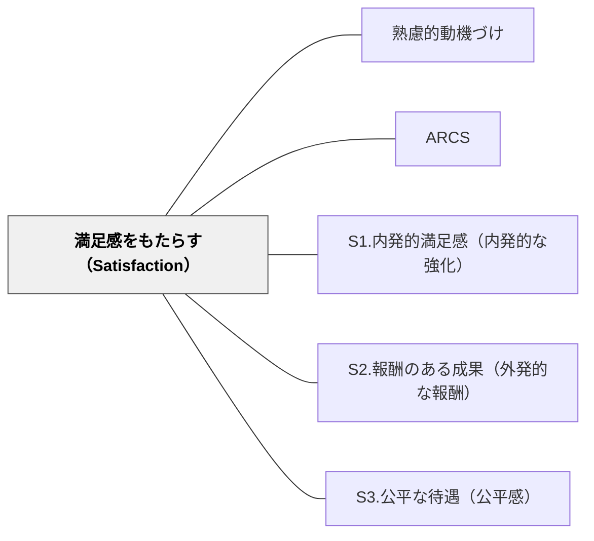

# 満足感をもたらす（Satisfaction）

> やり遂げた喜び・認められる経験・公平な扱いが、学習を「また続けたい」という気持ちにつなげる。

## 背景（Context）
ARCSモデルの第4要素。注意・関連性・自信が揃っていても、学習の結果に満足感がなければ動機は次につながらない。内発的な達成感から外部報酬、公平感まで、多層的な満足の形がある。

## 問題（Problem）
学習者が努力しても報われない、不公平に扱われると感じる、あるいは達成感を感じる機会がないと、動機は急速に失われる。特に、報酬の不公平感は意欲を強く削ぐ。

## 力のかたち（Forces）
- 内発的満足感（やった！という喜び）は長期的な動機の根幹だが、育てるのに時間がかかる
- 外部報酬は即効性があるが、依存が生じると内発的動機を損なうことがある
- 公平感は、不公平を感じた瞬間に動機が大きく損なわれるという意味で非常に敏感な要因
- 満足感は達成後だけでなく、活動中にも感じさせることができる

## 解決（Solution）
**活動そのものの喜びを育て、達成に対する適切な承認や報酬を用意し、すべての学習者を公平に扱うことで、「また学びたい」という満足感をつくる。**

活動そのものへの内発的喜びを強化する（S1.内発的満足感）、達成を外部から承認・報酬する（S2.報酬のある成果）、公平な扱いを保障する（S3.公平な待遇）という3つのサブパターンを設計に組み込む。

## 結果（Consequences）
- 学習者が学習活動を「やって良かった」と感じ、次の学習への動機が高まる
- 継続的な学習参加が促進される
- 報酬と内発的動機のバランスに意識的になれる

## クラスター図

## Actionable Insight

- 「活動の後に「やった！」と感じる瞬間」を授業に1つ意識的に設計する——内発的達成感が「また学びたい」という動機の最も持続的な源泉になる
- 達成に対して「○○ができるようになったね」と具体的な承認を即時に与える——達成への承認が外部報酬への依存を最小化しながら学習継続の動機を育てる
- 全学習者に同じ機会・同じ基準で取り組む公平感を意識的に設計する——不公平を感じた瞬間に動機は急速に失われるため公平感は満足感の最も敏感な要因

## 出典

- 一つの教育のパタン・ランゲージ（岩井輝久）

## 関連パタン
- [[パタン/熟慮的動機づけ]] — 親パタン
- [[パタン/ARCS]] — 上位フレームワーク
- [[パタン/S1.内発的満足感（内発的な強化）]] — サブパターン
- [[パタン/S2.報酬のある成果（外発的な報酬）]] — サブパターン
- [[パタン/S3.公平な待遇（公平感）]] — サブパターン
