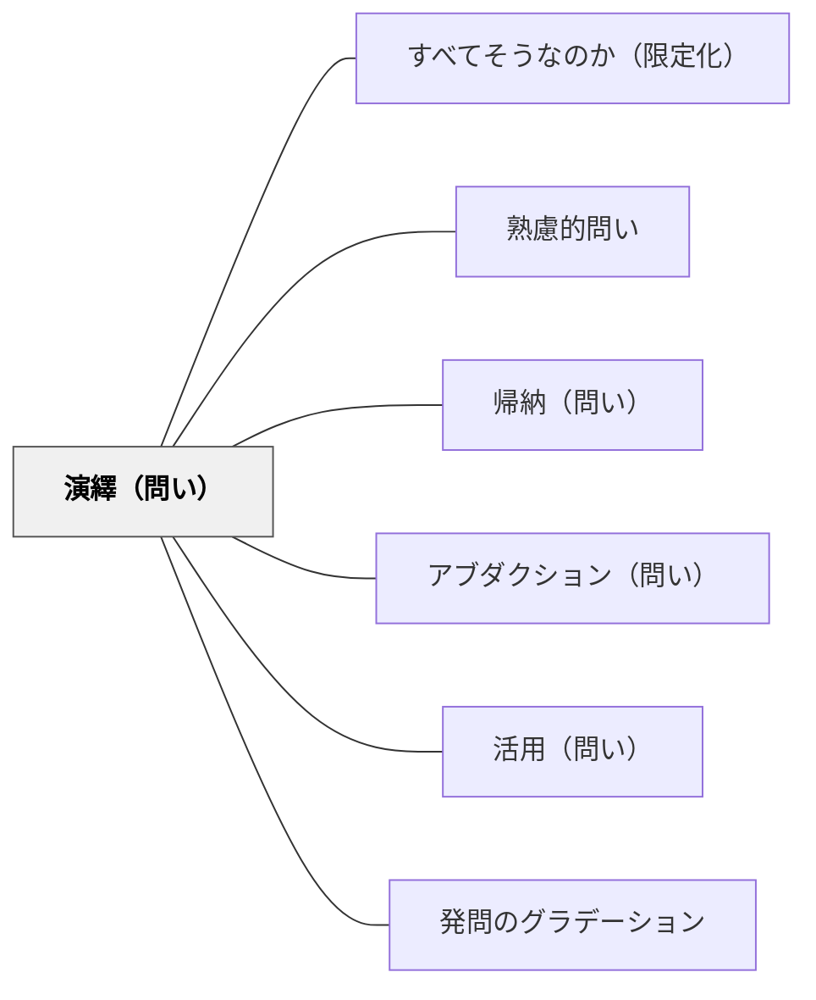

# 演繹（問い）

> 「この法則からこのケースではどうなるか？」と問い、原理を個別の現実に適用させる。

## 背景（Context）
法則・原理・一般命題を学んだとしても、それを具体的な場面に適用できなければ「使える知識」にはならない。
「知っている」と「使える」の間には大きなギャップがある。
演繹的思考とは、一般的な命題から個別の結論を論理的に導く推論であり、実践的知性の核心だ。
教育の文脈では、原理から具体的な予測・判断・処方を引き出す力が求められる。

## 問題（Problem）
学習者が一般的な法則や原理を学んだとき、それを新しい具体的な場面や問題に適用して結論を引き出す力をどう育てるか。

## 力のかたち（Forces）
- 法則を「暗記」しているだけでは応用が利かない。
- 演繹的適用を求めることで、法則の本当の理解度が明らかになる。
- 演繹には前提の正確な理解と、論理的なステップの把握が必要だ。
- 誤った前提から演繹すると誤った結論が生まれるため、前提の吟味も重要になる。

## 解決（Solution）
「この原則に従えば、この状況ではどうなると予測できますか？」「この法則をこのケースに当てはめると？」と問いかける。
学習者に推論の手順を言語化させることで、論理の流れを可視化する。
「なぜそう言えるか？どの原則から導いたか？」と根拠を問い返すことで、演繹の根拠を明確にさせる。
誤った適用が起きたときは、前提のどこが問題なのかを一緒に辿る。

## 結果（Consequences）
法則の理解が「使える理解」へと深まり、新しい問題への転用力が育つ。
「なぜそうなるのか」を論理的に説明する力がつく。
演繹的推論の習慣が、日常の問題解決にも応用されるようになる。
一方で、前提を疑わない演繹は批判的思考の欠如につながる可能性もある。

## 関連パタン
- [[パタン/すべてそうなのか（限定化）]]
- [[パタン/熟慮的問い]] — 親パタン
- [[パタン/帰納（問い）]] — 演繹の前提となる法則を帰納で導く
- [[パタン/アブダクション（問い）]] — 演繹・帰納と並ぶ第三の推論様式
- [[パタン/活用（問い）]] — 知識を実際の場面に応用させる問い
- [[パタン/発問のグラデーション]] — 演繹的指導は「教師の工夫を削ぎ落とした」既習事項の習熟段階と対応する

## クラスター図

## Actionable Insight

- 法則を教えた後に「この原則を使うと、この状況ではどうなると予測できますか？」と問う——「知っている」から「使える」への移行を意識的に促す
- 学習者に推論の手順を「〇〇という原則があるから、△△という状況では□□になる」と言語化させる——論理の流れを言葉にすることで理解の深さが確認できる
- 誤った演繹が出たとき「どの前提から来たか一緒に辿ってみよう」と問い返す——前提の吟味が批判的思考と真の理解につながる

## 出典
- [[文献/熟慮的問いのパターンリスト（動画記録）]]
- 土居正博（2026）『自分で考え、学べる子を育てる！ 発問の技術』学陽書房
- [[文献/自分で考え、学べる子を育てる！ 発問の技術]]

> 「既習事項を指導する際は『演繹的指導』が向いています。まず理論や法則を先に教師が指導し、それをある程度理解させてから、子ども达一人一人に行わせていく指導のことです。演繹的指導には、帰納的指導ほどの教師による工夫は取り入れられない」——土居正博（2026）

### 土居（2026）との接続

土居（2026）は堀裕嗣（2016）を引きつつ、**既習事項の習熟場面では演繹的指導が適し、発問の工夫を削ぎ落とした直接的な問いが有効**と主張する。例えば「情景描写」が既習のとき、「天気などの表現から人物の気持ちがわかる情景描写という表現がありましたね。この作品にも情景描写はありましたか」というシンプルで直接的な発問で十分であり、子どもはすでに学んだ法則・概念を新しい素材に適用することで習熟を深める。これが [[パタン/発問のグラデーション]] の段階3〜4（工夫を大きく減らした発問・自然な問い）に対応する。同じことを繰り返し学ぶ国語科などでは、高学年になるほど演繹的指導の場面が増える点に注目すべきである。
