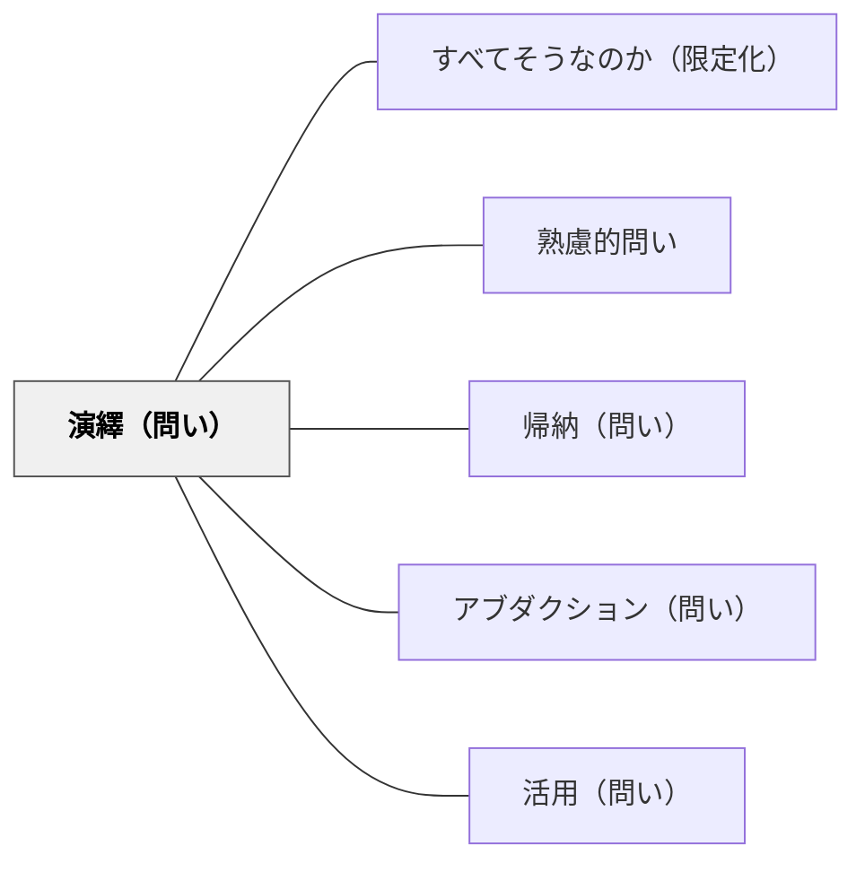

# 演繹（問い）

> 「この法則からこのケースではどうなるか？」と問い、原理を個別の現実に適用させる。

## 背景（Context）
法則・原理・一般命題を学んだとしても、それを具体的な場面に適用できなければ「使える知識」にはならない。
「知っている」と「使える」の間には大きなギャップがある。
演繹的思考とは、一般的な命題から個別の結論を論理的に導く推論であり、実践的知性の核心だ。
教育の文脈では、原理から具体的な予測・判断・処方を引き出す力が求められる。

## 問題（Problem）
学習者が一般的な法則や原理を学んだとき、それを新しい具体的な場面や問題に適用して結論を引き出す力をどう育てるか。

## 力のかたち（Forces）
- 法則を「暗記」しているだけでは応用が利かない。
- 演繹的適用を求めることで、法則の本当の理解度が明らかになる。
- 演繹には前提の正確な理解と、論理的なステップの把握が必要だ。
- 誤った前提から演繹すると誤った結論が生まれるため、前提の吟味も重要になる。

## 解決（Solution）
「この原則に従えば、この状況ではどうなると予測できますか？」「この法則をこのケースに当てはめると？」と問いかける。
学習者に推論の手順を言語化させることで、論理の流れを可視化する。
「なぜそう言えるか？どの原則から導いたか？」と根拠を問い返すことで、演繹の根拠を明確にさせる。
誤った適用が起きたときは、前提のどこが問題なのかを一緒に辿る。

## 結果（Consequences）
法則の理解が「使える理解」へと深まり、新しい問題への転用力が育つ。
「なぜそうなるのか」を論理的に説明する力がつく。
演繹的推論の習慣が、日常の問題解決にも応用されるようになる。
一方で、前提を疑わない演繹は批判的思考の欠如につながる可能性もある。

## 関連パタン
- [[パタン/すべてそうなのか（限定化）]]
- [[パタン/熟慮的問い]] — 親パタン
- [[パタン/帰納（問い）]] — 演繹の前提となる法則を帰納で導く
- [[パタン/アブダクション（問い）]] — 演繹・帰納と並ぶ第三の推論様式
- [[パタン/活用（問い）]] — 知識を実際の場面に応用させる問い

## クラスター図

## Actionable Insight

- 法則を教えた後に「この原則を使うと、この状況ではどうなると予測できますか？」と問う——「知っている」から「使える」への移行を意識的に促す
- 学習者に推論の手順を「〇〇という原則があるから、△△という状況では□□になる」と言語化させる——論理の流れを言葉にすることで理解の深さが確認できる
- 誤った演繹が出たとき「どの前提から来たか一緒に辿ってみよう」と問い返す——前提の吟味が批判的思考と真の理解につながる

## 出典
- [[文献/熟慮的問いのパターンリスト（動画記録）]]
