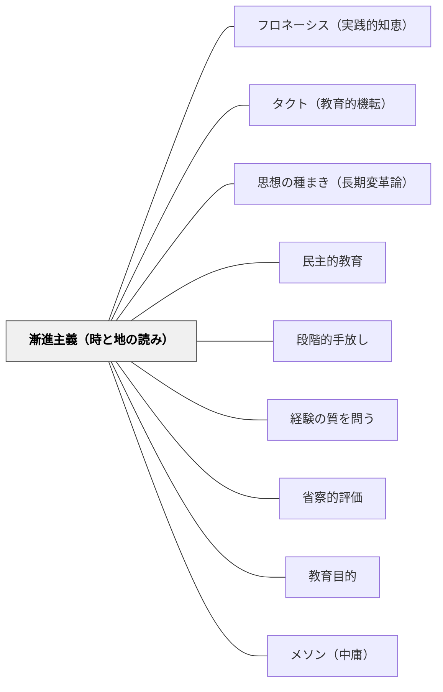

# 漸進主義（時と地の読み）

> 理想は正しく、現実は今ここにある——今この時と地でできる次の一歩を選ぶことが、遠い理想への唯一の道だ。

## [Pattern Connection]

### 中江兆民（1887）三酔人経綸問答——「進化神の悪む所」と漸進主義

三酔人経綸問答で南海先生は、急進的民主主義者（洋学紳士）にも軍事膨張論者（豪傑）にも同じ批評を下す：「どちらも架空の構想——今この時と地で実行できない」。

南海先生の漸進主義の核心は、「進化神の悪む所」という言葉に凝縮されている：

> 「其の時と其の地とに於て必ず行なうことを得可からざる所を行なわんと欲すること、即ち是れのみ」——南海先生（三酔人経綸問答）

進化神（歴史的変化の必然性）が唯一嫌うのは「時と地を無視した施策」だ。正しい理想であっても、「今この時と地でできないこと」を強行しようとすることは進化の摂理に反する。

対照的に南海先生の最終提言——「立憲制確立・好和外交・言論出版の自由化・教育と商工業の漸進的育成」——を二人の客は笑う：「今どきの子どもや使い走りでもそのくらいのことは知っています」。

南海先生の答え：

> 「ふだんの雑談ならば、奇抜を競い珍しさを争っておもしろがるのもよろしいが、国家百年の大計とあっては、いたずらに奇抜や新味を求めて喜んでいるわけにもいきません」

「当たり前の答え」こそが正解であり、それを「当たり前」と侮るほど人は誤る——という逆説。

兆民晩年のインタビュー（1900年）でも同じ主張が繰り返される：

> 「社会というものはな、秩序と進歩と相待ったものである。もし急激に事を処すると飛んだ間違いを起すものぢゃぞ……きわめて永久の年月を経て進歩する性質のものであるから、之れを改良するにはやはり進歩の法則に従い、次第に根本的改良に従事せねばならぬものぢゃ」——兆民

**「恩賜の民権」と漸進主義の授業設計：**

南海先生が「恩賜の民権でも本質は同じ——大切に育てることで回復した民権になる」と述べたように、教師が「与えられた条件（学習指導要領・カリキュラム・時間・クラスの状態）」の中でできることを見極め、そこから始める漸進的実践こそが持続的な変化をもたらす。

**既存パタンとの関連（三者の補完関係）：**

| パタン | 問い | 時間軸 | 対象 |
|---|---|---|---|
| [[パタン/フロネーシス（実践的知恵）]] | 何がちょうどしかるべきか | 個別の実践場面 | 行為の質 |
| [[パタン/タクト（教育的機転）]] | 今この瞬間に何をするか | 授業中の即時判断 | タイミング |
| **漸進主義（時と地の読み）** | 今この文脈で何が次の一歩か | 中長期的な変革戦略 | 変革の方向と歩幅 |

三者は補完的に機能する——フロネーシスが「何が良いか」を判断し、タクトが「いつするか」を判断し、漸進主義が「どこから・どの歩幅で」を判断する。

- **接続点**：[[パタン/思想の種まき（長期変革論）]] — 漸進主義は「長期に種を蒔き続ける」ことの戦略的根拠になる。急激な変革を諦め、長期的な思想の成熟を信頼する。
- **波及するパタン**：[[パタン/民主的教育]] — 「恩賜の民権を回復した民権へ」という段階論が漸進主義の実装；[[文献/三酔人経綸問答（中江兆民）]] — 本統合の出典

---

## 背景（Context）

教師は理想を持つ——「全員が問いを持つ授業」「子どもが主体的に学ぶ教室」「心理的に安全な学級」。しかし現実のクラスは、理想とはしばしば遠い。学力格差、関係性の問題、時間の制約、学習指導要領の縛り。

この乖離は二つの反応を生む。一つは「理想を下げる」——慣れと妥協で現状を受け入れ、変化を諦める。もう一つは「理想を急ぐ」——一気に変えようとして焦り、失敗し、疲弊する。

南海先生が三酔人で示した「漸進主義」は、第三の道だ。理想を諦めず、しかし急がず——「今この時と地でできることを正確に見極め、その文脈で最善の次の一歩を選ぶ」という戦略的な姿勢。

## 問題（Problem）

「正しい理想」を持つ教師が、現実との乖離に直面したとき：

- 「本当はこういう授業がしたいのに、このクラスではできない」と感じて動けなくなる
- 理想通りの実践をしようとして無理をし、子どもとの関係が崩れる
- 「今の制度・環境が変わらないと何も変えられない」と外的条件に責任を帰する
- 逆に「今すぐすべてを変えなければ」と焦り、一気に多くを変えようとして混乱を招く

どちらも「今この時と地」を正確に読んでいない点で共通している。

## 力のかたち（Forces）

- 理想は「架空の構想（洋学紳士的理想）」として参照点になるが、今すぐ実装できるとは限らない
- 現実の制約（クラスの状態・時間・制度・同僚・保護者の期待）は無視できない
- 急激な変化は「恋旧元素」（変化に抵抗する力）の反発を招き、かえって後退しやすい
- 一方で「できないことを言い訳にして何もしない」漸進主義は停滞と同じ
- 「次の一歩は何か」を問い続けることが、理想と現実の間を歩く唯一の方法

## 解決（Solution）

**「今この時と地でできることは何か」を正確に見極め、理想に向かう方向でできる最小の確実な一歩を選ぶ。一歩ずつ積み重ねることが、急激な変革よりも確実に遠くへ到達する。**

---

### 具体例①：「時と地」の三つの問い

南海先生の判断軸を授業設計・学級経営に翻訳した三問：

**問い1：今のクラスは「ここ」にいる**
「今のこのクラスの実態（関係性の状態、学力、習慣）を、美化せず否定せず、正確に把握しているか？」

**問い2：理想は「あそこ」にある**
「自分が向かいたい方向（民主的教室・探究型授業・心理的安全）は何か？」

**問い3：「今この時と地」からできる次の一歩は何か**
「今のクラスを理想に近づける方向で、今週試せることは何か？」——一気に全部ではなく、一つ。

---

### 具体例②：「恩賜の民権」を授業設計で使う

南海先生の言葉「恩賜の民権でも本質は同じ——大切に育てれば回復した民権になる」を、授業設計に適用する：

| 理想の形（回復した民権） | 今の段階（恩賜の民権） | 移行の方法 |
|---|---|---|
| 子どもが問いを自分で作る | 教師が3択の問いを出し、子どもが選ぶ | 選んだ理由を問い、次は2択・1択へ |
| 子どもが評価規準を自分で作る | 教師が提示した規準に子どもがコメントを足す | コメントの重みを増やし、規準に組み込む |
| 子どもが自分の学習計画を立てる | 週の課題リストから子どもが順番を選ぶ | 選択肢の幅を広げ、理由を書かせる |
| 子どもが授業の問いを設計する | 教師の問いに「それとも…？」と追加させる | 追加の問いを次の授業に使う |

「今すぐ全部渡す」でなく「今渡せるものを渡し、大切に育て、次を渡す」の繰り返し。

---

### 具体例③：「漸進主義」と「妥協主義」の区別

南海先生の漸進主義は「何もしない」妥協ではない。両者の違い：

| 漸進主義（南海先生的） | 妥協主義（停滞） |
|---|---|
| 理想の方向を保ち続ける | 理想を諦める |
| 「今できる一歩」を毎回選ぶ | 「できない理由」を積み重ねる |
| 「時と地」を読んで戦略を変える | 状況を言い訳にして止まる |
| 「恩賜の民権」を育てる | 与えられた条件に安住する |
| 次の一歩を問い続ける | 「いつか変える」と先送りする |

漸進主義は「方向を保ちながら、速度を状況に合わせる」こと。妥協主義は「方向を失う」こと。

---

### 具体例④：「時と地」の読み方——兆民の三角形

南海先生の判断は三つの座標を同時に読んでいる：

```
         理想（どこへ向かうか）
            △
           / \
          /   \
    時（今は） ── 地（ここでは）
```

- **時**：「今の発達段階」「今の学期の位置」「今の子どもたちの関係性の状態」
- **地**：「このクラス文化」「この学校の制度的制約」「この地域・保護者の期待」
- **理想**：「向かいたい方向」——これだけ単独では「架空の構想」になる

三角形の現在地を見ず、「理想」だけを見て直進しようとするのが洋学紳士的誤り。「時と地」だけを見て理想を忘れるのが妥協主義的誤り。

---

### 具体例⑤：変革の「歩幅」を測る

南海先生の漸進主義が示すもう一つの知恵：変革の歩幅は「時と地」に応じて変える。

同じ「次の一歩」でも、クラスの状態によって最適な歩幅は変わる：

- 4月の学年始め → 基本的な習慣を一つ確立する（小さな歩幅）
- 関係が育ってきた10月 → 学習形態を一つ変える（中程度の歩幅）
- 前年の実践の成果が出た新学年 → 複数のパタンを同時に展開する（大きな歩幅）

「いつでも同じ歩幅で進む」のも「いつでも大きく変えようとする」のも、漸進主義ではない。時と地を読んで歩幅を変えることが「進化の道理」に従うことだ。

---

## 結果（Consequences）

- 「理想と現実の乖離」に圧倒されて動けなくなる状態から解放される
- 「今日できた一歩」という小さな達成感が、長期的な実践継続の動力になる
- 急激な変化による子ども・同僚・保護者との摩擦が減り、変化が定着しやすくなる
- 「なぜ今これをするのか」という自分の判断に根拠が生まれ、専門的な自律が育つ
- 「当たり前の答え」（立憲制・好和外交）が持つ知恵——急がなくてよいという安心感が、長期にわたる教育実践を支える

## 関連パタン

- [[パタン/フロネーシス（実践的知恵）]] — 漸進主義の判断を可能にする実践的知恵の基盤
- [[パタン/タクト（教育的機転）]] — 瞬間の判断（タクト）と中長期の戦略（漸進主義）の補完関係
- [[パタン/思想の種まき（長期変革論）]] — 漸進主義は「長期に種を蒔き続ける」ことの戦略的根拠
- [[パタン/民主的教育]] — 恩賜の民権を回復した民権へ育てる段階的実践
- [[パタン/段階的手放し]] — 足場を段階的に外す I Do→We Do→You Do の漸進的移行
- [[パタン/経験の質を問う]] — デューイの経験の連続性が漸進主義の哲学的基盤
- [[パタン/省察的評価]] — 「今この時と地」を読むための振り返り
- [[パタン/教育目的]] — 理想（目的）と現実（手段）の関係を常に照合する
- [[パタン/メソン（中庸）]] — フロネーシスが見極める「ちょうどしかるべき歩幅」
- [[文献/三酔人経綸問答（中江兆民）]] — 本パタンの出典
- [[メタパタン/足場は消えるために組む（フェードアウト）]] — 撤去の「時」を読む実践知

## クラスター図



## Actionable Insight

- 今学期の「理想とするクラスの姿」を1文で書く。次に「今のクラスの実態」を1文で書く。その差を縮める方向で「今週できる一つのこと」を選ぶ——この三点を毎学期の計画前に問う
- 「これはまだこのクラスでは早い」と感じたとき、「なぜ早いのか」を「時」と「地」に分けて言語化してみる——「時のせいか、地のせいか」が分かると、どちらを先に育てるべきかが見える
- うまくいった実践で「なぜ今できたのか」を問う——成功は偶然ではなく「時と地」が熟したサイン。次に熟すタイミングを読む練習になる

## 出典

中江兆民（山田博雄訳）（2014）．『三酔人経綸問答』光文社古典新訳文庫．（原著: 1887年）

> 「其の時と其の地とに於て必ず行なうことを得可からざる所を行なわんと欲すること、即ち是れのみ」——南海先生（三酔人経綸問答）

> 「ふだんの雑談ならば、奇抜を競い珍しさを争っておもしろがるのもよろしいが、国家百年の大計とあっては、いたずらに奇抜や新味を求めて喜んでいるわけにもいきません」——南海先生（三酔人経綸問答）
