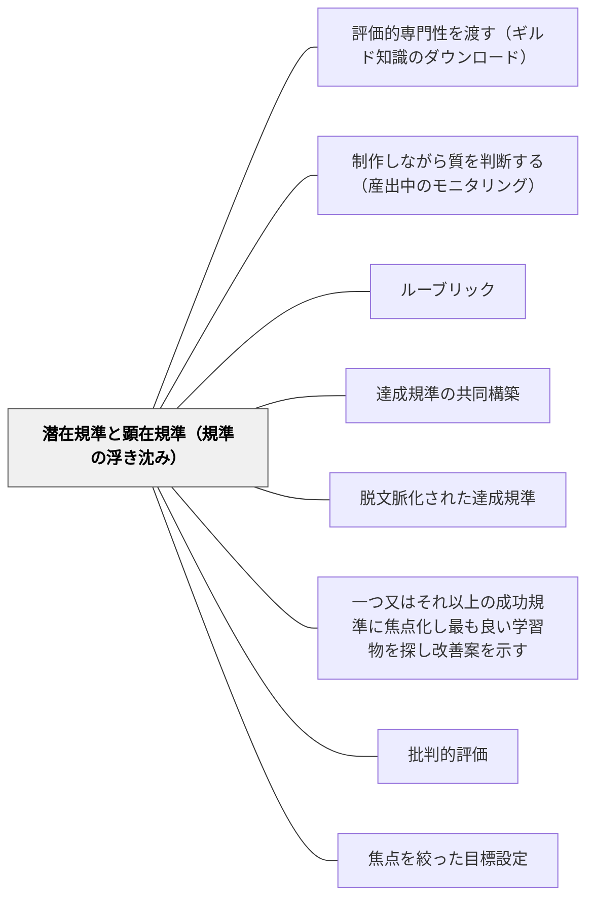

# 潜在規準と顕在規準（規準の浮き沈み）

> 規準は全部を同時に使えない。今この作品で見るものを前面に浮かせ、当たり前になったら背景へ沈める。形成的評価の技芸は、この浮き沈みを設計することにある。

## 背景（Context）

「何を見て評価するのか」を子どもに示さないまま作品を書かせるのは不親切である。だから多くの教師は **規準表（criteria sheet）** をつくる。課題の指示と一緒に配る教師もいれば、採点した答案を返すときに添える教師もいる。ルーブリックの普及もこの流れの上にある。

規準を明示することは、それ自体としては正しい方向を向いている。サドラー（1989）が問題にするのは、明示することではなく、**明示された規準のセットを固定してしまうこと** の方だ。

背景にはもう一つ、評価という行為そのものの性質がある。熟練した評価者は、ありうる膨大な規準のプールの中から、その作品のその場面で **際立っている（salient）** ものを選び出して判断している。作品の性質のうち、正常・普通・期待通りのものは、そもそも注意を引かない。サドラーはウィトゲンシュタインを引く——「Does what is ordinary always make the impression of ordinariness?（普通のものは、いつも普通だという印象を与えるだろうか）」。当たり前のものは「言うに値しない（not "remark"-able）」。逸脱したものだけが注意を呼ぶ。

## 問題（Problem）

**規準表を固定して配ると、その硬直性が教師と学習者の双方を苦しめる。**

規準表を日常的に使っている教師は、それが役に立つ一方で、まさにその融通のきかなさゆえにいらだちを覚える、とサドラーは書いている。作品の質は、固定された規準セットでは必ずしも十分に扱えない。だから教師は、しばしば表に載っていない規準を持ち出さざるを得なくなる。ここで教師は板挟みになる——表にない理由で評価すれば「後出し」と言われ、表の中だけで評価すれば、その作品にとって本当に大事なことを言えない。

かといって、規準が教師の頭の中だけにあれば良いわけでもない。サドラーは、教師の書き込みコメントの研究から次の事実を挙げる。同じ教師が同じ作品に二度コメントを書くと、**全体としての判定は一致するのに、途中に書き込まれるコメントは回によって違う**。書き込まれる場所が違い、同じ場所でも内容が違う。複数の評価者が同じ全体評価に至りながら、理由がそれぞれ異なることもある。

これは形成的評価にとって重大な意味を持つ。**教師が確率的に振る舞っているように見えるとき、学習者は体系的に前進できるのか** という問いが立つからだ。今回は構成を指摘され、次回は語彙を指摘される。子どもの側からは、何を直せば良くなるのかの見当がつかない。

さらに根本的な制約がある。**すべての規準を一度に扱うことは、実際上不可能である。** 良い作品には十も二十も条件があるが、書きながら二十を同時に監視できる人はいない。

## 力のかたち（Forces）

- **明示の親切さ vs 表の硬直性**——規準表は「何を見られるか」を予測可能にするが、そのぶん、表に書かれていない質を扱えなくする
- **一貫性 vs 応答性**——毎回同じ規準で見れば公平で体系的だが、その作品固有の良さや躓きに応答できない。作品に応じて見る点を変えれば応答的だが、学習者からは気まぐれに見える
- **全部を見たい vs 全部は見られない**——教師は作品を全体として評価したい。しかし学習者が一度に注意を向けられる規準の数はごく少ない
- **顕現性の非対称**——できていないところは目立ち、できているところは目立たない。放っておくと、フィードバックは常に逸脱の指摘に偏る
- **意識化の副作用**——ひとたびある規準に言及すると、その規準への感度がその後しばらく高まる（潜在的顕現性が上がる）。焦点化は効くが、他の規準への注意を一時的に薄くもする
- **明示しつづける vs 沈めていく**——毎回言葉にすれば確実だが、いつまでも言葉にし続ける規準は、自動化されていないということでもある

## 解決（Solution）

**規準を「顕在規準」と「潜在規準」の二つに分けて運用する。必要に応じて潜在規準を顕在へ浮上させ、当たり前になったら再び潜在へ沈める。この出し入れを、可逆的な進行として設計する。**

サドラーはサドラー（1983）の区別を持ち出す。

- **顕在規準（manifest criteria）**——作品が作られている最中、あるいは評価されている最中に、意識的に注意が向けられている規準。今この場の作業セット
- **潜在規準（latent criteria）**——背景で待機している規準。作品の何らかの性質が期待から逸脱したときに、その場で呼び出され、活性化される

潜在規準が深刻に破られたとき、教師はそれを呼び出し、**少なくとも一時的に**顕在規準の作業セットへ加える。熟練した教師がこれをできるのは、規準の全体セットと、その使い方についての（書かれていない）規則を熟知しているからだ。そしてサドラーは続ける——**しかしまさにこの種の知識こそ、学習者の中に育てられなければならないものである。** 自分の作品を自分で相応の水準で監視できるようになるには、規準の出し入れの規則を学習者自身が持つ必要がある。

ここが最も重要な転換点になる。

> The translation of a criterion from latent to manifest should therefore not be interpreted by either the student or the teacher as unfair or as some sort of aberration.
> （したがって、ある規準が潜在から顕在へ翻訳されることを、学習者も教師も、不公平だとか一種の逸脱だとか解釈すべきではない。）

すべての規準を一度に用いることは実際上不可能なのだから、これは避けられず、**まったく正常なこと（perfectly normal）** である。マーシャル（1958, 1968）はこれを **浮上原理（flotation principle）** と呼び、評価への活用を提唱した。エルボー（1973）の「重心（center of gravity）」アプローチ——書かれたものの中心的な重みがどこにあるかを見て応答する——も、比喩を移した同じ発想の上にある。

そして目標が示される。

> The art of formative assessment is to generate an efficient and partly reversible progression in which criteria are translated for the student's benefit from latent to manifest and back to latent again.
> （形成的評価の技芸は、規準が学習者のために潜在から顕在へ、そしてふたたび潜在へと翻訳されていく、効率的で部分的に可逆な進行を生み出すことにある。）

目指すのは、日常的な規準の多くが **最終的に沈むこと（ultimate submergence）** である。あまりに当然のこととして前提されるようになり、もはや明示的に述べる必要がなくなる状態。つまり、規準を前面に出すことは、**それをいずれ言わなくて済むようにするため** に行う。

実務としては次の三つの操作になる。

1. **浮上させる**——今回の作品で意識させる規準を、ごく少数（一つか二つ）に絞って前面に出す。言葉と実例の両方で示す
2. **一時的に呼び出す**——顕在セットに入れていない規準でも、作品が大きく逸脱したときにはその場で呼び出す。このとき「今回は言っていなかったけれど」と言い訳しない。呼び出しは正常な運用だと、あらかじめ子どもと共有しておく
3. **沈める**——安定して満たされるようになった規準は、意識的に言うのをやめる。ただし満たされなくなったときには、また呼び出す

---

### 具体例1：作文の「今日の目」を一つに絞り、満たされたら降ろす

五年生の書く単元。学級には年度当初につくった規準表があり、七項目が並んでいる。教師は毎回それを全部見て、全部にコメントしていた。返却された原稿は赤で埋まり、子どもはどこから直せばいいのか分からない。

やり方を変えた。黒板の右上に「今日の目」という枠をつくり、**そこに書けるのは一つか二つだけ** と決める。今回は「段落のはじめに、その段落で言いたいことを置く」。教師のコメントも、この一点に絞る。他の項目は規準表に残っているが、口には出さない。

三週目、A児の原稿で、段落の頭は整っているのに主語と述語がねじれている箇所が続いた。教師は「今日の目」に入れていないその点を呼び出し、「これは今日の目じゃないけど、読んだ人が意味を取れなくなっているから、ここは言うね」と伝えた。**言い訳ではなく宣言として言う。** クラス全体にも「今日の目に入っていなくても、意味が通らなくなったら、その場で出します。それは反則じゃありません」と最初に共有してある。

六週目、段落の頭はほぼ全員が自動的にできるようになった。教師は「今日の目」からこれを外し、「引用したら出典を書く」に入れ替えた。外したことも言葉にする——「段落のはじめのやつは、もうみんな当たり前にできるから、目からおろします」。**降ろす瞬間を可視化することが、沈める操作を子どもに教える。**

---

### 具体例2：ルーブリックを配るのをやめず、使い方を変える

ルーブリックは捨てなくてよい。サドラーが問題にしているのは、規準表そのものではなく、それを「毎回、全項目、同じ重みで」使うことだ。

六年生の発表。学級のルーブリックは五観点ある。教師は返却時に五観点すべてに丸をつけるのをやめ、次のようにした。

- 発表の前に、**その回に絞る観点を一つ**、子どもと相談して決める（今回は「聞き手が知らないことを、知っている言葉で説明する」）
- ルーブリックの他の四観点は、紙の上には残しておく。ただし「今回の目」ではないことを明示する
- 発表後の相互評価は、絞った一観点についてのみ行う。付箋一枚に一言
- 教師だけは五観点全部を見ているが、口に出すのは、絞った観点と、**大きく逸脱したもの** だけ

こうすると、規準表は「毎回チェックする一覧」から「今どこにいるかを確かめる地図」に変わる。学期の終わりに、子どもと一緒にルーブリックを見返し、「もう言わなくてもできるようになったもの」に印をつける。印のついた項目が増えていくことが、そのまま学習の記録になる。

---

### 具体例3：教師の「毎回違うことを言う」問題を自分で点検する

サドラーが指摘した「教師が確率的に振る舞って見える」問題は、教師自身には見えにくい。自分では一貫して見ているつもりだからだ。

点検の仕方は単純である。同じ子の作品三回分に自分が書いたコメントを並べて読む。指摘している観点が三回とも違っていたら、その子は自分のコメントから体系的な前進の道筋を読み取れていない可能性が高い。

もう一つ、逆向きの点検もある。**逸脱の指摘ばかりになっていないか。** サドラーが言うとおり、期待通りの性質はそもそも注意を引かない。放っておけばコメントは常に「足りないところ」に偏る。意識的に「今回、当たり前にできていたこと」を一つ書き添えると、それは「もう沈んだ規準」の確認になり、子どもにとっては到達の証拠になる。

---

### 特別支援の視点：一度に一つ、という原則は配慮ではなく設計の前提

規準を絞る運用は、注意の配分やワーキングメモリに困難がある子どもにとって決定的な意味を持つ。七項目を同時に監視しながら書くことは、多くの子にとって不可能であり、その困難が大きい子にとっては最初から成立しない。

ただし、絞れば済むわけではない。二つの注意点がある。

第一に、**呼び出しが「予告なしの変更」として受け取られないようにする。** 見通しの変化に強い不安を持つ子にとって、「今日は段落だと言ったのに、別のことを言われた」は課題の失敗ではなく、約束が破られた出来事として体験されうる。だから「今日の目以外のことも、意味が通らないときは言う」というメタ規則を、あらかじめ、繰り返し共有しておく。呼び出しの可能性そのものを見通しに含める。

第二に、**沈める判断を急がない。** 一度できたことが常にできるとは限らない。沈めた規準を、本人用のチェックカードには残しておき、教師が口に出すのはやめるが、本人はいつでも参照できる状態にしておく。口頭の足場を先に外し、視覚的な足場は後から外す、という順序をとる。

## 結果（Consequences）

**利点**

- **規準表の硬直性から抜けられる**——表を捨てずに、表にない質も扱えるようになる。教師が「後出し」の罪悪感なく必要な指摘ができる
- **学習者が体系的に前進できる**——今回見るものが絞られていれば、直す先が分かる。教師の指摘が気まぐれに見える問題が解消する
- **注意の負荷が下がる**——一度に監視する規準が少ないほど、産出中の自己点検が現実的になる（[[パタン/制作しながら質を判断する（産出中のモニタリング）]]）
- **到達が可視化される**——「沈んだ規準」の蓄積が、そのまま成長の記録になる。「できるようになったから、もう言わない」という形で到達が示される
- **規準の出し入れの規則そのものが学ばれる**——これが最大の利点。学習者は「今は何を見るべきか」を自分で決める力を身につけていく。これは [[パタン/評価的専門性を渡す（ギルド知識のダウンロード）]] が渡そうとしているものの中核部分である

**注意点・リスク**

- **絞った規準以外が本当に見られなくなる**——教師が口に出さないと、子どもも見なくなる。沈めるのは「自動的にできるようになったもの」だけであり、「まだできていないが今回は扱わないもの」と混同しない。この二つを教師自身が区別して把握しておく必要がある
- **呼び出しが不公平に見える**——メタ規則の共有を怠ると、「言ってないことで減点された」という受け取りになる。特に評定が絡む場面では信頼を損なう。**成績に関わる評価では、呼び出した規準をその回の評定に用いるかどうかを明確にする**
- **沈めるのが早すぎる**——一度できただけで沈めると、定着しないまま消える。複数回・複数場面で安定してから沈める
- **焦点化の副作用**——ある規準に言及すると、その後しばらく他の規準への感度が下がる。焦点を切り替えた直後は、前の焦点が崩れやすいことを見込んでおく
- **教師の側に規準の全体セットが要る**——出し入れの運用は、教師がどんな規準がありうるかを把握していて初めて成立する。全体セットが貧しければ、絞ることは単なる見落としになる

## 関連パタン

- [[パタン/評価的専門性を渡す（ギルド知識のダウンロード）]] — 上位の目的。本パタンはその具体的な機構を担う
- [[パタン/制作しながら質を判断する（産出中のモニタリング）]] — 顕在化された規準が、制作中の自己点検の焦点になる
- [[概念/質的判断（曖昧な規準とメタ規準）]] — なぜ規準を全部同時に使えないのかの理論的な理由
- [[パタン/ルーブリック]] — 規準表そのもの。本パタンはルーブリックの硬直性の問題に「規準を出し入れする」という別の解決を与える
- [[パタン/達成規準の共同構築]] — 規準を学習者と一緒に作る。本パタンは作った規準を「いつ前面に出すか」の運用を扱う
- [[パタン/脱文脈化された達成規準]] — 沈めた規準は文脈を越えて働く規準になっていく
- [[パタン/一つ又はそれ以上の成功規準に焦点化し最も良い学習物を探し改善案を示す]] — 焦点化した規準だけを見る授業技法。本パタンはその焦点をどう選び、いつ手放すかを扱う
- [[パタン/批判的評価]] — 与えられた規準が何を見落としているかを問う。潜在規準の存在に気づく力
- [[パタン/焦点を絞った目標設定]] — 一度に一つに絞る発想の、教師の自己成長側での対応物

- [[概念/形成的評価の5つの戦略（3×3の枠組み）]] — 戦略①の実装。規準の共有を「全部同時に」ではなく出し入れで行う

## クラスター図

## Actionable Insight

- **黒板の隅に「今日の目」の枠をつくり、書けるのは一つか二つと決める**——今回の作品で意識させる規準だけを入れる。教師のコメントもその一点に絞る。他の項目は規準表に残すが、口には出さない
- **「今日の目じゃないことも、意味が通らなくなったら言う」と最初に宣言する**——規準の呼び出しが正常な運用であることを、子どもと共有しておく。実際に呼び出すときは言い訳せず、「今日の目じゃないけど、ここは言うね」と宣言として言う
- **月に一度、「目から降ろす」時間を三分とる**——「これはもうみんな当たり前にできるから、今日から言いません」と口に出して外す。降ろした項目を教室に掲示していく。降ろした一覧が、そのまま学級の到達の記録になる
- **同じ子の作品三回分に自分が書いたコメントを並べて読む**——指摘の観点が三回とも違っていたら、その子は自分のコメントから前進の道筋を読み取れていない。次の一回は、前回と同じ観点で書いてみる

## 出典

Sadler, D. R. (1989). Formative assessment and the design of instructional systems. *Instructional Science, 18*(2), 119–144.

> Manifest criteria are those which are consciously attended to either while a work is being produced or while it is being assessed. Latent criteria are those in the background, triggered or activated as occasion demands by some (existential) property of the work that deviates from expectation. （p.134）
> — 顕在規準とは、作品が作られている最中、あるいは評価されている最中に意識的に注意が向けられているものである。潜在規準とは背景にあるもので、期待から逸脱した作品の何らかの（現に存在する）性質によって、必要に応じて呼び起こされ活性化されるものである。

> The translation of a criterion from latent to manifest should therefore not be interpreted by either the student or the teacher as unfair or as some sort of aberration. Because of the practical impossibility of employing all criteria at once, it is inevitable and perfectly normal. （p.134）
> — したがって、ある規準が潜在から顕在へ翻訳されることを、学習者も教師も、不公平だとか一種の逸脱だとか解釈すべきではない。すべての規準を一度に用いることは実際上不可能なのだから、それは避けられず、まったく正常なことである。

> The art of formative assessment is to generate an efficient and partly reversible progression in which criteria are translated for the student's benefit from latent to manifest and back to latent again. The aim is to work towards ultimate submergence of many of the routine criteria once they are so obviously taken for granted that they need no longer be stated explicitly. （p.134）
> — 形成的評価の技芸は、規準が学習者のために潜在から顕在へ、そしてふたたび潜在へと翻訳されていく、効率的で部分的に可逆な進行を生み出すことにある。目指すのは、日常的な規準の多くが、あまりに当然のこととして前提され、もはや明示的に述べる必要がなくなるまで、最終的に沈められることである。

> Does what is ordinary always make the impression of ordinariness? （Wittgenstein, Article 600; Sadler, 1989, p.133 に引用）
> — 普通のものは、いつも普通だという印象を与えるだろうか。

> Teachers who use criterion sheets regularly, however, find that while such sheets are helpful, they may lead to frustration because of their inflexibility. （pp.133–134）
> — しかし規準表を日常的に用いている教師は、それが役に立つ一方で、その融通のきかなさゆえにいらだちを招きうることに気づく。

Sadler, D. R. (1983). Evaluation and the improvement of academic learning. *Journal of Higher Education, 54*(1), 60–79.（顕在規準／潜在規準の区別の初出。Sadler, 1989 が参照）

Marshall, J. C. (1958, 1968).（浮上原理 flotation principle の提唱者として Sadler, 1989, p.134 に引用）

Elbow, P. (1973). *Writing Without Teachers*. Oxford University Press.（「重心 center of gravity」アプローチ。Sadler, 1989, p.134 に言及）
