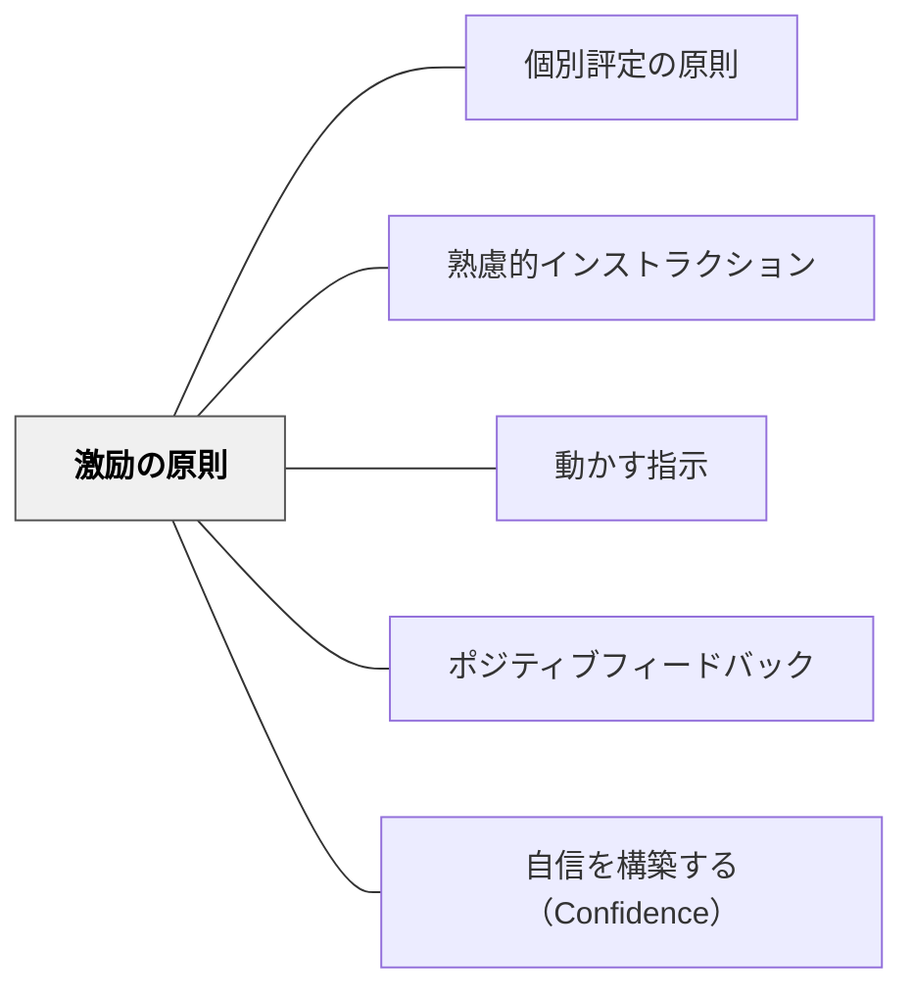

# 激励の原則

> 「よくやっている」「もう少しで完成」という言葉が、難しい課題への粘り強い取り組みを支える。

## 背景（Context）
学習者が難しい課題に取り組む場面では、途中で諦めたり意欲を失ったりすることがある。インストラクションは指示を出すだけでなく、実行を後押しする働きも担っている。向山洋一は授業の腕を上げる法則の中で、励ましを重要な原則として位置づけた。

## 問題（Problem）
課題が難しいとき、学習者は「自分にはできない」という気持ちになりやすい。指示だけが与えられ励ましがないと、取り組みが途中で止まってしまう。適切なタイミングでの言葉がけがなければ、学習者のパフォーマンスは本来の力を下回る。

## 力のかたち（Forces）
- 難しい課題ほど、継続する動機が必要になる
- 「できている」という実感が次の行動を生み出す
- 一般的な称賛より、具体的な進捗への言及が効果的
- 励ましの言葉は関係性と文脈によって受け取られ方が変わる

## 解決（Solution）
**課題の実行プロセス中に、進捗・努力・可能性を具体的に言語化して励ます。**

「よくやっている」「もう少しで完成」「ここまでできている」など、現在地を示す言葉をかける。全体への声がけと個への声がけを使い分け、特に行き詰まっている場面で意図的に介入する。励ましは指示と切り離さず、インストラクションの一部として設計する。

## 結果（Consequences）
- 難しい課題への粘り強い取り組みが続きやすくなる
- 学習者の自己効力感が高まる
- 空虚な称賛にならないよう、具体性と真正性が求められる

## クラスター図

## Actionable Insight

- 机間巡視中、一人ひとりの進捗に対して「ここまでできているね」と一言現在地を言語化して届ける——漠然とした称賛より具体的な進捗への言及が自己効力感を高める
- 難しい課題の中間地点で「あと少しで終わるよ」と全体に声をかける——行き詰まりが広がる前に意図的に介入することが諦めを防ぐ
- 「努力していること」と「できていること」を分けて声がけする（「頑張っているね」＋「ここが良くできている」）——両方をセットで伝えることで持続する動機と具体的な自信が生まれる

## 出典

- 一つの教育のパタン・ランゲージ（岩井輝久）

## 関連パタン
- [[パタン/個別評定の原則]]
- [[パタン/熟慮的インストラクション]] — 親パタン
- [[パタン/動かす指示]] — 実行を促す指示と組み合わせる
- [[パタン/ポジティブフィードバック]] — 行動後の強化と連動
- [[パタン/自信を構築する（Confidence）]] — 自信の構築と連動
