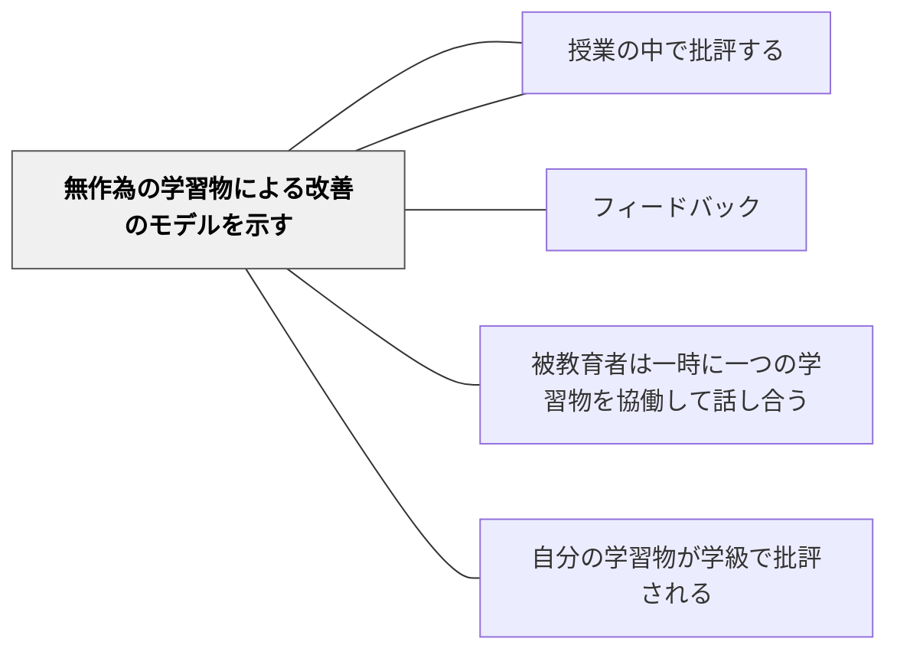

# 無作為の学習物による改善のモデルを示す

> 誰のものかを隠すことで、作品だけが語れるようになる。

## 背景（Context）

授業の中で学習物を批評する際、「誰の作品か」が明らかになっていると、批評は作品ではなくその学習者個人への評価として受け取られやすくなる。特定の個人が「毎回批評される人」にならないよう、また特定の個人の作品が常に「見本」として扱われないよう、無作為に選んだ作品を匿名で示すことが有効だ。

無作為選択はまた、選択における教師のバイアスを排除し、全員が「自分の作品が取り上げられるかもしれない」という緊張感をもちながら学習に取り組む動機にもなる。

## 問題（Problem）

授業の中で批評する作品を教師が意図的に選ぶ場合、「優れた作品だけを選ぶ」または「問題のある作品を選んで注意を促す」という偏りが生じやすい。前者では多くの学習者が参照できる改善例を得られず、後者では特定の学習者が標的になる危険がある。

また、批評が毎回同じ優秀な学習者の作品に集まると、その他の学習者は「どうせ自分の作品は取り上げられない」という疎外感をもつ。

## 力のかたち（Forces）

- 無作為選択は公平性を高めるが、偶然に難易度の高い批評が生まれる可能性もある
- 匿名性は心理的安全を高めるが、学習者が「自分の作品と気づかれたくない」という感覚が強い場合には維持が難しい
- エクセレンスの文化が成熟すると、記名で批評されることが栄誉になる段階に進める

## 解決（Solution）

授業のフィードバックセッションで批評する作品を、くじ引き・乱数・番号順などの無作為な方法で選ぶ。作品は作者名を伏せた状態（匿名）でクラスに提示し、批評はあくまで「この作品」に向けて行われるよう枠組みを設ける。

批評の後、教師は「この作品から学んだことを、自分の作品に適用する時間」を設ける。改善の方向が具体的に示されることで、他の学習者も自分の作品のどの部分を改善できるかを考えられる。文化として定着したら、「自分の作品が取り上げられてもいい」という志願制に移行することもできる。

## 結果（Consequences）

- 特定の個人への焦点化を避けながら、全員が批評から学べる環境が生まれる
- 無作為選択への公平感が、全員の参加動機を維持する
- 批評が「個人への評価」ではなく「学習物の評価」として文化化される

## 関連パタン
- [[パタン/授業中の学習のストップ（批評）]]

- [[パタン/フィードバック]] — 親パタン
- [[パタン/授業の中で批評する]] — 批評実践の親パタン
- [[パタン/被教育者は一時に一つの学習物を協働して話し合う]] — 一つの学習物への集中
- [[パタン/自分の学習物が学級で批評される]] — 記名での批評という次の段階

## クラスター図

## Actionable Insight

- くじ引きや番号で批評する作品を無作為に選び、作者名を伏せてクラスに提示する——無作為・匿名が「誰かを標的にしない」安全な批評の文化を支える
- 無作為選択であることをクラスに伝える——「次は自分かもしれない」という感覚が全員の学習への緊張感を維持する
- 批評後に「この作品から学んだことを自分の作品に一つ適用しよう」という時間を設ける——集合的な批評が個人の改善に着地する橋をかける

## 出典

Clarke, S. (2014). *Outstanding Formative Assessment*. Hodder Education.
