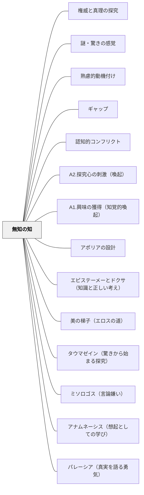

# 無知の知

> 「自分はいかに分かっていなかったか」を知ることが、知りたいという欲求を生む。問いの発見は、答えの発見より先に来る。

## [Pattern Connection]

### プラトン『メノン』（前387年頃）——メノンのパラドクスと想起説：「無知の知」の深化

プラトン『メノン』（80d〜81e）は、無知の知の概念を根底から問い直す「メノンのパラドクス」を提示し、それへの応答として想起説（アナムネーシス）を与える。

**メノンのパラドクス（80d〜e）：**

> 「それで、ソクラテス、あなたはどんなふうに、それが何であるか自分でもまったく知らない当のものを探究するのでしょうか？あるいはまた、その当のものに、望みどおり、ずばり行き当たったとして、どのようにしてあなたは、これこそ自分がこれまで知らなかった当のものであると、知ることができるでしょうか？」（80d）

これが「メノンのパラドクス」——「知らないものは探せない、知っているなら探す必要はない。ゆえに学習は不可能だ」という探究の逆説。もしこれが成立するなら「無知の知」は探究の出発点にはなれない。

**想起説による応答（81a〜e）：**
ソクラテスはアナムネーシス（想起説）でこのパラドクスを解く：魂はすでにすべてを知っている（潜在的知識）。「知らない」という状態は「全知」と「完全な無知」の二択ではなく、「忘れている（まだ想起していない）」状態である。

だから「無知の知」の教育的な意味は：
- 「何も知らない」（完全無知）ではなく「まだ想起していない」という状態
- 「知らないことに気づく」ことが、潜在的知識の想起プロセスを起動する
- 「自分が知らないことを自覚した問い」はすでに探究の方向性を持っている

**補強点**：「無知の知」が単なる謙虚さの概念でなく、「探究への積極的な方向づけ」であることを明示する。「知らないことに気づく」ことは探究の終点ではなく、潜在的知識への通路を開く出発点である。

**波及するパタン**：[[パタン/アポリアの設計]] — 無知の知の具体的な体験がアポリア；[[パタン/エピステーメーとドクサ（知識と正しい考え）]] — 「知らないことを知る」ことが本物の知識（エピステーメー）への道；[[文献/メノン（プラトン）]] — 本統合の出典

---

### プラトン『饗宴』（前380年頃）——エロスという「無知の知の化身」（201d–204c）

プラトン『饗宴』でディオティマが語るエロスの哲学的定義は、「無知の知」概念を神話的・存在論的な次元で深化させる。

**エロスの誕生神話と「無知の知」（203a–204c）：**
エロスの父ポロス（機知・策略）は知恵の宴でペニア（貧乏・欠乏）と結ばれ、エロスが生まれた。エロスの本性：

> 「知恵は最も美しいもののひとつですが、エロスは美しいものを愛し求めます。したがって、エロスは必然的に知恵を愛し求めるもの——フィロソフォス（哲学者）でなければなりません。……知恵ある者は哲学しない——すでに知恵があるから。愚かな者も哲学しない——何が欠けているか知らないから。哲学するのは、知恵と無知の間にいる者だ。」——ディオティマ（203e–204b）

**「無知の知」とエロスの同型性：**

| 概念 | ソクラテスの「無知の知」 | ディオティマの「エロス」 |
|---|---|---|
| 位置 | 知識でも完全な無知でもない「間」 | 知恵でも愚かさでもない「間」 |
| 動力 | 「知らないことを知る」からこそ探究する | 「欠けていると知る」からこそ求める |
| 哲学者の定義 | 知らないことを知る者 | 知恵を愛し求める者（フィロソフォス） |
| 危険 | 完全無知（気づかない）or 完全知識（探さない） | 完全愚か or 完全知恵 → どちらも探究しない |

「無知の知」は認識論的な状態の記述だが、エロスはその状態の**存在論的・神話的な擬人化**である。哲学者はエロスの化身であり、エロスは「無知の知」を持つ存在の宇宙的な形象である。

**教育への示唆——欠如感と策略の両立：**
エロスは母ペニア（欠乏）だけでなく、父ポロス（機知・策略）の血も引いている。「自分に欠けているものを知る（無知の知）」だけでは動けない——「それをどう手に入れるかを画策する力（ポロス）」も必要。

- 無知の知（欠如の認識）= 探究への入り口の条件
- ポロス的な策略力 = 探究を実際に前進させる力
- 教師の役割：欠如感に気づかせ（無知の知を設計し）、手に入れるための方略を一緒に考える（ポロス的な足場）

**補強点**：「無知の知」が単なる謙虚さや「知らないことへの気づき」にとどまらず、エロス（欠如への欲求）と連動したとき初めて探究を**前進させる力**になることが明らかになる。欠如の認識（無知の知）は探究の必要条件だが、十分条件ではない——ポロス（策略・方向性）が加わって初めて哲学（フィロソフィア）になる。

**波及するパタン**：[[パタン/美の梯子（エロスの道）]] — 美の梯子の上昇動力はエロス＝無知の知の動的な形；[[パタン/タウマゼイン（驚きから始まる探究）]] — タウマゼインが無知の知を生み、無知の知がエロスを生む；[[文献/饗宴（プラトン）]] — 本統合の出典

---

### プラトン『パイドン』（前380年頃）——「哲学は死の練習」：終生の不知の実践（64a–67e, 118a）

パイドンは「無知の知」を、一回限りの認識論的な気づきではなく、**生涯をかけて実践する哲学的態度**として描き出す最重要文献である。

**「哲学は死の練習（melete thanatou）」（67e）：**

死＝魂と肉体の分離、という定義から、哲学者は生涯を通じて「肉体の確信・感覚・快楽から魂を離す練習」をしていると言える。

> 「では実際、シミアス君、正しく知を愛し求める哲学者たちは、死にゆくことを練習しているのであり、また、人間の中でとりわけ彼らにとっては、死んでいる状態はすこしも恐ろしくないものなのだ。」（67e）

これは「無知の知」の終生実践版である——感覚・快楽・評判が「知っている」という偽の確信を生み出す。哲学者はその確信を手放し続ける練習を死ぬまで続ける。

**「無知の知」とミソロゴス（言論嫌い）の対比（88c–91c）：**

「無知の知」と「ミソロゴス（言論嫌い）」は、知の限界に直面したときの正反対の反応である：

| 直面する事態 | 「無知の知」の反応 | ミソロゴスの反応 |
|---|---|---|
| 議論が崩れた | 「私がまだ知らない部分がある」 | 「議論は全て信用できない」 |
| 理解できない | 「ここが自分の理解の限界」 | 「考えること自体が無意味」 |
| 答えが出ない | 「まだ問い続けている途中」 | 「答えなんてないのかもしれない」 |

→「無知の知」はミソロゴスへの根本的な対抗力である。「知らない」を自覚し続けることが、「どうせ知れない」という全般的な不信を防ぐ。

**ソクラテスの最後の態度（115b–118a）：**

ソクラテスは死を目前にしても「死後どうなるかを知っている」とは言わない。「死について知らない——だから怖れない」という不知の自覚を最後まで保ち、「善き希望がある」と言い続ける。最後の言葉「配慮（epimeleia）を怠らないでくれ」は、「考え続けること（魂の配慮）」の連鎖を弟子たちに委ねる言葉である。

**補強点**：「無知の知」が単なる「謙虚さ」や「一回の気づき」でなく、**ミソロゴスへの対抗力として、生涯をかけて実践される哲学的態度**であることが明らかになる。「死の練習＝不知の実践」という命題が、無知の知の最深の形態を与える。

**波及するパタン**：[[パタン/ミソロゴス（言論嫌い）]] — 無知の知はミソロゴスへの根本的対抗力；[[パタン/アナムネーシス（想起としての学び）]] — 不知の自覚がアナムネーシスの出発点；[[文献/パイドン（プラトン）]] — 本統合の出典

---

### プラトン『ソクラテスの弁明』（前399年・執筆前390年代）——「無知の知」の発見物語：政治家・詩人・職人の問答（20e–23b）

『ソクラテスの弁明』は、「無知の知」が抽象的概念でなく、ソクラテスが実際に生き抜いた**発見物語**であることを示す最重要の一次文献である。

**アポロンの神託と発見の経緯（20e–21a）：**

友人カイレフォンがデルフォイのアポロン神殿で「ソクラテスより知恵ある者はいるか」と尋ねると、神託は「より知恵ある者はだれもいない」と告げた。ソクラテスは困惑する：

> 「神は一体何をおっしゃっているのだろう。何の謎かけをしておられるのだろう。私は、知恵ある者であるとは、自分ですこしも意識していないのだから。」（21a）

**三種類の「知者」への問答（21b–22e）：**

| 対象 | 訪問の発見 | 結論 |
|---|---|---|
| 政治家 | 知恵があると思われているが、実際は知らない。かつ知らないのに知っていると思っている | 「この人は知らないのに知っていると思い、私は知らないので知らないと思っている」 |
| 詩人 | 優れた作品を作るが、その意味を説明できない。詩は知恵でなく「ある資質」——予言者のように、自分が何をしているか知らない | さらに「詩を作れるがゆえに他のことも知っている」と誤解している |
| 職人 | 本物の技知識を持つが、「技をなしとげるから他の大切なことも知っている」と自惚れる | 偽の全能感が本物の知識の上に積み重なる |

**「知らないと思っている」という精密化（21d）：**

解説者・納富信留の重要な指摘：ソクラテスは「知らないと**知っている**」とは語っていない。より正確に：

> 「私のほうは、知らないので、ちょうどそのとおり、知らないと**思っている**。」（21d）

「知らないと知っている」なら「自分の不知そのもの」を確実な知識として持つことになる。ソクラテスはより謙虚に「**おそらく知らない**と思っている」という認識の暫定性を保持している——これが「無知の知」の精密な意味。

**神託の意味の解釈（23a–c）：**

> 「本当は神こそが知恵ある者なのであり、この神託では、人間的な知恵などというものも、ほとんどなにも値しない、とおっしゃっているのでしょう。そして、ソクラテスのように、知恵という点では真実にはなにも値しないと認識している者が、お前たちのうちでもっとも知恵ある者なのだ、とおっしゃっているのです。」（23b）

**「死を恐れることは恥ずべき無知」（29a–b）：**

無知の知の実践的応用として死の問題が論じられる：

> 「死を恐れるということは、知恵がないのにあると思いこむことに他ならない。それは、知らないことについて知っていると思うことなのですから。」（29a）

死の恐怖そのものが「無知の知」の裏返し——知らない事態（死後）を「悪い」と断言することは「知らないことを知っている」という偽の知識。

**補強点**：「無知の知」の概念が、個人の一回の気づきでなく、**社会的・実践的な問答活動**を通じて繰り返し発見・確認されるものであることが明らかになる。また「知らないと知っている」ではなく「知らないと思っている」という暫定性こそが哲学的態度の核心。

**波及するパタン**：[[パタン/パレーシア（真実を語る勇気）]] — 知らないことを正直に語る勇気；[[パタン/アポリアの設計]] — 政治家・詩人・職人への問答が最古のアポリアの設計実践；[[文献/ソクラテスの弁明（プラトン）]] — 本統合の出典

---

## 背景（Context）
ソクラテスの「無知の知」に遡るこの概念は、自分が知らないことを自覚することが知への入口になるという洞察である。学習動機において、「知らない」を発見する体験は強力な探究心の起爆剤となる。メタ認知（自分の知識状態への気づき）とも深く関連する。

## 問題（Problem）
学習者は「自分は十分知っている」という仮定のもとに学習に臨むと、新しい内容を表面的に処理して終わってしまう。また、「何が分からないか分からない」という状態では、探究の方向性が定まらない。

## 力のかたち（Forces）
- 無知の発見は不快感（認知的不協和）を伴うことがあり、それが探究心か回避のどちらにもなりうる
- 安心して「知らない」と言える心理的安全性が前提になる
- 自分が知らなかったことを知るには、知っていると思っていた状態が揺さぶられる体験が必要
- 問いを立てる能力は教えられる・育てられるスキルでもある

## 解決（Solution）
**学習者が「自分が知らなかった」「自分の理解は不完全だった」と気づく体験を意図的に設けることで、知への欲求と探究心を喚起する。**

「この現象について知っていることを書き出す→授業後に振り返る」、予測と結果のギャップを体験させる活動、「わからないことリスト」を作る振り返り、KWLチャート（Know/Want to know/Learned）の活用などが有効である。「知らない」を安全に表明できるクラスの雰囲気づくりも不可欠である。

## 結果（Consequences）
- 学習者が「知りたい」という内発的な問いを持って学習に向かえるようになる
- 自分の知識の限界を認識するメタ認知能力が育つ
- 問いを立てる習慣が探究学習・自律学習の基盤になる

## クラスター図

## Actionable Insight

- 「この現象について知っていることを書き出す」を授業前に行い授業後に見直させる——予測と現実のギャップが「知らなかった」という発見として強力な探究の起爆剤になる
- KWLチャート（知っていること・知りたいこと・学んだこと）を単元の最初と最後に使う——「知りたい」の欄への記入が探究心の言語化と方向付けを同時に行う
- 「知らない」を安全に表明できるクラスの雰囲気を意識的に育てる——「わかりません」が尊重されるコミュニティがなければ無知の知の効果は生まれない

## 出典

- 一つの教育のパタン・ランゲージ（岩井輝久）
- [[文献/メノン（プラトン）]] — メノンのパラドクス（80d〜e）・想起説（アナムネーシス、81a〜e）の出典

## 関連パタン
- [[パタン/権威と真理の探究]]
- [[パタン/謎・驚きの感覚]]
- [[パタン/熟慮的動機付け]] — 親パタン
- [[パタン/ギャップ]] — 関連パタン
- [[パタン/認知的コンフリクト]] — 関連パタン
- [[パタン/A2.探究心の刺激（喚起）]] — 関連パタン（ARCSとの接点）
- [[パタン/A1.興味の獲得（知覚的喚起）]] — 関連パタン（ARCSとの接点）
- [[パタン/アポリアの設計]] — 無知の知の具体的な体験がアポリア；ソクラテスのエレンコスが設計手順を与える
- [[パタン/エピステーメーとドクサ（知識と正しい考え）]] — 「知らないことを知る」ことが本物の知識（エピステーメー）への通路
- [[パタン/美の梯子（エロスの道）]] — 美の梯子の上昇動力はエロス＝無知の知の動的な形（饗宴203e–204b）
- [[パタン/タウマゼイン（驚きから始まる探究）]] — タウマゼインが無知の知を生み、無知の知がエロスを生む
- [[パタン/ミソロゴス（言論嫌い）]] — 無知の知はミソロゴス（言論への全般的不信）への根本的対抗力
- [[パタン/アナムネーシス（想起としての学び）]] — 不知の自覚がアナムネーシス（想起）の起動条件
- [[パタン/パレーシア（真実を語る勇気）]] — 「知らないと思っている」を正直に語る勇気
- [[文献/ソクラテスの弁明（プラトン）]] — 政治家・詩人・職人への問答で発見した発見物語の出典
