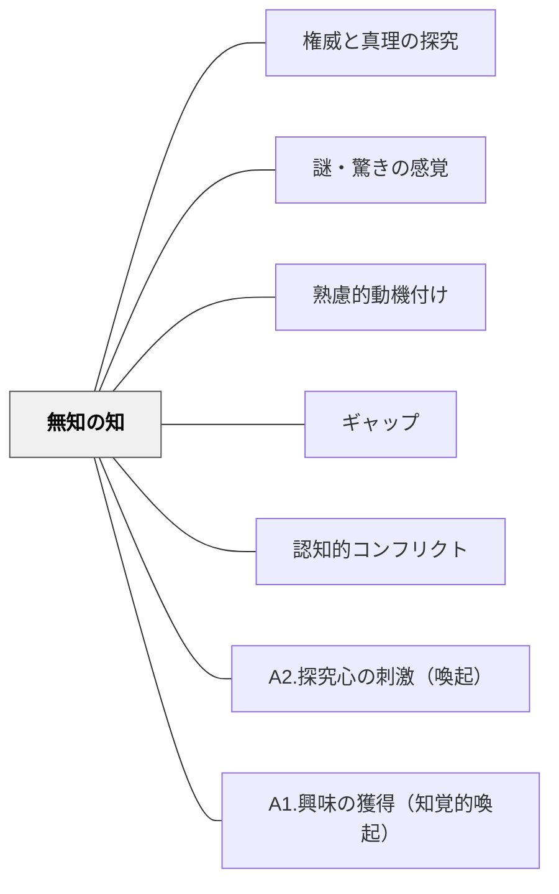

# 無知の知

> 「自分はいかに分かっていなかったか」を知ることが、知りたいという欲求を生む。問いの発見は、答えの発見より先に来る。

## 背景（Context）
ソクラテスの「無知の知」に遡るこの概念は、自分が知らないことを自覚することが知への入口になるという洞察である。学習動機において、「知らない」を発見する体験は強力な探究心の起爆剤となる。メタ認知（自分の知識状態への気づき）とも深く関連する。

## 問題（Problem）
学習者は「自分は十分知っている」という仮定のもとに学習に臨むと、新しい内容を表面的に処理して終わってしまう。また、「何が分からないか分からない」という状態では、探究の方向性が定まらない。

## 力のかたち（Forces）
- 無知の発見は不快感（認知的不協和）を伴うことがあり、それが探究心か回避のどちらにもなりうる
- 安心して「知らない」と言える心理的安全性が前提になる
- 自分が知らなかったことを知るには、知っていると思っていた状態が揺さぶられる体験が必要
- 問いを立てる能力は教えられる・育てられるスキルでもある

## 解決（Solution）
**学習者が「自分が知らなかった」「自分の理解は不完全だった」と気づく体験を意図的に設けることで、知への欲求と探究心を喚起する。**

「この現象について知っていることを書き出す→授業後に振り返る」、予測と結果のギャップを体験させる活動、「わからないことリスト」を作る振り返り、KWLチャート（Know/Want to know/Learned）の活用などが有効である。「知らない」を安全に表明できるクラスの雰囲気づくりも不可欠である。

## 結果（Consequences）
- 学習者が「知りたい」という内発的な問いを持って学習に向かえるようになる
- 自分の知識の限界を認識するメタ認知能力が育つ
- 問いを立てる習慣が探究学習・自律学習の基盤になる

## クラスター図

## Actionable Insight

- 「この現象について知っていることを書き出す」を授業前に行い授業後に見直させる——予測と現実のギャップが「知らなかった」という発見として強力な探究の起爆剤になる
- KWLチャート（知っていること・知りたいこと・学んだこと）を単元の最初と最後に使う——「知りたい」の欄への記入が探究心の言語化と方向付けを同時に行う
- 「知らない」を安全に表明できるクラスの雰囲気を意識的に育てる——「わかりません」が尊重されるコミュニティがなければ無知の知の効果は生まれない

## 出典

- 一つの教育のパタン・ランゲージ（岩井輝久）

## 関連パタン
- [[パタン/権威と真理の探究]]
- [[パタン/謎・驚きの感覚]]
- [[パタン/熟慮的動機付け]] — 親パタン
- [[パタン/ギャップ]] — 関連パタン
- [[パタン/認知的コンフリクト]] — 関連パタン
- [[パタン/A2.探究心の刺激（喚起）]] — 関連パタン（ARCSとの接点）
- [[パタン/A1.興味の獲得（知覚的喚起）]] — 関連パタン（ARCSとの接点）
