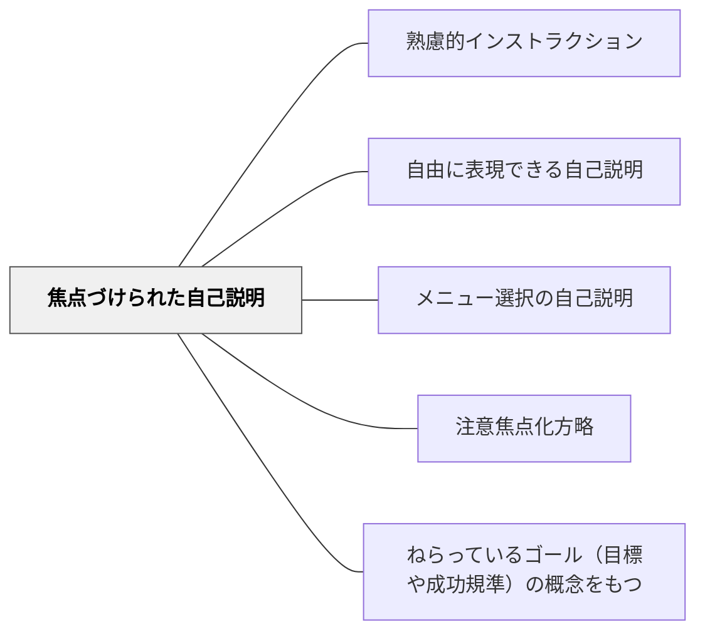

# 焦点づけられた自己説明

> 「この概念について説明しなさい」と焦点を絞ることで、自己説明を方向付ける。

## 背景（Context）
山本弘樹「教師のための説明実践の心理学」による自己説明5形態の第2形態。自由な自己説明が有効である一方、学習者によっては何を説明すればよいか分からず手が止まることがある。説明すべき内容・概念・観点を明確に示すことで、自己説明が方向付けられる。

## 問題（Problem）
「自由に説明してください」という指示は自由度が高い反面、学習者が何を説明するべきか迷って時間を無駄にしやすい。特に学習の初期段階や複雑な内容を扱うとき、焦点がないと表面的な説明にとどまりやすい。教師も何を確認したいのかが伝わらない。

## 力のかたち（Forces）
- 焦点が明確なほど自己説明が始めやすいが、焦点が狭すぎると考える余地がなくなる
- 学習の目標と連動した焦点の設定が自己説明を学習ゴールに近づける
- 焦点付きでも学習者の表現の自由は保てる
- 教師にとって評価や状況把握の観点が揃いやすい

## 解決（Solution）
**「○○という概念について自分の言葉で説明してください」「△△と□□の違いを説明してみてください」と、説明する対象・観点を明示して自己説明を求める。**
説明の対象を一つに絞ることで、学習者は何を考えればよいかが分かりやすくなる。形式は自由（口頭・記述・図解など）にしておくことで、表現の多様性は保たれる。指示の中に評価基準を含めないことで、正解を探す行動ではなく理解を表現する行動を引き出す。

## 結果（Consequences）
- 学習者が目標と関連した深い自己説明を行いやすくなる
- 教師が学習状況を焦点化して把握できる
- 自由な自己説明より取り組みやすく、幅広い学習者が参加できる

## クラスター図

## Actionable Insight

- 「今日の学びを説明してください」ではなく「○○という概念を自分の言葉で説明してください」と焦点を一つに絞って求める——焦点の明示が学習者の自己説明の質と深さを高める
- 説明の形式は自由（口頭・記述・図解）にしながら対象だけを指定する——表現の自由を保ちながら学習目標に連動した説明を引き出せる
- 自己説明後に「どこが難しかったか？」を1問加える——説明の中で生まれたメタ認知的な気づきが学習者の理解の深さを確認する機会になる

## 出典

- 一つの教育のパタン・ランゲージ（岩井輝久）

## 関連パタン
- [[パタン/熟慮的インストラクション]] — 親パタン
- [[パタン/自由に表現できる自己説明]] — より制約の少ない形態
- [[パタン/メニュー選択の自己説明]] — 選択肢から選ぶ形態
- [[パタン/注意焦点化方略]] — 注意を絞る方略との関連
- [[パタン/ねらっているゴール（目標や成功規準）の概念をもつ]] — 焦点の源泉
