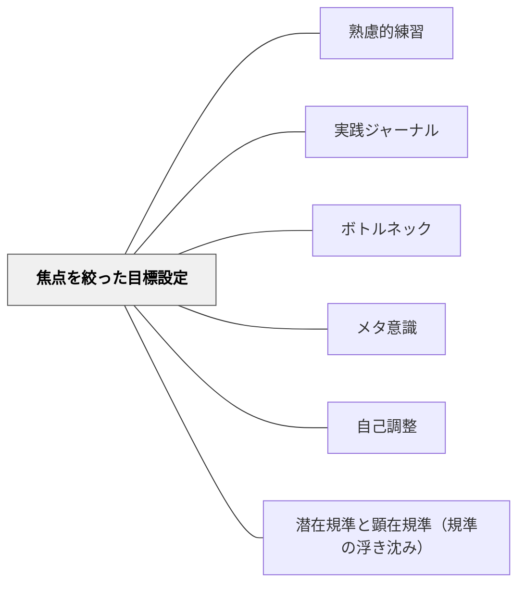

# 焦点を絞った目標設定

## 背景（Context）

[[パタン/熟慮的練習]] として、意図的な目標と振り返りをもった練習をしたい。しかし「今日も頑張る」「子どもたちのために」という大きな方向性だけでは、何がどう変わったかを確かめることができない。熟慮的練習の核心は、「一度に一つの小さな焦点を定める」ことにある。

## 問題（Problem）

「授業全体をよくしたい」「学級経営を改善したい」という目標は広すぎて、何を観察・改善すればいいかが見えない。目標が曖昧なまま実践を積み重ねても、「なんとなくよくなった気がする」「なんとなく変わらない」という感覚に留まり、意図的な成長が起きにくい。

## 力のかたち（Forces）

- 注意には限界があり、多くのことを同時に意識することはできない
- 小さな焦点は成否が確認しやすく、修正のサイクルが速くなる
- 焦点を絞りすぎると、全体の流れを見失うことがある
- 「今日の目標」が漠然としているほど、振り返りも漠然とする

## 解決（Solution）

**一回の実践（授業・支援・対話）につき、意識する焦点を一つだけ決めて臨む。**

焦点は「行動レベルで確認できる」ものにする。「子どもの発言への返し方を、評価でなく問いで返す」「発問の後に5秒待つ」のように、実施したかどうかが自分で確認できる粒度にする。

**焦点の選び方：**
- 今一番気になっている課題（ボトルネック）から選ぶ
- 「いつも同じ反応をしている」と感じる場面を選ぶ
- 前回の振り返りで「次はこうしたい」と書いたことを選ぶ

**実践例：**
- 「今日の授業では、子どもの発言を繰り返すのではなく問い返すことだけを意識する」
- 「この時間は、よくわかっていない子の様子だけを観察し続ける」
- 「今日の読み語りでは、場面転換後に必ず3秒間を置く」

## 結果（Consequences）

- 「自分は今日これをやった・やれなかった」という明確な確認ができるようになる
- 小さな変化が積み重なることで、長期的に実践が洗練されていく
- 焦点を意識することで、その部分への観察眼が育ち、子どもの反応がより細かく見えるようになる

- [[概念/自己調整学習の内側（成長の道とウェルビーイングの道）]] — 規準（Standards）の設定が自己評価をどう左右するか

## クラスター図

## Actionable Insight

- 明日の授業で意識することを「一つだけ」決めて付箋に書いておく——「発問後に5秒待つ」「問い返しを1回使う」など行動レベルで確認できる粒度にする
- 前回の振り返りで「次はこうしたい」と書いたことを、今日の焦点にする——振り返りが次の焦点を生む循環が熟慮的練習の核心
- 「今日の焦点にできたか・できなかったか」だけを授業後30秒で確認する——評価よりも確認が継続を支える

## 出典

- 一つの教育のパタン・ランゲージ（岩井輝久）

## 関連パタン

- [[パタン/熟慮的練習]] — 意図的な目標と振り返りをもった練習の上位パタン
- [[パタン/実践ジャーナル]] — 焦点を定めた後、その記録と振り返りを蓄積する
- [[パタン/ボトルネック]] — 何を焦点にするかはボトルネックの特定から始まる
- [[パタン/メタ意識]] — 焦点を持つことで実践中のメタ意識が働きやすくなる
- [[パタン/自己調整]] — 目標設定と修正のサイクルが自己調整の核心
- [[パタン/潜在規準と顕在規準（規準の浮き沈み）]] — 一度に一つに絞るという発想の、学習者の評価規準の側での対応物（Sadler, 1989）
