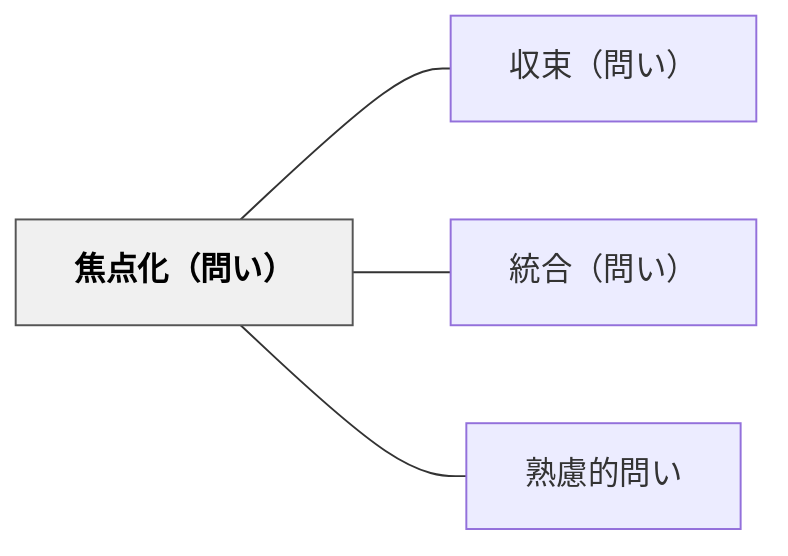

# 焦点化（問い）

> 「最も重要なことは何か？」と核心に絞ることで、思考が散漫にならず本質に向かう。

## 背景（Context）

学習者や対話の参加者が多くの情報や意見を出し合っている場面では、思考が広がりすぎて焦点を失いやすい。議論が拡散したまま終わると、何を学んだのか・何が大切なのかが曖昧になる。とくに複雑なテーマや情報量の多い状況では、核心を見失いがちである。

## 問題（Problem）

思考や議論が広がりすぎると、重要なことと些細なことの区別がつかなくなる。参加者は何に集中すればよいかわからず、学びの密度が低下する。最後に「結局何が言いたかったのか」と振り返っても答えが出ないまま終わることがある。

## 力のかたち（Forces）

- 広く考えることの価値と、焦点を絞ることの価値は相反する
- 核心を問うと参加者に「答えを決めるプレッシャー」を与える場合がある
- 問い手自身も何が核心かを断言できないまま問うことがある
- 時間の制約があるほど焦点化の問いは有効になる

## 解決（Solution）

「最も重要なことは何か？」「一言で言うと？」「核心は？」という問いを、議論が広がった後や思考の整理場面で意図的に投げかける。たとえば、長い発表の後に「この話で最も伝えたかったことを一文にするなら？」と問うことで、話者も聴衆も思考が収束する。グループ討議の後に「みんなの意見で最も大切だと思うことは何か？」と問うことで、散らばったアイデアに優先順位が生まれる。

## 結果（Consequences）

- 思考や議論が本質へと収束し、学びの輪郭が明確になる
- 参加者が「何が重要か」を自分の言葉で意識するようになる
- 問いへの答えが「正解」に縛られすぎる場合がある点に注意が必要

## 関連パタン
- [[パタン/収束（問い）]]
- [[パタン/統合（問い）]]

- [[パタン/熟慮的問い]] — 親パタン
## このパタンが働く実践

| 実践パタン | どのように焦点化しているか |
|------------|----------------------------|
| [[実践/10や100を単位にして計算しよう]] | 「何を単位として見るか」に焦点を絞り、計算の背後にある数の構成を扱う |

## このパタンが働く教材

| 教材 | どのように焦点化しているか |
|------|----------------------------|
| [[教材/読書会の質問（テーマ）集]] | 読書会で扱う問いを選び、「登場人物」「作者の書き方」「結末」など話し合いの焦点を絞る |

## クラスター図

## Actionable Insight

- 長い議論や発表の後「この話で最も伝えたかったことを一文にするなら？」と問う——核心への焦点化が散漫になった思考を本質へと収束させる
- 授業の終わりに「今日学んだことで一番大切なことを1つだけ選ぶとしたら？」と問う——授業の締めくくりに使う焦点化の問いが学びの輪郭を明確にする
- グループ討議後に「みんなの意見で最も重要だと思うことは？」と問い、根拠を求める——根拠付きの収束が「なんとなく選ぶ」を防ぎ思考の密度を高める

## 出典

- [[文献/熟慮的問いのパターンリスト（動画記録）]]
