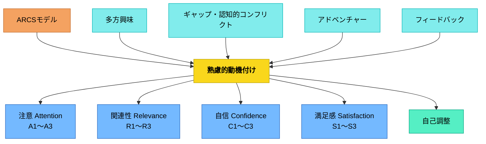

# 熟慮的動機付け

**一文でいうと**：やる気を個人の内面だけに任せず、価値・期待・感情・環境から設計する。

## 使いどころ・使いすぎ注意

| 観点         | 内容                                               |
| ------------ | -------------------------------------------------- |
| 使いどころ   | 意欲を授業設計として扱いたいとき。                 |
| 使いすぎ注意 | 動機付けだけに寄ると、学習内容の厳密さが弱くなる。 |

> 学習者のやる気は偶然に任せず、意図的に設計し支援できる。

## Pattern Connection

### アリストテレス（前335年頃）——ニコマコス倫理学 第二巻・フロネーシスと動機付け設計

「熟慮的動機付け」の「熟慮」は、アリストテレスの**フロネーシス（実践的知恵）**の働きそのものである。

- フロネーシスは「この状況でちょうどしかるべき動機付けを見極める能力」——強すぎる（プレッシャー・恐怖）でも弱すぎる（無関心・放任）でもなく、[[パタン/メソン（中庸）]] の「ちょうどしかるべき」動機付けを選択する判断力
- 「熟慮」は動機付け設計の「どのツールを使うか」の選択以前に、「この子・この文脈・この瞬間に何が適切か」を診断する思慮（phronēsis）を必要とする
- 動機付けの設計は規則（「ARCSのA要素をまず使う」）から演繹されるのではなく、実践的判断（フロネーシス）によって状況に応じて選ばれる

> 「思慮深い人ならば中間性と定めるような定め方において定まるものである。」（第二巻第六章）

**接続**：三政体の原理（モンテスキュー）と動機付けの三類型の対応は「どの原理を採用すべきか」を示すが、「今この子にどの原理がちょうどしかるべきか」の判断はフロネーシスによる。

[[文献/ニコマコス倫理学（上）（アリストテレス）]] · [[パタン/フロネーシス（実践的知恵）]] · [[パタン/メソン（中庸）]]

---

### モンテスキュー（1748）——Livre II-IV「三政体の原理と動機付け」

動機付けの三類型（内発・社会的承認・外発的強化）は、モンテスキューの三政体の「原理（ressort）」と構造的に対応する：

| モンテスキューの政体 | 原理（ressort） | 動機付けの型 | ARCSとの対応 |
|---|---|---|---|
| 共和政（démocratie） | 徳・愛国心（vertu） | 内発的・共同体貢献 | S（内発的満足感）・R（共同体との関連） |
| 王政（monarchie） | 名誉・卓越（honneur） | 社会的承認・競争 | S（外発的報酬）・A（承認への注意） |
| 専制（despotisme） | 恐怖（crainte） | 外発的強化・罰の回避 | C（成功への期待の逆）・恐怖による圧迫 |

- **既存パタンとの関連**：[[パタン/オペラント条件付け]] は「恐怖・強化」の原理に相当する。[[パタン/内発的動機付け]] は「徳」の原理に最も近い。[[パタン/S2.報酬のある成果（外発的な報酬）]] は「名誉」の原理の一形態。
- **補強された点**：動機付けを設計する前に「自分の教室はどの政体の原理で動いているか」を診断する視座が加わる。ARCSの4要素が「どの政体の原理に乗っているか」という問いと接続される。
- **エレクトロニクス時代への拡張**：デジタルプラットフォームのエンゲージメント経済は「間欠的強化（unpredictable reward）」という、三政体を超えた第四の動機付け原理として機能する。これは通知・いいね・アルゴリズム推薦によって作動し、学校の動機付け設計を侵食しうる。
- **他のパタンへの波及**：[[パタン/政体の原理と教育目標]]（動機付け設計の前提診断）・[[パタン/副次的学習]]（政体の原理が副次的学習として態度を形成する）

---

### Dewey（1938）

_Experience and Education_（1938）の「目的の形成（Purpose Formation）」概念は、このパタンの動機付け設計に「衝動から目的へ」という3段階モデルを加える。学習者のやる気を「衝動のレベルで終わらせない」ことが、動機付け設計の核心だというDeweyの指摘は実践的に重要。

- **既存パタンとの関連**：ARCSの「A（注意）」を本物の関心に変えるには、衝動→欲望→目的の形成プロセスを経る必要がある。衝動（「やってみたい」という即座の反応）が目的（「〜のためにこれをする」という見通しを持った意図）になるまでに、観察と判断の機会が必要。
- **補強された点**：「子どもが乗ってきた（衝動）」を「子どもが目的を持った（purpose）」と混同しない基準が生まれる。

**目的の形成（Purpose Formation）——衝動から目的へ**

| 段階                | 内容                                         | 授業設計での対応                               |
| ------------------- | -------------------------------------------- | ---------------------------------------------- |
| **衝動（Impulse）** | 「やりたい」という最初の動き                 | 課題・素材・活動で火をつける                   |
| **欲望（Desire）**  | 衝動が特定の方向を向いたもの                 | 「何をしたいか」を言語化させる                 |
| **目的（Purpose）** | 観察＋判断＋結果予測による見通しを伴った意図 | 「なぜそれをするか・どうなるか」を一緒に考える |

> "A genuine purpose always starts with an impulse. Obstruction of the immediate execution of an impulse converts it into a desire. Nevertheless neither impulse nor desire is itself a purpose. A purpose is an end-view."（Dewey, 1938, Ch.6）

**教師の役割**：衝動を即座に実行させることでも、外から目的を押し付けることでもなく、観察と判断の機会を設けて目的が学習者の中で育つのを助けること。

> "The teacher's business is to see that the occasion is taken advantage of... guidance given by the teacher to the exercise of the pupils' intelligence is an aid to freedom, not a restriction upon it."（Dewey, 1938, Ch.6）

- **他のパタンへの波及**：[[パタン/切実性（必要感）]]（衝動が生まれる設計）・[[パタン/課題設定]]（衝動から目的への橋渡し）

---

### Dewey（1916）

**補強された点**：本パタンはARCSモデル・多方興味・ギャップ系など複数の動機付け理論を統合しているが、Dewey（1916, Ch.10）の「関心（interest）」概念は、**動機付けの真偽を見分ける基準**を与えてくれる。外発的刺激か内発的関与かという軸に加えて、「自己と世界が本当に関与し合っているか」という基準が動機付け設計の質を問い直す。

**関心（interest）の3つの意味（Ch.10）**

Deweyは「関心（interest）」を3層で分析する：

| 意味                     | 内容                           | 授業設計への含意                           |
| ------------------------ | ------------------------------ | ------------------------------------------ |
| **継続的活動への従事**   | 何かに取り組み続けている状態   | 活動が途切れないよう設計する               |
| **物事が個人に触れる点** | 自分と素材が交わっている場所   | 学習者の現在の力・目的と素材が接続している |
| **没頭・吸収される状態** | 自分と活動が同一化している状態 | フロー状態：評価を忘れて活動する           |

> "Interest signifies that self and world are engaged with each other in a developing situation."（Dewey, 1916, Ch.10）

**真の関心 vs. 偽の関心（糖衣付き）**

これはARCSの「A（注意）」を「本物の関心」と「刺激的な装置」で区別するDeweの指摘：

|              | 真の関心                                 | 偽の関心（糖衣）                 |
| ------------ | ---------------------------------------- | -------------------------------- |
| 源泉         | 素材と学習者の現在の力・目的の自然な連結 | 外から付加された面白さ・報酬・罰 |
| 動機の性質   | 活動への内発的関与                       | 活動の外にある誘因への反応       |
| 生み出すもの | 統合された心（whole mind）               | 分割された心（divided mind）     |
| 持続性       | 刺激がなくても続く                       | 刺激がなくなると消える           |

「分割された心（divided mind）」——学習者が表面上は参加しながら内側は離脱している状態——は、「関心がないのにやらされている」動機付けが生む最も危険な副作用。建前の参加が習慣化すると、主体性の基盤が損なわれる。

**関心と規律は対立しない**

Deweyは「関心と規律（discipline）は目的をもつ活動の両面」だと言う。内発的関心のある活動に自然に規律が宿る。「やる気がないから規律がない」ではなく、「本物の目的をもつ活動に関与させれば規律は生まれる」。この命題はARCSの「C（自信）」「S（満足）」と組み合わせると実践的になる。

> "Interest measures—or rather is—the depth of the grip which the foreseen end has upon one, moving one to act for its realization."（Dewey, 1916, Ch.10）

**多方興味との接続**

ヘルバルト＝牧口の「多方興味（9種類）」は、Deweyの「自己と世界が関与し合う点の多様性」を類型化したものとして読める。知覚的交渉（状況的興味）がDeweyの「自然への直接的な経験」に最も近く、研究的交渉がDeweyの「反省的思考を起動する関心」に対応する。

**他のパタンへの波及**：[[パタン/教育＝成長]] の「成長への欲求そのものが動機」という命題は、「本物の内発的動機付けとは何か」をDeweの視点から定義する。[[パタン/反省的思考の5段階]] では、困惑（段階①）が本物の関心の着火点になるかどうかが問われる。

---

## 背景（Context）

学習において「やる気」は不可欠な要素だが、「本人次第」として放置されることが多い。しかし動機付けは理論的に分析でき、教育設計の中に意図的に組み込むことができる。

## 問題（Problem）

動機付けのない学習者は学ばない。しかし「もっとやる気を出せ」と言うだけでは何も変わらない。どのような仕組みで動機が生まれ、維持されるのかを理解しなければ、教育設計に活かせない。

## 力のかたち（Forces）

- 動機付けには内発的なものと外発的なものがある
- 一部のパターン（例：フィードバック、可視化）は他の目的も持ちながら動機付けにも機能する
- 動機付けのパターンは互いに重なり合い、関係し合っている
- どのパターンも単独では不完全——組み合わせが重要

## 解決（Solution）

**動機付けに関する複数の理論とパターンを理解し、文脈に応じて組み合わせて使う。ARCSモデルを基本の地図として用い、ギャップ・多方興味・自己調整・外発的動機付けなどの観点から設計する。**

### 教室での診断チェックリスト

授業前に以下を確認し、ボトルネックに応じてパタンを選ぶ：

| チェック | 問い | 対応パタン |
|--------|------|---------|
| □ 注意 | 最初の5分で「なんだろう？」が生まれているか | [[パタン/A1.興味の獲得（知覚的喚起）]] |
| □ 切実性 | 「なぜこれを学ぶのか」が子どもに見えているか | [[パタン/切実性（必要感）]] |
| □ 関連性 | 子どもの興味・生活・目標と結びついているか | [[パタン/R2.興味（動機）との一致]] |
| □ 期待感 | 「自分にできそう」という感覚があるか | [[パタン/C1.成功への期待感（学習要求）]] |
| □ 選択 | 「自分が決めた」という感覚があるか | [[パタン/自己選択自己決定]] |
| □ 満足感 | 「できた・伸びた」が実感されているか | [[パタン/S1.内発的満足感（内発的な強化）]] |

## パターン一覧

### ARCSモデル（ケラー）

| パターン名                                     | 説明                                        |
| ---------------------------------------------- | ------------------------------------------- |
| [[パタン/ARCS]]                                | ケラーの体系的動機付けモデル（全体）        |
| [[パタン/注意を生み出し維持する（Attention）]] | A：学習者の注意を引きつけ持続させる         |
| [[パタン/関連性を確立し支援する（Relevance）]] | R：学習内容を学習者の目標・興味と結びつける |
| [[パタン/自信を構築する（Confidence）]]        | C：できるという感覚を育てる                 |
| [[パタン/満足感をもたらす（Satisfaction）]]    | S：達成や報酬で満足感を生み出す             |

**Attention（注意）のサブパターン**

| パターン名                             | 説明                               |
| -------------------------------------- | ---------------------------------- |
| [[パタン/A1.興味の獲得（知覚的喚起）]] | 驚き・新奇性で注意を引く           |
| [[パタン/A2.探究心の刺激（喚起）]]     | 問いを投げかけ探求欲を喚起する     |
| [[パタン/A3.注意の持続（変化性）]]     | 変化をつけることで注意を持続させる |

**Relevance（関連性）のサブパターン**

| パターン名                                         | 説明                                     |
| -------------------------------------------------- | ---------------------------------------- |
| [[パタン/R1.ゴールと関連づけること（目的思考性）]] | 学習とその人の目標・目的を結びつける     |
| [[パタン/R2.興味（動機）との一致]]                 | 学習者の既存の興味・関心と学習を合わせる |
| [[パタン/R3.経験とのつながり（親しみやすさ）]]     | 既存の経験と新しい学習を結びつける       |

**Confidence（自信）のサブパターン**

| パターン名                                       | 説明                                                   |
| ------------------------------------------------ | ------------------------------------------------------ |
| [[パタン/C1.成功への期待感（学習要求）]]         | 成功できるという期待を高める                           |
| [[パタン/C2.成功の機会]]                         | 実際に成功を経験できる機会を作る                       |
| [[パタン/C3.個人の責任（個人的なコントロール）]] | 学習者が自分でコントロールできる感覚を持てるようにする |

**Satisfaction（満足）のサブパターン**

| パターン名                                   | 説明                                   |
| -------------------------------------------- | -------------------------------------- |
| [[パタン/S1.内発的満足感（内発的な強化）]]   | 活動そのものの喜びで満足感をもたらす   |
| [[パタン/S2.報酬のある成果（外発的な報酬）]] | 達成に対する外部報酬で満足感をもたらす |
| [[パタン/S3.公平な待遇（公平感）]]           | 公平な扱いを保ち意欲をそがない         |

### 内発的動機付け

| パターン名                                    | 説明                                   |
| --------------------------------------------- | -------------------------------------- |
| [[パタン/内発的価値]]                         | 活動そのものに感じる価値・面白さ       |
| [[パタン/自己選択自己決定]]                   | 自分で選び決めることが動機を生む       |
| [[パタン/本物を扱う（当事者意識・自分ごと）]] | 本物・リアルな課題が当事者意識を育てる |
| [[パタン/目標設定]]                           | 適切な目標を自ら設定する               |
| [[パタン/自己調整]]                           | 自分で目標・方法・評価を管理する       |
| [[パタン/個人興味]]                           | 個人の安定した興味・関心に根ざした動機 |
| [[パタン/個別化]]                             | 個人の興味・強みに合わせた学習設計     |

### ギャップ系

| パターン名                              | 説明                                             |
| --------------------------------------- | ------------------------------------------------ |
| [[パタン/ギャップ]]                     | ある状態と望む状態のずれが動機を生む（親パタン） |
| [[パタン/過去記憶と現状]]               | 過去の自分と現在のギャップが継続意欲を生む       |
| [[パタン/将来展望と現状]]               | 将来の夢・目標と現状のギャップが動機になる       |
| [[パタン/無知の知]]                     | 自分が知らないことを知ることが探究心を生む       |
| [[パタン/認知的コンフリクト]]           | 予測を裏切る出来事が解消欲求を生む               |
| [[パタン/最適化]]                       | 最適状態へ向かおうとする傾向を活かす             |
| [[パタン/予測差分（期待値差分）の調整]] | 過大な期待を調整してやる気低下を防ぐ             |

### 外発的動機付け・コミットメント

| パターン名                              | 説明                                   |
| --------------------------------------- | -------------------------------------- |
| [[パタン/オペラント条件付け]]           | 強化・罰による行動の学習（親パタン）   |
| [[パタン/コミットメント]]               | 自分との約束・誓約で行動を促進する     |
| [[パタン/正の強化]]                     | 良い行動に報酬を与えて増やす           |
| [[パタン/負の強化]]                     | 不快なものを取り除いて行動を増やす     |
| [[パタン/正の罰]]                       | 不快なものを与えて行動を減らす         |
| [[パタン/負の罰]]                       | 心地よいものを取り去って行動を減らす   |
| [[パタン/期待・達成価値（重要性価値）]] | 成功への期待と達成の重要性が動機になる |
| [[パタン/宣言]]                         | 公言・宣言が実行を後押しする           |
| [[パタン/アクション]]                   | 行動することでやる気が生まれる         |

### 方向づけのベース

| パターン名                  | 説明                                           |
| --------------------------- | ---------------------------------------------- |
| [[パタン/方向づけのベース]] | 先行オーガナイザー・レイジによる理解の足場がけ |

### 多方興味（ヘルバルト / 牧口常三郎）

| パターン名                                  | 説明                                     |
| ------------------------------------------- | ---------------------------------------- |
| [[パタン/多方興味]]                         | 多様な種類の興味を活用する（親パタン）   |
| [[パタン/好奇心から多方興味へ]]             | 好奇心を入り口に多方面の興味へ発展させる |
| [[パタン/知覚的交渉（状況的興味）]]         | 自然・社会事象への直接的関わり           |
| [[パタン/利用的交渉（有用性価値／有益性）]] | 利用・活用することへの興味               |
| [[パタン/研究的交渉]]                       | 科学的探究・調査への興味                 |
| [[パタン/審美的交渉]]                       | 芸術・美への興味                         |
| [[パタン/道徳的交渉]]                       | 道徳的価値への関心                       |
| [[パタン/同情的交渉]]                       | 共感・同情の感情                         |
| [[パタン/社会的交渉（ソーシャル）]]         | 家族・国家・他者との関係への興味         |
| [[パタン/宗教的交渉]]                       | 宗教・霊的なものへの関心                 |

### 自己調整・メタ認知

| パターン名                                                    | 説明                                         |
| ------------------------------------------------------------- | -------------------------------------------- |
| [[パタン/自己教示（セルフトーク／自己説明／精緻化／体系化）]] | 自己対話・説明で理解と自信を深める           |
| [[パタン/メタ認知的モニタリング]]                             | 自分の学習状況を観察・評価する               |
| [[パタン/自己記録]]                                           | 自分の行動・成果を記録する                   |
| [[パタン/帰属志向性]]                                         | 成功・失敗の原因の帰属の仕方が動機に影響する |
| [[パタン/イメージ]]                                           | 目標やプロセスをイメージする                 |
| [[パタン/焦点を絞った目標設定]]                               | 具体的・適切な目標が動機を支える             |

### ゲーム・感情・想像力

| パターン名                                                | 説明                             |
| --------------------------------------------------------- | -------------------------------- |
| [[パタン/ゲーム]]                                         | ゲーム的要素で楽しさと動機を生む |
| [[パタン/想像力（感情）を触発する]]                       | 感情・想像力を揺さぶり動機を生む |
| [[パタン/セレンディピティを掴む（徴候的知／周辺的関心）]] | 偶然の発見を動機に変える         |

### 大きなパターン（参照）

| パターン名                                    | 説明                                 |
| --------------------------------------------- | ------------------------------------ |
| [[パタン/アドベンチャー]]                     | 適切な負荷・チャレンジで動機を保つ   |
| [[パタン/熟慮的配列]]                         | 学習の順序設計が動機に影響する       |
| [[パタン/熟慮的練習]]                         | 質の高い練習で上達と自信を育てる     |
| [[パタン/オンボーディング]]                   | 学習の土台に乗れるようにする         |
| [[パタン/可視化]]                             | 学習・成長を見えるようにする         |
| [[パタン/制限化限定化]]                       | 範囲を絞ることで集中と意欲を高める   |
| [[パタン/心理的安全性（コンフォートゾーン）]] | 安心できる基盤がチャレンジを支える   |
| [[パタン/運動]]                               | 身体を動かすことが脳と意欲に働く     |
| [[パタン/フィードバック]]                     | フィードバックがギャップと意欲を生む |

## 結果（Consequences）

- 教育者が動機付けを体系的に理解し、意図的に設計できるようになる
- 学習者の「やる気」が様々な角度から支援される
- 単一のアプローチへの依存を避け、多角的な動機付け設計ができる

## 関連パタン
- [[パタン/自分の頭で考える（Selbstdenken）]]
- [[パタン/フロネーシス（実践的知恵）]]
- [[パタン/メソン（中庸）]]
- [[パタン/政体の原理と教育目標]]
- [[パタン/ミソロゴス（言論嫌い）]]
- [[パタン/タウマゼイン（驚きから始まる探究）]]
- [[パタン/計量術（メトレーティケー）]]
- [[パタン/アポリアの設計]]
- [[学級経営/学級経営で使えるパタン]]
- [[パタン/ゲーム]]
- [[パタン/A1.興味の獲得（知覚的喚起）]]
- [[パタン/A2.探究心の刺激（喚起）]]
- [[パタン/C1.成功への期待感（学習要求）]]
- [[パタン/C2.成功の機会]]
- [[パタン/C3.個人の責任（個人的なコントロール）]]
- [[パタン/R1.ゴールと関連づけること（目的思考性）]]
- [[パタン/R2.興味（動機）との一致]]
- [[パタン/R3.経験とのつながり（親しみやすさ）]]
- [[パタン/S1.内発的満足感（内発的な強化）]]
- [[パタン/S2.報酬のある成果（外発的な報酬）]]
- [[パタン/S3.公平な待遇（公平感）]]
- [[パタン/アクション]]
- [[パタン/コミットメント]]
- [[パタン/セレンディピティを掴む（徴候的知／周辺的関心）]]
- [[パタン/運動]]
- [[パタン/過去記憶と現状]]
- [[パタン/関連性を確立し支援する（Relevance）]]
- [[パタン/期待・達成価値（重要性価値）]]
- [[パタン/帰属志向性]]
- [[パタン/研究的交渉]]
- [[パタン/個人興味]]
- [[パタン/最適化]]
- [[パタン/自己記録]]
- [[パタン/自己教示（セルフトーク／自己説明／精緻化／体系化）]]
- [[パタン/自信を構築する（Confidence）]]
- [[パタン/社会的交渉（ソーシャル）]]
- [[パタン/宗教的交渉]]
- [[パタン/将来展望と現状]]
- [[パタン/審美的交渉]]
- [[パタン/正の強化]]
- [[パタン/正の罰]]
- [[パタン/宣言]]
- [[パタン/知覚的交渉（状況的興味）]]
- [[パタン/注意を生み出し維持する（Attention）]]
- [[パタン/挑発する]]
- [[パタン/同情的交渉]]
- [[パタン/道徳的交渉]]
- [[パタン/内発的価値]]
- [[パタン/認知的コンフリクト]]
- [[パタン/負の強化]]
- [[パタン/負の罰]]
- [[パタン/方向づけのベース]]
- [[パタン/満足感をもたらす（Satisfaction）]]
- [[パタン/無知の知]]
- [[パタン/目標設定]]
- [[パタン/予測差分（期待値差分）の調整]]
- [[パタン/利用的交渉（有用性価値／有益性）]]
- [[パタン/A3.注意の持続（変化性）]]
- [[パタン/ARCS]]
- [[パタン/オペラント条件付け]]
- [[パタン/スキル化]]
- [[パタン/ナッジ]]
- [[パタン/メタ注意]]
- [[パタン/メタ認知的モニタリング]]
- [[パタン/教育＝成長]]
- [[パタン/教育目的]]
- [[パタン/個別化]]
- [[パタン/自己選択自己決定]]
- [[パタン/熟慮的インストラクション]]
- [[パタン/熟慮的教材教具]]
- [[パタン/心理的安全性（コンフォートゾーン）]]
- [[パタン/人間形成の様式]]
- [[パタン/想像力（感情）を触発する]]
- [[パタン/内発的動機付け]]
- [[パタン/本物を扱う（当事者意識・自分ごと）]]

- [[パタン/アドベンチャー]] — 課題難易度による動機設計
- [[パタン/フィードバック]] — ギャップを通じた動機付け
- [[パタン/多方興味]] — 興味の多様性を活かす
- [[パタン/自己調整]] — 自己管理による内発的動機
- [[特別支援/身体と学習]] — 運動の成功体験が学習全体への動機づけに橋渡しする実践例

## クラスター図
<!-- cluster: manual -->

## Actionable Insight

- ARCSの「R（関連性）」を1つだけ意識して授業の導入に組み込む——「これは○○と関係している」「自分のどんな場面で使えるか」を問いかけるだけでよい
- 「やる気がない」と感じたら、ARCS4要素のどれが欠けているかを10秒で診断する——A（興味が薄い）/R（関係性が薄い）/C（自信がない）/S（達成感がない）のどれかが見えてくる
- ギャップを使う：今日の学習で「理想の自分」と「今の自分」の差を学習者が1行書く機会を作る——このギャップの言語化が内発的動機の最も強い刺激の一つ

## 出典

- Skinner, B. F. (1938). _The Behavior of Organisms: An Experimental Analysis_. Appleton-Century-Crofts.
- Keller, J. M. (2010). _Motivational Design for Learning and Performance: The ARCS Model Approach_. Springer.
- Keller, J. M. (1987). Development and use of the ARCS model of instructional design. _Journal of Instructional Development_, 10(3), 2–10.
- Herbart, J. F. (1806). _Allgemeine Pädagogik_.（三枝孝弘訳（1960）『一般教育学』明治図書）
- 熟慮的動機付けのパターンリスト（動画記録）: [[文献/熟慮的動機付けのパターンリスト（動画記録）]]

---

## 下位パタン一覧

| パタン                                                        | サマリー                                                                                                       |
| ------------------------------------------------------------- | -------------------------------------------------------------------------------------------------------------- |
| [[パタン/A1.興味の獲得（知覚的喚起）]]                        | 驚き・新奇性・視覚的刺激が、学習者の「なんだろう？」を呼び起こす。最初の一瞬が、その後の学習への入口になる。   |
| [[パタン/A2.探究心の刺激（喚起）]]                            | 「なぜ？」「どうして？」が解きたくなる状況を作ることで、探求欲を内側から燃やす。問いは答えより強い動機になる。 |
| [[パタン/A3.注意の持続（変化性）]]                            | 変化のない授業は、どれほど大事な内容でも注意が離れていく。活動・形式・ペースに変化をつけることで、注意を…      |
| [[パタン/C1.成功への期待感（学習要求）]]                      | 「自分はこれができる」という期待感が、挑戦への最初の一歩を生む。成功への見通しがあってこそ、学習者は動き出す。 |
| [[パタン/C2.成功の機会]]                                      | 「できた」という実体験が、次の挑戦への自信になる。成功は待つものではなく、設計するものである。                 |
| [[パタン/C3.個人の責任（個人的なコントロール）]]              | 「自分でやった」という感覚が、自信の核心をつくる。コントロール感のある学習者は、結果を自分のものとして引…      |
| [[パタン/R1.ゴールと関連づけること（目的思考性）]]            | 「これを学ぶと、自分の○○に役立つ」が見えたとき、学習は自分のこととして動き始める。ゴールとの接続が動機…        |
| [[パタン/R2.興味（動機）との一致]]                            | 学習者が「これは自分の関心領域だ」と感じると、学ぶ理由を探す必要がなくなる。既存の興味と学習を重ねること…      |
| [[パタン/R3.経験とのつながり（親しみやすさ）]]                | 新しい学びが過去の経験と結びつくとき、理解は深まり、取り組む意欲が自然に生まれる。知っていることが、知ら…      |
| [[パタン/S1.内発的満足感（内発的な強化）]]                    | 「できた！」「わかった！」「面白い！」という内側からの喜びが、外からの報酬がなくても学びを続けさせる。         |
| [[パタン/S2.報酬のある成果（外発的な報酬）]]                  | 達成を認められ、報われる体験が、学習の意味を強化する。外部からの承認は、特に学びはじめの段階で大きな力を持つ。 |
| [[パタン/S3.公平な待遇（公平感）]]                            | 不公平だと感じた瞬間、それまで積み上げた動機は崩れ落ちる。公平な扱いは動機の基盤にある見えにくい柱である。     |
| [[パタン/アクション]]                                         | やる気が出るのを待つのではなく、まず動く。行動がやる気を生む。                                                 |
| [[パタン/オペラント条件付け]]                                 | 行動の結果が次の行動を形作る。強化と罰の仕組みを知ることが、動機付けの設計の基礎となる。                       |
| [[パタン/コミットメント]]                                     | 自分との約束が行動を引き出す。宣言・誓約・契約は動機付けの強力な触媒となる。                                   |
| [[パタン/セレンディピティを掴む（徴候的知／周辺的関心）]]     | 「ちょっと気になる」という周辺的な関心が、新しい学びへの動機の種になる。                                       |
| [[パタン/予測差分（期待値差分）の調整]]                       | 期待が高すぎると落胆し、低すぎると挑戦しない。現実的な見通しが動機を守る。                                     |
| [[パタン/個人興味]]                                           | 自分の中に根付いた興味は、外から火をつけなくても燃え続ける。個人の関心領域に根ざした動機は、深く安定している。 |
| [[パタン/内発的価値]]                                         | 活動そのものが報酬になるとき、人は外から促されなくても動き続ける。やっていること自体が価値なら、動機は尽…      |
| [[パタン/利用的交渉（有用性価値／有益性）]]                   | 「これで何かできる」という実感が、学ぶ意味を作り出す。                                                         |
| [[パタン/同情的交渉]]                                         | 他者の痛みや喜びに寄り添うことが、学ぼうとする力の源泉になる。                                                 |
| [[パタン/宗教的交渉]]                                         | 「なぜ生きるのか」という根本的な問いへの探究が、深い学びの動機になる。                                         |
| [[パタン/宣言]]                                               | 人前で言葉にすることが、行動への踏み台になる。                                                                 |
| [[パタン/審美的交渉]]                                         | 美しいものへの感動が、深く学ぼうとする動機を呼び覚ます。                                                       |
| [[パタン/将来展望と現状]]                                     | 夢や目標と今の自分のギャップを見つめるとき、「そこに向かうためにこれを学ぼう」という方向性が生まれる。将…      |
| [[パタン/帰属志向性]]                                         | 成功・失敗の原因をどこに求めるかが、次の挑戦への意欲を決める。                                                 |
| [[パタン/方向づけのベース]]                                   | 何を学ぶのかの全体像を先に示すことで、学習者は安心して深く入っていける。                                       |
| [[パタン/最適化]]                                             | 「もっとよくしたい」という欲求は、人間に深く根ざした動機の源泉である。現状と理想のギャップが、改善へのエ…      |
| [[パタン/期待・達成価値（重要性価値）]]                       | 「できそうか」と「やる価値があるか」の両方が揃ってはじめて人は動く。                                           |
| [[パタン/正の強化]]                                           | 望ましい行動のあとに良いものを与えることで、その行動が増える。                                                 |
| [[パタン/正の罰]]                                             | 望ましくない行動のあとに不快なものを与えることで、その行動が減る。使用には細心の注意が必要。                   |
| [[パタン/注意を生み出し維持する（Attention）]]                | 学習者が「気になる」と感じなければ、学習は始まらない。新奇性・驚き・問いかけで注意を呼び起こし、変化によ…      |
| [[パタン/満足感をもたらす（Satisfaction）]]                   | やり遂げた喜び・認められる経験・公平な扱いが、学習を「また続けたい」という気持ちにつなげる。                   |
| [[パタン/知覚的交渉（状況的興味）]]                           | 直接触れて、見て、感じることから、学習への入り口が開く。                                                       |
| [[パタン/研究的交渉]]                                         | 「知りたい」という欲求が、探究と学びの原動力になる。                                                           |
| [[パタン/社会的交渉（ソーシャル）]]                           | 家族・仲間・地域・社会の一員であることが、学ぼうとする動機を支える。                                           |
| [[パタン/自信を構築する（Confidence）]]                       | 「自分にはできる」という感覚が、挑戦を続ける原動力になる。適切な難易度・成功体験・自己コントロール感で自…      |
| [[パタン/自己教示（セルフトーク／自己説明／精緻化／体系化）]] | 自分に教えるように説明することで、理解が深まり、自信と動機が生まれる。                                         |
| [[パタン/自己記録]]                                           | 自分の進歩を記録し、目に見えるようにすることで、動機が維持される。                                             |
| [[パタン/認知的コンフリクト]]                                 | 予測を裏切られた瞬間、人は「なぜ？」を解かずにいられなくなる。矛盾・驚き・ズレが、探究心への着火点になる。     |
| [[パタン/負の強化]]                                           | 望ましい行動をとることで不快なものが取り除かれる。行動は増える。                                               |
| [[パタン/負の罰]]                                             | 望ましくない行動のあとに心地よいものを取り去ることで、その行動が減る。                                         |
| [[パタン/運動]]                                               | 体を動かすことで脳が活性化し、やる気に関わる神経基盤が整えられる。                                             |
| [[パタン/過去記憶と現状]]                                     | 「以前はできなかったことが今はできる」という気づきが、成長の実感と継続意欲を生む。過去の自分との比較が、…      |
| [[パタン/道徳的交渉]]                                         | 「これは正しいのか」という問いが、学びへの真剣な関与を生む。                                                   |
| [[パタン/関連性を確立し支援する（Relevance）]]                | 「これは自分に関係がある」と感じることが、学ぼうとする意志を生む。学習内容を学習者の目標・興味・経験と結…      |
