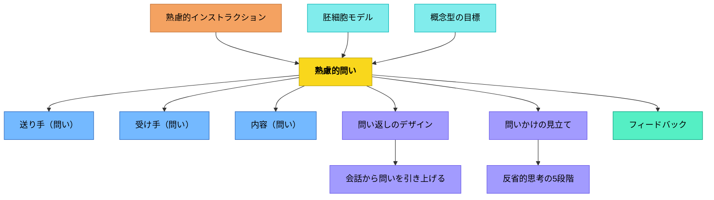

# 熟慮的問い

> 問いは偶然に任せず、目的・相手・方法・文脈を意図的に設計することで、学びと探究を深められる。

## 背景（Context）

教育者が発する問いも、学習者自身が立てる問いも、そのパターンは無数にある。しかし「問いの種類をたくさん知っている」だけでは機能しない。どんな目的・相手・状況においてどの問いを選ぶか、という**熟慮的な設計**が問いの力を引き出す。

## 問題（Problem）

問いは経験的・感覚的に使われがちで、なぜその問いが効果的だったかが分析されない。問い方が固定化し、発散を促すべき場面でも収束型の問いを使い続けるなど、ミスマッチが起きる。

## 力のかたち（Forces）

- 問いの目的（理解確認・探究誘発・メタ認知・評価など）は場面によって異なる
- 問いは送り手・受け手・内容・チャンネル・コンテクストの5要素で構造化できる
- 同じ問いでも時制（過去・現在・未来）や次元（価値・事実・感情）によって引き出されるものが変わる
- 思考操作（比較・分類・発散・収束など）と問いは対応している

## 解決（Solution）

**問いの目的・相手・方法・文脈を意識的に選択し、以下のカテゴリから適切な問いパターンを重ねる。**

### ワーマン5要素（問いの設計原則）

| パタン                | 核心                          |
| ------------------ | --------------------------- |
| [[パタン/送り手（問い）]]    | 誰が問うか——教育者か学習者か             |
| [[パタン/受け手（問い）]]    | 誰に問うか——相手の理解・文脈を把握する        |
| [[パタン/内容（問い）]]     | 何を問うか——教科・テーマによって問うべきことが変わる |
| [[パタン/チャンネル（問い）]]  | どのような形式・方法で問うか              |
| [[パタン/コンテクスト（問い）]] | どんな状況・目的で問うか                |

### 問いの次元

| パタン                    | 核心                  |
| ---------------------- | ------------------- |
| [[パタン/価値を問う]]          | この学びの良さ・意義は何か       |
| [[パタン/過去を問う]]          | 由来・歴史・変化を問う         |
| [[パタン/現在を問う]]          | 今どうなっているか、現状を問う     |
| [[パタン/未来を問う]]          | これからどうなるか、どうすべきかを問う |
| [[パタン/感情を問う]]          | 感じたこと・気持ちを問う        |
| [[パタン/使命（目的）何のため（問い）]] | 何のためにするのかを問う        |
| [[パタン/最終イメージ（問い）]]     | ゴール像・完成形を問う         |

### 問いの環境整備

| パタン                      | 核心                  |
| ------------------------ | ------------------- |
| [[パタン/質問作成の手順を示す]]       | 質問語幹リストなどで手順を可視化する  |
| [[パタン/他者の質問を参照できるようにする]] | 問いのモデルを提供する         |
| [[パタン/問題の意識化]]           | 「分からない」「知りたい」を明確にする |
| [[パタン/質問する文化]]           | 問うことが当たり前の文化を育てる    |

### メタ認知の問い（ポリア）

| パタン | 核心 |
|--------|------|
| [[パタン/自分に投げかける問い]] | 自分の理解を再考するメタ認知の問い |
| [[パタン/求めるものは何か]] | 何を答えとして求めているのか |
| [[パタン/分からないことは何か]] | 未知・ギャップを明確にする |
| [[パタン/君は何を見つけようとしているのか]] | 探究の方向を問う |
| [[パタン/与えられているものは何か（問い）]] | 既知の情報・条件を整理する |
| [[パタン/条件は何か（問い）]] | 制約・条件を明確にする |
| [[パタン/図に表せないか]] | 視覚化・図示で問題を再構成する |
| [[パタン/似ているものを知らないか（問い）]] | 既知から未知へ——アナロジー探索 |
| [[パタン/役立つ定理を知らないか]] | 使えそうな知識・原理を問う |
| [[パタン/これと似たもっと簡単な問題は]] | 問題を単純化して足がかりを作る |
| [[パタン/もっと一般的な問題は（一般化）]] | 抽象化・一般化を問う |
| [[パタン/もっと特殊な問題は（特殊化）]] | 具体化・特殊化を問う |
| [[パタン/類推的な問題は（問い）]] | 似た構造の問題を探す |
| [[パタン/一部分を解くことはできないか]] | 部分解・サブゴールを問う |
| [[パタン/与えられているものをすべてつかったか]] | 活用し残しの確認 |
| [[パタン/条件をすべてつかったか]] | 条件の見落としを確認 |
| [[パタン/計画の各段階はどうか]] | 解法プロセスの振り返り |
| [[パタン/解決をためすことができるか]] | 検証・確認の問い |
| [[パタン/似た問題に解決を応用できるか]] | 転移・応用を問う |

### 問い返し（リヴォイシング）

| パタン | 核心 |
|--------|------|
| [[パタン/問い返し（リヴォイシング）]] | 相手の発言を問いとして返す |
| [[パタン/意味を問う（それはどういうことかな）]] | 意味・定義を言語化させる |
| [[パタン/理由・根拠を問う]] | なぜそう考えたかを問う |
| [[パタン/続きを問う]] | 思考の続きを引き出す |
| [[パタン/他の表現や方法を問う]] | 別の言葉・方法での表現を促す |
| [[パタン/思考や表現のよさを問う]] | 価値・優れた点を問う |
| [[パタン/知覚語で問う]] | 感覚的・身体的な表現で問う |

### 発問技術

| パタン | 核心 |
|--------|------|
| [[パタン/ゆさぶり発問]] | 固定観念に疑いを投げかける |
| [[パタン/否定発問]] | 間違い・例外を問う |
| [[パタン/しぼる問い（クローズドクエスチョン）]] | 答えを限定する問い |
| [[パタン/広げる問い（オープンクエスチョン）]] | 多様な答えを引き出す問い |
| [[パタン/深める問い]] | 表面から核心へ掘り下げる |
| [[パタン/間接的発問]] | ねらいを迂回して問う——良い発問の第一条件 |
| [[パタン/発問セット指示]] | 発問と指示をセットで設計する |
| [[パタン/発問前の整理（文脈づくり）]] | 発問を機能させる前段階の設計 |
| [[パタン/発問のグラデーション]] | 子どものレベルに合わせて発問の難易度を調節する |

### 論理的問い

| パタン | 核心 |
|--------|------|
| [[パタン/異同（問い）]] | 違いと共通点を問う |
| [[パタン/仮定（もし〜だったら）]] | 仮想の設定で思考を広げる |
| [[パタン/背理法（もし〜でなかったら）]] | 否定による推論 |
| [[パタン/加減（付け足す・削る）]] | 要素の追加・除去を問う |
| [[パタン/定義・特徴を問う]] | 概念の本質を問う |

### 基本疑問詞（WH問い）

| パタン | 核心 |
|--------|------|
| [[パタン/いつ？（問い）]] | 時間・時期を問う |
| [[パタン/どこ？（問い）]] | 場所・位置を問う |
| [[パタン/なぜ？（問い）]] | 理由・原因を問う |
| [[パタン/だれ？（問い）]] | 人・主体を問う |
| [[パタン/どのように？（問い）]] | 方法・プロセスを問う |
| [[パタン/どのくらい？（問い）]] | 量・程度を問う |
| [[パタン/どうすべきか？（当為）]] | 規範・べき論を問う |
| [[パタン/事実か（信憑性）]] | 根拠・エビデンスを問う |
| [[パタン/他には？（問い）]] | 追加・多様な視点を促す |
| [[パタン/例えば？（例示・具象化）]] | 具体例を求める |
| [[パタン/すべてそうなのか（限定化）]] | 一般化の誤りを問う |

### 思考操作の問い

| パタン | 核心 |
|--------|------|
| [[パタン/帰納（問い）]] | 個別から法則を見出す |
| [[パタン/演繹（問い）]] | 法則から個別へ適用する |
| [[パタン/アブダクション（問い）]] | 驚くべき事実から仮説を形成する |
| [[パタン/類推（アナロジー）]] | 構造の類似から推論する |
| [[パタン/比較（問い）]] | 2つ以上を並べて違いを問う |
| [[パタン/統合（問い）]] | バラバラの要素をまとめる |
| [[パタン/関連づける（問い）]] | つながりを問う |
| [[パタン/発散（問い）]] | アイデアを広げる |
| [[パタン/収束（問い）]] | 選び絞る |
| [[パタン/活用（問い）]] | どう使えるかを問う |
| [[パタン/選択（問い）]] | どれを選ぶかを問う |
| [[パタン/創造（問い）]] | 新しいものを作る問い |
| [[パタン/拡張（問い）]] | 広げる・発展させる |
| [[パタン/焦点化（問い）]] | 核心に絞る |
| [[パタン/観点変更（問い）]] | 別の視点から見る |
| [[パタン/分類（問い）]] | グループに分ける |
| [[パタン/分解（問い）]] | 要素に分ける |
| [[パタン/変換（問い）]] | 形式・表現を変える |
| [[パタン/連想（問い）]] | 関連するものを広げる |
| [[パタン/反復検討]] | 繰り返し問い直す |
| [[パタン/弁証法（ジンテーゼを問う）]] | 対立から止揚を問う |

### 創造的問い

| パタン | 核心 |
|--------|------|
| [[パタン/制約をかける（問い）]] | 範囲・条件を指定して発想を促す |
| [[パタン/ユーモア（問い）]] | 笑いを通して固定観念を崩す |
| [[パタン/いつもとは違う言葉づかいで意外な発想を促す]] | 違和感から創造を引き出す |

### 深掘り問い

| パタン | 核心 |
|--------|------|
| [[パタン/素人質問]] | 当たり前を問い直す |
| [[パタン/ルーツ発掘]] | こだわりの源泉を聞く |
| [[パタン/真善美（問い）]] | 根底にある価値観を問う |
| [[パタン/パラフレイズ（問い）]] | 別の言葉・表現への言い換え |
| [[パタン/仮定法（視点変更）]] | 仮想設定で視点を変える |
| [[パタン/バイアス破壊]] | 固定観念に疑いをかける |

### 問いの生成プロセス

| パタン | 核心 |
|--------|------|
| [[パタン/多方興味]] | 多角的な興味から問いを生む |
| [[パタン/知識から問いへ]] | 知識を問いの起点にする |
| [[パタン/テーマから問いをつくる]] | キーワードを問いに変換する |
| [[パタン/問いを整理する]] | 問いの関係を構造化する |
| [[パタン/問いを評価する]] | 問いの質を吟味する |

### 注意を引く問い

| パタン | 核心 |
|--------|------|
| [[パタン/注意を引く①予告（問い）]] | 事前に伝えて関心を高める |
| [[パタン/注意を引く②共感（問い）]] | 相手の心情を代弁する |
| [[パタン/注意を引く③扇動（問い）]] | 前提を強調して注目させる |
| [[パタン/注意を引く④余白（問い）]] | あえて間を演出する |

### オズボーンのチェックリスト（水平思考）

| パタン | 核心 |
|--------|------|
| [[パタン/オズボーン①置き換え]] | 別のものに置き換えてみたら？ |
| [[パタン/オズボーン②応用]] | 別の場面に応用してみたら？ |
| [[パタン/オズボーン③修正]] | 形や内容を修正してみたら？ |
| [[パタン/オズボーン④大きくする]] | より大きく・多くしたら？ |
| [[パタン/オズボーン⑤小さくする]] | より小さく・少なくしたら？ |
| [[パタン/オズボーン⑥代用]] | 別のもので代用できないか？ |
| [[パタン/オズボーン⑦並び方を変える]] | 順序・配置を変えてみたら？ |
| [[パタン/オズボーン⑧逆にする]] | 逆にしてみたら？ |
| [[パタン/オズボーン⑨組み合わせる]] | 組み合わせてみたら？ |

### PICO（問いの構造化フレーム）

| パタン | 核心 |
|--------|------|
| [[パタン/PICO①Patient・Problem]] | 誰にとって・何の問題か |
| [[パタン/PICO②Intervention]] | 何をするか |
| [[パタン/PICO③Comparison]] | 何と比べて |
| [[パタン/PICO④Outcome]] | どうなるか |

### 質問評価表

| パタン | 核心 |
|--------|------|
| [[パタン/質問評価表①重要性]] | この問いはどれほど重要か |
| [[パタン/質問評価表②独自性]] | 意外性・新鮮さはあるか |
| [[パタン/質問評価表③ミクロ・マクロ]] | 視野のスケールは適切か |
| [[パタン/質問評価表④ベネフィットの範囲]] | 誰にどんな益をもたらすか |
| [[パタン/質問評価表⑤レトリック]] | 表現・修辞の力はあるか |

### 修辞技法の問い

| パタン | 核心 |
|--------|------|
| [[パタン/倒置法（問い）]] | 語順を逆にして前提を印象づける |
| [[パタン/誇張法（問い）]] | 大袈裟な表現でフォーカスを作る |
| [[パタン/列挙法（問い）]] | 具体的な単語を並べる |
| [[パタン/対照法（問い）]] | 対をなすメッセージで際立たせる |
| [[パタン/比喩法（問い）]] | 別のものに喩えてイメージを豊かに |
| [[パタン/擬人法（問い）]] | 人間に見立てて感情を込める |
| [[パタン/共感覚法（問い）]] | 五感に関する表現で感覚を刺激 |
| [[パタン/声喩法（問い）]] | オノマトペで情緒的にする |
| [[パタン/緩徐法（問い）]] | 二重否定で印象を操作 |
| [[パタン/婉曲法（問い）]] | ネガティブな表現をオブラートに包む |

### 問いかけのアフターフォロー

| パタン | 核心 |
|--------|------|
| [[パタン/アフターフォロー①前提を捕捉する]] | 問いの背景を補足する |
| [[パタン/アフターフォロー②意義を捕捉する]] | なぜその問いが大切かを伝える |
| [[パタン/アフターフォロー③ハードルを下げる]] | 「何でも言っていいよ」と安心させる |
| [[パタン/アフターフォロー④手がかりを渡す]] | ヒントを与えて思考を助ける |
| [[パタン/アフターフォロー⑤リマインドする]] | 問いを繰り返す |
| [[パタン/アフターフォロー⑥組み立て直す]] | 問いを言い換えて再提示する |

### その他

| パタン | 核心 |
|--------|------|
| [[パタン/駆動質問]] | 探究を動かし続ける中心的な問い |

## 結果（Consequences）

- 問いが場当たり的でなく、目的に合わせて設計されるようになる
- 学習者が自ら問いを立て、探究を深められるようになる
- 問いを通じてメタ認知・批判的思考・創造的思考が育つ

## このパタンが働く実践
- [[実践/リテラチャー・サークルの起動]]
- [[実践/文学討論グループの設計]]

| 実践・教材 | どのように働くか |
|------------|------------------|
| [[実践/BDA読解授業の設計]] | Before・During・After の各段階に問いを配置し、読む目的と読後の統合を作る |
| [[実践/ローベルみたいな物語を書こう]] | 物語の構想・人物・場面を問いで掘り下げ、書く内容を見つける |
| [[実践/詩歌の授業（詩を書く・詩を読む）]] | 一語・比喩・わからなさを問いにして、詩の読みと創作を深める |
| [[実践/カエルの算数：勝ちやすさを表で考えよう]] | 「どちらが勝ちやすいか」「なぜそう言えるか」を問い、予想を表で確かめる |
| [[教材/読書会の質問（テーマ）集]] | 読書会で使える問いを参照し、対話の焦点を作る |
| [[教材/算数シンキング・タスク集]] | 良問を通して、条件・図示・一般化・別解を問う |

## 関連パタン
- [[パタン/具体的・限定的に問う]]
- [[パタン/思考のヒントを入れる発問]]
- [[パタン/素材研究から発問内容を見出す]]
- [[パタン/発問の機能を使い分ける]]
- [[パタン/発問内容の具現化]]
- [[教科/国語]]
- [[パタン/PICO①Patient・Problem]]
- [[パタン/PICO②Intervention]]
- [[パタン/PICO③Comparison]]
- [[パタン/PICO④Outcome]]
- [[パタン/アフターフォロー①前提を捕捉する]]
- [[パタン/アフターフォロー②意義を捕捉する]]
- [[パタン/アフターフォロー③ハードルを下げる]]
- [[パタン/アフターフォロー④手がかりを渡す]]
- [[パタン/アフターフォロー⑤リマインドする]]
- [[パタン/アフターフォロー⑥組み立て直す]]
- [[パタン/アブダクション（問い）]]
- [[パタン/いつ？（問い）]]
- [[パタン/いつもとは違う言葉づかいで意外な発想を促す]]
- [[パタン/オズボーン①置き換え]]
- [[パタン/オズボーン②応用]]
- [[パタン/オズボーン③修正]]
- [[パタン/オズボーン④大きくする]]
- [[パタン/オズボーン⑤小さくする]]
- [[パタン/オズボーン⑥代用]]
- [[パタン/オズボーン⑦並び方を変える]]
- [[パタン/オズボーン⑧逆にする]]
- [[パタン/オズボーン⑨組み合わせる]]
- [[パタン/これと似たもっと簡単な問題は]]
- [[パタン/コンテクスト（問い）]]
- [[パタン/しぼる問い（クローズドクエスチョン）]]
- [[パタン/すべてそうなのか（限定化）]]
- [[パタン/だれ？（問い）]]
- [[パタン/チャンネル（問い）]]
- [[パタン/テーマから問いをつくる]]
- [[パタン/どうすべきか？（当為）]]
- [[パタン/どこ？（問い）]]
- [[パタン/どのくらい？（問い）]]
- [[パタン/どのように？（問い）]]
- [[パタン/なぜ？（問い）]]
- [[パタン/バイアス破壊]]
- [[パタン/パラフレイズ（問い）]]
- [[パタン/もっと一般的な問題は（一般化）]]
- [[パタン/もっと特殊な問題は（特殊化）]]
- [[パタン/ユーモア（問い）]]
- [[パタン/ゆさぶり発問]]
- [[パタン/ルーツ発掘]]
- [[パタン/意味を問う（それはどういうことかな）]]
- [[パタン/異同（問い）]]
- [[パタン/一部分を解くことはできないか]]
- [[パタン/演繹（問い）]]
- [[パタン/仮定（もし〜だったら）]]
- [[パタン/仮定法（視点変更）]]
- [[パタン/価値を問う]]
- [[パタン/加減（付け足す・削る）]]
- [[パタン/過去を問う]]
- [[パタン/解決をためすことができるか]]
- [[パタン/拡張（問い）]]
- [[パタン/活用（問い）]]
- [[パタン/感情を問う]]
- [[パタン/緩徐法（問い）]]
- [[パタン/観点変更（問い）]]
- [[パタン/関連づける（問い）]]
- [[パタン/帰納（問い）]]
- [[パタン/擬人法（問い）]]
- [[パタン/求めるものは何か]]
- [[パタン/共感覚法（問い）]]
- [[パタン/駆動質問]]
- [[パタン/君は何を見つけようとしているのか]]
- [[パタン/計画の各段階はどうか]]
- [[パタン/現在を問う]]
- [[パタン/誇張法（問い）]]
- [[パタン/広げる問い（オープンクエスチョン）]]
- [[パタン/最終イメージ（問い）]]
- [[パタン/使命（目的）何のため（問い）]]
- [[パタン/思考や表現のよさを問う]]
- [[パタン/事実か（信憑性）]]
- [[パタン/似た問題に解決を応用できるか]]
- [[パタン/似ているものを知らないか（問い）]]
- [[パタン/自分に投げかける問い]]
- [[パタン/質問する文化]]
- [[パタン/質問作成の手順を示す]]
- [[パタン/質問評価表①重要性]]
- [[パタン/質問評価表②独自性]]
- [[パタン/質問評価表③ミクロ・マクロ]]
- [[パタン/質問評価表④ベネフィットの範囲]]
- [[パタン/質問評価表⑤レトリック]]
- [[パタン/受け手（問い）]]
- [[パタン/収束（問い）]]
- [[パタン/条件は何か（問い）]]
- [[パタン/条件をすべてつかったか]]
- [[パタン/深める問い]]
- [[パタン/真善美（問い）]]
- [[パタン/図に表せないか]]
- [[パタン/制約をかける（問い）]]
- [[パタン/声喩法（問い）]]
- [[パタン/選択（問い）]]
- [[パタン/素人質問]]
- [[パタン/創造（問い）]]
- [[パタン/送り手（問い）]]
- [[パタン/続きを問う]]
- [[パタン/他には？（問い）]]
- [[パタン/他の表現や方法を問う]]
- [[パタン/他者の質問を参照できるようにする]]
- [[パタン/対照法（問い）]]
- [[パタン/知覚語で問う]]
- [[パタン/知識から問いへ]]
- [[パタン/注意を引く①予告（問い）]]
- [[パタン/注意を引く②共感（問い）]]
- [[パタン/注意を引く③扇動（問い）]]
- [[パタン/注意を引く④余白（問い）]]
- [[パタン/定義・特徴を問う]]
- [[パタン/倒置法（問い）]]
- [[パタン/統合（問い）]]
- [[パタン/内容（問い）]]
- [[パタン/背理法（もし〜でなかったら）]]
- [[パタン/発散（問い）]]
- [[パタン/反復検討]]
- [[パタン/否定発問]]
- [[パタン/比較（問い）]]
- [[パタン/比喩法（問い）]]
- [[パタン/分からないことは何か]]
- [[パタン/分解（問い）]]
- [[パタン/分類（問い）]]
- [[パタン/変換（問い）]]
- [[パタン/弁証法（ジンテーゼを問う）]]
- [[パタン/未来を問う]]
- [[パタン/問いを整理する]]
- [[パタン/問いを評価する]]
- [[パタン/問い返し（リヴォイシング）]]
- [[パタン/問題の意識化]]
- [[パタン/役立つ定理を知らないか]]
- [[パタン/与えられているものは何か（問い）]]
- [[パタン/与えられているものをすべてつかったか]]
- [[パタン/理由・根拠を問う]]
- [[パタン/類推（アナロジー）]]
- [[パタン/類推的な問題は（問い）]]
- [[パタン/例えば？（例示・具象化）]]
- [[パタン/列挙法（問い）]]
- [[パタン/連想（問い）]]
- [[パタン/婉曲法（問い）]]

- [[パタン/熟慮的インストラクション]] — 指示・説明との接続（ワーマン5要素共通）
- [[パタン/問い返しのデザイン]] — 問い返しの実践
- [[パタン/フィードバック]] — 問いはフィードバックの一形態
- [[メタパタン/アブダクション（仮説形成）]] — 探究の問いとアブダクション
- [[パタン/概念型の目標]] — 問いと概念的理解の関係
- [[パタン/胚細胞モデル]] — 単元を貫く中心概念と問いは表裏一体
- [[パタン/熟慮的教材教具]] — 教材が問いを生むように設計する
- [[パタン/質問]] — 学習者から問いを引き出す教師の問いかけ技術
- [[パタン/問いかけの見立て]] — どの種類の問いが今必要かを見定める
- [[パタン/会話から問いを引き上げる（Lifting a Prompt）]] — 対話の中から学びにつながる問いを拾い上げる
- [[パタン/反省的思考の5段階]] — デューイの反省的思考は問いを起点とする
- [[パタン/間接的発問]] — 良い発問の第一条件としての間接性
- [[パタン/発問セット指示]] — 発問と指示のセット設計
- [[パタン/発問前の整理（文脈づくり）]] — 発問を生かす前段階の設計
- [[パタン/発問のグラデーション]] — 子どもを自立した学習者に育てるための長期的発問設計

## クラスター図
<!-- cluster: manual -->

## Actionable Insight

- 明日の授業で使う問いを1つ選び、「これはどんな目的の問いか」を意識して設計する——「なぜ」「どのように」「もし〜だったら」のどれかを選んで使ってみるだけでよい
- 授業中に学習者の発言が出たら「続きを問う（もう少し教えて）」や「理由を問う（なぜそう思った？）」を意識的に1回使ってみる——問い返しの習慣が探究を深める
- 今日の授業で「発散型の問い（オープン）」と「収束型の問い（クローズ）」をどちらも使えたかを振り返る——どちらしか使っていなければ次回はもう一方を意識して取り入れる

## 出典

- リチャード・ソウル・ワーマン（1993）『理解の秘密―マジカル・インストラクション』NTT出版
- ジョージ・ポリア（1954）『いかにして問題をとくか』丸善出版
- [[文献/熟慮的問いのパターンリスト（動画記録）]] — 動画 https://youtu.be/WivskVtxG34
- 土居正博（2026）『自分で考え、学べる子を育てる！ 発問の技術』学陽書房 — 発問の三要素（発問・発問セット指示・整理）、発問技法、グラデーション論
- [[文献/自分で考え、学べる子を育てる！ 発問の技術]]

---

## 下位パタン一覧

| パタン | サマリー |
|--------|----------|
| [[パタン/PICO①Patient・Problem]] | 「誰にとって・何の問題か」を明確にする |
| [[パタン/PICO②Intervention]] | 「何をするか・どんな介入・方法か」を明確にする |
| [[パタン/PICO③Comparison]] | 「何と比べるか」を明確にすることで、問いの焦点を鋭くする。 |
| [[パタン/PICO④Outcome]] | 「どんな結果・効果を期待するか」を明確にすることで、問いに目的地を与える。 |
| [[パタン/いつもとは違う言葉づかいで意外な発想を促す]] | 普段と異なる語彙・表現・言語で問うことで、思考の惰性が断ち切られ、意外な発想が生まれる。 |
| [[パタン/いつ？（問い）]] | 時間・時期・タイミング・順序を問うことで、出来事や知識の時間的文脈を把握する。 |
| [[パタン/これと似たもっと簡単な問題は]] | 問題を単純化して足がかりを作り、そこから元の問題へと橋を架ける。 |
| [[パタン/しぼる問い（クローズドクエスチョン）]] | はい・いいえや選択肢など、答えの範囲を限定した問いで、焦点化・確認・評価を行う。 |
| [[パタン/すべてそうなのか（限定化）]] | 「本当に全部そうか？」と問い、過剰な一般化を丁寧に切り崩す。 |
| [[パタン/だれ？（問い）]] | 人・主体・登場人物を問うことで、議論の焦点を具体的なアクターに絞り込む。 |
| [[パタン/どうすべきか？（当為）]] | 規範・べき論・倫理的判断を問うことで、価値判断と道徳的推論を引き出す。 |
| [[パタン/どこ？（問い）]] | 場所・位置・空間・範囲を問うことで、知識や出来事の空間的文脈を把握する。 |
| [[パタン/どのくらい？（問い）]] | 量・程度・割合・頻度を問うことで、曖昧な言葉に数値的根拠と具体性をもたらす。 |
| [[パタン/どのように？（問い）]] | 方法・プロセス・手順を問うことで、「何か」から「いかに」へと思考を深める。 |
| [[パタン/もっと一般的な問題は（一般化）]] | 抽象化・一般化を問うことで、個別事例を超えた本質的理解へと導く。 |
| [[パタン/もっと特殊な問題は（特殊化）]] | 具体化・特殊化を問うことで、抽象的な概念を理解可能な事例へと落とし込む。 |
| [[パタン/ゆさぶり発問]] | 固定観念・思い込みに疑いを投げかけ、「本当にそうか？」と認知的コンフリクトを起こす問い。 |
| [[パタン/アフターフォロー①前提を捕捉する]] | 問いかけの後に「この問いの背景は〇〇です」と前提・文脈を補足する |
| [[パタン/アフターフォロー②意義を捕捉する]] | 「なぜこの問いが大切か」を伝える |
| [[パタン/アフターフォロー③ハードルを下げる]] | 「何でも言っていいよ」「正解はないよ」と安心感を与える |
| [[パタン/アフターフォロー④手がかりを渡す]] | ヒント・足場がけを提供して思考を助ける |
| [[パタン/アフターフォロー⑤リマインドする]] | 問いを繰り返す・再提示することで意識を戻す |
| [[パタン/アフターフォロー⑥組み立て直す]] | 問いを言い換え・再構成して別角度から再提示する |
| [[パタン/アブダクション（問い）]] | 「なぜこんなことが起きたのか？最良の説明仮説は？」と驚くべき事実から仮説を形成する。 |
| [[パタン/オズボーン①置き換え]] | 「別のものに置き換えてみたらどうか？」と問うことで、現状の固定化から発想が解放される。 |
| [[パタン/オズボーン②応用]] | 「別の場面・文脈に応用してみたら？」と問うことで、知識や方法の転用可能性が広がる。 |
| [[パタン/オズボーン③修正]] | 「形・色・内容・手順を修正してみたら？」と問うことで、現状の改善点が浮かびあがる。 |
| [[パタン/オズボーン④大きくする]] | 「もっと大きく・多く・強くしたら？」と問うことで、拡大の可能性と限界が見えてくる。 |
| [[パタン/オズボーン⑤小さくする]] | 「もっと小さく・少なく・弱くしたら？」と問うことで、本当に必要な核心が明らかになる。 |
| [[パタン/オズボーン⑥代用]] | 「別のもので代用できないか？」と問うことで、資源・手段・役割の再設計が促される。 |
| [[パタン/オズボーン⑦並び方を変える]] | 「順序・配置を変えてみたら？」と問うことで、同じ要素から全く異なる体験や意味が生まれる。 |
| [[パタン/オズボーン⑧逆にする]] | 「逆にしてみたら？反対から考えると？」と問うことで、常識の盲点が照らし出される。 |
| [[パタン/オズボーン⑨組み合わせる]] | 「AとBを組み合わせてみたら？」 |
| [[パタン/コンテクスト（問い）]] | 問いは状況・目的・場面の中で生まれる。同じ問いも文脈が変われば意味が変わる。 |
| [[パタン/チャンネル（問い）]] | 問いの内容が同じでも、どんな形式・方法・媒体で届けるかが学びの質を変える。 |
| [[パタン/テーマから問いをつくる]] | キーワード・テーマ・トピックを与えて、そこから問いを作る活動。 |
| [[パタン/バイアス破壊]] | 特定の固定観念・思い込み・先入観に疑いをかける問い。 |
| [[パタン/パラフレイズ（問い）]] | 「別の言葉・表現に言い換えられないか？」と再言語化を促す問い。 |
| [[パタン/ユーモア（問い）]] | 笑いや意外性のある問いを通じて、固定観念が崩れ、創造的な発想への扉が開かれる。 |
| [[パタン/ルーツ発掘]] | 相手のこだわりや価値観の源泉・背景を聞き込む深掘り質問。 |
| [[パタン/一部分を解くことはできないか]] | 全体が解けなくても、部分から始める。サブゴールが突破口になる。 |
| [[パタン/与えられているものは何か（問い）]] | 既知の情報・前提・条件を整理することで、問題解決の出発点を確かにする。 |
| [[パタン/与えられているものをすべてつかったか]] | 使い残しはないか。既知の情報を全て活かしたか確認する。 |
| [[パタン/事実か（信憑性）]] | 「本当にそうか？根拠は？エビデンスは？」と情報の信憑性・真偽を問う批判的思考の核心。 |
| [[パタン/他には？（問い）]] | 「他に何があるか？別の視点は？」と追加・多様な可能性を促し、思考を広げる。 |
| [[パタン/他の表現や方法を問う]] | 「別の言い方・方法はあるか？」と問い、多様な表現・アプローチを引き出す。 |
| [[パタン/他者の質問を参照できるようにする]] | 良い問いのモデルを提示し参照できる環境を作ることで、学習者は問いの質を高めるための基準を得る。 |
| [[パタン/仮定法（視点変更）]] | 「もし〇〇だったら？」という仮想的な設定によって視点を変える。 |
| [[パタン/仮定（もし〜だったら）]] | 「もし〇〇だったら？」と仮想の設定を置いて思考を広げ、反実仮想による探索を促す。 |
| [[パタン/似た問題に解決を応用できるか]] | この解き方を別の問題でも使えるか、と問うことで転移と応用を促す。 |
| [[パタン/似ているものを知らないか（問い）]] | 既知のものから未知へ：アナロジーを活用して解法を探索する。 |
| [[パタン/使命（目的）何のため（問い）]] | 「何のためにするのか」と目的・使命・意義を問うことで、学習者は行動の方向性と意味を自ら構築する。 |
| [[パタン/例えば？（例示・具象化）]] | 「例えば？」と問うことで、抽象的な言葉を具体の世界へ着地させる。 |
| [[パタン/価値を問う]] | 「この学びの良さ・意義は何か」と問うことで、学習者は知識の価値を自ら発見する。 |
| [[パタン/倒置法（問い）]] | 語順を逆にすることで、問いの前提を印象づけ、思考を引き寄せる。 |
| [[パタン/共感覚法（問い）]] | 五感に関する表現で感覚を刺激する問い |
| [[パタン/内容（問い）]] | 何について問うかが、問いのかたちを根本的に決定する。 |
| [[パタン/分からないことは何か]] | 「何が分からないか」を言語化することで、学習者は未知とギャップを明確にし、探究の方向を定める。 |
| [[パタン/分解（問い）]] | 「どの要素で構成されているか？」と問うことで、複雑な対象の内部構造が明らかになる。 |
| [[パタン/分類（問い）]] | 「どのグループに分けられるか？」と問うことで、情報の関係性や構造が見えてくる。 |
| [[パタン/列挙法（問い）]] | 具体的な単語・例を並べて問いの抽象度をカバーし、多様な入口を用意する問い。 |
| [[パタン/制約をかける（問い）]] | 「もし〇〇の条件だけで答えるなら？」と制約を設けることで、自由な発想ではなく意外な発見が生まれる。 |
| [[パタン/創造（問い）]] | 「新しい〇〇を作るとしたら？」と独創的なものを生み出すよう促す問い。 |
| [[パタン/加減（付け足す・削る）]] | 要素の追加・除去を問うことで、問題の本質と不要な要素を見極める。 |
| [[パタン/反復検討]] | 同じ問いを時間をおいて繰り返すことで、思考は熟成し、最初とは異なる深さに達する。 |
| [[パタン/収束（問い）]] | 「どれが最もよいか？一番大切なのは？」と問い、広がった思考を最良の選択へと絞り込む。 |
| [[パタン/受け手（問い）]] | 問いを届けるまえに、受け取る相手の状態・文脈・理解を「見立てよ」。 |
| [[パタン/君は何を見つけようとしているのか]] | 「自分は何を見つけようとしているのか」と問うことで、学習者は探究の方向と目的を自ら意識する。 |
| [[パタン/否定発問]] | 「〇〇でないのはどれか？」「間違っているとすれば？」と否定・例外・反証を問い、論理の穴を見つける力を育てる。 |
| [[パタン/問いを整理する]] | 立てた問いを分類・構造化・優先順位付けする。 |
| [[パタン/問いを評価する]] | 立てた問いの質（重要性・独自性・深さ・実行可能性）を吟味する。 |
| [[パタン/問い返し（リヴォイシング）]] | 相手の発言を問いとして返し、思考を明確化・深化させる。 |
| [[パタン/問題の意識化]] | 「何が分からないか、何を知りたいか」を言語化させることで、問いを立てる前提となる認識のギャップを明確にする。 |
| [[パタン/図に表せないか]] | 問題を視覚化・図示することで、言語だけでは見えなかった構造を把握する。 |
| [[パタン/声喩法（問い）]] | オノマトペを足して問いを情緒的にする |
| [[パタン/変換（問い）]] | 「これを別の形式に変えると？」と問うことで、理解の深さと表現の多様性が試される。 |
| [[パタン/婉曲法（問い）]] | 露骨にネガティブな表現をオブラートに包んだ問い |
| [[パタン/定義・特徴を問う]] | 「〇〇とは何か？〇〇の特徴は？」と概念の本質・定義を問うことで、概念的理解の核心に迫る。 |
| [[パタン/対照法（問い）]] | 「〇〇か、それとも〇〇か？」と対をなす概念を並べて問いを際立たせる |
| [[パタン/帰納（問い）]] | 「これらの例から何がいえるか？」と問い、個別の事実から法則・パターンへと思考を昇華させる。 |
| [[パタン/広げる問い（オープンクエスチョン）]] | 多様な答えを引き出す開放的な問いで、探索・発散・創造的思考を促す。 |
| [[パタン/弁証法（ジンテーゼを問う）]] | 対立する二つの立場を統合するとどうなるか、と問うことで思考が止揚（アウフヘーベン）される。 |
| [[パタン/役立つ定理を知らないか]] | 問題の解決に使えそうな知識・原理・定理を能動的に探索する問い。 |
| [[パタン/思考や表現のよさを問う]] | 「この考え方のよさはどこか？」と問い、価値・優れた点・美しさを評価的に見る力を育てる。 |
| [[パタン/意味を問う（それはどういうことかな）]] | 「それはどういうことか？」と問い、意味・定義を言語化させる。 |
| [[パタン/感情を問う]] | 「どう感じたか」と感情・情動・感覚を問うことで、学習者は自らの内側にある学びの手がかりを発見する。 |
| [[パタン/拡張（問い）]] | 「もっと広げるとどうなるか？別のドメインに適用すると？」と発展・拡張を問い、知識の射程を広げる。 |
| [[パタン/擬人法（問い）]] | 人間に見立てることで問いに感情を込める |
| [[パタン/最終イメージ（問い）]] | 「完成したらどんな状態か？」とゴール像・理想の姿を問うことで、学習者は目的地を自らイメージして進む。 |
| [[パタン/未来を問う]] | 「これからどうなるか、どうすべきか」と予測・展望・規範を問うことで、学習者は知識を行動と結びつける。 |
| [[パタン/条件は何か（問い）]] | 制約・条件・前提を明確にすることで、問題の境界線を把握する。 |
| [[パタン/条件をすべてつかったか]] | 解答後に条件の見落としを確認することで、解の完全性と正確さを担保する。 |
| [[パタン/比喩法（問い）]] | 別のものに喩えることでイメージを豊かにした問い |
| [[パタン/比較（問い）]] | 「AとBはどう違うか？共通点は？」と並べることで、それぞれの輪郭を際立たせる。 |
| [[パタン/求めるものは何か]] | 「何を答えとして求めているのか」を確認することで、学習者は問題解決のゴールを明確にしてから取り組む。 |
| [[パタン/注意を引く①予告（問い）]] | 「次にこんな問いをします」と事前に伝えることで、参加者の関心と準備状態が高まる。 |
| [[パタン/注意を引く②共感（問い）]] | 相手の心情や状況を代弁してから問うことで、参加者が「自分ごと」として問いに向き合える。 |
| [[パタン/注意を引く③扇動（問い）]] | 「実はこれが非常に重要なんです」と問いの前に重要性を強調することで、参加者の集中度が高まる。 |
| [[パタン/注意を引く④余白（問い）]] | 問う前にあえて間（ポーズ）を演出することで、参加者の思考と注意が問いの方向に向かう。 |
| [[パタン/活用（問い）]] | 「これをどう使えるか？どの場面で役立つか？」と問い、知識を実践へとつなぐ橋を架ける。 |
| [[パタン/演繹（問い）]] | 「この法則からこのケースではどうなるか？」と問い、原理を個別の現実に適用させる。 |
| [[パタン/焦点化（問い）]] | 「最も重要なことは何か？」と核心に絞ることで、思考が散漫にならず本質に向かう。 |
| [[パタン/現在を問う]] | 「今どうなっているのか」と現状・実態を問うことで、学習者は知識を生きた現実と結びつける。 |
| [[パタン/理由・根拠を問う]] | 「どうしてそう考えたの？」と理由・根拠・証拠を問い、論理的思考を育てる。 |
| [[パタン/異同（問い）]] | 「違いはどこか？共通点は？」と比較・対照を問い、概念の明確化と構造的理解を促す。 |
| [[パタン/発散（問い）]] | 「他にはどんな方法・アイデアがあるか？」と問い、思考の広がりを意図的に生み出す。 |
| [[パタン/真善美（問い）]] | 「美しいか・正しいか・役立つか」と根底にある哲学的な価値観を探る問い。 |
| [[パタン/知覚語で問う]] | 「どんな感じがする？」「どう見える？」と感覚的・身体的な言葉で問い、身体性と学びをつなぐ。 |
| [[パタン/知識から問いへ]] | 既有知識を起点として「これって本当か？」「もっと深めると？」と問いを立てる。 |
| [[パタン/統合（問い）]] | 「これらをまとめるとどうなるか？」と問い、バラバラの要素に一貫した全体像を与える。 |
| [[パタン/続きを問う]] | 「この続きはどう説明できる？」と問い、途中で止まった思考を前に進める。 |
| [[パタン/緩徐法（問い）]] | 二重否定を使って直接表現の印象を操作する問い |
| [[パタン/背理法（もし〜でなかったら）]] | 否定的仮定から出発し、論理的矛盾を通じて真実に迫る問いの型。 |
| [[パタン/自分に投げかける問い]] | 「自分は今何を理解しているか」と自己に問いかけることで、学習者はメタ認知を通じて自分の理解を調整する。 |
| [[パタン/観点変更（問い）]] | 「別の立場から見ると？」と問うことで、自分の視点の偏りに気づき、多様な理解が開かれる。 |
| [[パタン/解決をためすことができるか]] | 答えや解決が本当に正しいか、実際に確かめてみる問い。 |
| [[パタン/計画の各段階はどうか]] | 解法プロセスの各ステップを振り返ることで、誤りを発見し理解を深める。 |
| [[パタン/誇張法（問い）]] | 大袈裟な表現でフォーカスポイントを作り、思考を極端な方向へ引き伸ばす問い。 |
| [[パタン/質問する文化]] | 問うことが当たり前で安心できる学習環境・文化を育てることで、学習者は恐れなく問いを立てられるようになる。 |
| [[パタン/質問作成の手順を示す]] | 質問語幹リストと手順を提示することで、学習者は自ら質問を生成できるようになる。 |
| [[パタン/質問評価表①重要性]] | この問いは、答える価値があるほど重要か・本質的かを問い直す。 |
| [[パタン/質問評価表②独自性]] | 意外性・新鮮さ・ユニークさがあるかで、問いの刺激力を評価する。 |
| [[パタン/質問評価表③ミクロ・マクロ]] | 問いの視野のスケールが、目的に対して適切かを評価する。 |
| [[パタン/質問評価表④ベネフィットの範囲]] | この問いは誰にどんな益・価値をもたらすかを評価する。 |
| [[パタン/質問評価表⑤レトリック]] | 問いの表現・修辞の力・印象の強さがあるかを評価する。 |
| [[パタン/送り手（問い）]] | 問いを設計するとき、まず「誰が、なぜ、何を意図して問うのか」を自覚せよ。 |
| [[パタン/連想（問い）]] | 「〇〇から連想することは？」と関連するものを広げる。 |
| [[パタン/過去を問う]] | 「これはどこから来たのか」と起源・歴史・変化を問うことで、学びに文脈と深みが生まれる。 |
| [[パタン/選択（問い）]] | 「どれを選ぶか？理由は？」と判断・選択とその根拠を問い、意思決定力を育てる。 |
| [[パタン/関連づける（問い）]] | 「〇〇と〇〇はどう関係しているか？」と問い、孤立した知識の間にネットワークを築く。 |
| [[パタン/類推的な問題は（問い）]] | 似た構造の問題を探すことで、解法の手がかりが見えてくる。 |
| [[パタン/類推（アナロジー）]] | 「これは何に似ているか？」と問い、構造的な類似からなじみのある知識で未知を理解する。 |
| [[パタン/駆動質問]] | 探究プロジェクト全体を動かし続ける中心的な問い（Driving Question） |
| [[パタン/間接的発問]] | ねらいを迂回して問うことで、どんな子も「考えたい」「話したい」という気持ちが湧く。 |
| [[パタン/発問セット指示]] | 発問と「どう活動するか」の指示をセットで設計する——発問だけでは子どもは動かない。 |
| [[パタン/発問前の整理（文脈づくり）]] | 前提条件を揃え、既習を確認し、学びの文脈をつくることで発問を機能させる。 |
| [[パタン/発問のグラデーション]] | 教師による工夫の多寡でグラデーションを設定し、子どもの実態に合わせて難易度を調節する。 |
