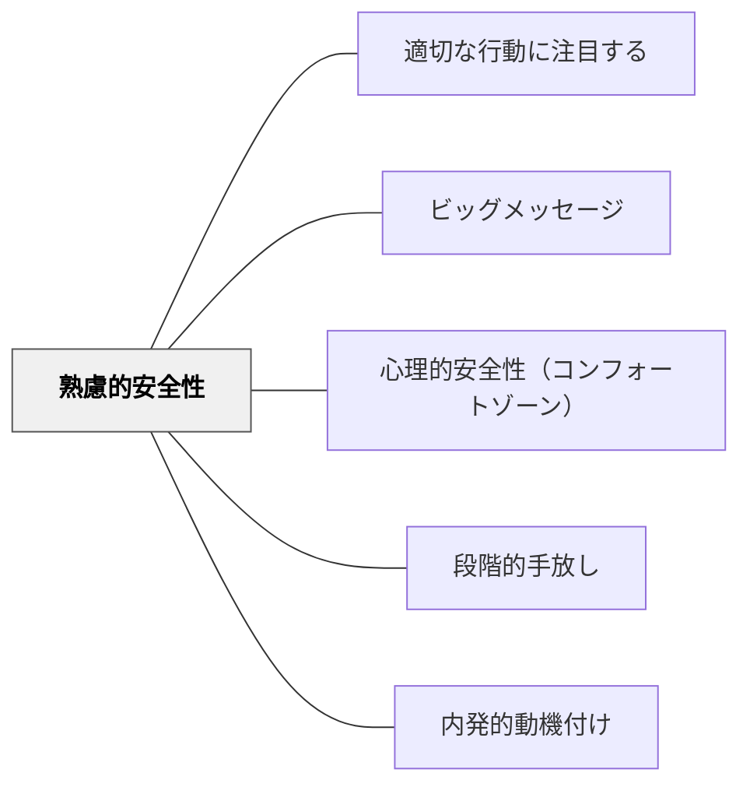

# 熟慮的安全性

> 認められる経験が積み重なることで、ここは安全だという確信になる。

## 背景（Context）

「心理的安全性」はAmy Edmondsonによって研究され、「チームの中で対人リスクを取っても安全だという信念」として定義された。しかし心理的安全性はただ「安全です」と宣言すれば生まれるものではない。実際に認められる経験・受け入れられる経験が積み重なることで、初めて「ここは安全だ」という確信が育つ。

「熟慮的安全性」は、この「実際の経験による安全性の積み上げ」を指す。熟慮的に——つまり意図的に、繰り返し——認められる場をつくることで、心理的安全性の土台を形成するパタンだ。

## 問題（Problem）

「このクラスは安全ですよ」と言っても、子どもたちはすぐには信じない。特に、過去に否定された経験・笑われた経験・無視された経験がある子は、言葉だけでは動かない。経験による積み重ねが必要だ。

## 力のかたち（Forces）

- 安全性は「宣言」ではなく「経験の積み重ね」で生まれる
- 1回の認められる経験では不十分——繰り返しが必要
- 認められる経験は小さくても構わない——正解でなくても「あなたの考えを聞いた」という事実が積み重なる
- 教師の言動・表情・反応が安全性の証拠として子どもに読まれている

## 解決（Solution）

**意図的に、繰り返し「認められる経験」を積み重ねる設計をせよ。**

---

### 熟慮的安全性をつくる実践的手立て

**発言・間違いへの反応**
- 間違いや的外れな発言に対して「なるほど」「そういう考え方もあるね」と受け取る
- 「正解かどうか」の前に「考えたこと自体」を認める

**ペアワーク・小集団での安全性**
- いきなり全体発表ではなく、ペア→小集団→全体の順に発言のリスクを段階的に下げる
- [[パタン/段階的手放し]]と組み合わせると効果が高い

**ルーティンによる安全性**
- 毎授業の始めに「今日の一言」「思ったことを書く」などの低リスク発信の機会をつくる
- 習慣化することで「ここでは発信することが普通」という文化になる

**教師自身の開示**
- 教師が「わからないことがある」「間違えた」と開示することで、不完全さが認められる証拠になる

---

### 「適切な行動に注目する」との接続

「適切な行動に注目する」パタンで子どもの行動を具体的に認めることが、熟慮的安全性の最も直接的な実践だ。「○○さんが手を挙げた」「△△さんが質問した」——その行動への注目と言語化が、「ここでは挑戦することが認められる」という経験の積み重ねになる。

## 結果（Consequences）

- 時間をかけて「ここは安全だ」という確信が子どもの中に育つ
- 挑戦・発言・質問が増える——リスクを取ることへの恐れが薄れる
- 認められる経験が積み重なることで、学習への内発的動機が育ちやすくなる

## 関連パタン

- [[パタン/適切な行動に注目する]] — 熟慮的安全性の最も直接的な実践
- [[パタン/ビッグメッセージ]] — 全体への価値観の発信が個別の認め経験と組み合わさる
- [[パタン/心理的安全性（コンフォートゾーン）]] — 熟慮的安全性が心理的安全性の基盤になる
- [[パタン/段階的手放し]] — リスクを段階的に下げながら発信の機会をつくる
- [[パタン/内発的動機付け]] — 安全性は自律性・有能感の前提条件

## クラスター図

## Actionable Insight

- 今日の授業で1人の子どもが何か発言したとき、内容の正誤より前に「考えてくれてありがとう」と言う——小さな認める経験の積み重ねが安全性をつくる
- 授業の最初5分を「答えなくてもいい発問」に使う——「どう思う？」と全員に問い、挙手や書くだけで認められる経験をつくる
- 自分が間違えた場面を週1回意識的に見せる——教師の失敗開示が「ここは失敗してもいい場所」の証拠になる

## 出典

Edmondson, A. C. (1999). Psychological safety and learning behavior in work teams. *Administrative Science Quarterly*, 44(2), 350–383.  
岩井輝久「教育のパタン・ランゲージ（適切な行動に注目する・熟慮的安全性記述）」
