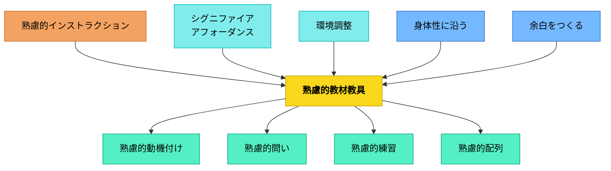

# 熟慮的教材教具

**一文でいうと**：教材・教具を、価値・目的・使いやすさ・学習者の経験から吟味して設計する。

## 使いどころ・使いすぎ注意

| 観点         | 内容                                               |
| ------------ | -------------------------------------------------- |
| 使いどころ   | 教材の意図や使い方が伝わりにくいとき。             |
| 使いすぎ注意 | 教材を作り込みすぎると、子どもの工夫の余地が減る。 |

> 教育材料について考えない日はない——教材・教具の設計と選択を熟慮することが教育の質を決める。

## 背景（Context）

教育材料（教材・教具）は教育実践の中核をなす。教科の分類そのものが「価値」から出発している（牧口常三郎）。どんな教材を選び、どう設計し、どう改善するかは教育の成否に直結する。

一方で、教材や教具の選定・デザインは「手近なもの」や「慣例的なもの」に依存されがちである。時間が限られていたり、多様な子どもたちに同時に対応しなければならない場面では、教材教具そのものに深く意識を向けることが後回しにされてしまう。

鈴木克明「教材設計マニュアル」・牧口常三郎の価値論・スペンサーの活動分類・ノーマンのシグニファイアなど複数の理論が交差する領域がここにある。

## 問題（Problem）

教材が「手元にあるから使う」「教科書をそのまま使う」というデフォルトになりがちで、どんな価値・目的のためにどんな教材を設計・選択すべきかという熟慮がなされない。また、教材や教具の選定が不十分な場合、学習者にとって不自然な負荷がかかる。

例：左利きの子どもが数字を書こうとしても、自分の手が数字を隠してしまい、計算がスムーズに進まない。

## 力のかたち（Forces）

- 教育材料には価値論的な根拠（利・善・美）が必要
- 教材設計には引き算の発想が重要（足し算よりも減らす）
- 学習者のレディネス・動機付け・イメージ形成が教材効果に影響する
- 教材の分析手法（クラスター・手順・階層）が設計を精緻化する
- アナログな実装技法（切り貼り・ポケット・色分け）も設計の一部
- 教材教具は学習者にとっての「経験の媒体」であり、身体的・認知的インタラクションの質に強く影響を与える
- 「教材をどう使うか」ではなく「教材自体の質」が教育の本質的な成果を左右する場面も多い
- 学習者の多様性（利き手・特性・年齢など）に対する配慮が求められる

## 解決（Solution）

**教育材料の源泉・価値・種類・設計手順・実装技法を熟慮し、以下のパターンを文脈に応じて重ねて教材を設計・改善する。**

教材や教具を選ぶとき・作るときには、それが**どのようなインタラクションを可能にするのか（アフォーダンス）**、**何を学習者に示唆しているのか（シグニファイア）**を熟慮する。「誰にとって使いやすいか」「誰にとって障壁となるか」を具体的に想像して設計する。

**具体例：**

- 左利きにも対応したレイアウト設計（10マス計算ドリル、1行マス計算プリント）
- 書く場所が明示されているワークシート（記入欄が視覚的に明確）
- 子どもが操作しやすいサイズ・形状の教具（はさみ・のり・パズルなど）
- むげんプリントの「1行マス計算プリント」：左右どちらの利き手にも対応し視覚的にも整っている
- 杉渕鐵良の「10マス計算ドリル」：スモールステップ設計で成功体験を積み重ねやすい

### 教育材料の源泉と価値論（牧口常三郎）

| パタン                          | 核心                                   |
| ------------------------------- | -------------------------------------- |
| [[パタン/教育目的]]             | 教育材料の存在理由——何のために教えるか |
| [[パタン/価値]]                 | 利・善・美——教育材料を選ぶ根拠         |
| [[パタン/生活環境]]             | 生活する環境そのものが教育材料になる   |
| [[パタン/自然的環境]]           | 自然環境との関わりから価値が生まれる   |
| [[パタン/自然現象]]             | 自然事象を教育材料として設計する       |
| [[パタン/社会的環境]]           | 社会的環境を教育材料として活かす       |
| [[パタン/人生現象]]             | 人生の出来事・ドラマを教育材料にする   |
| [[パタン/利的経済的価値の創造]] | 有用性・経済的価値を育む教育材料       |
| [[パタン/善的道徳的価値の創造]] | 道徳的・倫理的価値を育む教育材料       |
| [[パタン/美的美術的価値の創造]] | 美的価値・芸術的感性を育む教育材料     |

### 教育材料の種類・素材

| パタン                    | 核心                               |
| ------------------------- | ---------------------------------- |
| [[パタン/本]]             | 書籍・絵本・読み物を教材として使う |
| [[パタン/図画・地図]]     | 平面的表現を教材として活かす       |
| [[パタン/半具体物]]       | 操作可能な半具体的教材             |

### 活動の分類（スペンサー）

| パタン                                                    | 核心                           |
| --------------------------------------------------------- | ------------------------------ |
| [[パタン/直接の自己保存に関する活動]]                     | 生理学などの直接的健康維持活動 |
| [[パタン/間接の自己保存に関する活動]]                     | 数学・物理学・化学・生物学など |
| [[パタン/子孫の教育を目的とする活動]]                     | 育児法など次世代を育てる活動   |
| [[パタン/適当なる社会的政治的関係を維持しようとする活動]] | 社会科学・歴史学など           |
| [[パタン/人生の趣味を満足させる活動]]                     | 美術・絵画・音楽など           |

### 知識体系の分類（牧口常三郎）

| パタン                                                  | 核心                           |
| ------------------------------------------------------- | ------------------------------ |
| [[パタン/キーコンセプト（胚細胞的概念）]]               | 教科の核となる概念が教育材料   |
| [[パタン/自然法則に関する知識体系]]                     | 物理・生物などの法則体系       |
| [[パタン/社会法則に関する知識体系]]                     | 社会科学から出る法則体系       |
| [[パタン/自然と人類との相関に成る価値に関する知識体系]] | 人間が創造した価値の表現法体系 |
| [[パタン/身体動作を以ってする直接的表現法]]             | 遊び・体操・ダンスなど         |
| [[パタン/立体的創作品を以ってする表現法]]               | 工芸・工作などの生産的教科     |
| [[パタン/平面的創作品を以ってする表現法]]               | 図画・地図など                 |
| [[パタン/言語という符号の組み立てを以ってする表現法]]   | 歌・談話・文章・数式・音楽など |

### 教材設計の原則（大きな視点）

| パタン                                                    | 核心                                 |
| --------------------------------------------------------- | ------------------------------------ |
| [[パタン/引き算＞足し算（教材）]]                         | 教材は足すより引く                   |
| [[パタン/想像力（感情）を触発する]]                       | 感情と想像力に働きかける設計         |
| [[パタン/熟慮的配列]]                                     | 教材の順序・配列を熟慮する           |
| [[パタン/ゲーム]]                                         | 教材のゲーム化                       |
| [[パタン/ソーシャル]]                                     | 社会的関係を教材として活かす         |
| [[パタン/オンボーディング]]                               | 学習の土台に乗せる                   |
| [[パタン/イメージ]]                                       | 具体的な姿・お手本を持てるようにする |
| [[パタン/フィードバック]]                                 | 教材の中にフィードバックを組み込む   |
| [[パタン/シグニファイア]]                                 | 何ができるかを知覚させる設計         |
| [[パタン/熟慮的動機づけ]]                                 | 動機付けを意図的に設計する           |
| [[パタン/切実性（必要感）]]                               | 必要感・意味を見出せる設計           |
| [[パタン/多方興味]]                                       | 多様な興味を活かす                   |
| [[パタン/アドベンチャー]]                                 | リスクを負う設計                     |
| [[パタン/自分のやり方で自由にできる（考える余地がある）]] | 考える余地を残す                     |
| [[パタン/モヤモヤを置く]]                                 | 葛藤・コンフリクトを仕込む           |

### 教材設計手順（鈴木克明「教材設計マニュアル」）

| パタン                                      | 核心                             |
| ------------------------------------------- | -------------------------------- |
| [[パタン/教材をイメージする]]               | 完成形をイメージしてから設計する |
| [[パタン/出入り口を明確にする（目標設定）]] | 学習の開始点とゴールを明確にする |
| [[パタン/テストを作成する]]                 | 先にテストを作り目標を明確化する |
| [[パタン/教材の構造を見極める]]             | 教材の知識・スキル構造を分析する |
| [[パタン/教え方の作戦を立てる]]             | 指導方略を選択・設計する         |
| [[パタン/形成的評価]]                       | 試用・改善サイクルを回す         |
| [[パタン/教材を改善する]]                   | 評価に基づいて継続的に改善する   |

### 教材分析手法

| パタン                      | 核心                               |
| --------------------------- | ---------------------------------- |
| [[パタン/問題設定]]         | 何を解決するための教材かを設定する |
| [[パタン/課題設定]]         | 学習者が取り組む課題を設計する     |
| [[パタン/クラスター分析]]   | 内容の関連を束として分析する       |
| [[パタン/手順分析]]         | 手順・プロセスを分解して分析する   |
| [[パタン/階層分析]]         | 概念・スキルの上下関係を分析する   |
| [[パタン/自己選択自己決定]] | 学習者が選択・決定できる設計       |

### 設計技法

| パタン                        | 核心                                       |
| ----------------------------- | ------------------------------------------ |
| [[パタン/制限化限定化]]       | 範囲を絞ることで集中を高める               |
| [[パタン/精緻化（自己説明）]] | 説明させることで理解を深める               |
| [[パタン/可視化]]             | 見える形で示す                             |
| [[パタン/仕組み化]]           | 自動的に動く仕組みに組み込む               |
| [[パタン/対応づけ]]           | 操作と結果の対応を分かりやすくする         |
| [[パタン/概念モデル]]         | 使い方を理解させるメンタルモデルを提供する |

### 教材の内容要素

| パタン                              | 核心                                     |
| ----------------------------------- | ---------------------------------------- |
| [[パタン/熟慮的問い]]               | 教材の中の問いを設計する                 |
| [[パタン/熟慮的インストラクション]] | 教材の中の説明・指示を設計する           |
| [[パタン/フィードバック]]           | 教材の中の評価・フィードバックを設計する |
| [[パタン/記憶術]]                   | 記憶を助ける技法を組み込む               |

### 実装技法（アナログ）

| パタン                        | 核心                               |
| ----------------------------- | ---------------------------------- |
| [[パタン/切り貼り]]           | 既存の教材を組み替えて最適化する   |
| [[パタン/ポケット]]           | 教材に収納・整理の仕組みを組み込む |
| [[パタン/色分け]]             | 色で意味・構造を示す               |
| [[パタン/名前を書く欄がある]] | 自分のものであることを知覚させる   |

### 課題設計

| パタン                          | 核心                               |
| ------------------------------- | ---------------------------------- |
| [[パタン/エクセレンスの収集家]] | 良い事例を集め学習者に示す         |
| [[パタン/課題の調整]]           | 課題の難易度・量を学習者に合わせる |

## 結果（Consequences）

熟慮された教材教具は、子どもの能動性・集中・納得感のある学びを促進する。無用なストレスや混乱、指導側の説明・補助の負担を軽減する。学習の場がより「意味ある経験」として成立する。

- 教育材料が価値・目的に根ざして設計・選択されるようになる
- 教材の設計・改善が体系的なプロセスとして機能する
- 学習者の動機付け・理解・記憶が教材設計によって支援される

> 「道具のデザインが経験の質を変える。これは教育実践における重要なレバレッジポイントである。」

「熟慮的教材教具」は単なる機能性やコストの議論ではなく、「その道具が教育経験の何を可能にし、何を妨げるか」という視点から捉えることが求められる。

## 関連パタン
- [[特別支援/視覚支援]]
- [[パタン/シグニファイア]]
- [[パタン/操作物による概念形成]]
- [[パタン/素材研究から発問内容を見出す]]
- [[パタン/半具体物]]
- [[特別支援/環境調整（特別支援）]]
- [[実践/個別教材の設計]]
- [[パタン/カット技法（映像の一部を寸断し時間を省略する表現技法）]]
- [[パタン/ナッジ]]
- [[パタン/可視化]]
- [[パタン/色分け]]
- [[パタン/熟慮的教材教具]]
- [[パタン/熟慮的配列]]
- [[パタン/切実性（必要感）]]
- [[パタン/未完成教材]]
- [[パタン/問題解決的教材研究]]

- [[パタン/環境調整]] — 大きな上位パタン（引き算の原理）
- [[パタン/熟慮的インストラクション]] — 指示・説明の設計
- [[パタン/熟慮的動機づけ]] — 動機付けの設計
- [[パタン/熟慮的問い]] — 問いの設計
- [[パタン/熟慮的練習]] — 練習の設計
- [[パタン/シグニファイアアフォーダンス]] — 行動を誘導する知覚可能な手がかり
- [[パタン/身体性に沿う]] — 身体の動きと学びを接続する
- [[パタン/余白をつくる]] — 教材に余白を設けて子どもの思考を促す
- [[特別支援/TEACCHとシグニファイア]] — 構造化とシグニファイアの特別支援的応用

## クラスター図
<!-- cluster: manual -->

## Actionable Insight

- ワークシートを設計するとき「左利きの子どもが使うとどうなるか」を一度確認する——多様な身体的条件を想定するだけで教材の質が変わる
- 今使っている教材から「学習者がやらなくても困らないもの」を1つ探して削ってみる——引き算の原理の第一歩は「足す前に削ること」
- 教具を選ぶとき「これは何を自然に促すか（アフォーダンス）」を1つ言語化する——意図を明示することで選択の根拠が明確になる

## 出典

- 牧口常三郎（1972）『牧口常三郎全集第4巻 創価教育学体系 上』聖教新聞社
- 鈴木克明（2002）『教材設計マニュアル――独学を支援するために』北大路書房
- [[文献/熟慮的教育材料のパターンリスト（動画記録）]] — 動画 https://youtu.be/yI220g9e6eE

---

## 下位パタン一覧

| パタン                                                    | サマリー                                                                                     |
| --------------------------------------------------------- | -------------------------------------------------------------------------------------------- |
| [[パタン/エクセレンスの収集家]]                           | 優れた作品・事例・実践（エクセレンス）を収集・分析することで、質の基準と感覚を育てる。       |
| [[パタン/キーコンセプト（胚細胞的概念）]]                 | 教科の核となる概念が、深い理解と転移の鍵を握る教育材料。                                     |
| [[パタン/クラスター分析]]                                 | 関連し合う知識・概念のかたまり（クラスター）を識別し、教材の構造を把握する。                 |
| [[パタン/シグニファイア]]                                 | 「何ができるか」が分かる教材が、学習者を自然に導く。— D.A. ノーマン                          |
| [[パタン/テストを作成する]]                               | 教材を作る前にテスト（評価）を先に作ることで、目標が明確になる。                             |
| [[パタン/ポケット]]                                       | 教材に「ポケット」を設けてカード・付箋・資料を収納できるようにし、教材を活性化する。         |
| [[パタン/モヤモヤを置く]]                                 | 学習の終わりに「解決されない問い」「引っかかり」を意図的に残し、学習者の継続的な思考を促す。 |
| [[パタン/人生の趣味を満足させる活動]]                     | 美術・音楽・文学——人生を豊かに彩る芸術的活動が教育材料になる。                               |
| [[パタン/人生現象]]                                       | 誕生・成長・別れ・達成・挫折——人生の出来事そのものが強力な教育材料になる。                   |
| [[パタン/仕組み化]]                                       | 学習活動や教材の使い方をルーティン・システムとして設計し、自律的に学べる仕組みをつくる。     |
| [[パタン/出入り口を明確にする（目標設定）]]               | 学習の入り口（出発点）とゴール（到達点）を明確にすることで教材設計が定まる。                 |
| [[パタン/切り貼り]]                                       | 紙の教材を切り取り・貼り付けする操作的な活動が、学習への能動的関与を高める。                 |
| [[パタン/利的経済的価値の創造]]                           | 役に立つこと・生活を豊かにすること——有用性の価値を育む教育材料。                             |
| [[パタン/半具体物]]                                       | 具体物と抽象記号の間をつなぐ——操作可能な半具体的教材。                                       |
| [[パタン/名前を書く欄がある]]                             | 教材に名前を書く欄を設けることで、学習者が教材を「自分のもの」として所有する感覚が生まれる。 |
| [[パタン/問題設定]]                                       | 何を解決するための教材かを問い、学習者が取り組む価値のある問題を設定する。                   |
| [[パタン/善的道徳的価値の創造]]                           | 良いことをする・正しく生きる——道徳的・倫理的価値を育む教育材料。                             |
| [[パタン/図画・地図]]                                     | 平面的な視覚表現は、概念・空間・関係を見える化する教育材料である。                           |
| [[パタン/子孫の教育を目的とする活動]]                     | 次の世代を育てるための知識——育児・教育そのものが重要な学習内容。                             |
| [[パタン/対応づけ]]                                       | 新しい知識・概念を学習者が既に持つ知識・経験と意識的に結びつける。                           |
| [[パタン/平面的創作品を以ってする表現法]]                 | 絵・図・地図——平面的な視覚表現で価値を表現し伝える。                                         |
| [[パタン/手順分析]]                                       | 手続き的なスキル・作業の手順を分解して分析し、教材設計に活かす。                             |
| [[パタン/教え方の作戦を立てる]]                           | 教材の構造を踏まえ、どの順序・方法・メディアで教えるかの作戦を立てる。                       |
| [[パタン/教材の構造を見極める]]                           | 教材が持つ知識・スキルの構造（クラスター・手順・階層）を分析し、設計に活かす。               |
| [[パタン/教材をイメージする]]                             | 設計を始める前に完成した教材がどんなものかをイメージする。                                   |
| [[パタン/教材を改善する]]                                 | 形成的評価の結果を踏まえて教材を継続的に改善する。                                           |
| [[パタン/教育目的]]                                       | 教材は目的なくして選べない——何のために教えるかが教育材料のすべてを方向づける。               |
| [[パタン/本]]                                             | 書籍・絵本・読み物は最も汎用性の高い教育材料の一つである。                                   |
| [[パタン/概念モデル]]                                     | 学習内容の構造・関係を図やモデルとして可視化し、学習者の理解を支援する。                     |
| [[パタン/生活環境]]                                       | 生活する環境そのものが最も豊かな教育材料である。                                             |
| [[パタン/直接の自己保存に関する活動]]                     | 身体・健康・命を直接守るための知識——最も根本的な教育内容。                                   |
| [[パタン/社会法則に関する知識体系]]                       | 社会科学が明らかにした社会の構造・法則が教育材料の重要な柱。                                 |
| [[パタン/社会的環境]]                                     | 人間関係・コミュニティ・社会の仕組みそのものが教育材料になる。                               |
| [[パタン/立体的創作品を以ってする表現法]]                 | 工芸・工作・彫刻——立体的な創作を通じて価値を表現し学ぶ。                                     |
| [[パタン/精緻化（自己説明）]]                             | 学習者が自分の言葉で説明・再構成することで、理解が深まる。                                   |
| [[パタン/美的美術的価値の創造]]                           | 美しいものに出会い、美しいものを作る——審美的価値を育む教育材料。                             |
| [[パタン/自分のやり方で自由にできる（考える余地がある）]] | 学習者が自分なりのやり方・ペース・表現で取り組める余地を教材に組み込む。                     |
| [[パタン/自然と人類との相関に成る価値に関する知識体系]]   | 人間が自然・社会と関わる中で創造した価値の表現法——芸術・言語・身体表現の知識体系。           |
| [[パタン/自然法則に関する知識体系]]                       | 物理・化学・生物学などが発見してきた自然の法則が教育材料の核をなす。                         |
| [[パタン/自然現象]]                                       | 「なぜそうなるのか」という問いを引き起こす自然の出来事が学びを動かす。                       |
| [[パタン/自然的環境]]                                     | 自然との関わりが価値を創造し、学びを生む。                                                   |
| [[パタン/色分け]]                                         | 色を使って情報を分類・強調・整理することで、学習者の理解とナビゲーションを支援する。         |
| [[パタン/言語という符号の組み立てを以ってする表現法]]     | 歌・談話・文章・数式・音楽——言語的・記号的表現で価値を伝える。                               |
| [[パタン/記憶術]]                                         | 記憶しにくい情報を覚えやすくする技法（ニーモニクス）を教材に組み込む。                       |
| [[パタン/質問（教材設計）]]                                           | 教材の中に問いを組み込むことで、学習者の思考を促し能動的な関与を生む。                       |
| [[パタン/身体動作を以ってする直接的表現法]]               | 遊び・体操・ダンス——身体を動かすことそのものが表現であり学びである。                         |
| [[パタン/適当なる社会的政治的関係を維持しようとする活動]] | 社会・歴史・政治を理解し、健全な市民として生きる知識。                                       |
| [[パタン/間接の自己保存に関する活動]]                     | 数学・物理学・化学・生物学——自然を理解することで生活を支える知識。                           |
| [[パタン/階層分析]]                                       | 知識・スキルの前提関係（何を先に学ぶべきか）を階層的に分析する。                             |
