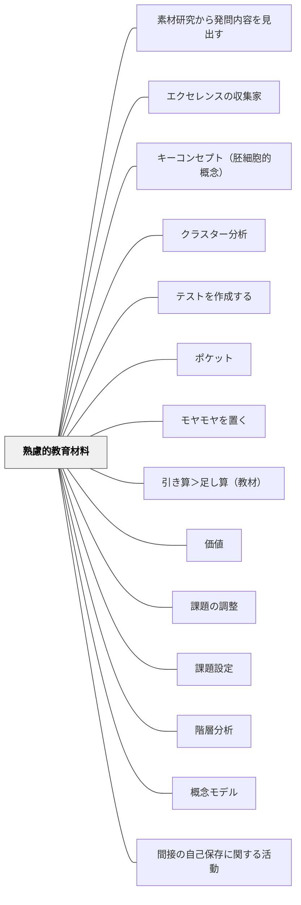

# 熟慮的教育材料

> 教育材料について考えない日はない——教材・教具の設計と選択を熟慮することが教育の質を決める。

詳細は [[パタン/熟慮的教材教具]] を参照。

## 概要

「手近なものを使う」「教科書をそのまま使う」というデフォルトから抜け出し、**どんな価値・目的のためにどんな教材を設計・選択するか**を問い直すパタン。

教育材料の設計で問うべき3軸：
- **価値**：利（役立つか）・善（倫理的か）・美（美しく使えるか）
- **シグニファイア**：「何をすればよいか」が材料自体から伝わるか
- **身体性**：左利き・感覚過敏など多様な身体に配慮されているか

牧口常三郎の価値論、ノーマンのシグニファイア、鈴木克明の教材設計が交差する領域。

## 関連パタン
- [[パタン/素材研究から発問内容を見出す]]
- [[パタン/エクセレンスの収集家]]
- [[パタン/キーコンセプト（胚細胞的概念）]]
- [[パタン/クラスター分析]]
- [[パタン/テストを作成する]]
- [[パタン/ポケット]]
- [[パタン/モヤモヤを置く]]
- [[パタン/引き算＞足し算（教材）]]
- [[パタン/価値]]
- [[パタン/課題の調整]]
- [[パタン/課題設定]]
- [[パタン/階層分析]]
- [[パタン/概念モデル]]
- [[パタン/間接の自己保存に関する活動]]
- [[パタン/記憶術]]
- [[パタン/教え方の作戦を立てる]]
- [[パタン/教育目的]]
- [[パタン/教材の構造を見極める]]
- [[パタン/教材をイメージする]]
- [[パタン/教材を改善する]]
- [[パタン/言語という符号の組み立てを以ってする表現法]]
- [[パタン/仕組み化]]
- [[パタン/子孫の教育を目的とする活動]]
- [[パタン/指示]]
- [[パタン/自然と人類との相関に成る価値に関する知識体系]]
- [[パタン/自然現象]]
- [[パタン/自然的環境]]
- [[パタン/自然法則に関する知識体系]]
- [[パタン/自分のやり方で自由にできる（考える余地がある）]]
- [[パタン/質問]]
- [[パタン/実物（具体物）]]
- [[パタン/社会的環境]]
- [[パタン/社会法則に関する知識体系]]
- [[パタン/手順分析]]
- [[パタン/出入り口を明確にする（目標設定）]]
- [[パタン/身体動作を以ってする直接的表現法]]
- [[パタン/人生の趣味を満足させる活動]]
- [[パタン/人生現象]]
- [[パタン/図画・地図]]
- [[パタン/生活環境]]
- [[パタン/精緻化（自己説明）]]
- [[パタン/切り貼り]]
- [[パタン/説明]]
- [[パタン/善的道徳的価値の創造]]
- [[パタン/対応づけ]]
- [[パタン/直接の自己保存に関する活動]]
- [[パタン/適当なる社会的政治的関係を維持しようとする活動]]
- [[パタン/美的美術的価値の創造]]
- [[パタン/評価（フィードバック）]]
- [[パタン/平面的創作品を以ってする表現法]]
- [[パタン/本]]
- [[パタン/名前を書く欄がある]]
- [[パタン/問題設定]]
- [[パタン/利的経済的価値の創造]]
- [[パタン/立体的創作品を以ってする表現法]]

- [[パタン/熟慮的教材教具]] — 本パタンの主エントリー
- [[パタン/シグニファイア]] — 教育材料が学習行動を誘発する仕組み
- [[パタン/シグニファイアアフォーダンス]] — 教材のデザインが行動を自然に導く
- [[パタン/環境調整]] — 教育材料を含む学習環境の設計
- [[パタン/身体性に沿う]] — 多様な身体への配慮

## クラスター図

## Actionable Insight

- 今週使う教材を1つ選び、「利（役立つか）・善（倫理的か）・美（美しく使えるか）」の3軸で見直す——3軸のうち1つでも意識するだけで設計が変わる
- 「この教材、何をすればいいかが材料から伝わるか（シグニファイア）？」と問う——伝わらなければ指示を補強するか別の素材を選ぶ
- 詳細は [[パタン/熟慮的教材教具]] を参照
