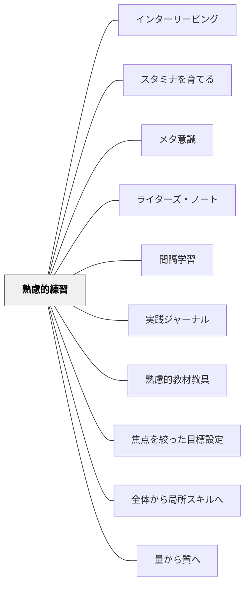

# 熟慮的練習

## 背景（Context）

高度な専門性や実践的知恵は、単なる経験の積み重ねだけでは育たない。**意図的な目標設定と内省的な反復**によって、初めて洗練されていく。教育現場でも、教員や学習者が「ただ経験する」だけでなく、意味のある練習を行う必要がある。

## 問題（Problem）

漫然とした経験や反復では、技能や思考は自動化されるだけで、**質的な変容や成長が起きにくい**。「なんとなくやっている」授業や支援が、形だけのルーティンになってしまいがち。経験を積むことと学び続けることは必ずしも一致しない。

## 力のかたち（Forces）

- 上達や変化は、**現状を少し超える課題に挑戦し続けること**でしか得られない
- 教育実践は多忙で、立ち止まって考える時間がとりづらい
- 経験を積むことと、学び続けることは必ずしも一致しない

## 解決（Solution）

日々の実践において、自分が伸ばしたい要素（技能・態度・判断力など）に焦点を定め、**小さな目標と振り返りをもった「練習」**を意図的に取り入れる。

- フィードバックを受け取りながら、失敗をふまえた再挑戦を継続する
- 「うまくいった／いかなかった」の原因を考える**熟慮**を必ず含める

**実践例：**
- 授業後に「今日は○○を意識してやってみた。結果、△△だった。次は◇◇してみる」と記録する
- 同僚との定期的なふりかえりで「最近の小さなチャレンジとその結果」を共有する
- 子どもたちにも「今回の練習で"どこを伸ばそう"と思ってやってみた？」と問い返す

## 結果（Consequences）

- 実践が、反射的な習慣から**意図的な学びの場**へと転換する
- 教員自身の力量形成が、自己調整可能なプロセスとして進む
- 子どもたちに対して、**学びのモデル**としての姿を示せる
- 組織的に熟慮的練習を共有することで、実践知の共同体が形成される

## 関連パタン
- [[特別支援/特別支援級の算数指導]]
- [[実践/ノート指導（読み書きハンドブック・ノート検定）]]
- [[パタン/インターリービング]]
- [[パタン/スタミナを育てる]]
- [[パタン/メタ意識]]
- [[パタン/ライターズ・ノート]]
- [[パタン/間隔学習]]
- [[パタン/実践ジャーナル]]
- [[パタン/熟慮的教材教具]]
- [[パタン/焦点を絞った目標設定]]
- [[パタン/全体から局所スキルへ]]
- [[パタン/量から質へ]]

### 下位パタン
- [[パタン/焦点を絞った目標設定]] — 一回の実践につき一つの小さな焦点を定める
- [[パタン/実践ジャーナル]] — やってみたこと・起きたこと・次の一手を書き留める

### 関連
- [[パタン/メタ意識]] — 自分の実践を一歩引いて捉える構え
- [[パタン/自己調整]] — 学習者が自分の学習を調整する力
- [[パタン/フィードバック]] — 適切なフィードバックで学習を加速する
- [[パタン/エラー分析]] — 誤りを分析することで理解が深まる

## クラスター図

## Actionable Insight

- 授業後に「今日は○○を意識してやってみた。結果△△だった。次回は◇◇する」を3行だけ書く——熟慮的練習の最小実践が実践ジャーナルの1エントリ
- 子どもに「今回の練習で伸ばそうと思ったのはどこ？」と1回問いかける——目標意識のある練習とない練習では上達速度が全く違う
- 今週の授業で「うまくいかなかった1場面」を同僚に話す——失敗を共有することが実践知の共同体を育てる熟慮的練習の集団版になる

## 出典

- パタン集/熟慮的練習.md
