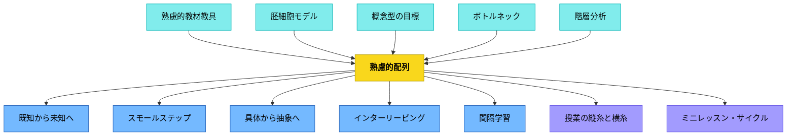

# 熟慮的配列（シークエンス）

**一文でいうと**：学習経験をどの順序で並べるかによって、理解・意欲・転移の起こり方を設計する。

## 使いどころ・使いすぎ注意

| 観点         | 内容                                               |
| ------------ | -------------------------------------------------- |
| 使いどころ   | 単元や活動の順序を考えるとき。                     |
| 使いすぎ注意 | 順序を固定しすぎると、子どもの発見に応答しにくい。 |

> 学習の順序は、内容と同じくらい重要である。

## 背景（Context）

[[パタン/熟慮的教材教具]] によって教材の内容が整ったとき、次に問われるのは「どの順番で提示するか」である。同じ内容でも、提示の順序が変わると、理解の深さもつまずきの場所もまったく異なる結果をもたらす。

このパターン群の起源は**1883年「改正教授術」**（当時の教員養成の教科書）に掲載された**ペスタロッチ主義の原則**にある。「既知から未知へ」「身近なものから遠くへ」をはじめとする配列原則がすでに示されており、100年以上前から教育実践の中核を担ってきた。本パターンリストはこの原則を踏まえ、その後の研究・実践の知見を加えて拡張したものである。

ペスタロッチ自身は1801年の『ゲルトルート児童教育法』でこの配列原則を体系化した。「自然が音から言葉へ、そして言葉から音声へと徐々に進渉していく順序に連鎖させるという原則」——あらゆる教科・技能の指導は、人間の精神発達の「不変の原型」（心理学的順序）に従った配列をとらなければならない。

## 問題（Problem）

学習経験の配列に原則がないと、学習者はまだ持っていない理解の上に新しい概念を積み上げることになる。基盤のない上積みは崩れやすく、丸暗記や断片的知識に終わる。

## 力のかたち（Forces）

- 内容には内在的な論理的依存関係がある（Aを知らなければBはわからない）
- 学習者の認知的・情意的発達には自然な進行方向がある
- 配列が厳格すぎると、学習者の興味や問いの方向を無視することになる
- 教師には時間と教育課程上の制約がある

## 解決（Solution）

**学習経験を、複数の発展的次元に沿って意図的に配列する。** 各次元は「より到達しやすいもの→より到達が難しいもの」という方向を持っている。

| 次元         | 方向                                            |
| ------------ | ----------------------------------------------- |
| 認識論的     | [[パタン/既知から未知へ]]                       |
| 空間的       | [[パタン/身近なものから遠くへ]]                 |
| 難易度       | [[パタン/スモールステップ]]（簡単から難しいへ） |
| 物質性・抽象度 | [[パタン/具体から抽象へ]]                     |
| 概念形成     | [[パタン/具体事例から典型事例（中心概念）へ]]   |
| 分析方向     | [[パタン/総合から分析へ]]                       |
| スキル粒度   | [[パタン/全体から局所スキルへ]]                 |
| 一般化       | [[パタン/特殊から一般へ]]                       |
| 複雑さ       | [[パタン/単純から複雑へ]]                       |
| 表出         | [[パタン/観念から表出へ]]                       |
| 技能形成     | [[パタン/知識から技能へ]]                       |
| 言語受容     | [[パタン/聴くことから語ることへ]]               |
| 読み書き     | [[パタン/読むことから書くことへ]]               |
| 量と質       | [[パタン/量から質へ]]                           |
| モード転換   | [[パタン/視覚表現から文章表現へ]]               |
| 動機づけ①    | [[パタン/アンカーイベントから問いへ]]           |
| 動機づけ②    | [[パタン/必然性から楽しさへ]]                   |
| 興味の深化   | [[パタン/好奇心から多方興味へ]]                 |
| モデル       | [[パタン/一流から学ぶ]]                         |
| 複雑性の受容 | [[パタン/あえて複雑から丸ごと学ぶ]]             |

複数の次元を組み合わせ、ユニット全体・単元・一時間の授業それぞれのスケールで配列を設計する。

**矛盾するパターンの共存：** このリストには一見矛盾するパターンが含まれる（例：「単純から複雑へ」と「あえて複雑から丸ごと学ぶ」）。これは矛盾ではない。パターンは問題状況を解決するための道具であり、どのパターンを選ぶかは**意図・状況・目的**によって変わる。教育のある状況から離れてパターンは存在しない。

## 結果（Consequences）

- 各学習経験が次の経験への足場になり、学習が螺旋的に深まる
- 学習者は「なぜこれを学ぶのか」が体験を通じて自ずと理解できる
- 教師は詰まりが生じた場合に「どの配列の次元で問題が起きているか」を診断できる

ただし、あらゆる配列原則を同時に満たすことはできない。設計者は各単元・目標に応じて、どの次元を優先するかを判断する必要がある。

## 関連パタン
- [[パタン/既知から未知へ]]
- [[パタン/具体から抽象へ]]
- [[パタン/知識から技能へ]]
- [[パタン/あえて複雑から丸ごと学ぶ]]
- [[パタン/アンカーイベントから問いへ]]
- [[パタン/一流から学ぶ]]
- [[パタン/観念から表出へ]]
- [[パタン/教え方の作戦を立てる]]
- [[パタン/具体事例から典型事例（中心概念）へ]]
- [[パタン/形あるものから無形へ]]
- [[パタン/好奇心から多方興味へ]]
- [[パタン/視覚表現から文章表現へ]]
- [[パタン/身近なものから遠くへ]]
- [[パタン/全体から局所スキルへ]]
- [[パタン/総合から分析へ]]
- [[パタン/単純から複雑へ]]
- [[パタン/聴くことから語ることへ]]
- [[パタン/特殊から一般へ]]
- [[パタン/読むことから書くことへ]]
- [[パタン/必然性から楽しさへ]]
- [[パタン/量から質へ]]

- [[パタン/熟慮的教材教具]] — 上位パタン（何を提示するかを決める）
- [[パタン/スモールステップ]] — 難易度軸の配列
- [[パタン/体験への接続]] — 経験を出発点とする配列
- [[パタン/経験から出発すること]] — 経験を基点とすること
- [[パタン/胚細胞モデル]] — 核概念を中心に配列を組み立てる
- [[パタン/場を設定する]] — 配列の各入口で学習者の認知的準備を整える
- [[パタン/インターリービング]] — 異なる内容を交互に配列することで識別力と転移を高める
- [[パタン/間隔学習]] — 時間的な配列の工夫が記憶の定着を左右する
- [[パタン/概念型の目標]] — 学習者がつかむ概念が配列の方向を決める
- [[パタン/ボトルネック]] — ボトルネックの特定が配列の優先順位を決める
- [[パタン/ミニレッスン・サイクル]] — ミニレッスンの連続配置が単元の学習経路をつくる
- [[パタン/授業の縦糸と横糸]] — 縦糸（長期的な学習経路）と横糸（各時の構造）の組み合わせが配列の骨格
- [[パタン/話す・描く・書く]] — 話す→描く→書くという配列が書く力の足場をつくる
- [[パタン/階層分析]] — 学習課題を階層的に分解することで正しい配列順序が見えてくる

## クラスター図
<!-- cluster: manual -->

## Actionable Insight

- 次の単元を設計するとき「既知→未知」「具体→抽象」「簡単→難しい」の3次元で順序を確認する——どの次元が逆になっているか一つ見つけて修正するだけでよい
- 授業の後半に急に難しい内容が来ていないか確認する——難易度の急上昇がボトルネックになっていることが多い
- 「スモールステップ」として学習を小さく分解した後、全体を俯瞰して順序を見直す——小さな段階の積み上げが正しい方向かを確認する

## 出典

- 1883年「改正教授術」ペスタロッチ主義の原則
- [[文献/ゲルトルート児童教育法（ペスタロッチ）]] — ペスタロッチ原典（1801年）
- [[文献/熟慮的配列のパターンリスト（動画記録）]]

---

## 下位パタン一覧

| パタン                                        | サマリー                                                               |
| --------------------------------------------- | ---------------------------------------------------------------------- |
| [[パタン/具体事例から典型事例（中心概念）へ]] | 多くの「例」の中に、その概念の心臓部がある。                           |
| [[パタン/単純から複雑へ]]                     | 単純なモデルは間違っているかもしれないが、複雑さへの入口として正しい。 |
| [[パタン/好奇心から多方興味へ]]               | 一点の好奇心が、やがて世界全体への窓になる。                           |
| [[パタン/形あるものから無形へ]]               | 手で触れるものが、頭の中の形をつくる。                                 |
| [[パタン/必然性から楽しさへ]]                 | まず「やらなければ」から始まり、やがて「やりたい」に変わる。           |
| [[パタン/特殊から一般へ]]                     | 一つの「なぜ」が、百の「なぜ」の鍵になる。                             |
| [[パタン/総合から分析へ]]                     | 全体を見てから、部分に分け入る。                                       |
| [[パタン/聴くことから語ることへ]]             | 豊かな話し手は、まず豊かな聴き手だった。                               |
| [[パタン/視覚表現から文章表現へ]]             | 絵や図で思考したことを、言葉に変換することで理解が深まる。             |
| [[パタン/身近なものから遠くへ]]               | 自分の足元から世界への通路を開く。                                     |
