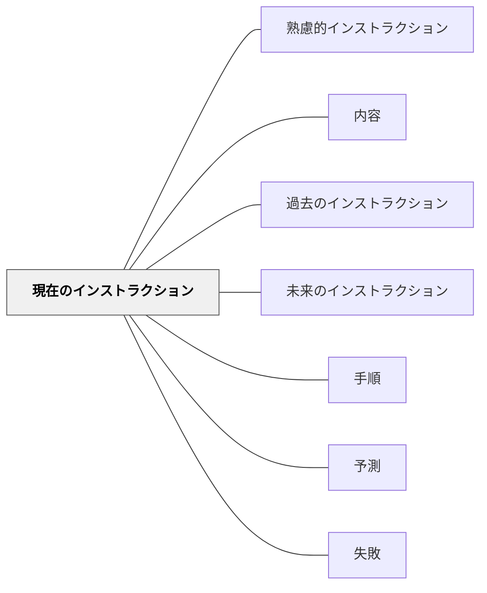

# 現在のインストラクション

> 今すぐの行動を求めるインストラクションは、6要素をそろえて明確にする。

## 背景（Context）
ワーマンが分類した3種類のインストラクションのうち、「現在のインストラクション」は即座の行動を求めるものである。道案内・機器の操作・作業手順・授業中の活動指示などがこれに当たる。3種類の中で最も6要素（使命・最終イメージ・手順・時間・予測・失敗）の整備が必要とされる。

## 問題（Problem）
即座の行動を求めるにもかかわらず、手順だけを伝えて他の要素（時間・予測・失敗）を省くと、受け手はどこまで進めばよいのか、何が起きるのかがわからず不安になる。「やっているうちに間違えて、気づかずに進んでいた」という失敗が起きやすい。

## 力のかたち（Forces）
- 即座の行動を求めるほど、曖昧さが行動停止につながりやすい
- 手順は最も重要だが、時間・予測・失敗がないと受け手が孤立感を持つ
- コンテクスト（緊急度・場の状況）が6要素のどこまで伝えられるかを左右する
- 短い現在のインストラクションでも最低限の使命と最終イメージは必要

## 解決（Solution）
**即座の行動を求めるインストラクションには、手順を中心に据えながら、使命・最終イメージ・時間・予測・失敗の要素をできる限りそろえる。**

「これをやってほしい（使命）」「こうなれば完了（最終イメージ）」「こういう手順で（手順）」「これくらい時間がかかる（時間）」「途中でこうなったら正しい（予測）」「こうなったらやり直し（失敗）」の構造で伝える。緊急時や短い指示では優先順位をつけて省略する。

## 結果（Consequences）
- 受け手が迷わず動けるようになり、途中で止まるケースが減る
- 失敗の早期発見・修正が可能になる
- 6要素の意識がインストラクション設計全体の質を高める

## クラスター図

## Actionable Insight

- 活動指示を出すとき「使命・最終イメージ・手順・時間」の4要素をセットで伝える——「何のために・どうなれば完了か・どの順で・何分か」がそろうと受け手が迷わず動ける
- 手順の説明に「途中でこうなったら正常（予測）・こうなったらやり直し（失敗）」を加える——予測と失敗の情報が受け手の孤立感を防ぎ自律的な進行を支える
- 指示を出した後「今の説明でどのステップが一番不明確でしたか？」と一問確認する——受け手の不確かさを早期発見することで作業の途中停止を防げる

## 出典

- 一つの教育のパタン・ランゲージ（岩井輝久）

## 関連パタン
- [[パタン/熟慮的インストラクション]] — 親パタン
- [[パタン/内容]] — インストラクションの内容の種類
- [[パタン/過去のインストラクション]] — 対比となる種類
- [[パタン/未来のインストラクション]] — 対比となる種類
- [[パタン/手順]] — 現在のインストラクションの中核要素
- [[パタン/予測（インストラクション）]] — 安心要素
- [[パタン/失敗（インストラクション）]] — 修正のための要素
