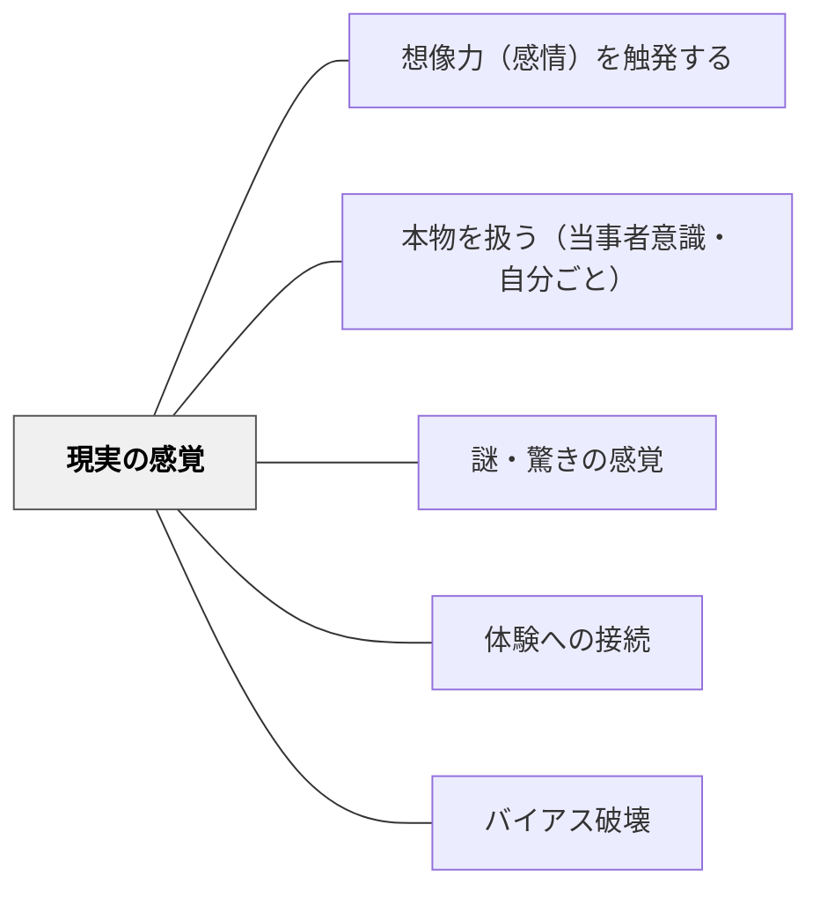

# 現実の感覚

> 「これは本当のことだ」というリアリティが、世界への関与を深める

## 背景（Context）

イーガンによれば、科学の発達とともに人間の「現実感覚」は変化してきた。かつては妖精・ドラゴン・魔法が現実として信じられていたが、科学的な知識の蓄積により、より精緻な現実認識が育まれる。

## 問題（Problem）

フィクションや「作り話」として学んだ内容は、感情的な重みをもちにくい。一方、「これは現実に起きていること・起きたこと」という感覚は、深い関与と責任感を生む。どうすれば学習者の「現実感覚」を育て、活用できるか。

## 力のかたち（Forces）

- 人間は「本当のこと」に対して、フィクションとは異なる感情的な重みを感じる
- 科学的・歴史的な知識は「現実」の解像度を上げる認知的道具
- 現実感覚は批判的思考・科学的態度と結びついている
- 「現実」を強調しすぎると、想像力・フィクションの価値が軽視される危険がある

## 解決（Solution）

学習内容が「実際に起きたこと・起きていること」であることを意識させる機会を設ける。歴史的事実・科学的発見・社会問題の現実を「これは誰かの実際の生きた経験だ」という形で提示する。一方で、かつての人々がなぜ妖精やドラゴンを信じていたかを探ることで、現実感覚の形成プロセスそのものを学ぶことも有効。

## 結果（Consequences）

- 学習者の社会的・倫理的関与が高まる
- 批判的思考と科学的態度の育成につながる
- 「現実の重さ」が学習者にとって過負荷になる場合があるため、感情的サポートが必要

## 関連パタン

- [[パタン/想像力（感情）を触発する]]
- [[パタン/本物を扱う（当事者意識・自分ごと）]]
- [[パタン/謎・驚きの感覚]]
- [[パタン/体験への接続]]
- [[パタン/バイアス破壊]]

## クラスター図

## Actionable Insight

- 歴史・科学の内容を教えるとき「これは実際に〇〇年に〇〇に起きたことです」と一言添える——「本当のこと」というリアリティが学習者の感情的関与と責任感を生む
- 写真・一次資料・実物（または画像）を1つ見せてから学習を始める——視覚的なリアリティが「作り話」でなく「実際のこと」としての学習への関与を深める
- 「この出来事に関わった人はどんな気持ちだったと思うか？」と問う——実際の人間の経験への想像が現実感と共感的な関与を育てる

## 出典

キアラン・イーガン（2010）『想像力を触発する教育――認知的道具を活かした授業づくり』北大路書房
