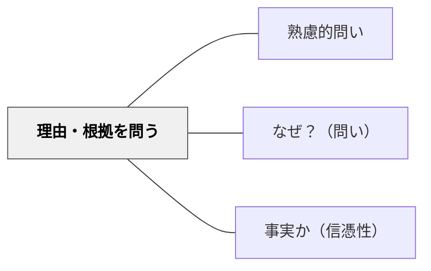

# 理由・根拠を問う

> 「どうしてそう考えたの？」と理由・根拠・証拠を問い、論理的思考を育てる。

## 背景（Context）
学習者が答えを出したとき、その答えがたとえ正しくても、なぜそう考えたかを言語化させなければ、思考のプロセスが見えない。根拠のない「感じ」や「なんとなく」で答えている場合、理由を問われることで初めて自分の思考を意識できる。

## 問題（Problem）
答えだけを評価する文化では、学習者は結果に集中し、理由や根拠を明示することを軽視する。理由を問われる習慣がないと、論理的・批判的思考の基盤が育たない。

## 力のかたち（Forces）
- 理由を求めることで思考プロセスが可視化される
- 根拠を問うことで、思い込みや直感と証拠の区別がつく
- 「なぜ」を繰り返すと深い層の理解に達する
- 他者に説明することで、自分の論理の穴に気づける

## 解決（Solution）
「どうしてそう考えたの？」「その根拠は何？」「どこからそう分かる？」と問い、理由・根拠・証拠を言語化させる。たとえば「春になると気温が上がる、なぜだと思う？」「地球が温まっているという証拠は何があるかな？」と具体的な証拠を求める。正解の後でも「なぜそれが正しいといえるの？」と追い問いする。

## 結果（Consequences）
- 論理的に説明する力が育ち、議論の質が高まる
- 根拠に基づいた思考習慣が学習全般に転移する
- 他者の主張に対しても根拠を問う姿勢が身につく

## 関連パタン
- [[パタン/熟慮的問い]] — 親パタン
- [[パタン/なぜ？（問い）]] — 理由・原因を深く問う
- [[パタン/事実か（信憑性）]] — 証拠・根拠の信頼性を問う

## クラスター図

## Actionable Insight

- 正解が出た後でも「なぜそれが正しいと言えるの？」と必ず追い問いする習慣をつける——正解の後の追い問いが根拠に基づく思考を育てる
- 「感じや直感で答えたと思う人、それを言葉にするとどうなる？」と問う——直感を証拠の言葉に変換させることが論理的思考の始点になる
- 「どこからそれが分かった？教科書のどのページ？実験のどの結果？」と出典を求める——証拠の場所を特定させることが批判的思考の習慣をつくる

## 出典
- [[文献/熟慮的問いのパターンリスト（動画記録）]]
