# 理解のしるしを読む（fit と match）

> 全問正解は理解の証拠ではない。子どもの答えは、教師の理解と一致（match）しているのではなく、教科書が繰り返してきた慣習にたまたま適合（fit）しているだけかもしれない。

## [Pattern Connection]

- **既存パタンとの関連**：本パタンは von Glasersfeld（1987）の fit / match の区別と、Reynolds et al.（1995）の「理解の7指標」を、この Wiki の評価パタン群に接続する。[[パタン/形成的評価]] は「情報が使われて教授と学習が変わること」を要件とするが、その手前に**そもそも何を情報として拾うか**という問題がある。正答を情報として拾い続けているかぎり、形成的評価は正答率の管理に縮む。本パタンはその入口を扱う
- **[[概念/質的判断（曖昧な規準とメタ規準）]] との対応**：教師が「この子はわかった」と判断するとき働いているのは、まさに Sadler の言う質的判断である。7指標は規準の集合だが、どの指標をいま持ち出すかを決めるメタ規準が要る。7指標が有効なのは、それが**チェック項目ではなく手がかりの系列**として扱われるときだけである
- **[[パタン/評価的専門性を渡す（ギルド知識のダウンロード）]] の裏返し**：Sadler は「教師の質の概念を子どもに渡す」方向を論じた。本パタンは逆方向——**教師が子どもの持っている概念を読み取る**方向を扱う。fit と match のズレとは、二つの質の概念のあいだのズレそのものである。両方向が揃ってはじめて、教師と子どもは同じ対象について話せるようになる
- **このWikiの視点との接続（重要）**：7指標のうち①ふるまいの変化と⑥説明できるは、**表出の量に依存する指標**である。この Wiki は「理解と言語表出は別である」という立場を取る（身体化認知・ジェスチャー研究の系譜）。目が輝かない子・説明を言葉にしない子が理解していないと読むことは、指標の誤用である。7指標は**表出に依存する指標と、依存しない指標（③修正か模倣か・⑤近道・④別文脈での使用）を区別して**使う必要がある
- **自己教育への波及**：独学者にも同じ問題が起こる。参考書の章末問題が全部解けたとき、それは著者の理解と match したのか、その章の問題の作り方に fit しただけなのか。数学デイリーで「解けた」を記録するだけでは、この区別はつかない
- **他のパタンへの波及**：[[パタン/聴き方を変える（評価的・解釈的・解釈学的）]] と対をなす。本パタンは**読む対象**（何をしるしとするか）、あちらは**読む構え**（どんな耳で聴くか）を扱う

## 背景（Context）

教師は毎時間、理解を推定している。挙手の数、練習問題の丸の数、ノートの記述、表情。しかし理解そのものは直接見えない。見えるのは行動の表面だけであり、そこから内側を推測するしかない。

この推測の道具として、日本の教室でもっとも広く使われているのが**正答**である。単元テストで9割取れた、練習問題を全問正解した、だから理解している——この推論は素早く、集団に対して実行でき、記録に残せる。そして多くの場合、間違っている。

von Glasersfeld（1987）はここに二つの語を置いた。**match（一致）**は、子どもの持つ構成が教師の持つ構成と同じ形をしていることを指す。**fit（適合）**は、子どもの持つ構成が、いま出された問いの範囲でたまたま正しい答えを出せることを指す。鍵が鍵穴に合うかどうかは、その鍵が正しい鍵であることを保証しない——合鍵でも、たまたま形の似た別の鍵でも、その錠は開く。

Black & Wiliam（1998, pp.56-57）はこれを実例で示す。$3a = 24$ と $a + b = 16$ を出すと、多くの生徒はこれを解けないと信じ、こう言う——「$b$ が8になってしまうが、$a$ が8だから $b$ が8であるはずがない」。教科書で出会ってきた例では、異なる文字がつねに異なる数を表していたからである。誰もそれを規則として教えていない。それでも子どもは規則として学んでいる。

そして著者らはこう述べる。fit と match の区別は「**教師が用いる問いの豊かさに決定的に依存し、それはさらに教師の教科知識、学習についての理論、学習者についての経験に依存する**」。つまり、この見分けは観察技術の問題であると同時に、**教材研究の深さの関数**である。

## 問題（Problem）

「わかりましたか」は機能しない。この問いに「わかりません」と答えることは、集団の中で自分の位置を下げる行為であり、[[概念/教授学的契約（やり過ごしの均衡）]] の下では合理的な選択ではない。返ってくるのは、わかったかどうかの情報ではなく、契約に従った反応である。

では正答を見ればよいか。ここに fit の問題が立ちはだかる。教科書の練習問題は、その単元の中で系統的に配列されている。系統的であるということは、**問題群のあいだに共通性がある**ということである。子どもはその共通性を読み取り、それに合う手続きを組み立てる。手続きは正答を出す。教師はそれを理解の証拠として読む。

しかし子どもが読み取った共通性は、多くの場合、教師が教えたつもりのない性質である。

- 「わり算の答えは必ず割り切れる」
- 「かけ算をすると数は大きくなる」
- 「三角形の高さは、図の中の縦の辺である」
- 「文章題に『あわせて』とあればたし算、『のこりは』とあればひき算」
- 「説明文の問いの文は、いちばんはじめの段落にある」

どれも、その単元の問題群の中では**例外なく成り立っている**。だから子どもは学ぶ。そして教師は、それを教えたことに気づいていない。単元テストは同じ慣習の上に作られているから、テストでも露見しない。露見するのは、翌年、あるいは中学校である。

さらに厄介なのは、正答を出せない子については誤答の中身から手がかりが得られるのに、**正答を出した子については情報が得られない**という非対称である。教師の見取りは、できていない子に自然と向かう。fit の問題は、できている子の中に静かに残る。

## 力のかたち（Forces）

- **正答はもっとも入手しやすい証拠である vs 正答は理解と独立に生じうる**——丸つけは集団に対して数分で実行できる。しかしその情報量は、思われているより桁違いに少ない
- **教科書の系列は学習を支える vs 系列は慣習を副産物として教える**——問題を系統的に並べることは足場として正しい。しかし系統性そのものが、意図しない規則性を子どもに供給する。良い配列ほど強い慣習を生む
- **慣習を外す問いは診断力が高い vs ひっかけと受け取られると信頼を損なう**——「先生は落とし穴を掘る人だ」と認識された瞬間、子どもは問題文を疑う構えで読み始め、テストは安全でない場所になる
- **情意的なしるしは即時に読める vs 表出の個人差が大きい**——「目が輝く」は教室で最速で読める指標だが、もっとも個人差の大きい指標でもある
- **7指標は観察を助ける vs 一覧表にすると評定に化ける**——Reynolds らの7指標は、記録用紙に落とした瞬間に「7項目中5項目該当」という別のものに変わる。手がかりの系列と、評定の項目は、見た目が同じで機能が正反対である
- **見取りの精度は教材研究の深さに縛られる**——どの慣習が暗黙に教えられているかは、その内容の数学的・言語的構造を教師が把握していなければ特定できない。見取りの技術だけを磨いても届かない
- **時間**——慣習を外した一問を単元ごとに作る作業は、そのままでは持続しない。一単元一問という上限を最初に決めておかないと、二週間で消える

## 解決（Solution）

**正答を理解の証拠として扱うのをやめ、二つの手立てに置き換える。ひとつは、理解のしるしを7つの手がかりの系列として観察すること。もうひとつは、正答したときにこそ「その単元で暗黙に教えてしまっている慣習を一つだけ外した問い」を置いて、fit と match を見分けることである。**

### 7指標——理解の水準への手がかりの系列

Reynolds et al.（1995）は、授業のビデオと記録を経験ある小学校教師7名に検討させ、子どもが「わかった」かどうかを判断するために使っている暗黙の規準を取り出した。7名全員が合意したのは次の7つである。重要なのは、これが**静的なチェックリストではなく、理解の水準を示す手がかりの系列**として提示されている点である。

1. **ふるまいの変化**——目が輝く／気乗りしない
2. **概念の拡張**——自発的にアイデアを先へ進める
3. **パターンへの修正**——理解していない子は模倣するか、規則にただ従う
4. **別の文脈での使用**——同じパターンを他所に見出し始める
5. **近道を使う**——大きな絵を確信している子だけが手続きを短縮できる
6. **説明できる**
7. **注意を集中できる**——課題への持続

小学校の教室では、③と⑤がもっとも診断力が高い。どちらも**正答からは見えない差**を拾うからである。同じ丸がついた二人のうち、一人は示された手順をそのままなぞり、もう一人はその手順に自分の都合で手を入れている。後者だけが、手続きの背後にある構造を見ている。

### 慣習を外す一問——設計の手順

これは思いつきでは作れない。次の三段階を踏む。

**第一段階：その単元の練習問題を全部並べる。** 教科書・ドリル・単元テストを横に並べ、数字だけを抜き出して眺める。

**第二段階：どの問題にも成り立っているが、数学的・言語的には必然でない性質を探す。** これが「暗黙に教えてしまっている慣習」である。必然でない、というところが要点になる。たとえば「わり算の答えが割り切れる」ことは、わり算の性質ではなく、その単元の問題の選び方の性質である。

**第三段階：その性質を一つだけ外した問題を作る。ほかは全部同じにする。** 二つ以上外すと、どの慣習でつまずいたかがわからなくなる。難易度を上げるのではなく、**慣習を一つ引き算する**のだと考える。

そして出し方が決定的に重要である。この一問は、**評定の対象にしない**。「これは新しいことを考えるための問題です。できなくても点にはなりません」と最初に言う。ここを外すと、診断のための問いがひっかけ問題に変質する。

---

### 場面1：小数のかけ算——「かけると大きくなる」を外す（算数・第5学年）

小数×小数の単元。子どもたちは筆算を正確に実行できるようになり、練習問題の正答率は9割を超えていた。

第一段階として、教科書と計算ドリルの問題を全部並べてみた。$2.4 \times 1.3$、$3.5 \times 2.8$、$0.6 \times 4.2$——数字を眺めているうちに、第二段階の性質が浮かんだ。**この単元で「かける数が1より小さい」問題は、ほとんど出てこない**。出てきても $0.6 \times 4.2$ のように、かけられる数の側が小さい。つまり子どもは、この単元を通してずっと「かけ算をすると答えは大きくなる」という経験を積んでいる。これは小数のかけ算の性質ではなく、問題の選び方の性質である。

第三段階として、一問だけ作った。$400 \times 0.8$。数値は易しく、筆算は暗算でもできる。慣習だけを一つ外してある。

出す前に「これは点にならない問題です。答えを出したら、その答えが**もとの数より大きいか小さいか**も書いてください」と伝えた。

結果は分かれた。320と正しく計算し、しかし「大きい」と書いた子がいた。計算はできるが、答えの意味を見ていない。計算を止めて「かけ算だから400より大きいはずなのに、おかしい」と書いた子がいた。慣習と手続きが衝突したことを自覚しており、これは**手続きの外に出ている**しるしである。そして A児は320と書き、「小さい。0.8をかけるのは0.8個分だから、1個分より少ない」と書いた。⑤近道と⑥説明が同時に現れている。

三つは全部「正答」に見えるが、理解の水準は三段階違う。慣習を一つ外しただけで、丸つけでは重なっていた三つが分離した。

なおこの授業のあと、教師の側にも発見があった。**この慣習は教科書が作ったのではなく、教師が問題を選ぶときに無意識に避けていた**——1より小さい数をかける問題は「混乱するから後にしよう」と判断して外していた。慣習の特定作業は、教材研究であると同時に自分の選択の点検でもある。

---

### 場面2：説明文の「問い」——位置の慣習を外す（国語・第3学年）

説明文の読み取りで「問いの文をさがしましょう」を繰り返してきた。子どもたちは確実に見つけられるようになっていた。

問題群を並べてみると、三年生までに扱った説明文では、**問いの文は例外なく最初の一段落か二段落目にあった**。教材の作られ方としてそうなっているだけで、説明文の性質ではない。

そこで、問いが文章の中ほどに置かれた短い説明文を一つ用意した（教師が書いたもの。前半で具体例を三つ挙げ、中ほどで「では、どうしてこうなるのでしょうか」と問い、後半で答える構成）。長さは半分以下にし、語彙も易しくした。難しくするのではなく、位置の慣習だけを外すためである。

多くの子は最初の段落から探し、見つからずに手が止まった。「問いがない文章だ」と言った子もいた。**慣習が規則として働いていた証拠**である。ここで教師は答えを言わず、[[パタン/待ち時間（問いのあとの3秒）]] を長めに取った。

B児が「まん中に『どうして』ってある」と言った。そこで [[パタン/問い返し（リヴォイシング）]] を使って「問いの文って、はじめにあるものだと思ってた？」と返した。B児は「うん。でも、はじめに例を出してから聞くほうが、気になるからいいと思う」と答えた——④別の文脈での使用と②概念の拡張が出ている。

このやりとりのあと、学級で「問いの文はどこにあってもいい。ただし、その文章では答えが必ずあとに来る」という言い方が共有された。慣習が、規則から**性質**に組み替えられた瞬間である。

---

### 場面3：7指標で見取る——同じ丸の中の差（算数・第4学年）

わり算の筆算の練習時間。全員が問題を解いており、机間指導で丸をつけて回る場面である。従来はここで見ているのは「合っているか」だけだった。

見る対象を③と⑤の二つに絞った。**手順に手を入れているか（③）。手順を短くしているか（⑤）。**

- C児は、示した筆算の形式を一画も崩さずに書いている。商が立たない位に0を丁寧に書き、線も定規で引いている。正答率は10割。しかし**一問目と十問目の書き方がまったく同じ**である。③でいえば「模倣」の側にある
- D児は、途中から余りの計算を筆算に書かずに暗算で処理し始めた。書く量が半分になっている。⑤の近道である。ただし一問だけ、暗算にした位で間違えていた
- E児は、問題の数字を見て「これは商が2桁になる」と解く前に鉛筆の脇に小さく書いていた。誰も教えていない。②概念の拡張にあたる

三人とも「できている」子である。しかし次の時間に必要な手立ては三人とも違う。C児には別の文脈（④）を渡す必要があり、D児には近道の使いどころを言語化させる必要があり、E児には見立ての根拠を説明させる（⑥）と学級全体の資源になる。

指標を二つに絞ったのは意図的である。7つ全部を持って机間指導に出ると、何も見えない。**その時間に見る指標を一つか二つ決めて回る**——これが7指標の実用的な使い方である。

---

### 特別支援の視点：情意的指標を単独で使わない

7指標のうち①ふるまいの変化（目が輝く／気乗りしない）と⑦注意を集中できるは、教室でもっとも速く読める指標であり、同時にもっとも危険な指標である。

表情の変化が小さい子、視線を合わせにくい子、姿勢の保持に困難のある子は、この二つの指標では**構造的に「理解していない」側に分類され続ける**。⑥説明できるも同じである。言語表出に困難のある子は、理解していても説明が出ない。ここで「説明できないから理解していない」と読むのは、指標の誤用というより、**理解と言語表出を同一視するという理論上の誤り**である。

この Wiki の立場は、理解と表出は別の層に属する、というものである。ジェスチャー研究が繰り返し示してきたように、言葉に出ない理解は手や視線に先に現れる。だから特別支援の文脈では、**表出に依存しない指標を優先して使う**。

- ③**パターンへの修正**——手順を自分の都合に合わせて変えているか。書字が困難な子でも、道具の使い方・並べ方に現れる
- ⑤**近道を使う**——数える回数が減ったか。操作の手数が減ったか。これは行動の量で読める
- ④**別の文脈での使用**——別の時間・別の教科・休み時間の場面で同じやり方が出るか

そして「わかりましたか」に代わる問いも変える。「わかった人？」ではなく、**「どうやったか、手だけでやってみて」**「もう一回、同じことを別の数でやってみて」と、表出の様式を言語に限定しない形で求める。慣習を外した一問も、口頭ではなく具体物や図で提示できる形にしておくと、診断の対象から外れる子がいなくなる。

## 結果（Consequences）

**利点**

- **正答の中が分離する**——丸つけでは重なっていた子どもたちが、慣習を一つ外すだけで三つ四つの水準に分かれる。もっとも情報の乏しかった「できている子」から情報が取れるようになる
- **見取りが教材研究と接続する**——どの慣習が暗黙に教えられているかを特定する作業は、そのまま内容の構造分析である。見取りの技術を磨く作業が、教科の理解を深める作業と同じものになる
- **翌年・翌学年への持ち越しが減る**——慣習は単元テストでは露見せず、次の単元や次の学年で初めて壊れる。単元の中で一度外しておけば、そこで気づける
- **子どもの側に「規則」と「性質」の区別が育つ**——「これは決まりなのか、たまたまそうだっただけなのか」を問う構えは、教科の中で持つ知識の質そのものを変える。暗記された規則の量は同じでも、その規則が何に支えられているかを子どもが問えるようになる
- **教師の想定外の理解が拾える**——⑤近道と②概念の拡張は、教師が教えていないことを子どもがしているしるしである。これは [[パタン/聴き方を変える（評価的・解釈的・解釈学的）]] の第二段階への入口になる

**注意点・リスク**

- **7指標が評定表に化ける**——これが最大のリスク。記録用紙に7項目を並べて丸をつけ始めた時点で、手がかりの系列は観点別評価の下位項目に変質する。Reynolds らが「静的なチェックリストではない」と明記したのはこのためである。**紙に落とさない。その時間に見る指標を一つか二つ、口で決めて教室に出る**
- **情意的指標の単独使用が子どもを取りこぼす**——上述のとおり、①⑥⑦は表出量に依存する。この三つだけで見取ると、表現の少ない子・特別支援を要する子が体系的に「理解していない」側に置かれる。しかもその判断は記録として堆積し、Filer（1995）の言う「非形式的評価の堆積」として翌年に引き継がれる
- **慣習を外す問いがひっかけになる**——「点になる」「テストに出る」形で出した瞬間、これは診断ではなく罠になる。子どもは問題文を疑う構えで読み始め、テスト全般への信頼が下がる。**評定から明示的に外し、そう宣言してから出す**
- **外す慣習を二つ以上にすると診断にならない**——難しくすることが目的ではない。慣習を一つ引き算し、ほかは全部同じにする。難易度が上がると、どの慣習でつまずいたのかが読めなくなる
- **持続しない**——一単元一問という上限を最初に決める。全単元で作ろうとすると、二週間で止まる
- **教師の教科知識に上限が縛られる**——どの慣習が暗黙に教えられているかを特定できなければ、この設計は成立しない。「問いの豊かさは教師の教科知識に依存する」という Black & Wiliam の指摘は、そのまま本パタンの実行条件である。ここを飛ばして観察技術だけを導入しても効かない

## 関連パタン

- [[パタン/聴き方を変える（評価的・解釈的・解釈学的）]] — 対をなすパタン。本パタンは「何をしるしとして読むか」、あちらは「どんな構えで聴くか」を扱う
- [[パタン/形成的評価]] — 上位の枠組み。本パタンは形成的評価の入口、すなわち何を情報として拾うかを扱う
- [[パタン/評価的専門性を渡す（ギルド知識のダウンロード）]] — 教師の質の概念を子どもへ渡す方向。本パタンは子どもの概念を教師が読む逆方向で、両者は同じズレの両側を見ている
- [[概念/質的判断（曖昧な規準とメタ規準）]] — 「わかった」の判断が働かせている質的判断の構造。7指標のどれを持ち出すかはメタ規準の問題
- [[概念/教授学的契約（やり過ごしの均衡）]] — 「わかりましたか」に「わかりません」と答えないのは、契約の下では合理的である。本パタンはその契約を迂回して情報を取る手立て
- [[パタン/見取ったあとの手を決めておく（データ利用のルール化）]] — 読み取ったしるしを次の時間の手立てに変える段。読むだけで終わらせないための続き
- [[パタン/進歩の傾きを見る（水準ではなく変化率）]] — 同じく正答率では見えないものを読む。あちらは時間軸、本パタンは一時点の断面
- [[パタン/待ち時間（問いのあとの3秒）]] — 慣習を外した問いは即答できない。待たなければ、この問いは機能しない
- [[パタン/問い返し（リヴォイシング）]] — 正答した子に「どうしてそう思った？」と返すことが、fit と match を見分ける最短の手立てになる
- [[パタン/誤りフィードバック]] — 誤答の中身を読む技術。本パタンは正答の中身を読む技術で、非対称を埋める
- [[パタン/テストを繰り返す]] — テストは学習を測るだけでなく促進する。慣習を外した一問は、その促進の側を狙って置く
- [[パタン/到達レベルの自己評価]] — 子ども自身が「わかったつもり」を疑えるようになる段。本パタンの教師側の技術を子どもに渡した形
- [[概念/自我関与と課題関与（フィードバックが向ける先）]] — 慣習外しの一問を評定から外すのは、自我関与を避けて課題関与を保つため
- [[パタン/制作しながら質を判断する（産出中のモニタリング）]] — 質の判断を産出中に前倒しする。本パタンは理解の判断を正答の手前に前倒しする、同型の運動
- [[文献/Assessment and Classroom Learning（Black & Wiliam）]] — 出典。fit と match は pp.56-57、7指標は p.57

- [[パタン/答えの出どころを推し量る（誤答の解釈）]] — 裏側にあたるパタン。あちらは見当外れに見える答えの出どころを推し量る
- [[パタン/偶発の瞬間を活かす（コンティンジェンシー）]] — 偶発の瞬間の質は、そこで読み取る解釈の質を超えない
- [[概念/自己調整学習の内側（成長の道とウェルビーイングの道）]] — 「わかったつもり」が、自己調整のどの段階で生じるかのモデル
- [[文献/Developing the Theory of Formative Assessment（Black & Wiliam, 2009）]] — fit と match が「教師のモデルの限界」として再登場する2009年版
- [[パタン/その過程が本当に働いたかを確かめる]] — 同じ問題を評価設計の側から言ったもの。課題が意図した過程を引き出せているかを確かめる
- [[パタン/余計な難しさを外す（構成概念に無関係な分散）]] — 正答が理解の証拠にならない一因。無関係な易しさが「わかったふり」を作る
- [[概念/妥当性（スコアの意味についての評価判断）]] — 「解釈が妥当か」を問う枠組み。fit と match のずれは妥当性の問題として整理できる
- [[パタン/測れていないものを疑う（構成概念の過少代表）]] — 読み取ろうとしている枠そのものが狭いとき、しるしは最初から視野に入らない
- [[パタン/返したことと届いたことを分ける（返却の五段）]] — 「わかりました」と言ったが解釈が違っていた、を返却の側から扱う
- [[パタン/沈黙に値をつけているのは誰か]] — しるしが出てこなかったとき、見たうえで無かったのか見ていなかったのかを分ける
- [[パタン/読みの筋道を書き出す（スコアから結論までの階段）]] — 同じスコアに狭い読みと広い読みが並び立つことを扱う（Kane, 1990）。読みは見つかるのではなく選ばれている、という前提は子どもにも渡せる

## クラスター図

```mermaid
flowchart LR
    ne79086e8a7a3e381aee38197e3828be38197e38292e8aaade38280efbc8866697420e381a8206d61746368efbc89["理解のしるしを読む（fit と match）"]
    ne881b4e3818de696b9e38292e5a489e38188e3828befbc88e8a995e4bea1e79a84e383bbe8a7a3e98788e79a84e383bbe8a7a3e98788e5ada6e79a84efbc89["聴き方を変える（評価的・解釈的・解釈学的）"]
    ne5bda2e68890e79a84e8a995e4bea1["形成的評価"]
    ne8a995e4bea1e79a84e5b082e99680e680a7e38292e6b8a1e38199efbc88e382aee383abe38389e79fa5e8ad98e381aee38380e382a6e383b3e383ade383bce38389efbc89["評価的専門性を渡す（ギルド知識のダウンロード）"]
    ne8a68be58f96e381a3e3819fe38182e381a8e381aee6898be38292e6b1bae38281e381a6e3818ae3818fefbc88e38387e383bce382bfe588a9e794a8e381aee383abe383bce383abe58c96efbc89["見取ったあとの手を決めておく（データ利用のルール化）"]
    ne980b2e6ada9e381aee582bee3818de38292e8a68be3828befbc88e6b0b4e6ba96e381a7e381afe381aae3818fe5a489e58c96e78e87efbc89["進歩の傾きを見る（水準ではなく変化率）"]
    ne5be85e381a1e69982e99693efbc88e5958fe38184e381aee38182e381a8e381ae33e7a792efbc89["待ち時間（問いのあとの3秒）"]
    ne5958fe38184e8bf94e38197efbc88e383aae383b4e382a9e382a4e382b7e383b3e382b0efbc89["問い返し（リヴォイシング）"]
    ne8aaa4e3828ae38395e382a3e383bce38389e38390e38383e382af["誤りフィードバック"]
    ne38386e382b9e38388e38292e7b9b0e3828ae8bf94e38199["テストを繰り返す"]
    ne588b0e98194e383ace38399e383abe381aee887aae5b7b1e8a995e4bea1["到達レベルの自己評価"]
    ne588b6e4bd9ce38197e381aae3818ce38289e8b3aae38292e588a4e696ade38199e3828befbc88e794a3e587bae4b8ade381aee383a2e3838be382bfe383aae383b3e382b0efbc89["制作しながら質を判断する（産出中のモニタリング）"]
    ne7ad94e38188e381aee587bae381a9e38193e3828de38292e68ea8e38197e9878fe3828befbc88e8aaa4e7ad94e381aee8a7a3e98788efbc89["答えの出どころを推し量る（誤答の解釈）"]
    ne581b6e799bae381aee79eace99693e38292e6b4bbe3818be38199efbc88e382b3e383b3e38386e382a3e383b3e382b8e382a7e383b3e382b7e383bcefbc89["偶発の瞬間を活かす（コンティンジェンシー）"]
    ne3819de381aee9818ee7a88be3818ce69cace5bd93e381abe5838de38184e3819fe3818be38292e7a2bae3818be38281e3828b["その過程が本当に働いたかを確かめる"]

    ne79086e8a7a3e381aee38197e3828be38197e38292e8aaade38280efbc8866697420e381a8206d61746368efbc89 --- ne881b4e3818de696b9e38292e5a489e38188e3828befbc88e8a995e4bea1e79a84e383bbe8a7a3e98788e79a84e383bbe8a7a3e98788e5ada6e79a84efbc89
    ne79086e8a7a3e381aee38197e3828be38197e38292e8aaade38280efbc8866697420e381a8206d61746368efbc89 --- ne5bda2e68890e79a84e8a995e4bea1
    ne79086e8a7a3e381aee38197e3828be38197e38292e8aaade38280efbc8866697420e381a8206d61746368efbc89 --- ne8a995e4bea1e79a84e5b082e99680e680a7e38292e6b8a1e38199efbc88e382aee383abe38389e79fa5e8ad98e381aee38380e382a6e383b3e383ade383bce38389efbc89
    ne79086e8a7a3e381aee38197e3828be38197e38292e8aaade38280efbc8866697420e381a8206d61746368efbc89 --- ne8a68be58f96e381a3e3819fe38182e381a8e381aee6898be38292e6b1bae38281e381a6e3818ae3818fefbc88e38387e383bce382bfe588a9e794a8e381aee383abe383bce383abe58c96efbc89
    ne79086e8a7a3e381aee38197e3828be38197e38292e8aaade38280efbc8866697420e381a8206d61746368efbc89 --- ne980b2e6ada9e381aee582bee3818de38292e8a68be3828befbc88e6b0b4e6ba96e381a7e381afe381aae3818fe5a489e58c96e78e87efbc89
    ne79086e8a7a3e381aee38197e3828be38197e38292e8aaade38280efbc8866697420e381a8206d61746368efbc89 --- ne5be85e381a1e69982e99693efbc88e5958fe38184e381aee38182e381a8e381ae33e7a792efbc89
    ne79086e8a7a3e381aee38197e3828be38197e38292e8aaade38280efbc8866697420e381a8206d61746368efbc89 --- ne5958fe38184e8bf94e38197efbc88e383aae383b4e382a9e382a4e382b7e383b3e382b0efbc89
    ne79086e8a7a3e381aee38197e3828be38197e38292e8aaade38280efbc8866697420e381a8206d61746368efbc89 --- ne8aaa4e3828ae38395e382a3e383bce38389e38390e38383e382af
    ne79086e8a7a3e381aee38197e3828be38197e38292e8aaade38280efbc8866697420e381a8206d61746368efbc89 --- ne38386e382b9e38388e38292e7b9b0e3828ae8bf94e38199
    ne79086e8a7a3e381aee38197e3828be38197e38292e8aaade38280efbc8866697420e381a8206d61746368efbc89 --- ne588b0e98194e383ace38399e383abe381aee887aae5b7b1e8a995e4bea1
    ne79086e8a7a3e381aee38197e3828be38197e38292e8aaade38280efbc8866697420e381a8206d61746368efbc89 --- ne588b6e4bd9ce38197e381aae3818ce38289e8b3aae38292e588a4e696ade38199e3828befbc88e794a3e587bae4b8ade381aee383a2e3838be382bfe383aae383b3e382b0efbc89
    ne79086e8a7a3e381aee38197e3828be38197e38292e8aaade38280efbc8866697420e381a8206d61746368efbc89 --- ne7ad94e38188e381aee587bae381a9e38193e3828de38292e68ea8e38197e9878fe3828befbc88e8aaa4e7ad94e381aee8a7a3e98788efbc89
    ne79086e8a7a3e381aee38197e3828be38197e38292e8aaade38280efbc8866697420e381a8206d61746368efbc89 --- ne581b6e799bae381aee79eace99693e38292e6b4bbe3818be38199efbc88e382b3e383b3e38386e382a3e383b3e382b8e382a7e383b3e382b7e383bcefbc89
    ne79086e8a7a3e381aee38197e3828be38197e38292e8aaade38280efbc8866697420e381a8206d61746368efbc89 --- ne3819de381aee9818ee7a88be3818ce69cace5bd93e381abe5838de38184e3819fe3818be38292e7a2bae3818be38281e3828b

    classDef hub fill:#f0f0f0,stroke:#555,color:#000,font-weight:bold
    class ne79086e8a7a3e381aee38197e3828be38197e38292e8aaade38280efbc8866697420e381a8206d61746368efbc89 hub
```

## Actionable Insight

- **今週の単元の練習問題を全部並べ、「どの問題にも成り立っているが、必然ではない性質」を一つ書き出す**——教科書・ドリル・単元テストを横に置いて数字だけを眺める。10分で一つ見つかる。見つからなければ、それはまだ内容の構造が見えていないというしるし
- **その性質を一つだけ外した問題を一問だけ作り、「点にならない問題です」と宣言してから出す**——難しくしない。慣習を引き算するだけ。ほかの条件は全部そろえる
- **机間指導に出る前に、今日見る指標を一つ口に出して決める**——「今日は③修正か模倣か」「今日は⑤近道」。7つ持って出ると何も見えない。記録用紙は作らない
- **正答した子に「どうしてそうなると思った？」を一日三人だけ聞く**——できていない子ではなく、できている子に聞く。丸のついたノートの上で fit と match が分かれる
- **「わかりましたか」を「同じことを別の数でやってみて」に置き換える**——言語表出を要求しない形で理解を問う。特別支援学級では、この置き換えだけで見取れる子の数が変わる

## 出典

Black, P., & Wiliam, D. (1998). Assessment and classroom learning. *Assessment in Education: Principles, Policy & Practice, 5*(1), 7–74.

> 子どもの理解が教師のそれと match しているのか、それともたまたま fit しているだけなのか——両者の区別は、教師が用いる問いの豊かさに決定的に依存し、それはさらに教師の教科知識、学習についての理論、学習者についての経験に依存する。（pp.56-57 の要旨）

> 〔経験ある教師7名が合意した7指標は〕静的なチェックリストとしてではなく、理解の水準への手がかりの系列として提示された。（p.57 の要旨）

von Glasersfeld, E. (1987). Learning as a constructive activity. In C. Janvier (Ed.), *Problems of representation in the teaching and learning of mathematics*. Lawrence Erlbaum.——fit と match の区別

Reynolds, S., Martin, K., & Groulx, J. (1995). Patterns of understanding. *Educational Assessment, 3*, 363–371.——理解の7指標

Filer, A. (1995). Teacher assessment: Social process and social products. *Assessment in Education, 2*, 23–38.——非形式的評価の堆積とラベリングの自己成就的予言（Black & Wiliam, p.58 に引用）
