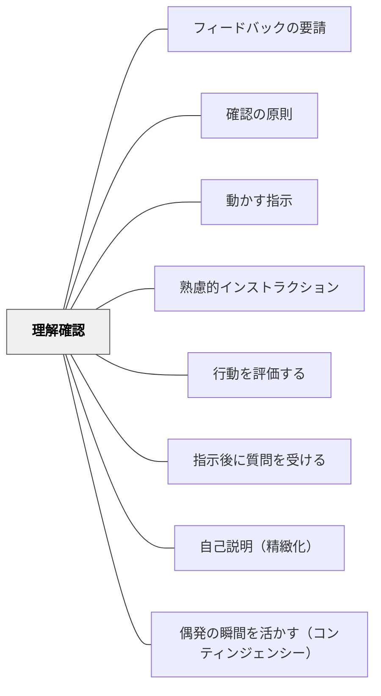

# 理解確認

> 「わかりましたか？」だけでは不十分。行動レベルで理解を確かめる。

## 背景（Context）
指示や説明の後に受け手が理解しているかを確認することは、インストラクションの基本ステップの一つである。しかし「わかりましたか？」と問うだけでは、実際の理解の有無は確認できない。受け手は分かっていなくても「はい」と答えることが多く、形式的な確認に終わりやすい。

## 問題（Problem）
理解していないまま活動に入ると、後になって混乱や失敗が集積する。「分かった」という申告と実際の行動可能な理解は別物である。確認しないことでインストラクターは「伝わった」と思い込み、受け手の実態が見えなくなる。

## 力のかたち（Forces）
- 言語的な「はい」は理解の証拠にならない
- 実際にやってみることが最も確実な理解確認の方法
- 時間的制約の中で全員の理解を確認することは難しい
- 確認の方法によって得られる情報の質が大きく変わる

## 解決（Solution）
**指示・説明の後に、実際にやってみる・説明させる・質問させるなど、行動レベルで理解を確認する。**

「一つやってみて」「隣の人に説明して」「どうすれば良いか一言で言って」のように、動作・言語化・実演を通じて確認する。代表者に説明させることで、クラス全体の理解状況を把握できる。確認の結果によって指示を補足するか、活動に進むかを判断する。

## 結果（Consequences）
- 指示の理解不足を活動前に発見・修正できる
- 受け手が「聞いているふり」に慣れることを防ぐ
- インストラクターが受け手の実態を把握した状態で次に進める

## クラスター図

## Actionable Insight

- 指示の後に「一つやってみて」「隣の人に説明して」のどちらかを1回入れる——行動で確認することで「分かったふり」を防ぐ
- 全体に「分からなかった人？」と問うのではなく、代表者1人に説明させてクラス全体の理解状況を把握する——一人の言語化がクラス全員のモデルになる
- 確認の結果「まだ迷っている」と感じたら「もう一度、隣の人と確認してから始めよう」と戻る——確認が次のステップへの判断点として機能する

## 出典

- 一つの教育のパタン・ランゲージ（岩井輝久）

## 関連パタン
- [[パタン/フィードバックの要請]]
- [[パタン/確認の原則]]
- [[パタン/動かす指示]]
- [[パタン/熟慮的インストラクション]] — 親パタン
- [[パタン/行動を評価する]] — 活動後の評価と連動
- [[パタン/指示後に質問を受ける]] — 確認の場を明示的に設ける
- [[パタン/自己説明（精緻化）]] — 説明による理解確認
- [[概念/形成的評価の5つの戦略（3×3の枠組み）]] — 戦略②の実装。証拠を引き出す最小の手立て
- [[パタン/偶発の瞬間を活かす（コンティンジェンシー）]] — 「確かめた」で終わらせず、その結果によって次の一歩を分岐させる設計
