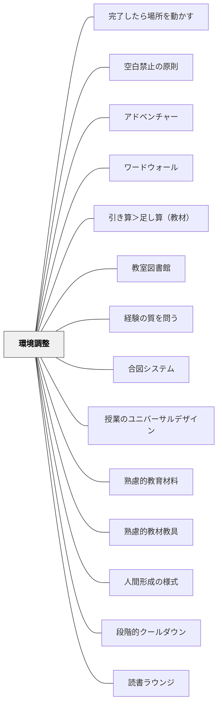

# 環境調整

> 全ての被教育者がよく学べるように環境調整せよ。環境調整は、教育経験の質を左右する無数のパターンを含む大きなパターン——いや、超特大パターンである。

---

## Pattern Connection

### Dewey（1938）

Deweyの *Experience and Education*（1938）は、環境調整という実践的パタンに哲学的な根拠を与える。「なぜ環境調整が教育の核心なのか」という問いへの答えが、相互作用（Interaction）の概念にある。

- **既存パタンとの関連**：本パタンの「全ての被教育者がよく学べるように環境調整せよ」という原則は、DeweyのInteraction原則——「経験は個人の内的条件と客観的条件の相互作用として生まれる」——の教育実践的表現そのものである。
- **補強された点**：環境調整が「なぜ重要か」の哲学的根拠が明確になる。教師が規制できるのは客観的条件（環境）だけである。だからこそ環境調整こそが教師の仕事の核心になる。

**Deweyの相互作用モデルと環境調整の関係**

> "The environment, in other words, is whatever conditions interact with personal needs, desires, purposes, and capacities to create the experience which is had."（Dewey, 1938, Ch.3）

| 側面 | 内容 | 教師がコントロールできるか |
|---|---|---|
| **内的条件** | 学習者の需要・欲求・目的・能力 | 直接は不可。間接的にのみ影響できる |
| **客観的条件（環境）** | 教師の言葉・素材・空間・道具・社会的関係 | 可能——これが環境調整の対象 |

> "The trouble with traditional education was not that educators took upon themselves the responsibility for providing an environment. The trouble was that they did not consider the other factor in creating an experience; namely, the powers and purposes of those taught."（Dewey, 1938, Ch.3）

伝統的教育は客観的条件（教科書・規律）を絶対視し内的条件を無視した。放任的進歩教育は内的条件（子どもの衝動）に従属し客観的条件を軽視した。環境調整の本質は、この2条件を均衡させることにある。

- **他のパタンへの波及**：[[パタン/経験の質を問う]]（相互作用が経験の質の第3の次元）・[[パタン/副次的学習]]（環境調整が副次的態度形成の条件を設定する）

---

### Hammeken（2003）統合（2026-05-15）：**

*The Teacher's Guide to Inclusive Education: 750 Strategies for Success!* は、本パタンに「Universal Design for Learning（UDL）」という哲学的フレームを接続する。

- **補強された点**：本パタンの「全員がよく学べるように環境調整する」という原則が、UDLの「はじめから全員のために設計する（Design for all from the start）」に対応することが明確になった。「障害のある子のための配慮は全員に有効」という視点が加わり、環境調整が「特定の子への特別対応」から「授業設計の質の向上」へと再定義される。
- **接続した概念**：配慮（Accommodation）と修正（Modification）の区別——「アクセスの方法を変える（内容は変えない）配慮」を先に試み、それでも届かないときに「内容自体を変える修正」を検討するという原則が加わった。
- **他のパタンへの波及**：[[パタン/授業のユニバーサルデザイン]] として独立したパタンを生成。[[実践/インクルーシブ授業の設計]] として教科別の具体的配慮カタログを整備。

---

### 細谷恒夫（1957）

細谷の *教育の哲学 人間形成の基礎理論* は、環境調整の「何を調整するか」という問いに対して、教育的環境の**四層構造**という体系的な答えを与える。

- **既存パタンとの関連**：本パタンが「全ての被教育者がよく学べるように環境調整する」と述べるとき、調整の対象となる環境はどこまで広いのか。細谷の分析は、その全体像を階層的に示す。
- **補強された点**：環境調整の射程がいかに広いかが構造的に見えてくる。「物的環境」「社会的環境」という2分類を、より深い理論的枠組みに接続できる。

**教育的環境の四層構造**

| 層 | 内容 | 教育的意義 |
|---|---|---|
| **自然的環境（風土）** | 気候・地形・自然。人間形成の最基底 | 直接調整は困難だが、文化を通して間接的に作用 |
| **精神的環境（文化）** | 制度・法律・科学・芸術・習俗 | 個人に行動の「軌道」を与えると同時に「更新の可能性」をもたらす |
| **人間的交渉** | 共感的・同僚的・同志的という三類型の人間関係 | 発達段階によって支配的な類型が変わる |
| **教育的交渉** | 意図的に人間形成を目的とした交渉 | 「目的意識」が初めて環境に加わる層 |

**文化の二面性——制約と更新の可能性**

細谷が特に強調するのは、精神的環境（文化）の二面性である：

1. **軌道（制約）**: 文化は新しく生まれた個人に対し、その行動の「軌道」として機能する。習俗・規範・慣行は個人に「これに従って行動せよ」という圧力を与える。
2. **更新の可能性**: 若い世代は文化をその本来の意味から問い直し、更新する可能性を持っている。生活条件の変化によって文化が「因襲」に転落したとき、その陳腐性を感じるのは新しい世代だからだ。

これは授業設計に直接示唆を与える——「文化（教科の内容）を与える」という一方向の環境調整ではなく、子どもたちが文化を批判的に問い、更新の主体になれるような環境調整が必要である。

> 「文化の更新とか変革を試みようとするものも、その前提としてその文化を単なる傍観者としてではなく、一応は自己のものとして受けとらなければならない」（第三章 教育的環境論）

- **他のパタンへの波及**：[[パタン/人間形成の様式]]（どの様式の形成を目ざすかによって必要な環境調整が変わる）・[[パタン/コミュニティをつくる]]（人間的交渉の三類型は環境調整の対象として考えられる）

---

**いるかどり（2023）統合（2026-05-14）：**

*子どもの発達障害と環境調整のコツがわかる本*（ソシム）は、本パタンの3分類（人的・物的・空間的）を発達障害のある子どもの具体的な困りごとに対して適用した実践書。

- **補強された点**：「困りごと別の調整」（言語理解・感覚過敏・読み書き・整理整頓・集団参加）が本パタンの抽象原則を具体的な実践に落とし込む基盤となった。「見通しを持たせる（スケジュールの可視化）」が最も即効性の高い調整として明確に位置づけられた。
- **修正・拡張された点**：「子どもを変えようとする」から「環境を変える」への視点転換が本書の核心。本パタンの「問題が起きた時に『どう環境調整するか』を考える」という原則がより具体的な発達障害文脈で深化した。
- **他のパタンへの波及**：[[パタン/発達特性と環境調整]]（新規）として、発達障害文脈での具体的な子パタンを作成。[[実践/発達特性別の環境調整]]（新規）として、困りごと別の実践ガイドを整備。

---

**岩井輝久（2023）——環境調整は人的環境調整を含む特大パタンだという気づき**

> 「環境調整というのは大きなパタン。物的環境調整もあるけど、環境調整の中には人的環境調整もある。例えば、教師がどう関わるのか。次の時間は何ですかと聞かれる。「次の時間は、社会です。」と答えるのと、「週予定を確認しましょう。」と答えるのでは、大きく結果が変わってくる。」（岩井輝久、2023）

> 「「大パタンから小パタンへ」というシークエンスのメタパタンを構成できた。教育全般を貫く大パタンの中でも環境調整は人的環境調整を含む特大パタンだということが分かった。」（岩井輝久、2023）

- **既存パタンとの関連**：本パタンの解決セクションでは「物的環境調整」と「社会的環境調整（人的環境調整）」の2分類を提示している。このツイートはその分類を作るプロセスの記録であり、「人的環境調整が環境調整に含まれる」という構造が、パタン・ランゲージの整理を通じて初めて明示的に把握されたことを示している
- **補強された点**：「次の時間は社会です」vs「週予定を確認しましょう」という指示の一言は、人的環境調整の最も小さな単位の例だ。教師の言葉・関わり方・問いかけのすべてが人的環境調整であり、それが物的環境調整と並んで「超特大パターン」の内実を構成する
- **他のパタンへの波及**：[[自分のパタンを作る]]（パタン・ランゲージを整理することで、各パタンの規模と位置関係が初めて見えてくる——「整理する」こと自体がパタンを発見する行為だ）

---

## 背景（Context）

「人間は環境の子である」（ロバート・オーエン）。教育は環境を通して行われる。教師と被教育者との関わり、教室、黒板の板書の色など、どれも環境になる。

**環境調整を進めていくことは、偶然を飼い慣らしていくことである。**

教材や教具・教室や学習空間などの物的環境調整や、クラスメートや教師などの社会的環境調整によって、学習や教育の成果を最大化することを目的とする。

環境調整は他のパターンのほとんどを含む**超特大パターン**だ。教師の仕事・教育者や学校の仕事のほとんどがこの環境調整なのではないかと思う。

## 問題（Problem）

何の環境調整もないとき、教育は偶然に任されている。被教育者は何をすればよいかわからず、同じところをぐるぐる回る。本来の教育の価値が届かない。

## 力のかたち（Forces）

- 環境調整を進めることは偶然を飼い慣らすことだ——無意図的な環境こそ最大の障害
- 教育者は自分が考えている以上に大きな教育環境である
- 物的環境と社会的環境の両方を意図的に調整することで相乗効果が生まれる
- ナッジ（肘で卒す：無意識のバイアスを利用して行動をより良い方向に導く手段）はこの環境調整に含まれる概念だ

## 解決（Solution）

**教育における環境調整を2種類に分けて意図的に設計する。**

イルカド（2023）では物的環境・空間的環境・人的環境の3分類を提示している。岩井の解釈では**物的環境に空間的環境を含め、社会的環境に人的環境を含む**2分類として整理する。

---

### 1. 物的環境調整

物的な環境における調整としては、教材や教具・教室内の温度や湿度・照明などの調整が挙げられる。これらの環境要因が快適であれば、生徒たちはより集中して学習することができる。また、教室内の机や椅子の配置、教材の配置なども大切な環境調整だ。教材の調整は、学習内容や難易度を被教育者の理解度や興味に合わせて調整することを含む。

**姿勢の改善を目指す物的環境調整の例（イルカド2023）**：
- 椅子の高さを調整すること
- 椅子の背もたれの部分にマットを置くこと
- 椅子の座る部分にマットを敷くこと
- 机の高さを調節すること
- 机の天板の広さを拡張すること
- 机の天板に角度をつけること

---

### 2. 社会的環境調整

社会的な環境における調整としては、教育者の被教育者への人的な関わり（声かけ・評価の調整・教育設計の調整など）、クラスメートや教育者の関係性・コミュニケーション・協力関係などが挙げられる。非教育者同士の関係性や教育者と被教育者の関係性が良好であれば、被教育者は学習意欲を高めることができる。

**教育者は考えている以上に影響が大きい教育環境だ**——教育者自身が教育環境である。被教育者の実態に応じて、表情や姿勢・声の大きさ・声の質・指示・質問などを使い分けながら、教育者は環境調整を進めていく。

---

### 具体例①：指示の一言が環境を変える

「次の時間は何ですか」と聞かれた時——

- 「次の時間は社会です」と答えるのか
- 「週予定を確認しましょう」と答えるのか

答え方一つで教師の考えや目的が現れる。そして子どもたちの結果がその答え方によって変わってくる。指示という社会的環境調整が、教育の成果を左右する。

---

### 具体例②：言語理解が苦手な被教育者へのケース（イルカド2023）

**言語を可視化する**：
- イラストを掲示する
- 実物を手に取って見せる

**感覚にアプローチする**：
- 背中をポンポンと優しく触れながら「背中をピンと」伝える
- 教師が手をグーにして手本を示しながら実際に手を添えて「背中とお腹にグー1つ」と伝える

同じ「姿勢を正して」というメッセージでも、言語・視覚・触覚と複数のアプローチで環境を調整することで届き方が変わる。

---

### 具体例③：パタパタゲームで目標設定を体験的に学ぶ

音信（知人の教育者）がよく行っていた実践。**目標設定という社会的環境調整を体験的に学ぶ**活動だ。

**手順**：
1. 全員でサークル（輪）になる
2. 時計周りの順番で膝の上を手でパタパタと叩いていく
3. まずなんとなくやってみる
4. 次に「できるだけ早くやってみて」と言ってタイムを取る
5. 「どれぐらいの速さでできる？」と目標タイムを設定させる（4秒・5秒など）
6. 目標タイムを目指してチャレンジを繰り返す

**何が起きるか**：なんとなくただやっている時より、目標を設定してやった時の方がパフォーマンスが明らかに良くなる。しかも楽しくなる。

**目標設定の学び**：この体験を通してSMART目標設定のコツが分かる。
- 「1秒でやれ」→絶対無理な目標 = やる気が出ない
- 「できるだけ早く」→漠然とした目標 = 伸びにくい
- 「今のタイムより1秒縮める」→適切な目標 = 意欲と成果が出る

簡単すぎても難しすぎても良い目標とは言えない。この体験的学習をデザインするのも環境調整だ。

---

### 環境調整に含まれる小パターン群

環境調整はほぼすべての教育パターンを含む超特大パターンだ。パターンリストをながめると、ほとんどが環境調整に含まれることが分かる：

**物的・空間的**
- 教材・教具の選定・配置（シグニファイア・アフォーダンス）
- 温度・照明・机椅子の配置

**学習の設計・順序**
- 基地から未知へ・簡単なものから難しいものへ（シークエンス）
- 分散学習・インターリーブ学習になるよう設計する
- 少ない項目を厳選して深く学べるようにする（モーラ的学習の回避）
- 類推的学習になるように教育をデザインする

**可視化・制限**
- 可視化：分かりにくいものを分かりやすく、見えないものを見えるようにする
- クラスやグループの状態が分かるようにする
- 制限化：どのように制限・焦点化するか

**動機づけ・感情**
- 想像力（感情）を触発する工夫
- ゲーミフィケーション：ゲームの要素を取り入れる
- 必要感のあるものになるよう生活と関連付けた教育をデザインする

**社会的関係・コミュニティ**
- 心理的安全性を確保するための環境調整
- 子ども同士がフィードバックし合い、学び合えるように促進する手立て
- 個別化：子どもたちの違いに応じた物的・社会的環境調整

**学習への参加**
- オンボーディング：全ての人が学習の土台に乗れるよう、これから学ぶことと関係のある知識を少しおさらいしてから新しい学習に入る。前の知識との繋がりから新しいことを学べるよう声かけ・質問をする

**指示・説明・発問**
- 指示の仕方を工夫する・一つ変えていく
- 説明の仕方を分かりやすくする
- 子どもたちが質問できるようにスキルを学べる関係を調整する。質問が出る状況になるよう環境を調整する

**フィードバック**
- 評価：生徒の理解度や進歩状況に応じて評価方法や評価基準を変更する
- フィードバックの提供・評価の透明性の確保

**教師のあり方**
- コーチング・カウンセリング・ファシリテーター・ティーチャー・ジェネレーターなど、どういったあり方を取るかが子どもたちにとっての社会的環境調整になる

---

### 問題が起きた時に「どう環境調整するか」を考える

授業や教育でいろんな問題が起きる。その時に「どう環境調整するのか」という問いで考えていくしかない。自分のできる環境調整を考え、優れた教師がしている様々な環境調整から学び、自分の教育活動に生かしていく。

## 結果（Consequences）

- 学習者の力能（なしうる力）が増大する
- 偶然に頼らず、意図的に学習成果を設計できる
- 他の大きなパターン（可視化・フィードバック・文化をつくる等）と重ねることで効果が高まる
- 問題が起きた時に「どう環境調整するか」という建設的な思考の軸ができる

## 関連パタン
- [[学級経営/心理的安全性]]
- [[パタン/完了したら場所を動かす]]
- [[特別支援/環境調整（特別支援）]]
- [[特別支援/視覚支援]]
- [[パタン/空白禁止の原則]]
- [[パタン/アドベンチャー]]
- [[パタン/ワードウォール]]
- [[パタン/引き算＞足し算（教材）]]
- [[パタン/教室図書館]]
- [[パタン/経験の質を問う]]
- [[パタン/合図システム]]
- [[パタン/授業のユニバーサルデザイン]]
- [[パタン/熟慮的教材教具]]
- [[パタン/熟慮的教材教具]]
- [[パタン/人間形成の様式]]
- [[パタン/段階的クールダウン]]
- [[パタン/読書ラウンジ]]
- [[パタン/発達特性と環境調整]]

- [[パタン/可視化]] — 環境調整の中核手段
- [[パタン/ナッジ]] — 環境調整に含まれる概念
- [[パタン/フィードバック]] — 社会的環境調整の中心
- [[パタン/文化をつくる]] — 社会的環境調整による文化形成
- [[パタン/オンボーディング]] — 学習の土台を整える環境調整
- [[パタン/シグニファイアアフォーダンス]] — 教材の物的環境調整
- [[パタン/自己調整]] — 自己調整できるように環境調整する
- [[メタパタン/経済を原理とする]] — 引き算の原理（不要な環境は削ぐ）

- [[パタン/4象限ノートテンプレート（意味のあるノート）]] — 収束後の記録形式を変えることで、全員が学びを所有しやすくする。
## このパタンが働く実践

- [[実践/発達特性別の環境調整]] — 人的・物的・空間的環境を、困りごと別に具体化した実践ガイド。
- [[実践/個別支援級の複式算数：重さと面積をわたり・ずらしで学ぶ]] — 複式・個別支援の条件下で、具体物・見通し・直接指導の配置を調整する。

## クラスター図

## Actionable Insight

- 授業で問題が起きているとき「どう環境調整するか」という視点で考える——子どもを変えようとするより環境を調整する方が効果的な場合が多い
- 明日の授業で1つだけ物的環境調整を変える——机の配置・教材の見せ方・掲示物のどれか1つを変えるだけでいい
- 毎回同じ質問が出る場面を思い出し、そこに「指示の書かれたカード」か「手順の掲示物」を置く——説明より環境を整える方が経済的

## 出典
- [[文献/みるみる（個別最適な学び）]]

ロバート・オーエン「人間は環境の子である」  
イルカド（2023）物的環境・空間的環境・人的環境の3分類  
岩井輝久「岩井輝久『一つの教育のパタン・ランゲージ』」（2026-04-29 vault収録）  
[[文献/大きなパターンと環境調整（動画記録）]] — 動画 https://youtu.be/BVWj3stX51Q  
岩井輝久「パタン　環境調整（動画記録）」https://youtu.be/kGE8qjkpV1s
