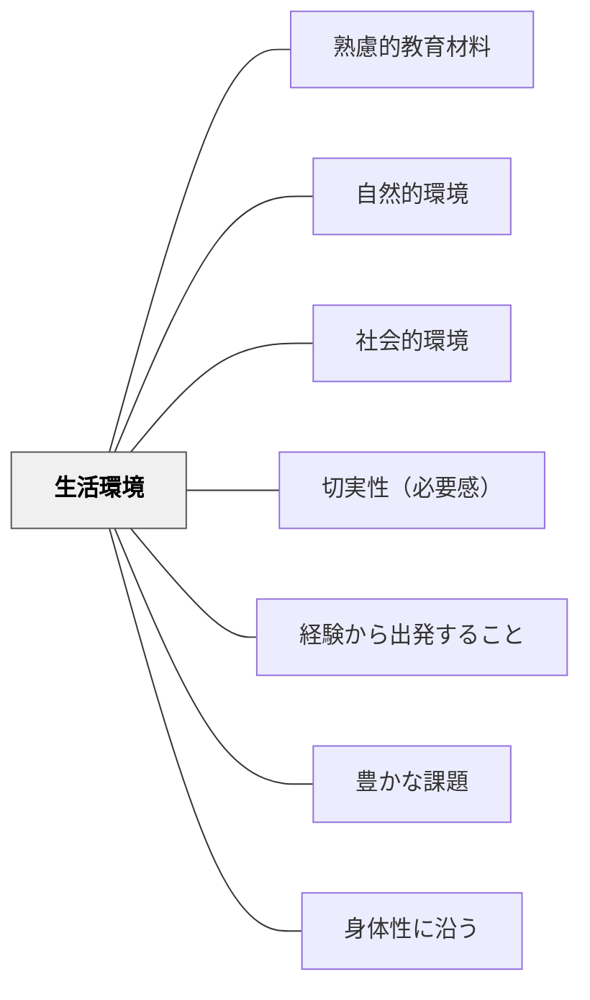

# 生活環境

> 生活する環境そのものが最も豊かな教育材料である。

## 背景（Context）

牧口常三郎は、人間が価値を創造するのは生活環境（自然的環境・社会的環境）との関わりを通じてであると主張した。学校の外にある生活環境——自然・地域・家庭・コミュニティ——は最大の教育材料であり、意図的に教育に取り込むことができる。

## 問題（Problem）

教育が学校・教室の中だけで完結しようとすると、学習内容が学習者の生活から切り離され、リアリティを失う。

## 力のかたち（Forces）

- 生活環境は学習者にとって最も身近で意味のある教材
- 生活環境の活用は切実性・必要感を自然に生む
- 学校外の環境は多様で統制が難しい

## 解決（Solution）

**学習者の日常の生活環境（家庭・地域・自然・社会）を教育材料として意図的に取り込む設計をする。**

## 結果（Consequences）

- 学習内容が学習者の生活と結びつき、意味を持つ
- 切実性・必要感が自然に高まる

## 関連パタン
- [[学級経営/学級経営で使えるパタン]]
- [[特別支援/特別支援で使えるパタン]]

- [[パタン/熟慮的教材教具]] — 親パタン
- [[パタン/自然的環境]] — 生活環境の下位パタン
- [[パタン/社会的環境]] — 生活環境の下位パタン
- [[パタン/切実性（必要感）]] — 生活から生まれる必要感

- [[パタン/経験から出発すること]] — 生活環境の体験が学びの起点になる
- [[パタン/豊かな課題]] — 生活環境を核にした豊かな課題設計
- [[パタン/身体性に沿う]] — 生活環境への身体的関与が理解を深める

## クラスター図

## Actionable Insight

- 授業の最初に「今日の学習内容は、あなたの日常のどこで見られるか？」と問いかける——生活との接続が意味感と切実性を自然に生む
- 地域・家庭・自然への「取材」課題（写真・観察・インタビュー）を出す——学校外の生活環境を教材化することで、学習内容がリアルな文脈を獲得する
- 「授業で学んだことを日常で発見したら記録してくる」課題を設ける——往還的な学習が生活と教科の間に橋をかけ、学習の転移を促す

## 出典

- 牧口常三郎（1972）『牧口常三郎全集第4巻 創価教育学体系 上』聖教新聞社
