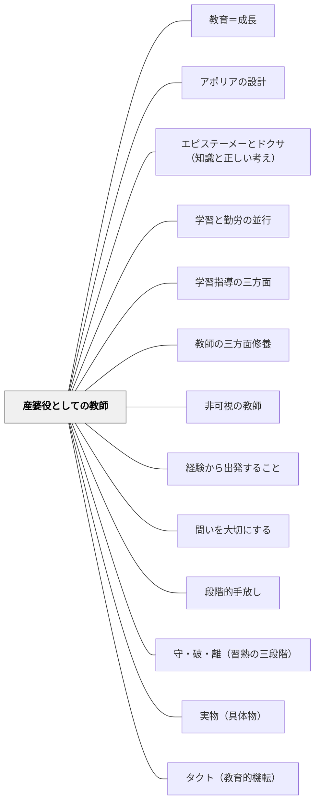

# 産婆役としての教師

> 知識は伝達し得べからず——ソクラテス（牧口常三郎引用）

## Pattern Connection

### 牧口常三郎（1931）——教師の本務の歴史的進化三段階

牧口は *創価教育学体系 第3巻* において、教師の本務が歴史的に三段階を経て進化してきたと論じる。

**第一期**：書物の希少な時代。教師は知識の唯一の貯蔵庫（「知識包蔵者」）として、書物の代わりに機能した。教師が話す＝書物を読むことと等価だった。

**第二期**：印刷術の発達で書物が普及した後。ペスタロッチに代表される実物教授の時代。教師は実物・標本・模型を教室に持ち込み、直接体験の媒介者となった。

**第三期（現代）**：自然・社会環境そのものが「教材」になる時代。教師はもはや知識の供給者でも実物の提供者でもなく、**補導者・誘導者・産婆役**として機能する。学習者自身が自然・社会の中で経験し、自ら概念を構成するのを助ける存在へと変わる。

牧口はソクラテスの言葉を引いてこの転換を説明する：「知識は伝達し得べからず」。知識は外から注ぎ込まれるのではなく、被教育者が自ら概念を再構成することでのみ成立する。だから教師の仕事は「教えること（知識供給）」ではなく「学習者が概念を産む（構成する）のを助けること（産婆）」である。

**既存パタンとの関連**
- **他のパタンへの波及**：[[パタン/問いを大切にする]]（産婆役の主な道具は「問い」である）・[[パタン/段階的手放し]]（産婆役は徐々に手放すプロセスの最終形）

### プラトン『メノン』（前387年頃）——アナムネーシス（想起説）：産婆役の哲学的根拠

プラトン『メノン』（81a〜86b）は、産婆役としての教師が「なぜ機能するのか」という哲学的根拠を与える最古の文献である。

ソクラテスは字も読み書きも習っていない召使いの少年を連れてきて、問答のみで幾何学の問題を解かせる（82a〜86b）。ここでソクラテスが言う：

> 「わたしのほうではかれに問うのみで教えない。」（84c）

そして少年が正しい答えに至った後、こう問う：「かれが自分でもともと知っていたのか、それともわれわれが教えたのか？」——答えは「内側から想起した」である。

**アナムネーシス（想起説、81a〜e）：**
ソクラテスは「魂は不死であり、すべてを見てきた」という想起説でこの問いに答える。実践的な意味は：

- 人間は生まれながらに知識の「種」を持っている
- 教育とは「種を植える」ことでなく「すでにある種を芽吹かせる」こと
- だから教師が「教える」必要はなく、「産婆役」として問いかけるだけでよい

牧口常三郎が「知識は伝達し得べからず」とソクラテスを引いたとき（創価教育学体系 第3巻）、この想起説の実践的な核心を指していた。

**補強点**：産婆役の機能的定義（牧口の「学習指導の技師」）に、プラトンの想起説が哲学的根拠を加える——「なぜ教えないで問うのか」への答えが、アナムネーシスにある。

**波及するパタン**：[[パタン/アポリアの設計]] — 少年の問答はアポリアの設計の最も古い実演；[[パタン/エピステーメーとドクサ（知識と正しい考え）]] — 産婆役が引き出すべきはドクサでなくエピステーメーである；[[文献/メノン（プラトン）]] — 本統合の出典

---

### プラトン『プロタゴラス』（前387年頃）——社会全体が産婆役：「全員が徳の先生」

プラトン『プロタゴラス』（326d〜e）でプロタゴラスは、個別の教師の役割を超えた「社会全体が教師」という視点を示す。

> 「あらゆる人が徳の教師であるがゆえに、特別に誰かを名指しして徳の教師と呼ぶことができない。」（327e）

**プロメテウス神話（322c〜d）との接続：**
ゼウスはアイドース（恥・自制）とディケー（正義）を「すべての人間に」与えた——例外なく。これは全ての人間が道徳的素地を持つという宣言であり、「誰でも他者の徳を引き出す産婆役になれる」という根拠でもある。

**産婆役の拡張**：
- ソクラテスの産婆役：「問うのみで教えない」1対1の問答で内側の知識を引き出す
- プロタゴラスの拡張：親・教師・法律・社会全体という連鎖が、誰もが別の人の産婆役を担うシステム

**補強点**：産婆役の概念が「1対1の教師と学習者」から「社会的環境全体」へと広がる。授業設計の視点から見ると、「教師が産婆役をする」だけでなく、「クラス全体・ピア・学校外の環境」が学習者の概念形成を産み助けるシステムとして設計できる。

**波及するパタン**：[[パタン/教育＝成長]] — 社会全体が教育者である視点；[[文献/プロタゴラス（プラトン）]] — 本統合の出典

---

### 牧口常三郎（1930）——学習指導の技師：産婆役の機能的定義

牧口は *創価教育学体系 第4巻*（教育方法論）において、教師の役割をより精密に「学習指導の技師」と位置づけた。産婆役の比喩を機能的に展開し、教師の優劣を「教師の活動量」ではなく「学習者の活動量」で測ることを明言した。

**知識の切り売り師 vs 学習指導の技師**

牧口は教師の二類型を対比する：「知識の切り売り師」は教材内容を一方向的に渡すだけだが、「学習指導の技師」は学習者が認識・評価・創価するプロセスを設計・支援する。この「技師（エンジニア）」としての教師像は、産婆役の概念を機能的・工学的に言い換えたものである。

**「自分が踊るより児童を踊らせる」**

牧口は第4巻 第七編で明言する：

> 「教え方の巧拙とは教師の活躍分量の多きを云うのではなくて、児童の活動の多量のを云うことを忘れてはならぬ。」

そして「自分が踊るよりは児童を踊らせることの巧妙なるもの」が良い教師だと示した。これは産婆役の役割定義「教師は消えて学習者が主役になる」（[[パタン/非可視の教師]]）と同じ原理を牧口が独自に定式化したものとして読める。

**教師活動の四段階（目的×手段マトリックス）**

牧口は教師と学習者の「目的意識の有無」「手段の計画性の有無」を組み合わせた四段階を示した：

| 段階 | 内容 |
|---|---|
| 第一段 | 教師は目的意識あり・無計画。学習者は目的なし・無計画 |
| 第二段 | 教師は目的あり・計画的。学習者は目的なし・無計画 |
| 第三段 | 教師が合理的活動の上に学習者を有目的の活動へ導く |
| 第四段 | 学習者をして明目的・計画的に活動させる——教師も合理的 |

第四段が最高水準であり、「学習者自身が目的を持って計画的に動ける」状態こそ産婆役が実現すべき姿である。

- **他のパタンへの波及**：[[パタン/学習指導の三方面]]（三作用の指導技術が技師の具体的仕事）・[[パタン/非可視の教師]]（「自分が踊るより児童を踊らせる」は非可視性の実践格言）

---

## 背景（Context）

教室には一人の教師と多くの学習者がいる。教師は何かを「教える」人であり、学習者は「教わる」人だという前提が長く続いてきた。しかし情報へのアクセスが豊かになり、環境そのものが教材になる今日、教師が知識の唯一の供給者であるという役割は歴史的使命を終えつつある。

## 問題（Problem）

教師が「知識を与える人」として立ち続けると、学習者の自発的な概念形成が阻まれる。知識は外から流し込めるという前提のもとで設計された授業は、学習者を受動的にし、学んだ内容は理解ではなく「形だけの記憶」として蓄積される。「知識は伝達し得べからず」——学習者自身が概念を再構成しなければ、学びは起きていない。

## 力のかたち（Forces）

- 知識は「受け取るもの」ではなく「構成するもの」である（構成主義的原理）
- 教師が先に答えを示すと、学習者の概念構成プロセスを奪う
- 教師が完全に退くと、学習者は方向を失い、概念を誤って構成するリスクがある
- 学習者ごとに「今どこにいるか」が違うため、一斉指導だけでは個別の概念構成を助けられない
- 産婆役の教師は「問い」「観察」「介入のタイミング」の熟練を必要とする

## 解決（Solution）

**教師は知識の「供給者」から学習者が知識を「産む」のを助ける「産婆役」へとシフトする。環境・課題・問いを設計し、学習者の概念構成プロセスを観察し、必要なときにだけ最小限の介入をする。**

産婆役の教師が行う主要な仕事：

1. **環境を設計する**——学習者が自然・社会・本物の問題と接触できる状況をつくる
2. **問いを投げる**——答えを教えず、思考を引き出す問いかけをする
3. **観察する**——学習者がどの概念を構成しようとしているかを見続ける
4. **タイミングよく介入する**——行き詰まった時・誤方向に進んだ時だけ最小の助けを与える
5. **自ら退く**——学習者が概念を構成できた瞬間に身を引く

---

**具体例1：算数の概念形成**

「三角形の面積の求め方」を教えるとき、産婆役の教師は公式から始めない。様々な三角形の紙を渡し「この三角形の面積を何とかして調べてみよう」と問いかける。ハサミで切って組み替える子、長方形に変形する子、ます目で数える子——それぞれの方法を発表させ、「どれも同じ答えになるのはなぜだろう」と問う。概念は学習者自身が産む。

**具体例2：読書後の問いかけ**

物語を読んだ後「主人公の気持ちはどうだったでしょうか」（答えを引き出す）ではなく、「この場面で主人公が◯◯したのはなぜだと思う？」と問う。教師は学習者の答えを肯定・否定せず「それはどこから分かった？」「他の人はどう思う？」と問い返す。学習者が解釈を構成する過程を助ける。

**具体例3：理科の観察**

植物の成長を観察する授業で、教師が先に「植物は光合成する」と説明するのではなく、日向と日陰の植物を用意して「どっちが元気そう？なぜ？」と問う。学習者が自分の仮説を立て、観察し、概念を構成するプロセスに立ち会う。

## 結果（Consequences）

- 学習者が「教わった」ではなく「自分で分かった」という体験をする
- 概念の定着が深まり、応用場面での転移が起きやすくなる
- 学習者の内発的動機が高まる（自分で考えた・自分で気づいた、という充実感）
- 教師は「全部教えなければ」というプレッシャーから解放され、観察・介入の熟練に集中できる
- 当初は「もっと教えてほしい」という抵抗が学習者から出ることがある

## 関連パタン
- [[パタン/教育＝成長]]
- [[パタン/アポリアの設計]]
- [[パタン/エピステーメーとドクサ（知識と正しい考え）]]
- [[パタン/学習と勤労の並行]]
- [[パタン/学習指導の三方面]]
- [[パタン/教師の三方面修養]]

- [[パタン/非可視の教師]] — 産婆役は「非可視の教師」の歴史的・理論的先駆け
- [[パタン/経験から出発すること]] — 「直観なき概念は不毛」——産婆役が助けるのは直観から概念への構成プロセス
- [[パタン/問いを大切にする]] — 産婆役の主な道具は「答えを与えない問い」
- [[パタン/段階的手放し]] — 産婆役は「足場を外す」最終形；学習者が自立したとき退く
- [[パタン/守・破・離（習熟の三段階）]] — 「守」段階では型を示すが、「破・離」への移行は学習者自身が行う
- [[パタン/実物（具体物）]] — 教師本務の第二段階（実物教授）の発展形として第三段階（産婆役）がある
- [[パタン/タクト（教育的機転）]] — 産婆役の「タイミングよく介入する」を可能にする瞬時判断力がタクトである

## クラスター図

## Actionable Insight

- 授業で「答えを教えた場面」と「学習者が自分で答えを見つけた場面」を記録してみる——産婆役の比率を把握することが出発点
- 学習者に質問されたとき、即座に答えを言う前に「どう思う？」「まず考えてみて」と一度返す——「知識は伝達し得べからず」を実践する最小単位
- 単元の終わりに「今日学んだことを自分の言葉で説明してみよう」と問う——自分で言語化するプロセス自体が概念構成であり、産婆役の仕事はここに集約される

## 出典
- [[文献/創価教育学体系 4（牧口常三郎）]]
- [[文献/創価教育学体系 3（牧口常三郎）]]
- [[文献/メノン（プラトン）]] — アナムネーシス（想起説）：「問うのみで教えない」の哲学的根拠
- [[文献/プロタゴラス（プラトン）]] — 「全員が徳の先生」：社会全体が産婆役を担うシステム

牧口常三郎（1931/2017）『創価教育学体系 第3巻（教育改造論）』聖教新聞社（電子版）

> 「知識は伝達し得べからず」——ソクラテス（牧口常三郎引用）

> 「教育の任務は知識の供給にあらずして、知識の構成の指導にある」——牧口常三郎
