# 産婆役としての教師

> 知識は伝達し得べからず——ソクラテス（牧口常三郎引用）

## Pattern Connection

### 牧口常三郎（1931）——教師の本務の歴史的進化三段階

牧口は *創価教育学体系 第3巻* において、教師の本務が歴史的に三段階を経て進化してきたと論じる。

**第一期**：書物の希少な時代。教師は知識の唯一の貯蔵庫（「知識包蔵者」）として、書物の代わりに機能した。教師が話す＝書物を読むことと等価だった。

**第二期**：印刷術の発達で書物が普及した後。ペスタロッチに代表される実物教授の時代。教師は実物・標本・模型を教室に持ち込み、直接体験の媒介者となった。

**第三期（現代）**：自然・社会環境そのものが「教材」になる時代。教師はもはや知識の供給者でも実物の提供者でもなく、**補導者・誘導者・産婆役**として機能する。学習者自身が自然・社会の中で経験し、自ら概念を構成するのを助ける存在へと変わる。

牧口はソクラテスの言葉を引いてこの転換を説明する：「知識は伝達し得べからず」。知識は外から注ぎ込まれるのではなく、被教育者が自ら概念を再構成することでのみ成立する。だから教師の仕事は「教えること（知識供給）」ではなく「学習者が概念を産む（構成する）のを助けること（産婆）」である。

**既存パタンとの関連**
- **他のパタンへの波及**：[[パタン/問いを大切にする]]（産婆役の主な道具は「問い」である）・[[パタン/段階的手放し]]（産婆役は徐々に手放すプロセスの最終形）

### プラトン『メノン』（前387年頃）——アナムネーシス（想起説）：産婆役の哲学的根拠

プラトン『メノン』（81a〜86b）は、産婆役としての教師が「なぜ機能するのか」という哲学的根拠を与える最古の文献である。

ソクラテスは字も読み書きも習っていない召使いの少年を連れてきて、問答のみで幾何学の問題を解かせる（82a〜86b）。ここでソクラテスが言う：

> 「わたしのほうではかれに問うのみで教えない。」（84c）

そして少年が正しい答えに至った後、こう問う：「かれが自分でもともと知っていたのか、それともわれわれが教えたのか？」——答えは「内側から想起した」である。

**アナムネーシス（想起説、81a〜e）：**
ソクラテスは「魂は不死であり、すべてを見てきた」という想起説でこの問いに答える。実践的な意味は：

- 人間は生まれながらに知識の「種」を持っている
- 教育とは「種を植える」ことでなく「すでにある種を芽吹かせる」こと
- だから教師が「教える」必要はなく、「産婆役」として問いかけるだけでよい

牧口常三郎が「知識は伝達し得べからず」とソクラテスを引いたとき（創価教育学体系 第3巻）、この想起説の実践的な核心を指していた。

**補強点**：産婆役の機能的定義（牧口の「学習指導の技師」）に、プラトンの想起説が哲学的根拠を加える——「なぜ教えないで問うのか」への答えが、アナムネーシスにある。

**波及するパタン**：[[パタン/アポリアの設計]] — 少年の問答はアポリアの設計の最も古い実演；[[パタン/エピステーメーとドクサ（知識と正しい考え）]] — 産婆役が引き出すべきはドクサでなくエピステーメーである；[[文献/メノン（プラトン）]] — 本統合の出典

---

### プラトン『プロタゴラス』（前387年頃）——社会全体が産婆役：「全員が徳の先生」

プラトン『プロタゴラス』（326d〜e）でプロタゴラスは、個別の教師の役割を超えた「社会全体が教師」という視点を示す。

> 「あらゆる人が徳の教師であるがゆえに、特別に誰かを名指しして徳の教師と呼ぶことができない。」（327e）

**プロメテウス神話（322c〜d）との接続：**
ゼウスはアイドース（恥・自制）とディケー（正義）を「すべての人間に」与えた——例外なく。これは全ての人間が道徳的素地を持つという宣言であり、「誰でも他者の徳を引き出す産婆役になれる」という根拠でもある。

**産婆役の拡張**：
- ソクラテスの産婆役：「問うのみで教えない」1対1の問答で内側の知識を引き出す
- プロタゴラスの拡張：親・教師・法律・社会全体という連鎖が、誰もが別の人の産婆役を担うシステム

**補強点**：産婆役の概念が「1対1の教師と学習者」から「社会的環境全体」へと広がる。授業設計の視点から見ると、「教師が産婆役をする」だけでなく、「クラス全体・ピア・学校外の環境」が学習者の概念形成を産み助けるシステムとして設計できる。

**波及するパタン**：[[パタン/教育＝成長]] — 社会全体が教育者である視点；[[文献/プロタゴラス（プラトン）]] — 本統合の出典

---

### クセノフォン（前370年代）——実践的・日常的な産婆役の実例

クセノフォン『ソクラテスの思い出』（相澤拓訳、光文社古典新訳文庫 2022）は、プラトンの対話篇とは異なり、**アゴラ・体育場・職人の工房**という日常的な場で実践される産婆役の姿を描く。ソクラテスは「人間に関わりのある事柄」に集中し、相手の具体的な状況から出発して普遍的な原理を引き出す。

**アリスティッポスとの対話（第一巻第五章）——欲望から自制へ**

快楽主義者アリスティッポスに対し、ソクラテスは「支配する能力を育てる教育とは何か」を問う。直接「自制が大切だ」と言うのではなく、こう始める：

> 「君が二人の若者を預かって、一方は支配する能力を身につけるように…教育しなければならないとしたら、それぞれをどんなふうに教育するだろうか？つまり食べ物のことから始めて、一緒にこの問題を考えてみようか？」

食欲→飲欲→睡眠→性欲と段階的に問いを連鎖させながら、アリスティッポス自身が「自制が支配能力の基礎だ」という結論に至るように導く。**教えない、問うのみ**——これが実践的文脈での産婆役の典型。

- **既存パタンとの関連**：プラトンの『メノン』における幾何学の問答（抽象的・教室的文脈）に対し、クセノフォンのアリスティッポスとの対話は人生の選択・職業・欲望という**日常的文脈**での産婆役の実例を提供する。どちらも「問うのみで教えない」という点で同型だが、クセノフォンのほうが教師の日常実践に近い。
- **補強された点**：産婆役は「相手の具体的な状況」から出発することで機能する——「支配する能力を育てたいなら、食べ物の話から」というソクラテスのアプローチは、抽象論ではなく相手が住む具体的な世界から入ることの重要性を示す。
- **波及するパタン**：[[パタン/エンクラテイア（自制の鍛錬）]] — アリスティッポスとの対話の内容的核心；[[パタン/ヘラクレスの岐路]] — 産婆役の道具としての物語技法；[[文献/ソクラテスの思い出（クセノフォン）]] — 本統合の出典

---

### プラトン『テアイテトス』（前369年頃）——産婆術（マイエウティケー）の最も詳しい記述（148e〜151d）

『テアイテトス』は、プラトンの対話篇の中で産婆術を最も詳しく・直接的に論じる文献である。ソクラテスは自分の仕事を産婆にたとえてその構造を明示する。

> 「わたしがおこなっている助産の技術には……かれらの魂が生むのを見守るのであって……最大の特徴として……若者の思考がみかけだけのもので虚偽を生み出しているのか、それとも、実質のある真正なものを生み出しているのかを、あらゆる仕方で吟味することができる。」（150b〜c）

**吟味（バサニゼイン）——産婆役の核心（150b〜c）：**
産婆術の最大の特徴は「産み物が本物か偽物かを吟味する（バサニゼイン）」ことにある。

| 産婆術の機能 | 内容 |
|---|---|
| 吟味（バサニゼイン） | 学習者の思考が「見かけだけの虚偽」か「実質のある真正なもの」かを見極める |
| 流産させる | 偽物の考えを除去する（「それは本当か？」と問い返し、見かけだけを崩す） |
| ともに喜ぶ | 本物の自己発見を学習者のものとして承認する |

**「産婆役は何も知らない」という逆説（149a）：**
ソクラテスは「自分自身は知恵の点では不毛（アゴノス）——自分では何も産まない」と言う。産婆役は知識を持たないが、他者が知識を産む手助けをする——これは牧口の「知識は伝達し得べからず」という命題の哲学的根拠の更なる深化である。

**補強点**：産婆役の機能が「問うのみで教えない」（メノン 84c）から「本物か偽物かを吟味する（バサニゼイン）」へと精密化される。より優れた産婆役とは、「正しい答えを引き出す人」ではなく「学習者の思考の真偽を吟味できる人」である。

**波及するパタン**：[[パタン/省察]] — 吟味（バサニゼイン）は教師の省察の実践形態；[[パタン/タウマゼイン（驚きから始まる探究）]] — 産婆術の前提に「驚き（タウマゼイン）」がある：驚いた魂が産む知識を助ける；[[パタン/エピステーメーとドクサ（知識と正しい考え）]] — 吟味するのは「ドクサ（正しい考え）」か「エピステーメー（知識）」かの見極めである；[[文献/テアイテトス（プラトン）]] — 本統合の出典

---

### プラトン『ゴルギアス』（前380年頃）——哲学者は真の政治家：産婆役の政治的定義（521d）

『ゴルギアス』の終盤でソクラテスは対話者カリクレスに、自分自身の立場を宣言する：

> 「わたしは、おそらくアテネの市民のうちで、真実の政治術に取り組んでいる数少ない者のひとりだ、いや、唯一の者かもしれない。」（521d）

**「真の政治術 = 魂の産婆役」：**

ソクラテスが言う「真の政治術」とは弁論術（コラケイア）の対極にある——市民の欲望を満たすことでなく、市民の魂を善くすること。これは産婆役の政治的・社会的拡張である：

| 偽の政治家（コラケイア型） | 真の政治家（テクネー型・産婆役型） |
|---|---|
| 市民が喜ぶことをする（快楽提供） | 市民の魂を善くすることをする（産婆役） |
| 弁論術で説得する（信念を生む） | 対話の吟味で問い直す（知識を産ませる） |
| 短期的に人気がある | 短期的には嫌われることがある |
| 最終的に陶片追放される（ペリクレス） | 真の意味で市民に貢献する |

**補強点**：産婆役の社会的・政治的次元の追加。牧口の「1対1の産婆役」・プロタゴラスの「社会全体が産婆役」に続き、『ゴルギアス』は「真の産婆役は真の政治家でもある」という次元を加える。教師の仕事は単なる授業設計でなく、「市民の魂を善くする」という政治的使命を持つ。

**コラケイアとの対比（教師論として）**：
コラケイア型の教師（弁論術師型）：生徒を喜ばせる授業→その場の評判は高い→しかし生徒の力がつかない
テクネー型の教師（産婆役型）：生徒を本当によくする授業→短期的に嫌われることもある→しかし長期的に力がつく

**波及するパタン**：[[パタン/コラケイア（おべっか）]] — 産婆役はコラケイアの正反対；[[文献/ゴルギアス（プラトン）]] — 本統合の出典

---

### プラトン『饗宴』（前380年頃）——心の妊娠：産婆役の深層哲学（206b–209e）

『饗宴』でディオティマがソクラテスに語った「エロスの働き」は、産婆役の哲学的根拠をさらに深める。

**「美しいものの中で子をなすこと」（206b–207a）：**

> 「心の中に宿している子とは、知恵をはじめとするさまざまな徳です。そのような徳を心に宿す者は、しかるべき年齢になると、子を生むことを欲するようになります」——ディオティマ（209a）

- 「人間はみな子を宿している」——すべての学習者はすでに「産む力」を持っている
- 美しい文脈（よい問い・安心できる環境・エロス的な教師の姿勢）に出会うと、穏やかになり「心の子」を生む
- 醜い・敵対的・プレッシャーの強い文脈では「子」を生めない

これは産婆役の機能的定義（牧口）と哲学的根拠（メノン・想起説）に加えて、**産婆役が機能するための環境的条件**を与える：産婆役が有効に働くのは「美しい（＝心理的に安全で、問いが活きている）」学習環境においてのみである。

**ダイモン（精霊）としての教師（202d–203a）：**
ディオティマはエロスを「神と人間の間を媒介する精霊（ダイモン）」として定義する——神々の思いを人間に届け、人間の祈りを神々に届ける翻訳者・橋渡し人。産婆役の教師はこのダイモン的媒介者の現代的形態である：

| ダイモンの働き | 産婆役教師の対応 |
|---|---|
| 高次の知を低次の言葉に翻訳する | 抽象的概念を学習者が触れられる問いに変換する |
| 人間の祈りを神々に届ける | 学習者の問いを深い問いへと育てる |
| 神と人間の「間」に立つ | 知識と無知の「間」にいる学習者に寄り添う |
| 全宇宙を一体化させる | 学習者が世界とつながる感覚を作る |

**「知識は流れるか」という問いへの答え（174d–175e）：**
宴会の冒頭でアガトンが「触れ合えば知恵が流れてくる」と言うと、ソクラテスはすぐに問い返す——「コップの水のように流れるなら、満ちた側から空っぽの側に流れるはず。残念ながら知恵はそのようには流れない」。これは「知識は伝達し得べからず」（牧口）の哲学的な先行表現であり、産婆役の必要性そのものを示す：知恵は受け渡せないから、産婆役が必要なのだ。

**補強点**：産婆役が機能するための「環境条件（美しい文脈）」を明示する。産婆役技術（問い・観察・介入）だけでなく、「美しい学習環境の設計」が産婆役の前提条件であることが明らかになる。

**波及するパタン**：[[パタン/美の梯子（エロスの道）]] — ディオティマの美の梯子は産婆役の「指導者が正しく導くなら」という役割を段階的に具体化したもの；[[文献/饗宴（プラトン）]] — 本統合の出典

---

### プラトン『パイドン』（前380年頃）——アナムネーシスの完全版と魂の配慮（72e–77a, 107c–d）

『パイドン』は、アナムネーシスを最も詳細に展開し、産婆役の哲学的根拠をさらに精密化する。

**「欠如」が想起を起動する構造（74d–75a）：**

メノンでの想起説では「少年が内側から思い出す」という事実だけが示された。パイドンでは、なぜ想起が起きるかの**メカニズム**が与えられる。

「等しい石や木」を見ると「等しさそれ自体（等しさのイデア）」を思い浮かべる。なぜか——感覚的な等しいものは、等しさのイデアに「**欠けるところがある（エンデイン）**」から。欠如を認識した瞬間、欠けていないもの（イデア）への想起が起動する。

> 「私たちが『学ぶ』と呼んでいることは、自分の本来の知識を再び得ることなのではないか。きっと、これを『想起する』と言うのが、正当な言い方ではないか。」（75e）

**産婆役の設計原理への示唆（「欠如からの想起」）：**

| 産婆役の働き | アナムネーシスの構造 |
|---|---|
| 問うのみで教えない（84c）| 感覚物が「欠けている」と気づかせる |
| アポリアを評価する | 欠如の自覚が想起の入口 |
| 最小のヒントのみ与える | 欠けているものの方向を示す |
| 自ら退く | 学習者自身が想起を完成させる |

産婆役が機能する理由は「教師が知識を与えないから」ではなく、「感覚経験の欠如を学習者が自覚したとき、内側の知識（アナムネーシス）が自然に目覚めるから」である。

**「魂の配慮」という産婆役の究極目的（107c–d）：**

> 「魂は冥府に赴くにあたって教育と養育以外のなにものも伴うことはできない」（107c–d）

ソクラテスの最後の言葉は「配慮（epimeleia）を怠らないでくれ」（118a）——これは産婆役の目的が「成績」でも「技能」でも「評判」でもなく、**魂の質の向上（エピメレイア・プシューケース）**にあることの最終宣言である。産婆役の教師が問いかける理由は、最終的にここに帰着する。

**補強点**：メノン（想起説の初出）→テアイテトス（産婆術の詳細記述）→パイドン（欠如メカニズムの解明）という深化系列が完成する。「なぜ産婆役が機能するか」の哲学的根拠が「欠如からの想起」として精密化される。

**波及するパタン**：[[パタン/アナムネーシス（想起としての学び）]] — 欠如からの想起の完全展開；[[パタン/アポリアの設計]] — アポリアが欠如体験を設計する産婆役の具体的手順；[[文献/パイドン（プラトン）]] — 本統合の出典

---

### プラトン『ソクラテスの弁明』（前399年・執筆前390年代）——「アテネの虻（アブ）」：産婆役の政治的・宇宙的使命（30e–31a, 29d–30b）

『ソクラテスの弁明』は、産婆役の機能（牧口・メノン・テアイテトス）から一歩踏み込んで、その**使命の起源**を描く。なぜソクラテスは産婆役を続けるのか——神の命令だからである。

**「アテネの虻（アブ）」の比喩（30e–31a）：**

ソクラテスは自分の役割をポリスへの神の贈り物として語る：

> 「可笑しな言い方かもしれませんが、私は神によってポリスにくっ付けられた存在なのです。大きくて血統はよいが、その大きさゆえにちょっとノロマで、アブのような存在に目を覚まさせてもらう必要がある馬、そんなこのポリスに、神は私をくっ付けられたのだと思うのです。」（30e–31a）

「アテネの虻」：ポリス＝大きくて血統はよいが動きの鈍い馬。ソクラテス＝アブ——刺して目覚めさせる存在。この刺激がなければポリスは怠惰に眠り続ける。

**産婆役と「アブ」の統合：**

| 産婆役（メノン・テアイテトス） | アブ（ソクラテスの弁明） |
|---|---|
| 1対1の問答で内側の知識を引き出す | 社会・ポリス全体を目覚めさせる |
| 学習者の「産む力」を助ける | 眠っているポリスを刺して覚醒させる |
| 学習者の意志（産みたい）が前提 | 相手が望んでいなくても刺す |
| 技術（マイエウティケー）として機能 | 使命（神の命令）として機能 |

「アブの刺し」は産婆役の社会的・強制的な形態——「学習者が驚くことを望む前に、まず驚かせる」役割。

**魂への配慮（29d–30b）——産婆役の目的の言語化：**

弁明でソクラテスは「なぜ問い続けるか」を直接語る：

> 「金銭ができるだけ多くなるように配慮し、評判や名誉に配慮しながら、思慮や真理や、魂というものができるだけ善くなるようにと配慮せず、考慮もしないとは、恥ずかしくないのですか」（29d–e）

産婆役の究極目標は「魂ができるだけ善くなること（エピメレイア・プシューケース）」——この宣言が、牧口の「学習指導の技師」・プラトンの「産む手伝い」のすべてを貫く最終目的を与える。

**「哲学の子供たち」の継承（39c–d）：**

死刑判決後、ソクラテスはアテネ人に予言する：「私を死刑にしても、吟味する者はずっと多くなる」——自分を殺してもアブは消えない、神が別の者を送る。これは産婆役の連鎖的継承の宣言である。

**補強点**：産婆役は「1対1の技術（メノン・テアイテトス）」から「社会全体への神の使命（プロタゴラス・弁明）」まで重層的な機能を持つことが明らかになる。「産婆役の最深の形態」は技術でなく**使命（ミッション）**——「なぜ産婆役を続けるのか」の根拠をソクラテスは神の命令として持っていた。

**波及するパタン**：[[パタン/パレーシア（真実を語る勇気）]] — アブとしての産婆役は真実を語る勇気（パレーシア）を前提とする；[[パタン/道徳的自律]] — 「魂の配慮」が産婆役の目的の倫理的定義；[[文献/ソクラテスの弁明（プラトン）]] — 本統合の出典

---

### 牧口常三郎（1930）——学習指導の技師：産婆役の機能的定義

牧口は *創価教育学体系 第4巻*（教育方法論）において、教師の役割をより精密に「学習指導の技師」と位置づけた。産婆役の比喩を機能的に展開し、教師の優劣を「教師の活動量」ではなく「学習者の活動量」で測ることを明言した。

**知識の切り売り師 vs 学習指導の技師**

牧口は教師の二類型を対比する：「知識の切り売り師」は教材内容を一方向的に渡すだけだが、「学習指導の技師」は学習者が認識・評価・創価するプロセスを設計・支援する。この「技師（エンジニア）」としての教師像は、産婆役の概念を機能的・工学的に言い換えたものである。

**「自分が踊るより児童を踊らせる」**

牧口は第4巻 第七編で明言する：

> 「教え方の巧拙とは教師の活躍分量の多きを云うのではなくて、児童の活動の多量のを云うことを忘れてはならぬ。」

そして「自分が踊るよりは児童を踊らせることの巧妙なるもの」が良い教師だと示した。これは産婆役の役割定義「教師は消えて学習者が主役になる」（[[パタン/非可視の教師]]）と同じ原理を牧口が独自に定式化したものとして読める。

**教師活動の四段階（目的×手段マトリックス）**

牧口は教師と学習者の「目的意識の有無」「手段の計画性の有無」を組み合わせた四段階を示した：

| 段階 | 内容 |
|---|---|
| 第一段 | 教師は目的意識あり・無計画。学習者は目的なし・無計画 |
| 第二段 | 教師は目的あり・計画的。学習者は目的なし・無計画 |
| 第三段 | 教師が合理的活動の上に学習者を有目的の活動へ導く |
| 第四段 | 学習者をして明目的・計画的に活動させる——教師も合理的 |

第四段が最高水準であり、「学習者自身が目的を持って計画的に動ける」状態こそ産婆役が実現すべき姿である。

- **他のパタンへの波及**：[[パタン/学習指導の三方面]]（三作用の指導技術が技師の具体的仕事）・[[パタン/非可視の教師]]（「自分が踊るより児童を踊らせる」は非可視性の実践格言）

---

### ウィトゲンシュタイン（1921）論理哲学論考——語る/示す（Sagen/Zeigen）：産婆役の言語哲学的根拠

牧口常三郎が「知識は伝達し得べからず」と言い、プラトンが「問うのみで教えない」（メノン84c）と示した産婆役の本質を、ウィトゲンシュタインは『論理哲学論考』（1921）において言語哲学的に基礎づける。

**語ること（Sagen）と示すこと（Zeigen）の区別（4.12–4.121）：**

命題は事実を語ることができるが、命題と世界が共有する論理形式そのものは語られることができず、ただ示される（sich zeigen）のみ。

> 「命題はそれが世界と共有している論理形式を語りえない。命題はそれを示す。」（4.121）

この区別は産婆役の本質を言語哲学的に照らし出す：

| 語ること（Sagen） | 示すこと（Zeigen） |
|---|---|
| 知識の供給者が行うこと | 産婆役の教師が行うこと |
| 「正解はこうです」 | 学習者の思考プロセスを観察する |
| 手続き・定義を伝達する | 「どうして？」という問いを返す |
| 命題として語れるもの | 知恵・感性・学ぶ喜びを体現する |

**「はしごを捨てる」（6.54）——産婆役の究極形態：**

> 「私の命題はこのようにして解明となる。私を理解した者は、これらの命題によって—これらの命題の上に立って—これを乗り越えたとき、最終的にそれらを無意味と認識する。彼はいわばはしごを昇り終えた後にはしごを投げ捨てなければならない。」（6.54）

産婆役の教師が与えるすべての問い・言葉・足場は「はしご」である——学習者がそれを使って登り、登り終えたときに不要になるように設計される。これは牧口の「学習指導の技師」の第四段階（「学習者をして明目的・計画的に活動させる」）に対応する——教師の問い・足場が内面化されて不要になったとき、産婆役は完成する。

**「語りえないものが示される」（6.522）——産婆役が示すもの：**

知恵・学ぶことへの愛・問いを持ち続ける態度——これらは命題として語られえず、ただ示されるのみ（6.522）。産婆役の教師が最終的に伝えるべきものは、命題で語れるものではなく「示されるもの」である。ソクラテスが「知恵の点では不毛」（テアイテトス149a）でありながら他者の産みを助けられた理由がここにある——産婆役は「語る知識」を持たないが、「示す姿勢」を持っている。

**補強された点**：産婆役の本質が「語らない（語れない）から問う」という消極的定義から、「語りえないものを示す（zeigen）という積極的行為」として再定義される。牧口の「知識は伝達し得べからず」はSagen/Zeigenの区別で哲学的に根拠づけられ、「なぜ伝達できないのか」への言語哲学的な答えが与えられる。

**他のパタンへの波及**：[[パタン/語ることと示すこと（言語の限界）]] — 産婆役の実践論的展開；[[パタン/道徳的自律]] — 「魂の配慮」も語れず示されるのみ——倫理の超越論性（6.421）との接続；[[文献/論理哲学論考（ウィトゲンシュタイン）]] — 本統合の出典

---

### 結城浩（2013）数学ガールの秘密ノート——複数人対話による産婆役の多声化

結城浩の『数学ガールの秘密ノート／式とグラフ』は、産婆役の実践をソクラテス的な「1対1」からさらに拡張し、「複数のキャラクターが互いに産婆役を務め合う」という形態を文学的に描く。

**登場人物の役割分担：**

| キャラクター | 立場 | 産婆役としての機能 |
|---|---|---|
| 僕（高校2年） | 案内役・整理役 | ユーリやテトラの疑問に向き合い、問いを鮮明にする |
| ユーリ（中学2年・従妹） | 素朴な疑問者 | 「なんとなく分かる」にとどまらず「それってどういう意味？」と問い直す役割 |
| テトラちゃん（高校1年） | 真剣な探求者 | 答えを急がず定義・証明の論理を一歩ずつ確認していく |
| ミルカさん（高校2年） | 深化役 | 既に分かっている者として「もっと深い問い」を立てる |

この構造では、「教師（答えを知っている人）」が一人いて学習者に向かうのではなく、各人が**それぞれの理解水準と疑問の仕方**をもって対話に参加する。産婆役は固定的な役割でなく、場面によってキャラクター間で交互に担われる。

**「真剣に取り組む」という産婆役の前提（プロローグ）：**

> 「難しいかどうかは重要じゃない。解けるかどうかも重要じゃない。真剣に取り組み、真剣に考える。真剣に問いかけ、真剣に答える。共に過ごす体験そのものが、僕たちの新たな秘密となる。」（プロローグ）

この宣言はプラトン『饗宴』のディオティマが示した「美しい（安全で問いが活きている）文脈」の条件（産婆役が機能するための環境的前提）と同型である。難しさや正解ではなく「真剣な共同探求」が産婆役の場を生む。

**「言葉にしないのはずるい」——産婆役の言語的誠実さ：**

第4章で比例の定義を確かめる場面。ユーリが「バーンっと大きくなるイメージ」で分かったつもりでいると、僕は「議論するからには、しっかり言葉にしなくちゃ」と返す。これはウィトゲンシュタインの「語りえないものを示す（zeigen）」の逆方向——「示すだけでなく言語化できるものは言語化しなければならない」という産婆役の誠実さの表明である。

**補強された点**：産婆役が1対1・教師と学習者の関係だけでなく、「複数の学習者が互いに産婆役を担い合う」形態でも機能することが示される。授業設計の視点では、「一斉的な産婆役（教師が全員に問う）」に加えて「分散的な産婆役（学習者同士が互いに問い合う）」という設計可能性が開かれる。

**他のパタンへの波及**：[[パタン/定義から始める（言葉を厳密にする）]]（本統合の新規パタン）；[[文献/数学ガールの秘密ノート式とグラフ（結城浩）]]

---

### 結城浩（2013）数学ガールの誕生——「最大の報酬は『なるほど』」と「水を向ける」産婆役

結城は『数学ガールの誕生』で、産婆役として機能する教師の技法と動機を具体的に語る。

**「良い素材・発見させる・肯定的に受け止める」の三点セット（p.79–80）：**

| ステップ | 内容 | 産婆役との対応 |
|---|---|---|
| 良い素材を与える | 発見が起きうる豊かさを持つ素材を選ぶ | 「美しい文脈」（饗宴206b）の設計 |
| 発見させる | 答えを渡さず、発見が起きるのを待つ | 「問うのみで教えない」（メノン84c） |
| 肯定的に受け止める | 何を言っても最初は受け止める | 「産み物を承認する」産婆役の機能 |

**「水を向ける」産婆役の技法（p.79）：**

> 「ここに、こんなものがあるよ。先生は三個くらいおもしろいこと見つけたんだけど、他にもあるのかなあ」——結城（2013）が描く「ガイドさん」の語りかけ

これはソクラテスの「問うのみで教えない」（メノン84c）の現代的な実践形態である。「先生も見つけた（3つ）」という共有が「自分も見つけられるかもしれない、先生を出し抜けるかもしれない」という探索欲を引き出す。答えを先に渡さず、発見が生まれる「間」を保つことが産婆役の核心技術である。

**「最大の報酬は『なるほど』」——産婆役の動機（p.252）：**

> 「教師の最大の報酬、それは生徒の『なるほど』という言葉です。教師が教えると、生徒が目を輝かせて『なるほど! そういうことだったの、先生!』と言う。これが最高の報酬です。」——結城（2013）

産婆役としての教師の動機は、学習者の「なるほど」という瞬間に立ち会うことにある。この動機軸を持つとき、教師は「教えた量」ではなく「学習者の腑落ちの瞬間の数」を目標にできる。

**「編集者は産婆役」——産婆役の普遍性（p.221–222）：**

> 「編集者は産婆さんみたいなものです。編集者は作品を産むわけではない。産むのはあくまで著者です。でも作品を産むときに非常にクリティカルな一手を出してくれたりする。」——結城（2013）

産婆役の機能は教師と学習者の間だけでなく、編集者と著者、コーチと選手、「産む」プロセスすべてに現れる。「最後に産むのは本人」「産む手伝いをする者は産まない」という構造は普遍的である。

- **補強された点**：産婆役の「動機の軸」が「最大の報酬は『なるほど』」として言語化される。産婆役を続ける理由が、テクニックでなく「腑落ちの瞬間への愛」にあることが明確になる。
- **他のパタンへの波及**：[[パタン/発見を委ねる（自分で見つけたものこそ燃え上がる）]]（「水を向ける」技法の心理的根拠）；[[文献/数学ガールの誕生（結城浩）]]

---

### 鶴見俊輔（2010）思い出袋——「黒い丸の中の白い丸」：予期しない解を感心して受け取る産婆役

鶴見俊輔は『思い出袋』（2010）で、産婆役として機能する教師の態度を「黒い丸の中の白い丸」というエピソードで具体的に示した。

**「黒い丸の中の白い丸」——予期しない解への開かれ（思い出袋 第4知見）：**

算数の授業で先生が「丸を書いて」と言ったとき、一人の子が黒く塗りつぶした中に白い丸を残した。

> 「先生は、じっと立って感心していた。抽象にはいろいろある。自分の出した問題は一つではない。その答えも一つではないはずだ」——鶴見（2010）

この「じっと立って感心していた」先生の姿勢は、産婆役の核心的な態度である。

結城浩（2013）が「良い素材・発見させる・肯定的に受け止める」の三点セットで産婆役を描いたとすれば、鶴見はそのうち「肯定的に受け止める」の深みを「じっと立って感心する」という体で示す。

| 産婆役の態度 | 「黒い丸の中の白い丸」エピソードでの実現 |
|---|---|
| 良い素材を与える | 「丸を書いて」——一義的に見えるが複数の抽象が可能な問い |
| 発見させる | 先生は塗りつぶし方を指示しなかった |
| 肯定的に受け止める | 「じっと立って感心していた」——修正せず、驚きとともに受け取る |

産婆役が「生み出されたものが本物かどうかを吟味する（バサニゼイン）」（テアイテトス150b）とすれば、「黒い丸の中の白い丸」エピソードはその吟味の結果を「これは本物だ」として受け取る最良の例である。先生は「それは間違い」でなく「抽象には複数の形がある」と気づいた——これが産婆役の吟味の完成形である。

**「抽象にはいろいろある。自分の出した問題は一つではない」——問いの複数性の自覚：**

この先生の言葉（鶴見の解釈）は、産婆役の教師が自分の問いを「唯一の正解を持つ問い」ではなく「複数の解が可能な開いた問い」として保つことの重要性を示す。「先生の心の中にある唯一の正しい答えを念写させる」構造の対極に「じっと立って感心する」産婆役が立つ。

**「念写しない産婆役」——制度的批判としての産婆役論：**

鶴見は「念写する優等生＝転向の常習犯」という批判で、産婆役が機能しない構造を描いた。「先生の正解を念写させる」教育は産婆役の否定形である。逆に「じっと立って感心する」先生は、「答えを持つ人（念写の対象）」ではなく「産まれるものを驚きとともに受け取る人（産婆役）」として立っている。

- **補強された点**：産婆役の「肯定的に受け止める」という態度が、「じっと立って感心する」という具体的な身体的姿勢として記述された。テクニック（問い方・介入のタイミング）ではなく、教師の「驚きの姿勢」そのものが産婆役の最も重要な要素であることが明確になる。
- **修正・拡張された点**：産婆役は「学習者が正解に至るのを助ける」だけでなく、「予期しない解を感心して受け取り、それを通じて自分の問いの複数性に気づく」という教師自身の学びを含む。産婆役は「教師を育てる」。
- **他のパタンへの波及**：[[パタン/念写しない（自分の問いを守る）]] — 「じっと立って感心する先生」の存在が「念写させない」文化を生む；[[パタン/タウマゼイン（驚きから始まる探究）]] — 先生の「じっと立って感心する」はタウマゼインの教師版；[[文献/思い出袋（鶴見俊輔）]] — 本統合の出典

---

### Kern（2026）——instructionの場：産婆役の対をなす知識伝達の形式

Andrea Kern *Wittgenstein and Skepticism*（2026）は、Stanley CavellのScenes of instruction（instructionの場）という概念を、知識-能力論と接続して教育理論として展開する。

**instructionの場（OC 374）：**

> 「子どもに『これがあなたの手だ』と教える。決して『これがおそらくあなたの手だ』とは教えない。それがどのように子どもが手に関する無数の言語ゲームを学ぶかである。」（OC 374）

instructionの場とは、知識が疑いなく「手渡される」場である。子どもは「これがあなたの手だ」という断定を通じて「手」という概念の言語ゲームを学ぶ——「おそらく手だと思う」と伝えられた場合、子どもはその概念を学べない。子どもはここで「手とは何か」だけでなく「こうして他者から学ぶことができる」という知識習得の形式も同時に学ぶ。

**産婆役とinstructionの場——二つの形式の対：**

産婆役（ソクラテス的問答）とinstructionの場は、形式的に対をなす：

| | 産婆役（マイエウティケー） | instructionの場 |
|---|---|---|
| 適用 | 学習者が内側に潜在的に持っている知識 | 学習者がまだ持っていない知識・概念 |
| 方法 | 問い——「これはなぜ？」「本当に？」 | 断定——「これがAだ」「これはBと呼ぶ」 |
| 疑いの役割 | アポリアを設計する（疑いを起こす） | 疑いを組み込まない（学習を可能にする） |
| 目的 | 潜在知識の顕在化 | 新しい能力の形成 |

**「疑いなき手渡し」の教育的意味：**

「これがあなたの手だ」と断定することは独断（ドグマティズム）ではない——それが学習を可能にする形式なのである。「正しいかどうかわからないけど」と留保することは、謙虚さではなく「学習の場の構造を壊す行為」になりうる。

ただし産婆役とinstructionの場は場面に応じて使い分ける：
- 子どもが内側に理解の「種」を持っているとき → 産婆役（引き出す）
- 子どもがまったく持っていない概念・技術を与えるとき → instructionの場（断定的に示す）

**補強された点**：産婆役パタンが「常に問い返す」という一側面のみにならないよう、「断定的に示す」というinstructionの場の形式が対として機能する。産婆役の適用場面が明確になる。

**他のパタンへの波及**：[[パタン/語ることと示すこと（言語の限界）]] — instructionの場は「示す（Zeigen）」の教育的実践形態；[[パタン/能力としての知識（知ることはできることだ）]] — 能力の形成にはinstructionの場が必要；[[パタン/アポリアの設計]] — 産婆役のアポリアとinstructionの場は場面によって使い分ける；[[文献/Wittgenstein and Skepticism（Kern）]] — 本統合の出典

---

## 背景（Context）

教室には一人の教師と多くの学習者がいる。教師は何かを「教える」人であり、学習者は「教わる」人だという前提が長く続いてきた。しかし情報へのアクセスが豊かになり、環境そのものが教材になる今日、教師が知識の唯一の供給者であるという役割は歴史的使命を終えつつある。

## 問題（Problem）

教師が「知識を与える人」として立ち続けると、学習者の自発的な概念形成が阻まれる。知識は外から流し込めるという前提のもとで設計された授業は、学習者を受動的にし、学んだ内容は理解ではなく「形だけの記憶」として蓄積される。「知識は伝達し得べからず」——学習者自身が概念を再構成しなければ、学びは起きていない。

## 力のかたち（Forces）

- 知識は「受け取るもの」ではなく「構成するもの」である（構成主義的原理）
- 教師が先に答えを示すと、学習者の概念構成プロセスを奪う
- 教師が完全に退くと、学習者は方向を失い、概念を誤って構成するリスクがある
- 学習者ごとに「今どこにいるか」が違うため、一斉指導だけでは個別の概念構成を助けられない
- 産婆役の教師は「問い」「観察」「介入のタイミング」の熟練を必要とする

## 解決（Solution）

**教師は知識の「供給者」から学習者が知識を「産む」のを助ける「産婆役」へとシフトする。環境・課題・問いを設計し、学習者の概念構成プロセスを観察し、必要なときにだけ最小限の介入をする。**

産婆役の教師が行う主要な仕事：

1. **環境を設計する**——学習者が自然・社会・本物の問題と接触できる状況をつくる
2. **問いを投げる**——答えを教えず、思考を引き出す問いかけをする
3. **観察する**——学習者がどの概念を構成しようとしているかを見続ける
4. **タイミングよく介入する**——行き詰まった時・誤方向に進んだ時だけ最小の助けを与える
5. **自ら退く**——学習者が概念を構成できた瞬間に身を引く

---

**具体例1：算数の概念形成**

「三角形の面積の求め方」を教えるとき、産婆役の教師は公式から始めない。様々な三角形の紙を渡し「この三角形の面積を何とかして調べてみよう」と問いかける。ハサミで切って組み替える子、長方形に変形する子、ます目で数える子——それぞれの方法を発表させ、「どれも同じ答えになるのはなぜだろう」と問う。概念は学習者自身が産む。

**具体例2：読書後の問いかけ**

物語を読んだ後「主人公の気持ちはどうだったでしょうか」（答えを引き出す）ではなく、「この場面で主人公が◯◯したのはなぜだと思う？」と問う。教師は学習者の答えを肯定・否定せず「それはどこから分かった？」「他の人はどう思う？」と問い返す。学習者が解釈を構成する過程を助ける。

**具体例3：理科の観察**

植物の成長を観察する授業で、教師が先に「植物は光合成する」と説明するのではなく、日向と日陰の植物を用意して「どっちが元気そう？なぜ？」と問う。学習者が自分の仮説を立て、観察し、概念を構成するプロセスに立ち会う。

## 結果（Consequences）

- 学習者が「教わった」ではなく「自分で分かった」という体験をする
- 概念の定着が深まり、応用場面での転移が起きやすくなる
- 学習者の内発的動機が高まる（自分で考えた・自分で気づいた、という充実感）
- 教師は「全部教えなければ」というプレッシャーから解放され、観察・介入の熟練に集中できる
- 当初は「もっと教えてほしい」という抵抗が学習者から出ることがある

## 関連パタン
- [[パタン/経験と語りの質（ErfahrungとErlebnis）]]
- [[パタン/専門以前の人間形成]]
- [[パタン/仲介者（メディエーター）]]
- [[パタン/定義から始める（言葉を厳密にする）]]
- [[パタン/念写しない（自分の問いを守る）]]
- [[パタン/能力としての知識（知ることはできることだ）]]
- [[パタン/発見を委ねる（自分で見つけたものこそ燃え上がる）]]
- [[パタン/ミメーシス（模倣による学び）]]
- [[パタン/ミソロゴス（言論嫌い）]]
- [[パタン/教育＝成長]]
- [[パタン/アポリアの設計]]
- [[パタン/エピステーメーとドクサ（知識と正しい考え）]]
- [[パタン/タウマゼイン（驚きから始まる探究）]] — 産婆術の前提：驚いた魂が知識を産む
- [[パタン/学習と勤労の並行]]
- [[パタン/学習指導の三方面]]
- [[パタン/教師の三方面修養]]

- [[パタン/非可視の教師]] — 産婆役は「非可視の教師」の歴史的・理論的先駆け
- [[パタン/経験から出発すること]] — 「直観なき概念は不毛」——産婆役が助けるのは直観から概念への構成プロセス
- [[パタン/問いを大切にする]] — 産婆役の主な道具は「答えを与えない問い」
- [[パタン/段階的手放し]] — 産婆役は「足場を外す」最終形；学習者が自立したとき退く
- [[パタン/守・破・離（習熟の三段階）]] — 「守」段階では型を示すが、「破・離」への移行は学習者自身が行う
- [[パタン/操作物による概念形成]] — 教師本務の第二段階（実物教授）の発展形として第三段階（産婆役）がある
- [[パタン/タクト（教育的機転）]] — 産婆役の「タイミングよく介入する」を可能にする瞬時判断力がタクトである
- [[パタン/コラケイア（おべっか）]] — 産婆役はコラケイア（おべっか的授業）の正反対：本物の知識を産ませるのか、産んだ気にさせるのか（ゴルギアス521d）
- [[パタン/美の梯子（エロスの道）]] — ディオティマが「指導者が正しく導くなら」と言う役割：梯子の各段で適切に導く産婆役の具体的形態
- [[パタン/アナムネーシス（想起としての学び）]] — 産婆役が可能にする欠如からの想起；「教えないで問う」の哲学的根拠（パイドン 72e-77a）
- [[パタン/分類の設計（「同じ」を決める力）]] — 「何で仲間分けするか」を教えるのではなく、子どもが基準を産むのを助ける産婆役の実践
- [[パタン/パレーシア（真実を語る勇気）]] — 産婆役はアブとして「相手が聞きたくない真実を語る」パレーシアを前提とする
- [[文献/ソクラテスの弁明（プラトン）]] — アテネの虻・魂の配慮（29d–30b）・産婆役の使命の宣言
- [[文献/ソクラテスの思い出（クセノフォン）]] — 実践的・日常的産婆役の実例
- [[パタン/エンクラテイア（自制の鍛錬）]] — アリスティッポスとの対話の実践的帰結
- [[パタン/ヘラクレスの岐路]] — 産婆役の技法としての物語の使用
- [[パタン/語ることと示すこと（言語の限界）]] — 産婆役の言語哲学的展開；語りえないものを示す教師の役割
- [[文献/論理哲学論考（ウィトゲンシュタイン）]] — Sagen/Zeigen区別・はしごのメタファー（6.54）・「知識は伝達し得べからず」の言語哲学的根拠の出典
- [[メタパタン/足場は消えるために組む（フェードアウト）]] — 教師の存在自体が、撤去されるべき足場であるという視点
- [[パタン/解説を先に渡さない（自得の設計）]] — 「教師は問うのみ」という姿勢論に対し、ヒントの内容設計（比較の指さし・3層フェードイン）という型を提供する設計論
- [[概念/AIリテラシー（創造的・批判的・効果的・効率的・倫理的）]] — 知識の供給者をAIが代替しうる時代にこそ、産む手助けをする役割が際立つ

- [[パタン/教科に対しても責任を負う（教えすぎと放任のあいだ）]] — 産婆であることと、司会に徹することの違い。両極を斥ける定式

## クラスター図

```mermaid
flowchart LR
    ne794a3e5a986e5bdb9e381a8e38197e381a6e381aee69599e5b8ab["産婆役としての教師"]
    ne7b58ce9a893e381a8e8aa9ee3828ae381aee8b3aaefbc88457266616872756e67e381a845726c65626e6973efbc89["経験と語りの質（ErfahrungとErlebnis）"]
    ne5b082e99680e4bba5e5898de381aee4babae99693e5bda2e68890["専門以前の人間形成"]
    ne4bbb2e4bb8be88085efbc88e383a1e38387e382a3e382a8e383bce382bfe383bcefbc89["仲介者（メディエーター）"]
    ne5ae9ae7bea9e3818be38289e5a78be38281e3828befbc88e8a880e89189e38292e58eb3e5af86e381abe38199e3828befbc89["定義から始める（言葉を厳密にする）"]
    ne5bfb5e58699e38197e381aae38184efbc88e887aae58886e381aee5958fe38184e38292e5ae88e3828befbc89["念写しない（自分の問いを守る）"]
    ne883bde58a9be381a8e38197e381a6e381aee79fa5e8ad98efbc88e79fa5e3828be38193e381a8e381afe381a7e3818de3828be38193e381a8e381a0efbc89["能力としての知識（知ることはできることだ）"]
    ne799bae8a68be38292e5a794e381ade3828befbc88e887aae58886e381a7e8a68be381a4e38191e3819fe38282e381aee38193e3819de78783e38188e4b88ae3818ce3828befbc89["発見を委ねる（自分で見つけたものこそ燃え上がる）"]
    ne3839fe383a1e383bce382b7e382b9efbc88e6a8a1e580a3e381abe38288e3828be5ada6e381b3efbc89["ミメーシス（模倣による学び）"]
    ne3839fe382bde383ade382b4e382b9efbc88e8a880e8ab96e5ab8ce38184efbc89["ミソロゴス（言論嫌い）"]
    ne69599e882b2efbc9de68890e995b7["教育＝成長"]
    ne382a2e3839de383aae382a2e381aee8a8ade8a888["アポリアの設計"]
    ne382a8e38394e382b9e38386e383bce383a1e383bce381a8e38389e382afe382b5efbc88e79fa5e8ad98e381a8e6ada3e38197e38184e88083e38188efbc89["エピステーメーとドクサ（知識と正しい考え）"]
    ne382bfe382a6e3839ee382bce382a4e383b3efbc88e9a99ae3818de3818be38289e5a78be381bee3828be68ea2e7a9b6efbc89["タウマゼイン（驚きから始まる探究）"]
    ne5ada6e7bf92e381a8e58ba4e58ab4e381aee4b8a6e8a18c["学習と勤労の並行"]

    ne794a3e5a986e5bdb9e381a8e38197e381a6e381aee69599e5b8ab --- ne7b58ce9a893e381a8e8aa9ee3828ae381aee8b3aaefbc88457266616872756e67e381a845726c65626e6973efbc89
    ne794a3e5a986e5bdb9e381a8e38197e381a6e381aee69599e5b8ab --- ne5b082e99680e4bba5e5898de381aee4babae99693e5bda2e68890
    ne794a3e5a986e5bdb9e381a8e38197e381a6e381aee69599e5b8ab --- ne4bbb2e4bb8be88085efbc88e383a1e38387e382a3e382a8e383bce382bfe383bcefbc89
    ne794a3e5a986e5bdb9e381a8e38197e381a6e381aee69599e5b8ab --- ne5ae9ae7bea9e3818be38289e5a78be38281e3828befbc88e8a880e89189e38292e58eb3e5af86e381abe38199e3828befbc89
    ne794a3e5a986e5bdb9e381a8e38197e381a6e381aee69599e5b8ab --- ne5bfb5e58699e38197e381aae38184efbc88e887aae58886e381aee5958fe38184e38292e5ae88e3828befbc89
    ne794a3e5a986e5bdb9e381a8e38197e381a6e381aee69599e5b8ab --- ne883bde58a9be381a8e38197e381a6e381aee79fa5e8ad98efbc88e79fa5e3828be38193e381a8e381afe381a7e3818de3828be38193e381a8e381a0efbc89
    ne794a3e5a986e5bdb9e381a8e38197e381a6e381aee69599e5b8ab --- ne799bae8a68be38292e5a794e381ade3828befbc88e887aae58886e381a7e8a68be381a4e38191e3819fe38282e381aee38193e3819de78783e38188e4b88ae3818ce3828befbc89
    ne794a3e5a986e5bdb9e381a8e38197e381a6e381aee69599e5b8ab --- ne3839fe383a1e383bce382b7e382b9efbc88e6a8a1e580a3e381abe38288e3828be5ada6e381b3efbc89
    ne794a3e5a986e5bdb9e381a8e38197e381a6e381aee69599e5b8ab --- ne3839fe382bde383ade382b4e382b9efbc88e8a880e8ab96e5ab8ce38184efbc89
    ne794a3e5a986e5bdb9e381a8e38197e381a6e381aee69599e5b8ab --- ne69599e882b2efbc9de68890e995b7
    ne794a3e5a986e5bdb9e381a8e38197e381a6e381aee69599e5b8ab --- ne382a2e3839de383aae382a2e381aee8a8ade8a888
    ne794a3e5a986e5bdb9e381a8e38197e381a6e381aee69599e5b8ab --- ne382a8e38394e382b9e38386e383bce383a1e383bce381a8e38389e382afe382b5efbc88e79fa5e8ad98e381a8e6ada3e38197e38184e88083e38188efbc89
    ne794a3e5a986e5bdb9e381a8e38197e381a6e381aee69599e5b8ab --- ne382bfe382a6e3839ee382bce382a4e383b3efbc88e9a99ae3818de3818be38289e5a78be381bee3828be68ea2e7a9b6efbc89
    ne794a3e5a986e5bdb9e381a8e38197e381a6e381aee69599e5b8ab --- ne5ada6e7bf92e381a8e58ba4e58ab4e381aee4b8a6e8a18c

    classDef hub fill:#f0f0f0,stroke:#555,color:#000,font-weight:bold
    class ne794a3e5a986e5bdb9e381a8e38197e381a6e381aee69599e5b8ab hub
```

## Actionable Insight

- 授業で「答えを教えた場面」と「学習者が自分で答えを見つけた場面」を記録してみる——産婆役の比率を把握することが出発点
- 学習者に質問されたとき、即座に答えを言う前に「どう思う？」「まず考えてみて」と一度返す——「知識は伝達し得べからず」を実践する最小単位
- 単元の終わりに「今日学んだことを自分の言葉で説明してみよう」と問う——自分で言語化するプロセス自体が概念構成であり、産婆役の仕事はここに集約される

## 出典
- [[文献/創価教育学体系 4（牧口常三郎）]]
- [[文献/創価教育学体系 3（牧口常三郎）]]
- [[文献/メノン（プラトン）]] — アナムネーシス（想起説）：「問うのみで教えない」の哲学的根拠
- [[文献/プロタゴラス（プラトン）]] — 「全員が徳の先生」：社会全体が産婆役を担うシステム
- [[文献/テアイテトス（プラトン）]] — 産婆術の最も詳しい記述：吟味（バサニゼイン）の概念（148e-151d）
- [[文献/ゴルギアス（プラトン）]] — 哲学者は真の政治家（521d）：産婆役の政治的・社会的定義
- [[文献/饗宴（プラトン）]] — 心の妊娠（206b–209e）：産婆役が機能するための環境条件
- [[文献/パイドン（プラトン）]] — アナムネーシスの完全版（72e–77a）・魂の配慮という産婆役の究極目的（107c–d）

牧口常三郎（1931/2017）『創価教育学体系 第3巻（教育改造論）』聖教新聞社（電子版）

> 「知識は伝達し得べからず」——ソクラテス（牧口常三郎引用）

> 「教育の任務は知識の供給にあらずして、知識の構成の指導にある」——牧口常三郎
