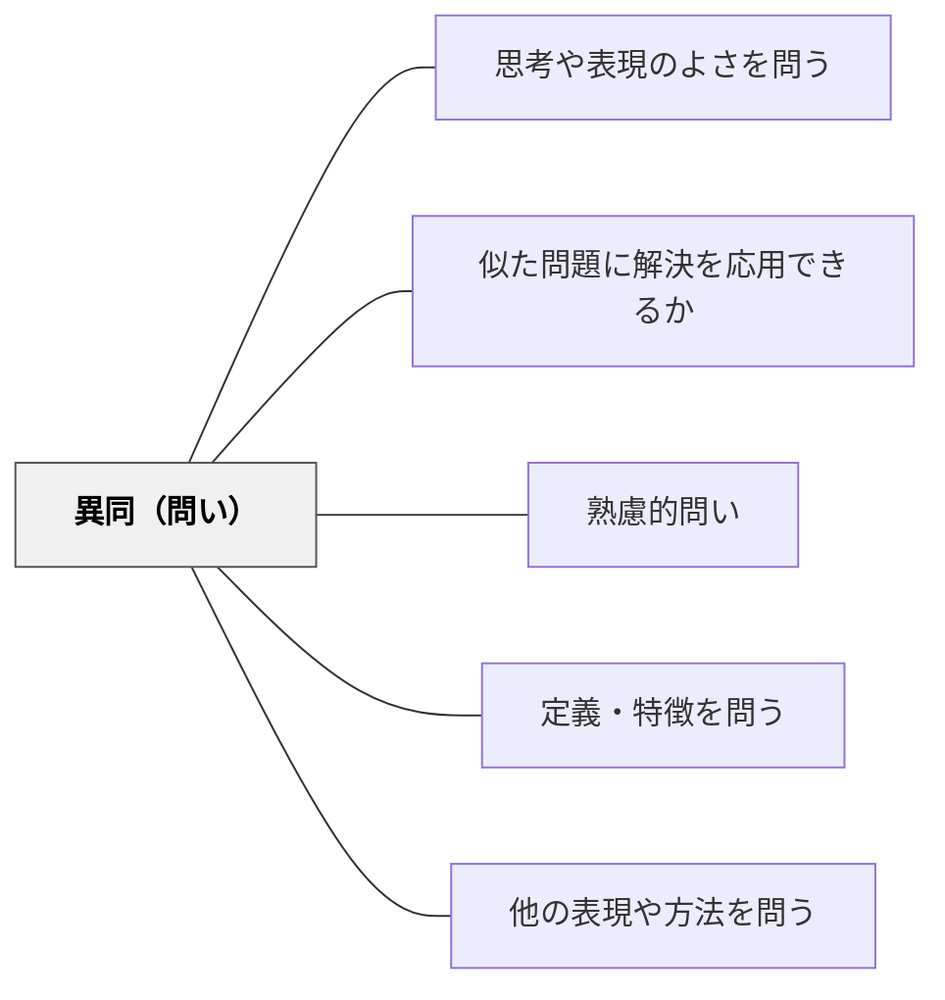

# 異同（問い）

> 「違いはどこか？共通点は？」と比較・対照を問い、概念の明確化と構造的理解を促す。

## 背景（Context）
概念や対象の理解は、他のものとの比較によって明確になる。「○○とは何か」を問うより「○○と△△はどう違うか」を問う方が、概念の輪郭が見えやすい。比較・対照の思考は、分類・分析・論理的推論の基礎となる。

## 問題（Problem）
一つの対象を独立して学ぶだけでは、その対象の特徴が際立たない。比較なしには、概念の境界があいまいになり、似たものを混同したり、本質的な違いを見逃したりする。

## 力のかたち（Forces）
- 違いを見つけることで、両者の特徴が明確になる
- 共通点を見つけることで、上位概念や本質が浮かび上がる
- 比較は具体的な観察・分析の出発点になる
- 対照表や図を使うと、比較の思考が可視化される

## 解決（Solution）
「植物と動物の違いは何だろう？」「江戸時代と現代の生活で似ているところ・違うところは？」「この二つの解き方、どこが同じでどこが違う？」と比較・対照を促す問いを投げかける。ベン図や比較表を使って「共通点」「Aだけの特徴」「Bだけの特徴」を整理させると、思考が構造化される。

## 結果（Consequences）
- 概念の輪郭が明確になり、混同や誤解が減る
- 比較を通じて上位概念・本質的な特徴が見えてくる
- 分類・分析・論理的推論の力が育つ

## 関連パタン
- [[パタン/思考や表現のよさを問う]]
- [[パタン/似た問題に解決を応用できるか]]
- [[パタン/熟慮的問い]] — 親パタン
- [[パタン/定義・特徴を問う]] — 特徴を問う
- [[パタン/他の表現や方法を問う]] — 複数の方法を比べる

## クラスター図

## Actionable Insight

- 「植物と動物の違いは何だろう？」「この二つの解き方、どこが同じでどこが違う？」と比較・対照を促す問いを投げかける——概念の輪郭が明確になり混同や誤解が減る
- ベン図や比較表を使って「共通点」「Aだけの特徴」「Bだけの特徴」を整理させる——思考が構造化され分類・分析・論理的推論の力が育つ
- 比較を通じて「両者の上位概念・本質的な特徴は何か？」を問う——共通点から上位概念が浮かび上がる

## 出典
- [[文献/熟慮的問いのパターンリスト（動画記録）]]
