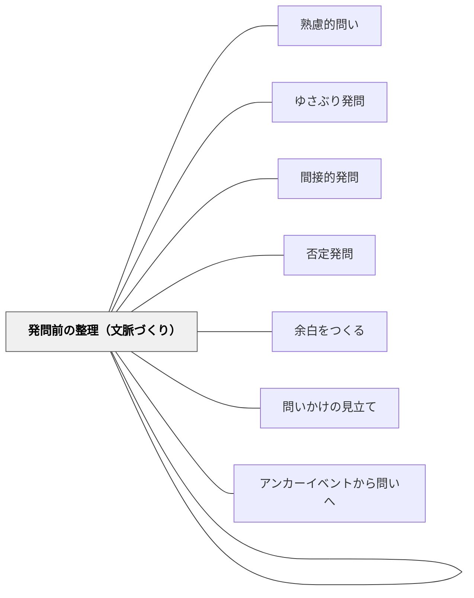

# 発問のグラデーション

> 「絶対的に良い発問」は存在しない——発問は子どものレベルに合わせて段階的に調節するものであり、最終的には教師の発問をなくし、子どもが自ら問いをもてるように育てていく。

## [Pattern Connection]

- **既存パタンとの関連**：[[パタン/熟慮的問い]] が発問の種類と設計を扱うのに対し、本パタンは発問の「難易度調節」と「段階移行」という縦軸の設計を扱う。[[パタン/発問を問いにしない]] と本パタンは、どちらも「教師の発問を手放す」という方向性を共有するが、本パタンはその段階的プロセスを明示する点で具体的である。
- **補強された点**：子どもを「育てる」ための発問論として、単なる技法集でなく長期的な指導ビジョンを提供する。「発問転移」——良い発問を経験した子どもがその物の見方を自分の問いとして転移させていく——という概念が既存パタンを補強する。
- **他のパタンへの波及**：[[パタン/ゆさぶり発問]]、[[パタン/否定発問]]、[[パタン/間接的発問]] などの具体的発問技法が「グラデーション」の上位・中位に位置するものとして整理される。

## 背景（Context）

教師は発問の技術を磨くことに力を注いできた。工夫を凝らした発問は子どもの思考を活性化し、授業を豊かにする。しかし、いつまでも教師が主役となる発問をし続けると、子どもは「問いは教師のもの」として受け取り、自ら問いを立てる力が育たない。

## 問題（Problem）

発問を磨くほど「不自然」な問いになり、子どもが普段の生活でもてる問いから遠ざかる。工夫満載の発問で活発な授業ができても、子ども達が自分で問いをもつ力を伸ばせていなければ、授業の主役は常に教師であり続ける。

## 力のかたち（Forces）

- 工夫された発問ほど教師の存在が大きくなり、「子どもが主役」から遠ざかる
- 子どもから問いを出させようとしても、土台となる「物の見方の転移」がなければ浅い問いしか出ない
- 子ども達の実態は一様でなく、同じ発問でも「簡単すぎる」「難しすぎる」場合がある
- 発問の内容（ねらい）は変えずに、難易度だけを調節することが可能である

## 解決（Solution）

**発問の内容（授業のねらい）は変えずに、教師による工夫の多寡でグラデーションを想定し、子どもの実態に合った段階を選択する。長期的には工夫を徐々に減らし、発問をなくしていくことを視野に入れる。**

### 発問のグラデーション（5段階）

| 段階 | 内容 |
|------|------|
| 1（教師工夫満載） | 間接的・具体的・選択肢あり・整理も発問セット指示も充実 |
| 2（工夫を少し減らす） | 中心的な工夫は残し、周辺の工夫を省く |
| 3（工夫を大きく減らす） | 直接的で自然な問いに近づける |
| 4（自然な問い） | 「このときの○○はどんな気持ちか」など、子どもでもともてる普通の問い |
| 5（子どもが問いを出す） | 「思ったことを話して」「疑問に思ったことは？」程度で子どもから問いが出る |

### 発問転移のメカニズム

教師の良質な発問は、その授業での子どもの思考を活性化するだけでなく、「物の見方・捉え方」として子どもに転移する。例えば、「この説明文の例はあやとりでなくてはいけませんか」という発問を経験した子が、次の教材でも自ら「この例は適切か」と問いをもつようになった事例（土居正博の実践）がこれを示す。

### 「難→易」からアプローチする

子ども達の実態を正確に見取るには、少し難しめの段階から入り、通じなければ徐々に落とす。「易→難」では支援しすぎる状態が見えにくい（深澤久（2009）の「難→易」理論の発問への適用）。

### グラデーションの運用指針

- **新出事項**（初めて学ぶこと）→ 帰納的指導、工夫多め（段階1〜2）
- **既習事項**（繰り返し深める）→ 演繹的指導、工夫少なめ（段階3〜4）
- **教材が難解**（読みにくい・問いが出にくい）→ 工夫多め
- **教材が子どもに親しみやすい**（問いが出やすい）→ 工夫少なめ・子どもに委ねる

## 結果（Consequences）

- 教師の発問研究が「最終的に発問をなくす」という長期ビジョンをもつものになる
- 子どもが育つにつれ、発問の工夫を減らしても授業が成立するようになる
- 良い発問経験の積み重ねが「転移」を生み、子ども自らが本質的な問いをもつようになる
- 授業の主役が教師から子どもへと移行していく

## 関連パタン

- [[パタン/熟慮的問い]] — 発問設計の上位パタン
- [[パタン/発問を問いにしない]] — グラデーションの最上位（段階5）と重なる
- [[パタン/ゆさぶり発問]] — グラデーション段階1〜2の典型的技法
- [[パタン/間接的発問]] — グラデーション段階1〜2の第一条件
- [[パタン/否定発問]] — グラデーション段階1〜2の効果的技法
- [[パタン/発問セット指示]] — 発問と常にセットで設計するもの
- [[パタン/発問前の整理（文脈づくり）]] — 発問を機能させる文脈設計
- [[パタン/余白をつくる]] — 子どもから問いが出るための空間
- [[パタン/問いかけの見立て]] — 子どもの実態を見取り発問のレベルを判断する
- [[パタン/アンカーイベントから問いへ]] — 良質な問い経験が子どもの問いを育てる

## クラスター図

## Actionable Insight

- 今週の授業で使う発問を1つ選び、グラデーションを5段階で書いてみる——「どこまで教師の工夫を外せるか」が見えてくる
- 子どもの表情・姿勢・つぶやきを観察し「今日の発問は難しすぎたか、易しすぎたか」を1行でメモする——レベル調節のための見取りが習慣化する
- 1ヶ月後に同じ発問を子どもから出させることを目標に、今月は段階1から始める——「転移」を意識した長期ビジョンで発問を設計する

## 出典

- 土居正博（2026）『自分で考え、学べる子を育てる！ 発問の技術』学陽書房
- [[文献/自分で考え、学べる子を育てる！ 発問の技術]]

> 「発問は、それ自体で価値をはかられるものではなく、『子ども達のレベルに合っていたか』という状況依存的なものでもある」——土居正博（2026）
