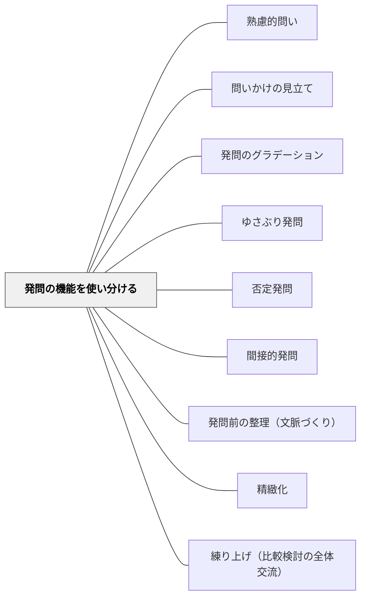

# 発問の機能を使い分ける

> 「今この発問で何をねらっているか」を意識化する——野口芳宏（2011）の6機能を頭に入れ、漫然と問うのをやめ、授業の局面ごとに適切な機能の発問を意図的に選ぶことで、授業設計の精緻さが増す。

## [Pattern Connection]

- **既存パタンとの関連**：[[パタン/熟慮的問い]] が発問の種類と設計を包括的に扱うのに対し、本パタンは発問の「機能意識」という横断的な視点を補強する。既存の発問技法パタン（[[パタン/ゆさぶり発問]]・[[パタン/否定発問]]・[[パタン/間接的発問]] など）が「どの機能を担うか」を整理する枠組みを提供する。
- **補強された点**：野口芳宏（2011）の6機能分類が「一つの発問が複数の機能をもつこともある」という点を含めて実践的に整理された。「確認・収束」も発問の機能として位置づけられた（長崎伸仁（2010）の「小さな発問と大きな発問」との接続）。
- **修正・拡張された点**：6機能を「主発問と補助発問」の文脈に落とし込み、授業設計の観点から使いやすい実践知として再構成した。
- **他のパタンへの波及**：[[パタン/問いかけの見立て]] の「今どの機能が必要か」という判断軸が明確になる。

## 背景（Context）

教師は毎日多くの発問を授業の中で投げかけている。しかし、その発問が「何のためにするのか」を意識しているかどうかは別問題だ。発問の技法（間接的に問う・具体的に問う・ゆさぶるなど）は様々あるが、そもそも「その発問でどんなことが子どもに起きてほしいのか」という機能の意識がなければ、技法は道具として機能しない。

## 問題（Problem）

授業で発問を続けていても「なんとなく発問している」状態に陥ると、機能のミスマッチが生まれる。深化・拡充が必要な局面で「注目・発見」型の発問をする、習熟が必要な局面で応用型の発問をするといった、意図しないズレが起きる。発問の機能を意識化することで、この問題を回避できる。

## 力のかたち（Forces）

- 一つの発問が複数の機能をもつこともあり、一対一対応ではない
- 機能を意識することで「今この授業の局面で何をねらうか」が明確になる
- 機能意識がないと、発問の工夫（間接性・具体性など）だけに注意が向きすぎてねらいがぼやける
- 発問の機能は教師の意図だけでなく、子どもの反応によっても決まる側面がある

## 解決（Solution）

**野口芳宏（2011）の6機能を頭に入れ、授業の局面ごとに「今はどの機能をねらうか」を意識して発問を設計する。また、「小さな発問（確認・収束）」と「大きな発問（拡散・深化）」を組み合わせて授業全体を構造化する。**

### 発問の6機能（野口芳宏（2011）より）

| 機能 | 内容 | 授業での場面 |
|------|------|------------|
| ① 注目・発見 | 子どもの意識を焦点化し、初めて気づかせる | 導入・問題提示・新概念との出会い |
| ② 修正・訂正 | 子どもの誤った考えや読みを正していく | 誤答・誤読が出たとき、理解確認 |
| ③ 深化・拡充 | 考えや認識を深めたり広げたりする | 主発問・中心的な議論の場面 |
| ④ 入手・獲得 | 新たな知識や技能を得させる | 新出事項の導入、知識獲得の場面 |
| ⑤ 上達・習熟 | 技能をさらに高める | 演奏・文章・運動技能の振り返り |
| ⑥ 応用・活用 | 学んだことを生活や他の学習に活用する | 単元末・習熟場面・転移の確認 |

土居（2026）は「③深化・拡充」を発問の中心的機能と位置づけている。「一言で言えば子ども達に『考える』機会をつくるものだが、『考える』にも様々な機能がある」という。

### 小さな発問と大きな発問（長崎伸仁（2010））

長崎伸仁（2010）は発問を大きく二分している：

- **小さな発問**：確認や収束の役割を果たす補助発問——主発問に至るまでの地盤を固める
- **大きな発問**：思考の拡散や深化の役割を果たす主発問——授業の核となる

実際の授業では、補助発問（小さな発問）で既習・前提を確認し、地盤が固まったところで主発問（大きな発問）を出す構造が基本となる。

### 発問を出す前に確認する問い

- 「この発問の後、子どもたちにどんなことが起きてほしいか」——機能の意識化
- 「今の局面に必要な機能は何か」——注目か、深化か、習熟か
- 「この発問は主発問か補助発問か」——大きな発問か小さな発問か

## 結果（Consequences）

- 授業の局面ごとに適切な機能の発問が選べるようになり、設計の精緻さが増す
- 発問の工夫（技法）だけでなく「何のためにする発問か」という目的意識が生まれる
- 補助発問で地盤を固めてから主発問を出す構造を意識できるようになる
- 「一つの発問が複数の機能をもつ」という複合的な見方が生まれ、発問研究の深みが増す

## 関連パタン

- [[パタン/熟慮的問い]] — 発問設計の上位パタン
- [[パタン/問いかけの見立て]] — 局面に応じた発問を選ぶ判断力
- [[パタン/発問のグラデーション]] — 機能の組み合わせがグラデーションの各段階で変わる
- [[パタン/ゆさぶり発問]] — 主に「③深化・拡充」「② 修正・訂正」の機能
- [[パタン/否定発問]] — 主に「②修正・訂正」の機能、副次的に「③深化・拡充」
- [[パタン/間接的発問]] — 主に「③深化・拡充」「①注目・発見」を果たす工夫
- [[パタン/発問前の整理（文脈づくり）]] — 補助発問（小さな発問）として機能することが多い
- [[パタン/精緻化]] — ④入手・獲得や③深化・拡充と接続する認知戦略

- [[パタン/練り上げ（比較検討の全体交流）]] — 発問（hatsumon）のあとに来る局面。発問だけでは授業は閉じない

## クラスター図

## Actionable Insight

- 授業の発問案を書いたら、各発問の横に「①〜⑥のどの機能か」をメモしてみる——「深化・拡充ばかり」「入手・獲得ばかり」などの偏りに気づける
- 主発問の前に「この地盤固めの発問（小さな発問）が必要か」を確認する——補助発問を意識することで主発問が機能しやすくなる
- 「今日の授業で最もねらいたい機能は何か」を1つ選んでから発問を設計する——目的意識が発問の質を変える

## 出典

- 土居正博（2026）『自分で考え、学べる子を育てる！ 発問の技術』学陽書房
- 野口芳宏（2011）『野口流 教師のための発問の作法』学陽書房
- 長崎伸仁（2010）『新国語科の具体と展望』メディア工房ステラ
- [[文献/自分で考え、学べる子を育てる！ 発問の技術]]

> 「発問には様々な機能があることを知っていれば、それらを意識して発問することができます。授業の局面で、どの機能を重視していきたいか、よく意識して発問をつくっていくようにしましょう」——土居正博（2026）
