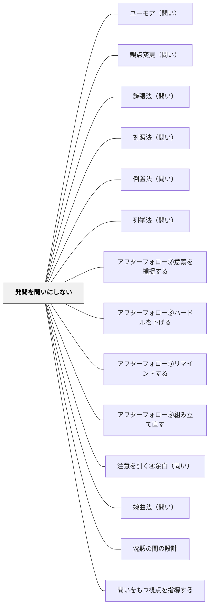

# 発問を問いにしない

## [Pattern Connection]

- **補強された点（土居正博（2026）より）**：土居は「教師の発問を磨きながら徐々になくしていく」という発問論を展開し、「普通で、自然な問い」の重要性を強調する。「練りに練った発問は不自然」であり、子どもが自立した学習者として日常生活で自ら問いをもてるようにするには、教師の工夫を削ぎ落とした自然な問い（あるいは問いのかたちにさえしないつぶやき）こそが重要だとする。本パタン「発問を問いにしない」は、土居の発問グラデーション論における最上位段階（段階5：子どもが自ら問いをもつ）への移行を支えるパタンとして位置づけられる。
- **拡張された実装**：宇佐美寛（1978）の「発問は、発問を不要にしていく方向でなされるという条件でのみ、してもいいのである」という命題と本パタンは深く共鳴する。「問わないことで問いが立つ」という逆説的な効果を、岩井の実践知と土居の理論が相互に補強する。

## 背景（Context）

教師は、子どもたちに思考を促すために「発問（question）」を使う。しかし、問いの形にすることで、子どもたちは「正解を求められている」と感じ、自由な発想や対話的なやりとりがしにくくなることがある。

## 問題（Problem）

「このとき主人公はどう思ったのかな？」「なんでそうなったんだと思う？」といった問いかけが、教師からの"問い"であるがゆえに、子どもにとっては「正しく答えなきゃいけない」プレッシャーになりやすい。その結果、発言が止まり、学びが閉じてしまう。

## 力のかたち（Forces）

- 子どもたちは教師の「問い」を評価の対象と感じがち
- 対話を促したいが、問いが「誘導」に見えると自由に話しにくくなる
- 思考のプロセスは必ずしも"言語化可能な問い"に収まらない
- 「問い」ではなく「つぶやき」や「感想」から深まることがある

## 解決（Solution）

**問いのかたちにせず、「つぶやき」や「観察」などの形で投げかける。**

発問を「問いとして構造化」せず、「先生自身の感じたこと」や「ただのつぶやき」として共有することで、子どもたちが自然なかたちで考えを広げやすくなる。

**例：**
- 「この場面、なんか変な感じするなあ…」
- 「ここ、さっきと似てない？」
- 「……なんか、この子、黙ってるね」
- 「この人、どうして泣いたんだろ。……いや、違うかなあ」

「問わない」ことで、「考えたい」が立ち上がる状況を生み出す。

**実践例：**
- 物語の読解で「……あれ？」とぼそっとつぶやくと、子どもから「どうしたの？」と返ってくる
- 社会科の資料写真を見せて無言のまま視線を向けると、子どもたちが「なんか…この人、怒ってる？」と話し始める
- 理科の実験後に「うーん、なんか違う気がするけど…」とつぶやくと「先生、何が変だったの？」と問い返す

## 結果（Consequences）

子どもたちが「正解を出す」よりも「自分の感じたことを話していい」と感じやすくなる。会話が対話的になり、他者のつぶやきに触発された内省や気づきが生まれる。発話のハードルが下がり、教室の言語的空気が開かれる。

子ども自身が「問いを立てる」ようになるとき、その多くは「問いかけられない場」でこそ育つ。

**注記：**「問いかけなくてはならない」という教師の思い込みを外すところから始まる。「つぶやき」は一方的に投げるよりも、自分を開いて子どもに向けて差し出すような感覚で。

## 関連パタン
- [[パタン/ユーモア（問い）]]
- [[パタン/観点変更（問い）]]
- [[パタン/誇張法（問い）]]
- [[パタン/対照法（問い）]]
- [[パタン/倒置法（問い）]]
- [[パタン/列挙法（問い）]]
- [[パタン/アフターフォロー②意義を捕捉する]]
- [[パタン/アフターフォロー③ハードルを下げる]]
- [[パタン/アフターフォロー⑤リマインドする]]
- [[パタン/アフターフォロー⑥組み立て直す]]
- [[パタン/注意を引く④余白（問い）]]
- [[パタン/婉曲法（問い）]]
- [[パタン/沈黙の間の設計]]
- [[パタン/問いをもつ視点を指導する]]
- [[教科/国語]]
- [[実践/読み語りの実践]]
- [[パタン/アンカーイベントから問いへ]]
- [[パタン/発問のグラデーション]] — 発問をなくす（段階5）への移行を支えるパタン
- [[パタン/ジェスチャー学習]]
- [[パタン/つぶやき技法]]
- [[パタン/感情的トリガー]]
- [[パタン/無言の提示]]
- [[パタン/問いかけを入れる]]
- [[パタン/問い返しのデザイン]] — 子どもの反応を深める問い返しが「問いにしない」ことを支える

### 下位パタン

### 関連
- [[パタン/余白をつくる]] — つぶやきが生まれる「間」を意図的に設ける
- [[パタン/メタ意識]] — 教師自身の指導の構えを外から見る
- [[パタン/身体性に沿う]] — 言語以外の手がかりを使った促し

## クラスター図

## Actionable Insight

- 授業中に1回、「？」の形にしない投げかけを試してみる——「ここなんか変な感じする…」とつぶやくだけで子どもたちが動き出すことがある
- 資料・写真・実物を見せてしばらく無言でいる——沈黙が子どもたちの「なんだろう？」を引き出す最小のナッジ
- 「問わない」という選択を意識的に1回取り入れる——問いかけへの強迫を手放すことが対話的な教室の出発点になる

## 出典

- パタン集/発問を問いにしない.md
- 土居正博（2026）『自分で考え、学べる子を育てる！ 発問の技術』学陽書房 — 発問をなくしていく論と「普通で、自然な問い」の重要性
- 宇佐美寛（1978）『教授方法論批判』明治図書 — 「発問は発問を不要にしていく方向でなされるという条件でのみ、してもいいのである」
- [[文献/自分で考え、学べる子を育てる！ 発問の技術]]
