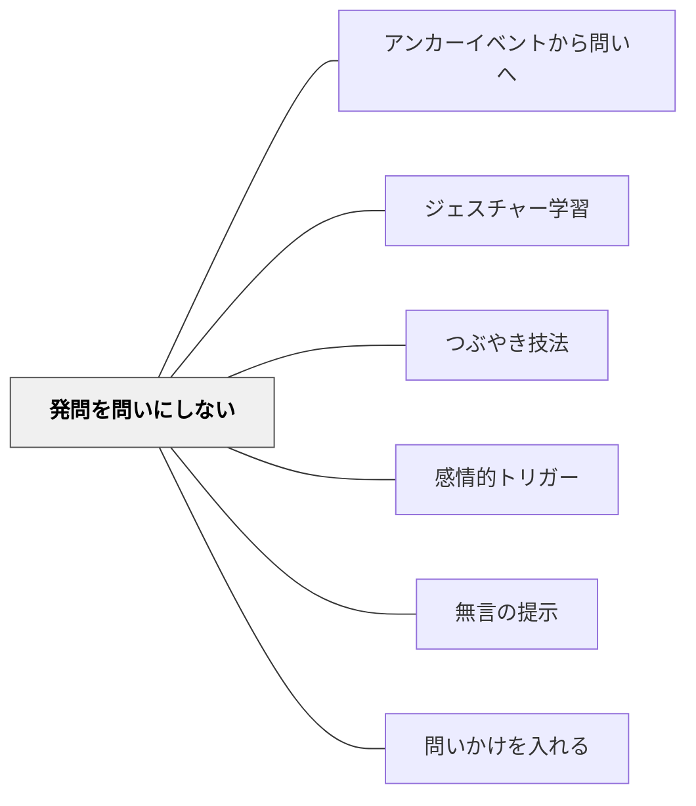

# 発問を問いにしない

## 背景（Context）

教師は、子どもたちに思考を促すために「発問（question）」を使う。しかし、問いの形にすることで、子どもたちは「正解を求められている」と感じ、自由な発想や対話的なやりとりがしにくくなることがある。

## 問題（Problem）

「このとき主人公はどう思ったのかな？」「なんでそうなったんだと思う？」といった問いかけが、教師からの"問い"であるがゆえに、子どもにとっては「正しく答えなきゃいけない」プレッシャーになりやすい。その結果、発言が止まり、学びが閉じてしまう。

## 力のかたち（Forces）

- 子どもたちは教師の「問い」を評価の対象と感じがち
- 対話を促したいが、問いが「誘導」に見えると自由に話しにくくなる
- 思考のプロセスは必ずしも"言語化可能な問い"に収まらない
- 「問い」ではなく「つぶやき」や「感想」から深まることがある

## 解決（Solution）

**問いのかたちにせず、「つぶやき」や「観察」などの形で投げかける。**

発問を「問いとして構造化」せず、「先生自身の感じたこと」や「ただのつぶやき」として共有することで、子どもたちが自然なかたちで考えを広げやすくなる。

**例：**
- 「この場面、なんか変な感じするなあ…」
- 「ここ、さっきと似てない？」
- 「……なんか、この子、黙ってるね」
- 「この人、どうして泣いたんだろ。……いや、違うかなあ」

「問わない」ことで、「考えたい」が立ち上がる状況を生み出す。

**実践例：**
- 物語の読解で「……あれ？」とぼそっとつぶやくと、子どもから「どうしたの？」と返ってくる
- 社会科の資料写真を見せて無言のまま視線を向けると、子どもたちが「なんか…この人、怒ってる？」と話し始める
- 理科の実験後に「うーん、なんか違う気がするけど…」とつぶやくと「先生、何が変だったの？」と問い返す

## 結果（Consequences）

子どもたちが「正解を出す」よりも「自分の感じたことを話していい」と感じやすくなる。会話が対話的になり、他者のつぶやきに触発された内省や気づきが生まれる。発話のハードルが下がり、教室の言語的空気が開かれる。

子ども自身が「問いを立てる」ようになるとき、その多くは「問いかけられない場」でこそ育つ。

**注記：**「問いかけなくてはならない」という教師の思い込みを外すところから始まる。「つぶやき」は一方的に投げるよりも、自分を開いて子どもに向けて差し出すような感覚で。

## 関連パタン
- [[パタン/アンカーイベントから問いへ]]
- [[パタン/ジェスチャー学習]]
- [[パタン/つぶやき技法]]
- [[パタン/感情的トリガー]]
- [[パタン/無言の提示]]
- [[パタン/問いかけを入れる]]

### 下位パタン
- [[パタン/つぶやき技法]] — 本音の感想・疑問を独り言として声に出す
- [[パタン/無言の提示]] — 言葉を使わず物・写真・表情で提示し反応を待つ

### 関連
- [[パタン/余白をつくる]] — つぶやきが生まれる「間」を意図的に設ける
- [[パタン/問い返しのデザイン]] — 子どもの反応を深める問い返し
- [[パタン/メタ意識]] — 教師自身の指導の構えを外から見る
- [[パタン/身体性に沿う]] — 言語以外の手がかりを使った促し

## クラスター図

## Actionable Insight

- 授業中に1回、「？」の形にしない投げかけを試してみる——「ここなんか変な感じする…」とつぶやくだけで子どもたちが動き出すことがある
- 資料・写真・実物を見せてしばらく無言でいる——沈黙が子どもたちの「なんだろう？」を引き出す最小のナッジ
- 「問わない」という選択を意識的に1回取り入れる——問いかけへの強迫を手放すことが対話的な教室の出発点になる

## 出典

- パタン集/発問を問いにしない.md
