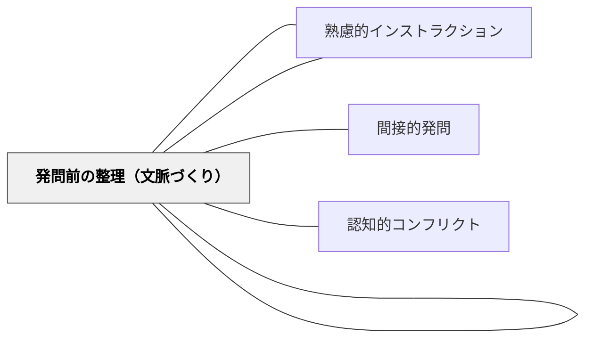

# 発問セット指示

> 発問だけでは子どもは動かない——「どう考えるか」を問う発問と、「どう活動するか」を示す指示をセットで設計することで、はじめて子どもの思考が具体的な活動として立ち上がる。

## [Pattern Connection]

- **既存パタンとの関連**：[[パタン/熟慮的インストラクション]] が指示設計の全般を扱うのに対し、本パタンは発問と指示の「セット設計」というピンポイントな実践を扱う。
- **補強された点**：「発問だけでは子どもは動かない」という観察を、本パタンが実践的に補強する。発問と指示が別々に設計されていると授業が機能しないことが、本書の事例によって具体化される。
- **他のパタンへの波及**：[[パタン/発問のグラデーション]] における工夫削減の際、発問セット指示の工夫も段階的に削ぎ落としていく視点が生まれる。

## 背景（Context）

授業で教師が発問をしても、子ども全員が思考に参加しているとは限らない。特に、小学校では子ども達は活動を通して考えるものであり、「何を考えるか」（発問）だけでなく「どう活動して考えるか」（指示）が同時に設計されて初めて授業が機能する。

## 問題（Problem）

良い発問をしても、「では考えてください」だけでは多くの子どもはどう動けばよいかわからず、一部の子だけが挙手して終わる授業になりやすい。「何を学ぶか」（発問）だけを検討し、「どのように学ぶか」（発問セット指示）を疎かにすると、活動なき思考や学びなき活動が生まれる。

## 力のかたち（Forces）

- 発問は子どもの「思考」に働きかけ、指示は「行動」に働きかける——両者は別の指導言である
- 発問セット指示の質次第で、子どもの活動・感覚・思考の深まりが大きく変わる
- 練りに練った発問セット指示は「不自然」になり、自立した学習から遠ざかる可能性がある
- 日常的に使える「自然な」発問セット指示と、授業を活性化させる「特別な」発問セット指示の両方が必要

## 解決（Solution）

**発問を設計したら、必ずセットで「子どもをどう動かすか」の指示を設計する。発問セット指示には「具体化」「考えのズレを生む」「自然な日常的活動」の3パターンを使い分ける。**

### 具体化する発問セット指示

発問の内容を活動として具現化する指示。子どもが発問内容を頭の中で漠然と処理するのでなく、体・手・目を使って具体的にイメージする。

- 「ビーバーのダムはどんな構造ですか。——図に描いてみましょう。」
- 「このセリフをどう読んだらいいですか。——気持ちが伝わるように読んでみましょう。」
- 「筆者はどんな考えでこの文章を書きましたか。——筆者役とインタビュアー役に分かれて話してみましょう。」

### 考えのズレを生む発問セット指示

子ども達の考えを可視化・比較可能にし、「なぜあの子と違うのか」という知的好奇心を生む。

- 「このときの心情の幸福度を1〜5の数字で表してください。」
- 「ハートマークに色を塗って感情を表してください。」
- 「AパターンとBパターンを聞いて、上手な方を選んで理由を言ってください。」

### 自然な日常的発問セット指示

毎日使える普通の指示。刺激は少ないが日常の授業を支える基盤。

- 「考えをノートに書きましょう。」
- 「大事だと思うところに線を引きましょう。」
- 「隣の人と考えを話し合いましょう。」
- 「疑問に思ったことを言ってください。」

### 発問セット指示を「なくしていく」方向性

子どもが育ったら、発問セット指示を徐々に減らし、「どうやって考えたいかな。一人で考える？ペア？」と子どもに選択を委ねるようにする。

## 結果（Consequences）

- 子どもが発問を受けた後、「何をすればいいかわからない」という状況が減る
- 考えのズレが可視化され、自然と話し合いたい気持ちが生まれる
- 発問セット指示の精度が上がるにつれ、「活動あって学びあり」の授業になる

## 関連パタン

- [[パタン/熟慮的問い]] — 発問設計の上位パタン
- [[パタン/熟慮的インストラクション]] — 指示設計全般の親パタン
- [[パタン/発問のグラデーション]] — 発問セット指示も段階的に削ぎ落とす
- [[パタン/発問前の整理（文脈づくり）]] — 発問セット指示と並ぶ三要素の一つ
- [[パタン/間接的発問]] — 発問自体の工夫とセット設計が相互作用する
- [[パタン/認知的コンフリクト]] — 考えのズレを生む発問セット指示がコンフリクトを生む

## クラスター図

## Actionable Insight

- 次の授業の発問を1つ選び、その後に続く指示を3つ書いてみる——「活動の形」が決まると授業の流れが具体的になる
- 「幸福度1〜5で示してください」などの数値化指示を1度試してみる——子どもの考えのズレが一目で見えて話し合いが活発化する
- 発問後の指示を子どもに委ねてみる（「どうやって考えたい？」）——一人で考えたい子・話したい子の違いが見えて実態把握になる

## 出典

- 土居正博（2026）『自分で考え、学べる子を育てる！ 発問の技術』学陽書房
- [[文献/自分で考え、学べる子を育てる！ 発問の技術]]

> 「発問の質が授業の質を左右するのは、紛れもない事実です。しかし、それだけでは子どもは動かない」——土居正博（2026）
