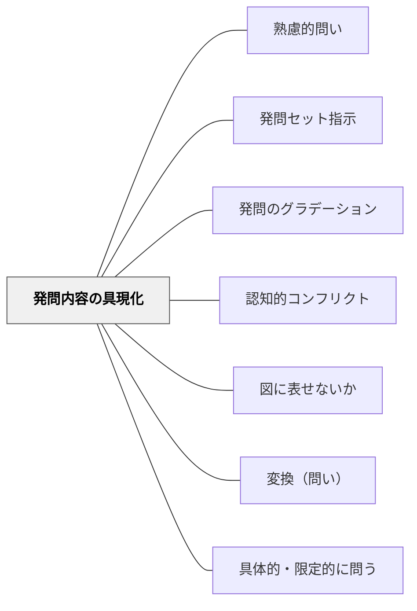

# 発問内容の具現化

> 発問への答えを「図に描く・演じる・数値で示す・ハートマークに色を塗る」という体の活動として表現させることで、すべての子どもが考えを手にして交流の場に臨めるようになる。

## [Pattern Connection]

- **既存パタンとの関連**：[[パタン/発問セット指示]] の「具体化する発問セット指示」を、教育実践の複数事例から掘り下げた下位パタン。[[パタン/認知的コンフリクト]] と接続し、「具現化によって考えのズレが可視化される」メカニズムを明示する。
- **補強された点**：長崎伸仁先生の「ビーバーのダム作図実践」（東京書籍2年）が「具現化が考えのズレを生む」ことを示す具体事例として補強された。動作化・役割演技・ハートマーク塗りなどが同じ原理の異なる形態であることが整理された。
- **修正・拡張された点**：「図示・数値化・演技」という土居の整理を「5つの具現化タイプ」として体系化した。
- **他のパタンへの波及**：[[パタン/発問のグラデーション]] における「発問セット指示への工夫」の一形態として位置づけられ、子どもが育てば徐々に削ぎ落としていく方向性も見える。

## 背景（Context）

発問を受けた子どもが「なんとなく考えている」状態では、考えが頭の中にとどまって言葉にならない。また、全員が考えをもった状態で交流に入らないと、一部の声の大きな子の意見で授業が動いてしまう。子どもが自分の考えを「体として表現する」活動を挟むことで、全員参加と考えの可視化が同時に実現する。

## 問題（Problem）

「このとき人物はどんな気持ちでしょうか」と発問しても、「ノートに書きましょう」だけでは発問の内容が子どもの中で曖昧なまま処理されやすい。また、一人ひとりがどう考えているかが互いに見えないため、交流が「正解を当てにいく」活動になりがちだ。

## 力のかたち（Forces）

- 小学生は机上の思考より「活動を通して考える」ほうが理解が深まりやすい（土居正博（2026））
- 発問の内容を体・手・目を使って具現化すると、子どもが漠然とイメージしていたものが明確になる
- 具現化によって「作図・数値・色・動作」が可視化されると、子ども同士の考えのズレが手に取るようにわかる
- 考えのズレが見えると「なぜあの子と違うのか」という知的好奇心が自然と生まれ、交流が活発になる
- 練りに練った発問セット指示は子どもの普段の行動から遠ざかり「不自然」になるため、使いすぎに注意が必要

## 解決（Solution）

**発問の内容を「描く・演じる・数値化する・色で示す・作る」という体の活動として具現化させる指示を、発問とセットで出す。活動によって全員が考えを手にした状態で交流に入れるようにする。**

### 5つの具現化タイプ

#### ① 図示する（作図・絵を描く）

> 「ビーバーのダムはどのようになっていますか。——図で描いてみましょう。」
>（長崎伸仁先生の実践：東京書籍2年「ビーバーの大工事」）

子ども達は実に様々な図を描いた。ダム湖の位置（手前か先か）、ビーバーの巣の位置（内側か外側か）など、文字面では気づかなかったズレが一目で可視化された。子ども达は「どれが正しいのか突き止めたくなる」状態になり、本文を精査しながら話し合いが深まった。

- 「人間の腕の骨や筋肉はどうなっているでしょうか。——図に描いてみてください。」

#### ② 数値化する（段階・数字で表す）

> 「このときの中心人物の幸せメーターはいくつくらいですか。——1（すごく不幸せ）〜5（最高に幸せ）の数字で表してください。」

数字が並ぶと「幸せ度4の自分」と「幸せ度1のあの子」の違いが一目でわかる。「なぜ違うのか聞いてみたい！」という交流の動機が自然と生まれる。

#### ③ 色・マークで示す

> 「このときの中心人物はどんな気持ちでしょうか。——ハートマークに色を塗って表してください。」

色の選択と塗り方（全塗り・半分・グラデーション）が多様で、その差が比較の素材になる。

#### ④ 動作化・演技する（役割演技・実演）

> 「どのようにすると、前転はカッコ悪いでしょうか。——やって見せてください。」
> 「筆者はどんな考えでこの文章を書いたのでしょうか。——筆者役とインタビュアー役に分かれてインタビューしてみましょう。」

道徳科でよく行われる「役割演技」もこの類であり、人物の気持ちを体で理解させる発問セット指示の代表例。

#### ⑤ 音読・読み方で表現する

> 「このときの中心人物はどんな気持ちだったのでしょうか。——この会話文を気持ちがわかるように読んでみてください。」

音読のトーン・速さ・強弱が子どもの心情理解の具現化となり、「どう読んだか」の違いが交流の素材になる。

## 結果（Consequences）

- 全員が発問の内容について「自分の考えの形」を手にした状態で交流に入れる
- 作図・数値・色・動作によって考えのズレが可視化され、「話し合いたい！」という内発的動機が生まれる
- 発問だけでは不十分だった子どもの思考が、発問セット指示による活動によって具現化・活性化される
- 練りに練った具現化指示は「不自然」になる側面もあるため、子どもが育ったら発問セット指示を削ぎ落とす方向（[[パタン/発問のグラデーション]]）を意識する

## 関連パタン

- [[パタン/熟慮的問い]] — 発問設計の上位パタン
- [[パタン/発問セット指示]] — 本パタンの親パタン（具体化タイプ）
- [[パタン/発問のグラデーション]] — 具現化指示は段階的に削ぎ落とす
- [[パタン/認知的コンフリクト]] — 考えのズレが可視化されてコンフリクトが生まれる
- [[パタン/図に表せないか]] — 「図に描く」具現化は熟慮的問いのサブパタンでもある
- [[パタン/変換（問い）]] — 形式を変えることが理解の深さを示す
- [[パタン/具体的・限定的に問う]] — 発問を具体化するもう一つの柱

## クラスター図

## Actionable Insight

- 今週の国語で「ハートマークに色を塗って」「幸福度を数字で示して」を1度試してみる——数字や色が並ぶと「なぜ違うの？」という会話が自然と始まる
- 説明文の授業で図を描かせてみる——「本文通り描いたつもり」でも子どもによって異なる図が出て、本文の精査につながる
- 動作化・役割演技を「楽しい活動」ではなく「発問内容を体で理解させる手段」として位置づけて設計する——目的意識が変わると発問と活動のつながりが明確になる

## 出典

- 土居正博（2026）『自分で考え、学べる子を育てる！ 発問の技術』学陽書房
- [[文献/自分で考え、学べる子を育てる！ 発問の技術]]

> 「『図で描いてみましょう。』と指示されて初めて、具体的にイメージを膨らませ始めたのです。発問だけでは不十分だった子ども达の思考が、発問セット指示による活動によって具現化され、活性化したのです」——土居正博（2026）
