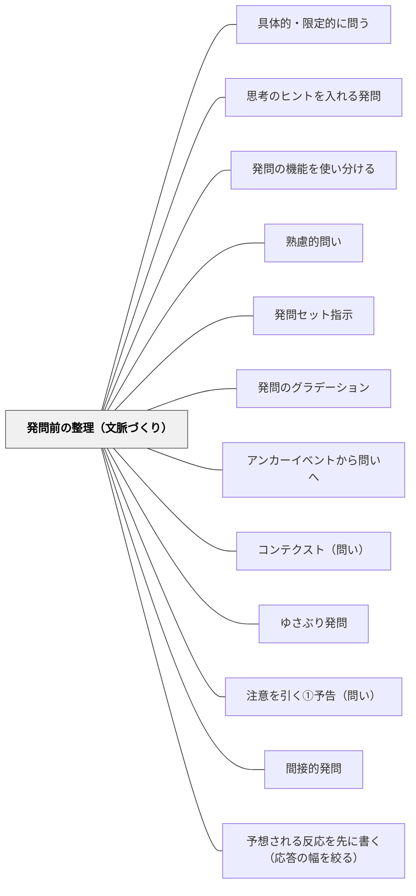

# 発問前の整理（文脈づくり）

> 発問の成否は、発問の前段階で8割方決まる——前提条件を揃え、既習を確認し、必然性のある文脈をつくってはじめて、発問が子どもに届く。

## [Pattern Connection]

- **既存パタンとの関連**：[[パタン/アンカーイベントから問いへ]] が問いの「きっかけ」を扱うのに対し、本パタンは発問が機能するための「準備と文脈」という土台設計を扱う。[[パタン/熟慮的問い]] の「コンテクスト（問い）」パタンとも連動する。
- **補強された点**：「整理」なくして発問なし、という実践的原則を確立する。特に「論理的・科学的・心理的」という三軸での文脈づくりは、発問研究の中でも具体性が高い。
- **他のパタンへの波及**：[[パタン/発問のグラデーション]] において、「整理（文脈づくり）は最後まで削がない」という判断基準を提供する。

## 背景（Context）

発問は単体では機能しない。授業で教師が発問をしても、子どもにとって「なぜ今それを考えるのか」という必然性が感じられなければ、多くの子は乗り出して考えない。発問の前に、子どもたちの前提条件を揃えたり、既習を確認したり、学びの文脈をつくったりすることが、発問を生かす土台となる。

## 問題（Problem）

発問の工夫だけを磨いても、その前段階の「整理」がなければ授業は機能しない。例えば「発問の必然性」がなければ子どもは考えるどころか問いとして受け取れない。また、前提条件がバラバラのまま議論させると子ども同士が噛み合わず、授業が深まらない。

## 力のかたち（Forces）

- 子ども達の既習の定着度は均一でなく、発問前に土台を確認しないと一部の子だけで授業が進む
- 前提条件を揃えすぎると子どもの思考が狭まる危険がある（枠が狭すぎる問題）
- 学びの文脈がなければ発問が「唐突」に見え、子どもは「なぜ今それを考えるのか」と感じる
- 整理は発問への工夫とは異なり、削りすぎてはいけない（発問セット指示は削っていいが、文脈づくりは最後まで残す）

## 解決（Solution）

**発問の前に「整理」として次の三つを意識的に行う：（1）前提条件を揃える、（2）既習を確認・固める、（3）学びの文脈をつくる（論理的・科学的・心理的）。**

### 前提条件を整える（枠を定める）

「この選択肢の中から選ぶ」「既習を使って考える」「全員に伝わる言葉で」など、考える枠を明示する。枠があることで逆に考えやすくなる。

例：道徳「手品師」で「少年のところへ行く or ステージに出る、この二択だけで考えてください」と定める。

### 既習を確認し固める

発問に必要な言葉・概念・既習事項を全員が持っているか確認する。「問いの文」を知らない子が一人でもいれば、その発問は機能しない。

### 学びの文脈をつくる（三軸）

**論理的な文脈**：発問に至る論理的つながりをつくる。
- 例：「ちいちゃんのかげおくり」最終場面の意義を問う前に、「中心人物は誰か確認 → 各場面のちいちゃんの様子を確認 → 最終場面にちいちゃんが出ないことを確認」という論理的なつながりを作ってから「この場面いらないよね」と問う。

**科学的な文脈**：教科の論理に即した文脈をつくる。
- 例：「固有種が教えてくれること」で文章と図表を切り離して読ませ、「図表があるとないとでどう違うか」を話してから、図表の配置を考えさせる。単元でつけたい力（文章と図表を結び付ける）に教科の論理で向かわせる。

**心理的な文脈**：子どもの経験・感じ方・価値観に働きかける文脈をつくる。
- 例：有田和正氏の実践——バスについて知っていることを自由に出させ自信をつけさせた後、「バスのタイヤは何個？」で「実はよく知らなかった」ことに気づかせ、そこから「バスの運転手はどこを見て運転するか」へ。子どもの経験と価値観をゆさぶる文脈。

## 結果（Consequences）

- 発問が「唐突」に感じられず、子どもが「なるほど、考えてみよう」という構えで受け取れる
- 一部の子だけでなく、多くの子が発問に参加できるようになる
- 発問の成否が「発問の工夫」ではなく「前段階の整理」にかかっていることが見えてくる

## 関連パタン
- [[パタン/具体的・限定的に問う]]
- [[パタン/思考のヒントを入れる発問]]
- [[パタン/発問の機能を使い分ける]]

- [[パタン/熟慮的問い]] — 発問設計の上位パタン
- [[パタン/発問セット指示]] — 発問三要素の一つ
- [[パタン/発問のグラデーション]] — 整理（文脈づくり）は最後まで削がない
- [[パタン/アンカーイベントから問いへ]] — 文脈づくりのきっかけとしてのアンカーイベント
- [[パタン/コンテクスト（問い）]] — 問いはコンテクストの中で生まれるという認識
- [[パタン/ゆさぶり発問]] — 心理的文脈づくりとゆさぶりはセットで機能する
- [[パタン/注意を引く①予告（問い）]] — 発問前の整理と事前予告は近接する
- [[パタン/間接的発問]] — 文脈が整ってはじめて間接的発問が機能する

- [[パタン/予想される反応を先に書く（応答の幅を絞る）]] — 発問の前に文脈を整えることと、反応の幅を絞ることは同じ作業の表裏

## クラスター図

## Actionable Insight

- 授業の発問を考えた後、「この発問が機能するために子どもは何を知っている必要があるか」を3つ書く——既習確認のチェックリストになる
- 授業冒頭の5分を「前時の振り返り＋今日の問いの文脈づくり」に使う——発問前の整理が「当たり前の導入」になる
- 「論理的・科学的・心理的」の三軸を意識し、今日の文脈づくりがどれに当たるかラベリングしてみる——文脈設計の意識が精緻化する

## 出典

- 土居正博（2026）『自分で考え、学べる子を育てる！ 発問の技術』学陽書房
- [[文献/自分で考え、学べる子を育てる！ 発問の技術]]

> 「発問の成否は、ある意味でその前の段階で決まっている」——土居正博（2026）
