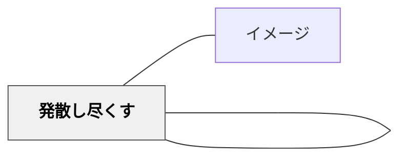

# 発散し尽くす

> 話し合いで決まったことに少数意見が反映されていないので、不満の人がいる。

## 背景（Context）

話し合いで決まったことに少数意見が反映されていないので、不満の人がいる。物語の読
み取りなどで、表面的な理解に終始して読みが深まらない。

## 問題（Problem）

学習者が学習の土台に乗れず、本来の教育の価値が届かない。

## 力のかたち（Forces）

- 教育者の意図と学習者の実態のギャップ
- 個々の状況に応じた柔軟な対応の必要性
- 経済性（無駄なコスト・苦しみを省く）の原理

## 解決（Solution）

間違いを恐れている。自分の考えを安心して言い合える環境ではない。よい話し合いや考

えが練り上がって深まっていくことへのイメージがない。そういったことから安易な答え

や考えで止まっている。

ファシリテーションは、会議の手法として出てきた。ファシリテーションのプロセスに

DIVERGENT THINKING（発散的思考）というものがある。話題や議題に対して意見をた
くさん出していく段階だ。話し合う内容によっては、時間の限り、発散し尽くすことが大

切だ。

クラスやグループなどの話し合いで安易に多数決で結論を出してしまうことがある。その

ような場合、少数意見が反映されないなどの問題が起きてくる。時間に限りがあるが、そ

の中で生徒たちは考えを発散し尽くすことが大切だ。考えを出す中で意見が対立して呻く

ような時間もあるだろう。しかし、そこでもさらに考えを出し続ける過程で新しい考えが

出てきたり、考えと考えが融合していったりする。最後には様々な考えが反映されいくつ

かのよりよい結論に収束していく。

国語では、言葉の細部にこだわって読むことが大切だと言われる。それは書く時もそうだ

ろう。私は、物語の読む学習で、音読劇などを学習活動とするときに、テキストに線を引

きながら自分の考えを書いていくということを教える。黒板に貼ってある教科書の見開き

２ページを拡大したものには、子どもたちの考えや質問でいっぱいになる。アーノルド・

ローベルの『お手紙』では、かえるくんが家を飛び出すシーンがある。ただ家を出るのと

飛び出るのではどのような違いがあるのだろうか。その違いからかえるくんはどのような

登場人物だと考えられるか。また捉えたかえるくんの人柄から音読はどのように変わって

いくだろうか。さらに、書いてあることから考えを出し尽くしていく、つまり発散し尽く

して

## 結果（Consequences）

- 学習者の力能（なしうる力）が増大する
- パタンの圧縮による教育の経済性が実現する
- 関連パタンと重ね合わせることで効果が高まる

## 関連パタン

- [[パタン/イメージ]]
- [[パタン/発散し尽くす]] （原典パタン集に存在する場合）

## クラスター図

## Actionable Insight

- 話し合いの最初の5分を「アイデア出し専用タイム・批評禁止」にする——「発散し尽くす」のには評価を後に回すことが鍵
- 黒板・ホワイトボードに出た意見を全部書き残し、多数決の前に「まだ出ていない視点はないか」と一度聞く——少数意見がそこで初めて出ることがある
- 物語の音読劇の前に「テキストに気づいたことを何でも書いてみよう」と1分間与える——発散し尽くしてから解釈を絞る流れが深い読みを生む

## 出典
- [[文献/一つの教育のパタン・ランゲージ]]

岩井輝久「岩井輝久『一つの教育のパタン・ランゲージ』」（2026-04-29 vault収録）
