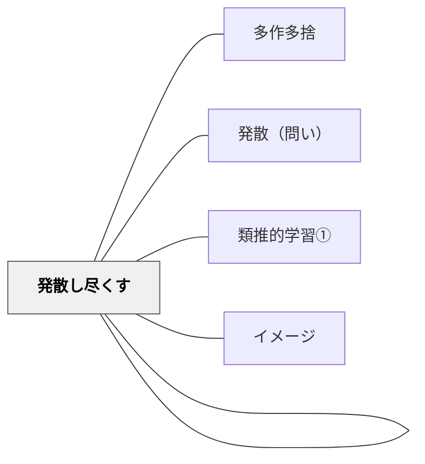

# 発散し尽くす

**このパタンが完成を助ける大きなパタン**：[[パタン/ソーシャル]]

> 話し合いで決まったことに少数意見が反映されていないので、不満の人がいる。

## 背景（Context）

話し合いで決まったことに少数意見が反映されていないので、不満の人がいる。物語の読み取りなどで、表面的な理解に終始して読みが深まらない。

## 問題（Problem）

間違いを恐れている。自分の考えを安心して言い合える環境ではない。よい話し合いや考えが練り上がって深まっていくことへのイメージがない。そういったことから安易な答えや考えで止まっている。（岩井の原稿の問題の一文）

## 力のかたち（Forces）

- 時間には限りがあり、安易に多数決で結論を出すと、少数意見が反映されない（原稿）
- 考えを出す中で、意見が対立して呻くような時間もある。それでも出し続ける過程で、新しい考えが出てきたり、考えと考えが融合したりする（原稿）
- 言葉の細部にこだわって考えを出し尽くすと、何度も読み込んだ教師も気づかなかった読みが生まれる（原稿の『お手紙』の例）
- 発散し尽くすには、そのイメージとメリットの理解だけでなく、安心して考えを出し合える人間関係と、間違いから学ぶ文化が要る（原稿）

## 解決（Solution）

間違いを恐れている。自分の考えを安心して言い合える環境ではない。よい話し合いや考えが練り上がって深まっていくことへのイメージがない。そういったことから安易な答えや考えで止まっている。

ファシリテーションは、会議の手法として出てきた。ファシリテーションのプロセスにDIVERGENT THINKING（発散的思考）というものがある。話題や議題に対して意見をたくさん出していく段階だ。話し合う内容によっては、時間の限り、発散し尽くすことが大切だ。

クラスやグループなどの話し合いで安易に多数決で結論を出してしまうことがある。そのような場合、少数意見が反映されないなどの問題が起きてくる。時間に限りがあるが、その中で生徒たちは考えを発散し尽くすことが大切だ。考えを出す中で意見が対立して呻くような時間もあるだろう。しかし、そこでもさらに考えを出し続ける過程で新しい考えが出てきたり、考えと考えが融合していったりする。最後には様々な考えが反映されいくつかのよりよい結論に収束していく。

国語では、言葉の細部にこだわって読むことが大切だと言われる。それは書く時もそうだろう。私は、物語の読む学習で、音読劇などを学習活動とするときに、テキストに線を引きながら自分の考えを書いていくということを教える。黒板に貼ってある教科書の見開き２ページを拡大したものには、子どもたちの考えや質問でいっぱいになる。アーノルド・ローベルの『お手紙』では、かえるくんが家を飛び出すシーンがある。ただ家を出るのと飛び出るのではどのような違いがあるのだろうか。その違いからかえるくんはどのような登場人物だと考えられるか。また捉えたかえるくんの人柄から音読はどのように変わっていくだろうか。さらに、書いてあることから考えを出し尽くしていく、つまり発散し尽くしていくことで、考えと考えがつながり合い、新しい考えが生まれてくる。何度も読み込んでいるはずの教師が気づかなかったような斬新な読みも生まれてくる。

考えを発散し尽くすためには、考えを発散し尽くすイメージをもち、そのメリット理解するだけではなく、そのチームの人間関係、文化が大切だ。安心して考えを出し合えるチームなのか、間違いから学んでいこうという考えがあるのかなど。

**考えを発散し尽くせ**

考えを発散し尽くすことで、少数意見も反映されたり、様々な考えが融合されたりして、よりよい結論に収束していく。またよりよい学習にもなっていく。そのためには、考えを安心して言い合えるような人間関係や間違えから学んでいこうという考え方が大切である。

（以上、岩井の原稿「教育のパタン・ランゲージ 集約」から。wiki のページは原稿の途中で切れていたため、2026-11-12 に原稿の続きを補い、あわせて折り返しの改行をつないだ。言葉は原稿のまま。）

**近いパタンとの見分け**：協働・対話の表では、本パタンの見分けの問いは「話し合いで、少数の考えも含めて出し尽くしてから、まとめに向かっているか（岩井）」。全体の表は [[パタン/ソーシャル#近いパタンとの見分け|ソーシャル]] にある。

## 結果（Consequences）

- 学習者の力能（なしうる力）が増大する
- パタンの圧縮による教育の経済性が実現する
- 関連パタンと重ね合わせることで効果が高まる

## 関連パタン
- [[パタン/多作多捨]]
- [[パタン/発散（問い）]]
- [[パタン/類推的学習①]]

- [[パタン/イメージ]]
- [[パタン/発散し尽くす]] （原典パタン集に存在する場合）

## クラスター図

```mermaid
flowchart LR
    ne799bae695a3e38197e5b0bde3818fe38199["発散し尽くす"]
    ne5a49ae4bd9ce5a49ae68da8["多作多捨"]
    ne799bae695a3efbc88e5958fe38184efbc89["発散（問い）"]
    ne9a19ee68ea8e79a84e5ada6e7bf92e291a0["類推的学習①"]
    ne382a4e383a1e383bce382b8["イメージ"]
    ne799bae695a3e38197e5b0bde3818fe38199["発散し尽くす"]

    ne799bae695a3e38197e5b0bde3818fe38199 --- ne5a49ae4bd9ce5a49ae68da8
    ne799bae695a3e38197e5b0bde3818fe38199 --- ne799bae695a3efbc88e5958fe38184efbc89
    ne799bae695a3e38197e5b0bde3818fe38199 --- ne9a19ee68ea8e79a84e5ada6e7bf92e291a0
    ne799bae695a3e38197e5b0bde3818fe38199 --- ne382a4e383a1e383bce382b8
    ne799bae695a3e38197e5b0bde3818fe38199 --- ne799bae695a3e38197e5b0bde3818fe38199

    classDef hub fill:#f0f0f0,stroke:#555,color:#000,font-weight:bold
    class ne799bae695a3e38197e5b0bde3818fe38199 hub
```

## Actionable Insight

- 話し合いの最初の5分を「アイデア出し専用タイム・批評禁止」にする——「発散し尽くす」のには評価を後に回すことが鍵
- 黒板・ホワイトボードに出た意見を全部書き残し、多数決の前に「まだ出ていない視点はないか」と一度聞く——少数意見がそこで初めて出ることがある
- 物語の音読劇の前に「テキストに気づいたことを何でも書いてみよう」と1分間与える——発散し尽くしてから解釈を絞る流れが深い読みを生む

## 出典
- [[文献/一つの教育のパタン・ランゲージ]]

岩井輝久「岩井輝久『一つの教育のパタン・ランゲージ』」（2026-04-29 vault収録）

原稿の参考文献：田村操、鈴木和子、表現読み総合法教育研究会編（2005）『理解を深める表現読み２年』ルック／Sam Kaner（2014）Facilitator's Guide to Participatory Decision-Making, Jossey-Bass

## 根拠の確かめ（自動生成）

<!-- source-check: 自動生成。手で編集しない。文献ページの frontmatter の source_check から作る -->
このページが引く文献を、本 Wiki が原典でどこまで確かめたかで分けた。くわしくは各文献ページの「書誌・確認した範囲」や「原文との照合」へ。

- **その他**（動画の記録や本 Wiki の作者自身の本など）：[[文献/一つの教育のパタン・ランゲージ|一つの教育のパタン・ランゲージ]]
