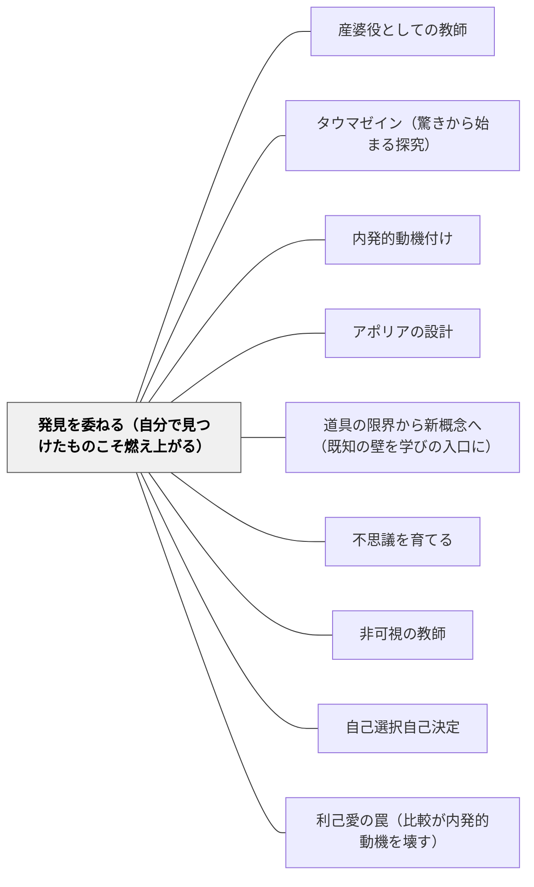

# 発見を委ねる（自分で見つけたものこそ燃え上がる）

> 「先生から渡されたものは踊らされている感覚がする。自分で見つけたものこそ、燃え上がる」

## [Pattern Connection]

### 結城浩（2013）数学ガールの誕生——発見の所有感という動機の核心

結城浩は『数学ガールの誕生』で、学習者が知識を「受け取る」のではなく「発見する」ことの根本的な違いを描く。

**「自分で見つけたものこそ燃え上がる」（p.79相当）：**

> 「自分が見つけたものこそ、おもしろい。自分が見つけたものこそ、燃り上がる。」——結城（2013）

「先生から定理を与えられると『踊らされている』感覚になる」——これは教師が「分かりやすく教えた」と思っているとき、学習者の側では主体性が奪われているという逆説である。

**「水を向ける」という設計技法（p.79–80）：**

結城が描く教師（「ガイドさん」）の語りかけ：

> 「ここに、こんなものがあるよ。先生は三個くらいおもしろいこと見つけたんだけど、他にもあるのかなあ」

この問いかけは答えを示さない。「先生も見つけた（3つ）」という情報が「自分も見つけられるかもしれない」という期待を引き出し、学習者が「よーし先生を出し抜こう！」と動き始める。

**「良い素材・発見させる・肯定的に受け止める」の3点セット（p.79–80）：**

| ステップ | 内容 | 教師の動き |
|---|---|---|
| 1. 良い素材を与える | 発見が起きうる豊かな素材を選ぶ | 素材の選択が最初の設計 |
| 2. 発見させる | 答えを教えず、発見が起きるのを待つ | 「どんなものがある？」と問うのみ |
| 3. 肯定的に受け止める | 何を言っても最初は受け止める | 「それはおもしろい！」「他にも？」 |

この3点は「何を発見したか」よりも「発見した」という体験を守ることを優先する。

**「仕組みが透けてはいけない」：**

「マニュアル的な親切心は感動を生まない」——発見の場を意図的に設計していても、その「意図」が見えてしまうと学習者は「また先生が仕掛けを作った」と感じ、主体的な発見感が消える。設計は見えない形で機能するときに最もよく働く。

- **既存パタンとの関連**：[[パタン/産婆役としての教師]]が「問うのみで教えない」技法を示すとすれば、本パタンはその技法の**心理的な理由**——「なぜ先に答えを渡してはいけないか」——を「発見の所有感（燃え上がり）」として明示する。産婆役が「どうするか」を示すなら、発見を委ねるは「なぜそうするか」を示す。
- **補強された点**：[[パタン/タウマゼイン（驚きから始まる探究）]]が「驚きが探究を始める」という状態を示すとすれば、本パタンは「自分で見つけた発見だからこそ燃え上がる」という所有感を加える——驚きだけでなく「自分がした発見だ」という感覚が動機の質を変える。
- **他のパタンへの波及**：[[パタン/内発的動機付け]]（発見の所有感は内発的動機の最も純粋な形）；[[パタン/アポリアの設計]]（アポリアは「解けると思っていた問いが解けない」という所有感が大きい場合に最も機能する）；[[文献/数学ガールの誕生（結城浩）]]

---

### 数学ガールの物理ノート（結城浩, 2024）——「証明より発見」の明確化

テトラ（第4章）: 「証明はできましたが、発見はしていません。½m倍する理由がわからない。」

この一言が「発見を委ねる」パタンの核心を逆から照らす。証明（手続きの完成）と発見（意味の獲得）は別のことである。「発見を委ねる」設計が成功しても、学習者が証明的正確さで確認しただけでは「発見した」とは言えない。発見の完成は「なぜそうなるのか」が自分の中で腑に落ちることにある。

**「燃え上がる」の質的定義**：結城（2013）が語った「自分で見つけたものこそ燃え上がる」の「燃え上がり」は、「証明できた」ではなく「発見した」という状態。テトラの言葉が、その区別を鮮明にした——証明の完成は手続きの正確さであり、発見は意味の腑落ちである。

- **補強された点**:
  - 「発見した」の判定基準が明確化される——「なぜ½m倍なのか、自分の言葉で言えるか」（明証性の確認）まで到達して初めて「発見した」と言える。[[パタン/明証性と判明性（自分で確かめる知の習慣）]] の「明証性の確認の四問」が「発見した」かどうかの判定基準として機能する。
  - 教師が「この子は発見した」と判断するための具体的な問いが示される: 「なぜそうなるか言える？」「別の数字で試しても同じことが言える？」

→ [[パタン/知らないふりゲーム（既知を問い直す）]]
→ [[文献/数学ガールの物理ノート・ニュートン力学（結城浩）]]

### 数学ガールの秘密ノート・丸い三角関数（結城浩, 2014）——定義が腑に落ちると発見が起きる

テトラが第1章で、単位円によるsin定義が「腑に落ちた直後」に -1 ≤ sinθ ≤ 1 を自発的に発見する場面。

> テトラ「だって、この円は半径が1ですから、円のいちばん《上》のu座標は1で、いちばん《下》の座標は-1ですよね。そして、点Pの座標がsin θなので、sin θは、-1以上で1以下の範囲に入っているはずですっ！」
> 「そうそう、その発見はいいなあ、テトラちゃん！ どんな角度θに対しても、-1≦sin θ≦1が成り立つ。これはsin θの定義からわかるsin θの性質だね」

この場面が示す構造：定義を「暗記する命題」でなく「図で体感する事実」として受け取ったとき、定義から性質を「発見する」ことが自然に起きる。

**「燃え上がり」の条件の追加：**
物理ノート（2024）でのテトラの「証明より発見」との接続——「燃え上がる」のは「発見した」ときであり、「証明できた」ときではない。単位円でのsin発見は、定義の腑落ちが「燃え上がり」を生む典型例である。

**ユーリのリサージュ探索との接続：**
第2章でユーリが(cos θ, sin θ)→楕円→8の字とパラメータを変えながら形の変化を観察する。対称性を発見して「もう計算しなくてもわかる」という内在化へ——「探索の喜び」が「発見の燃え上がり」の日常的な形態。

- **補強された点**: 「発見を委ねる」ための素材設計のヒントが追加される——「定義を図で体感させ、定義から何が言えるかを問う」という設計が、テトラの発見を可能にした。良い素材（単位円）を選び、「定義から何がわかる？」という問いだけを残す設計が「発見の場」を作る。

→ [[パタン/空白のノートで再現する（知識をおもちゃにする）]]（発見の喜びを自分で作り出す方法）
→ [[文献/数学ガールの秘密ノート・丸い三角関数（結城浩）]]

### 数学ガールの秘密ノート・整数で遊ぼう（結城浩, 2014）——「考えをシバらない」と独自解法の承認

**「考えをシバらない」——教師の解法が唯一のルートでないことを伝える：**

第5章でユーリが「そー考えなきゃダメなのか……」と語り手の解法を唯一の正解ルートとして受け取ろうとした瞬間：

> 「こう考えなきゃだめなんて自分の考えを縛っちゃいけないよ、ユーリ。うまくいく方法は一つとは限らない。じゃ、ユーリだったら、どう考える？」

ユーリが「カウントボタンをカチャカチャ押して試す」という独自アプローチを提案すると、「実際に試すのは確かにいい方法だよ」と受け入れる。「押してもいーでしょ？考えをシバらない」というユーリの返しも鋭い。

**発見を委ねる設計原理としての「考えをシバらない」：** 教師の解法を「示した後でも」、「あなたならどう考えるか」を問い直すことで発見の空間が再び開く。「教え終わった後」でさえ発見は起きうる——それは「唯一の正解ルート」という縛りを取り除くことで可能になる。

**ユーリが一般解を発見するエピソード——部分的正解への問い直しが発見を生む：**

語り手が「答えは14だね！」と締めくくろうとしたとき、ユーリが反論する。

> 「違う！パターン024になるの、14だけじゃないよ！」

これは正しい。最小解14に加え、30m+14（m=0,1,2…）がすべて解。語り手の部分的な正解に対し学習者が「それだけではない」と問い直すことで、「一般解」という発見に至る。**「教師が完全な正解を示した後でも、学習者の疑問が問題をより深く開く」**——これは3点セット（良い素材・発見させる・肯定的に受け止める）の自然な帰結である。

- **補強された点**:
  - 「発見を委ねる」設計は、解法を示した「後」でも有効であることが示される——「わかったはずの問題」への「もっと言えることはないか」という問いが発見を再び開く。
  - 「考えをシバらない」という言葉は、「先生の方法以外でやってはいけない」という暗黙の制約を取り除く許可として機能する。

→ [[パタン/例示は理解の試金石（具体例で理解を確かめる）]]
→ [[文献/数学ガールの秘密ノート・整数で遊ぼう（結城浩）]]

---

### ルソー（1755）人間不平等起源論——子どもの本来の善性と「自己愛（amour de soi）」

ルソーは自然状態の人間を「孤独で善良・満足していた」と描き、家族・小共同体の段階（黄金時代）から私有財産・比較・依存の発生によって腐敗が始まったと論じた。教育への含意として：

> 「原初的な状態にある人間ほど優しい人間はいない。この状態では人間は自然の力によって獣の愚味さからも、文明の人間の忌まわしい知識からも同じように隔てられていた」——第二部

子どもの「知りたい」という動機（amour de soi / 自己愛）は、ルソー的には文明以前の自然な状態である。学校の比較・序列化・外発的報酬は、この自然な動機を利己愛（amour propre）へと転落させる。

**「発見を委ねる」との接続：**

- 発見を委ねる設計は、子どもの amour de soi（「知りたい・見つけたい」）に働きかける。先に答えを与えることは、発見の所有感を奪うだけでなく、「正解した（他者の前で能力を示した）」という利己愛の充足に学習を還元する危険を持つ。
- 「自分で見つけたものこそ燃え上がる」（結城浩）の「燃え上がり」は、amour de soi が充足された状態——外の評価に依存しない、内側からの喜びとして理解できる。
- **補強された点**：発見を委ねる設計の「なぜ先に答えを渡してはいけないか」の理由が哲学的に深化する——「与えられた知識は踊らされている感覚」（結城）は、自己愛（内側の動機）が外発的な情報受け取りに置き換えられる瞬間のルソー的説明になる。
- **波及するパタン**：[[パタン/利己愛の罠（比較が内発的動機を壊す）]] — 発見を委ねる設計がなぜ重要かの動機論的根拠；[[文献/人間不平等起源論（ルソー）]] — 本統合の出典

---

## 背景（Context）

授業では教師が概念を説明し、例を示し、練習問題を与えるという流れが標準になっている。「分かりやすく丁寧に教える」ことが良い授業とされる文化の中では、答えを先に渡すことが親切とみなされる。

しかし「分かりやすく教えた」と教師が感じるとき、学習者は「渡されたもの」として受け取っている。知識は受け取れるが、学習者自身の「燃え上がり」は生まれない。

## 問題（Problem）

先に答えを与えられた学習者は「分かった」と感じても、その知識を自分のものとして使えないことがある。与えられた知識は「踊らされている」——誰かが用意したレールの上を走っているという感覚——を残す。そして「先生が教えてくれたこと」は先生がいなくなると使えなくなりやすい。

## 力のかたち（Forces）

- 先に答えを渡すと、その後の活動が「正解の確認作業」になり、発見が起きない
- 「自分で気づいた」という体験は、それが小さな発見でも、学習への態度を根本から変える
- 発見の設計は難しい——「問いを出す」だけでは発見が起きず、「答えを出さない」だけでは学習者が迷子になる
- 「発見させよう」という意図が見えると、学習者は「また仕掛けがある」と感じて主体性が下がる
- 「自分が見つけたもの」は記憶にも根付きやすく、応用場面での転移が起きやすい

## 解決（Solution）

**良い素材を選び、発見が起きる余白を確保し、何が発見されても肯定的に受け止める。答えを先に渡さず、学習者が「探した」「見つけた」という体験を守る設計をする。**

---

### 「水を向ける」問いの設計

直接「これを発見してください」と言わない。代わりに：

1. **「先生も見つけた」を共有する**：「先生がこの図形を見たとき、3つ面白いことに気づいたんだけど……みんなはいくつ見つけられたかな」——先生が答えを持っていることを示しつつ、「自分も見つけられるかもしれない」という期待を作る。
2. **「他にも？」と返し続ける**：学習者が何かを見つけたとき「いいね！他にも何かある？」——最初の発見を承認しながら、探索を続けるように促す。
3. **「正解があるとは言わない」**：「先生が気づいたこと以外にも、おもしろいことがあるかもしれない」——先生の答えが唯一でないという余白を残す。

---

### 具体例1：図形の探索（算数）

「この正方形の紙をいろいろな線で切ったり折ったりすると、どんな形が出てくるかな。先生は4つ気づいたんだけど……」——10分後、学習者が見つけてきたものを黒板に集める。先生の「4つ」より多くなったとき、「先生を出し抜いた！」という達成感と、発見の所有感が同時に生まれる。

### 具体例2：言葉の発見（国語）

物語の一場面を読んだ後、「主人公のこの行動、なんかおかしくない？先生は2つ気になることがある。みんなは気づいたかな」——全員が「気になること」を書いてから、全体で共有する。先生の「2つ」を当てようとする気持ちと、自分が気づいた別のことを言いたい気持ちが混在する——その混在が、テキストを深く読む動機になる。

### 具体例3：実験前の予測（理科）

結果を見せる前に「あなたはどうなると思う？」を必ず聞く。正解を求めるのではなく「自分の予測を持つ」こと自体を大切にする。予測が外れたとき、「なぜ違ったのか」という問いが内側から生まれる——これは答えを先に見せた場合には起きない問いである。

---

## 結果（Consequences）

- 「教えてもらったこと」でなく「自分で気づいたこと」として残る知識が増える
- 探索することへの態度が変わる——「答えを待つ」から「自分で見つける」へ
- 「まだ気づいていないことがあるかもしれない」という継続的な探索欲が育つ
- ただし、「良い素材」の選択が難しい——発見が起きうる豊かさと、迷子にならない安全さのバランスが必要
- 「発見させる」設計は時間がかかる——カリキュラムの圧力との折り合いを毎回判断する必要がある

## 関連パタン

- [[パタン/産婆役としての教師]] — 「問うのみで教えない」の実践的技法の体系
- [[パタン/タウマゼイン（驚きから始まる探究）]] — 発見の「燃え上がり」はタウマゼインと重なるが、「自分が発見した」という所有感が独自の次元を加える
- [[パタン/内発的動機付け]] — 発見の所有感は内発的動機の最も純粋な形態
- [[パタン/アポリアの設計]] — 「解けると思った問いが解けない」という所有感が強いアポリアほど深い探究につながる
- [[パタン/道具の限界から新概念へ（既知の壁を学びの入口に）]] — テクニックは「必要性を体感した後」に渡す
- [[パタン/不思議を育てる]] — Wonder Boxが「気づいたことを集める文化」を作るとき、本パタンは「気づく瞬間を守る設計」として機能する
- [[パタン/非可視の教師]] — 設計が見えないとき、発見が本物になる
- [[パタン/自己選択自己決定]] — 何を探索するかを学習者が選ぶとき、発見の所有感が最も高まる
- [[文献/数学ガールの誕生（結城浩）]] — 本パタンの出典
- [[パタン/利己愛の罠（比較が内発的動機を壊す）]] — 比較（amour propre）ではなく発見（amour de soi）への設計
- [[文献/人間不平等起源論（ルソー）]] — 子どもの自然な「知りたい」の哲学的根拠（1755）

## クラスター図

## Actionable Insight

- **「先生は〇つ見つけた」という水の向け方を試す**：次の単元で素材を提示するとき「先生が気づいたことが2つある。みんなはいくつ気づくかな」という問いかけを一回使ってみる——「答えを持っている先生」が「探索する仲間」に変わる瞬間が生まれる。
- **「どんなことに気づいた？」を答えを言う前に聞く**：授業の冒頭で新しい素材を提示したとき、説明をする前に「まず、これを見て何か気づいたことを書いてみよう」と2分間取る——その2分が、その後の説明を「自分の気づきと照らし合わせる体験」に変える。
- **「先生の答えより多く見つけた人？」を聞く**：学習者が探索した後、「先生が気づいたのは3つだったけど、3つ以上見つけた人？」と聞く——先生を超えた瞬間を全体で祝う文化が、探索欲を育てる。

## 出典

結城浩（2013）『数学ガールの誕生——理想の数学対話を求めて』ソフトバンククリエイティブ

> 「自分が見つけたものこそ、おもしろい。自分が見つけたものこそ、燃り上がる。」——結城（2013）

> 「良い素材を生徒に与える。そしてあとは生徒に発見させる。発見してもらう。生徒が何を言ってきても、しっかり受け止めて、肯定的に応える——そういうことが非常に重要です。」——結城（2013）
