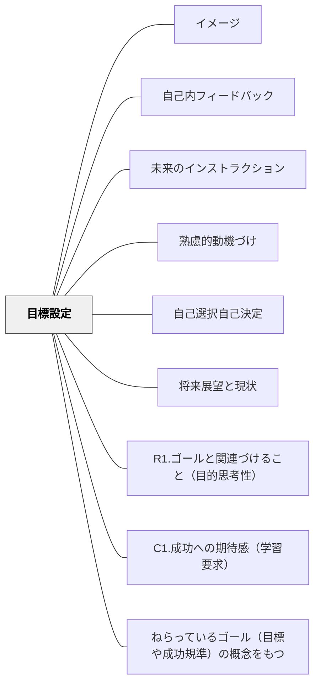

# 目標設定

> 適切な目標を持つことが、行動の方向性とエネルギーをつくる。具体的で挑戦的、かつ自分で設定した目標が最も力を持つ。

## 背景（Context）
ロック＆ラサムの目標設定理論が示すように、目標は動機と行動に直接影響する。目標がなければ努力は散漫になり、目標が明確であれば人は持てる力を集中させる。学習においても、目標設定は動機付けの核心的なプロセスのひとつである。

## 問題（Problem）
曖昧な目標（「頑張る」「もっとよくする」）では行動が具体化しない。教師から与えられた目標は、学習者の動機に結びつきにくい。また、高すぎる目標は無力感を、低すぎる目標は意欲の欠如をもたらす。

## 力のかたち（Forces）
- 目標は具体的・測定可能・達成可能・意味ある・期限のある（SMART）ものが行動につながりやすい
- 自分で設定した目標（内発的帰属）は、他から与えられた目標より強い動機を生む
- 近接目標（短期）と遠隔目標（長期）の組み合わせが持続的な動機付けに有効
- 目標の進捗を可視化・確認できる仕組みが達成感と次への動機を生む

## 解決（Solution）
**学習者が自分で具体的・適度に挑戦的な目標を設定できる機会と支援を提供することで、動機と行動の方向性をつくる。**

単元の始めに「この期間で何を達成したいか」を学習者自身に設定させる、目標を定期的に振り返り調整する機会を設ける、短期と長期の両方の目標を持てるよう支援する、達成した目標を可視化・蓄積するツールを活用するなどが有効である。

## 結果（Consequences）
- 学習者が何に向かって努力すればよいかが明確になり、行動が具体化する
- 目標達成の体験が自己効力感と達成感を育てる
- 目標設定・振り返りの習慣が自己調整学習の基盤となる

## このパタンが働く教材

| 教材 | どのように目標設定が働くか |
|------|----------------------------|
| [[教材/1週間の読書目標]] | 今週の読書目標を自分で決め、達成状況と次の調整を振り返る |

## クラスター図

## Actionable Insight

- 単元の始めに「この期間で何を達成したいか」を学習者自身に1文設定させる——自分で設定した目標が内発的帰属を生み他から与えられた目標より強い動機を生む
- 「今週の目標→単元末の目標」という近接と遠隔の両方の目標を持てるよう支援する——短期と長期の組み合わせが持続的な動機付けに最も有効
- 目標の達成状況を週末・単元末に振り返り調整する機会を設ける——進捗の可視化と定期的な振り返りが達成感と次への動機を生み自己調整学習の習慣を育てる

## 出典

- 一つの教育のパタン・ランゲージ（岩井輝久）

## 関連パタン
- [[パタン/イメージ]]
- [[パタン/自己内フィードバック]]
- [[パタン/未来のインストラクション]]
- [[パタン/熟慮的動機づけ]] — 親パタン
- [[パタン/自己選択自己決定]] — 関連パタン
- [[パタン/将来展望と現状]] — 関連パタン
- [[パタン/R1.ゴールと関連づけること（目的思考性）]] — 関連パタン（ARCSとの接点）
- [[パタン/C1.成功への期待感（学習要求）]] — 関連パタン（ARCSとの接点）
- [[パタン/ねらっているゴール（目標や成功規準）の概念をもつ]] — 関連パタン
