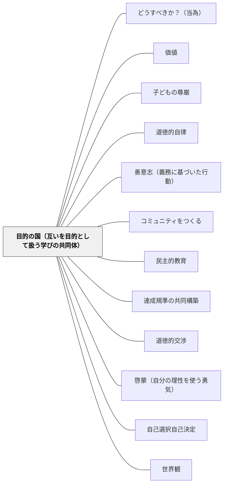

# 目的の国（互いを目的として扱う学びの共同体）

> 「あなた自身の人格においても、他のすべての人格においても、人間性をいつでも同時に目的として使用し、けっして単に手段として使用しないように行為せよ」——カント（1785）

---

## [Pattern Connection]

**カント（1785）統合：**

- **補強する既存パタン**：[[パタン/子どもの尊厳]] — McKnight/Sengeの「欠陥から才能へ」の転換に、カントの Würde（尊厳）概念が哲学的根拠を与える。尊厳は「何ができるか」で測られる価格ではなく、理性的存在者として生来持つ代替不可能な価値
- **深化する既存パタン**：[[パタン/コミュニティをつくる]] — 「コミュニティをつくる」の哲学的基盤として。目的の国の概念は「全員が立法者」という民主的コミュニティのモデルを提供する
- **新次元を加えるパタン**：[[パタン/達成規準の共同構築]] — 評価規準を学習者と共に作ることは、学習者を「評価される客体（手段）」でなく「評価の立法者（目的）」として扱うカント的実践
- **波及するパタン**：[[パタン/民主的教育]] — 目的の国の政治的表現が民主主義。教室民主主義の哲学的基盤。[[パタン/世界観]] — 「目的の国」はどんな世界観を教室に作るかという問いと接続する

---

## 背景（Context）

カントは定言命法の第二定式（人格の定式）で言う：理性的存在者は単なる物（手段）ではなく、目的それ自体（Zweck an sich selbst）として存在する。

すべての物には**価格（Preis）**がある——交換・比較・代替が可能。しかし人間（理性的存在者）は価格を超えた**尊厳（Würde）**を持つ。尊厳はすべての価格の上にあり、いかなる等価物も認めない。

さらにカントは「目的の国（Reich der Zwecke）」の概念を導く：共通の法則のもとに結合したすべての理性的存在者の体系的な統一体。目的の国では、各成員が同時に**立法者**であり**服従者**である——自分が与えた法則に自分が従う。

教室に翻訳すれば：すべての子どもが目的として扱われ、同時にルールの共同立法者である学びの共同体。

## 問題（Problem）

学校のシステムは子どもを「手段」として扱いやすい構造を持っている：
- 学校の評価のための子ども（学力向上の手段）
- 教師の授業成立のための子ども（学習管理の手段）
- 上位学年のための下位学年（学力保証の手段）

子どもも互いを手段として扱いがちになる：答えを写す、グループ活動での「いい子」利用、仲間はずれ。

「手段として扱われている」子どもは、自分の尊厳を感じられない。そこでは本来の学びは起きない。

## 力のかたち（Forces）

- システム・組織は人を手段として扱いやすい——効率・成果・評価への圧力
- 「手段」にされている感覚は子どもに鋭く感知されるが、言語化されない
- 尊厳はすべての価格の上にある——成績・能力・行動で条件づけることができない
- 目的の国は「強制」で作れない——全員が立法者であることが本質で、上から押しつけられた共同体は偽りの目的の国
- しかし「目的として扱う」実践は意識的に設計できる

## 解決（Solution）

**教室を「全員が目的として扱われ、全員が立法者として参加する」目的の国として意図的に設計する。子どもを常に目的として扱い、子どもが自分たちのルール・評価・学び方の共同立法者になれる場を作る。**

---

### 具体例①：人格の定式を授業設計の問いにする

授業を計画するとき「この授業で、子どもを手段として扱っている部分はないか」と問う。「テスト対策のため」「時間が足りないから早く終わらせたい」という動機で子どもを急かすとき、それは手段化の典型。目的として扱うとは「この子が今どこにいるか、何を理解したか」に本当に関心を持つこと。

---

### 具体例②：ルールの共同立法

クラスのルールを教師が一方的に決めず、「みんなで一緒に学ぶためにどんなことが必要か」を子どもと一緒に考え、決める。全員が立法者として参加したルールは、全員が服従者として守る意欲を持つ——これが目的の国の論理。

---

### 具体例③：価格vs尊厳の区別の実践

成績・能力・行動の善し悪しで子どもの価値（尊厳）を変えない。「成績の悪い子は価値が低い」という無意識のメッセージを授業設計から取り除く。「何ができるか」（価格）を評価しながら、「その子が存在することそのものへの尊重」（尊厳）を同時に守る。

---

### 具体例④：評価規準の共同構築

評価規準を子どもと一緒に作ることで、子どもを「評価される客体」でなく「評価基準の立法者」として位置づける。[[パタン/達成規準の共同構築]] の哲学的根拠がここにある。

---

### 具体例⑤：「ずるい」「不公平」を道徳的交渉の入口にする

子どもが「それはずるい」「不公平だ」と言うとき、それは「人格の定式」の感覚的な表出。「なぜずるいと感じたのか」「全員がそれをしたらどうなるか」——定言命法の問いへの入口として使う。

---

## 結果（Consequences）

- 子どもが「自分は大切にされている」と感じる教室文化が育つ
- ルールへの主体的関与が高まる——自分たちが作ったルールを自分たちで守る文化
- 「手段として扱われること」への感受性が育ち、互いを目的として扱う関係が広がる
- ただし、「目的として扱う」は「すべて子どもの言う通りにする」ではない——教師も立法者として教育的責任を担う
- 完全な「目的の国」は理想——実際には手段化の瞬間が起き続ける。それを都度問い直す態度が目的の国への漸進的接近

## 関連パタン
- [[パタン/どうすべきか？（当為）]]
- [[パタン/価値]]

- [[パタン/子どもの尊厳]] — Würde（尊厳）の実践的パタン。本パタンの主要前提
- [[パタン/道徳的自律]] — 目的の国の成員は自律的に立法する——道徳的自律が目的の国の構成要件
- [[パタン/善意志（義務に基づいた行動）]] — 善意志から行動する成員が集まる共同体が目的の国の実質
- [[パタン/コミュニティをつくる]] — 目的の国の実践的構築パタン
- [[パタン/民主的教育]] — 目的の国の政治的表現
- [[パタン/達成規準の共同構築]] — 立法者としての学習者参加の実践例
- [[パタン/道徳的交渉]] — 定言命法の問い（普遍化・人格の定式）が道徳的交渉の哲学的構造
- [[パタン/啓蒙（自分の理性を使う勇気）]] — 目的の国の成員に必要な啓蒙——自ら考え、立法できる理性
- [[パタン/自己選択自己決定]] — 「選択できること」が目的として扱われることの一形態
- [[パタン/世界観]] — 目的の国を実現しようとする世界観を教師が持つことが起点

---

## クラスター図

## Actionable Insight

- 授業計画を見直すとき「この場面で子どもを手段として扱っていないか」と自問する——「時間が足りないから」「テストに出るから」という動機で子どもを急かすとき、手段化が起きている
- クラスのルール（困ったとき・話し合いのとき・失敗したとき）を一つ選んで、子どもと一緒に「なぜこのルールが必要か」から議論して決め直す——立法者としての参加体験
- 「なぜずるいと思う？全員がそれをしたらどうなる？」——子どもの「ずるい」発言を定言命法の問いへの入口として使う
- 支援計画・個別評価を立てるとき「この子の尊厳（価格を超えた内的価値）を守っているか」を問う——能力で価値を測る視点を意識的に外す
- 教師自身が「この授業で私は子どもを目的として扱っているか」を週に一度振り返るメモを書く——自己省察が目的の国への漸進的接近の実践

---

## 出典

Kant, I. (1785). *Grundlegung zur Metaphysik der Sitten* [道徳形而上学の基礎づけ].
邦訳: カント著, 中山元訳（2012）『道徳形而上学の基礎づけ』光文社古典新訳文庫.

[[文献/道徳形而上学の基礎づけ（カント、中山元訳）]]

> 「あなた自身の人格においても、他のすべての人格においても、人間性をいつでも同時に目的として使用し、けっして単に手段として使用しないように行為せよ」——カント
