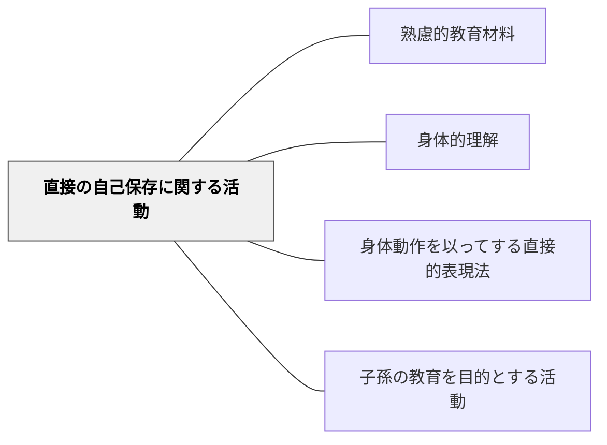

# 直接の自己保存に関する活動

> 身体・健康・命を直接守るための知識——最も根本的な教育内容。

## 背景（Context）

ハーバート・スペンサーが「何の知識が最も価値があるか」という問いに対して提示した活動分類の第一項目。生理学・保健・衛生・体育など、身体の健康を直接守るための知識・活動が含まれる。牧口常三郎もこの分類を参照している。

## 問題（Problem）

学校教育で抽象的・学術的な知識を優先するあまり、身体・健康という最も基礎的な価値が後回しになることがある。

## 力のかたち（Forces）

- 身体的健康は他の全ての活動の基盤
- 健康教育は知識だけでなく習慣形成が重要
- 個人差・家庭環境の違いへの配慮が必要

## 解決（Solution）

**身体・健康・生命に関わる知識と実践（生理学・保健・食育・体育）を教育材料に位置づけ、生活に生きる形で設計する。**

## 結果（Consequences）

- 健康リテラシーと身体感覚が育つ
- 自己管理能力の基盤が形成される

## 関連パタン

- [[パタン/熟慮的教材教具]] — 親パタン
- [[パタン/身体的理解]] — 身体を通じた学び
- [[パタン/身体動作を以ってする直接的表現法]] — 身体的表現
- [[パタン/子孫の教育を目的とする活動]] — スペンサーの第三活動カテゴリ（育児・次世代教育の知識）

## クラスター図

## Actionable Insight

- 保健・体育の授業で「この知識が明日の自分の生活をどう変えるか」を1文書かせる——知識が生活に接続されることで最も根本的な教育内容が「役立つもの」として内面化される
- 食育・睡眠・運動など日常生活に直結する内容を他教科の文脈とも結びつける——身体・健康の知識が孤立した保健の知識でなく生活全体に関わる知識として位置づけられる
- 「自分の身体の変化を1週間観察してみよう」という習慣課題を取り入れる——自己観察の習慣が健康リテラシーと自己管理能力の基盤を形成する

## 出典

- ハーバート・スペンサー（知識の分類）
- [[文献/熟慮的教育材料のパターンリスト（動画記録）]]
