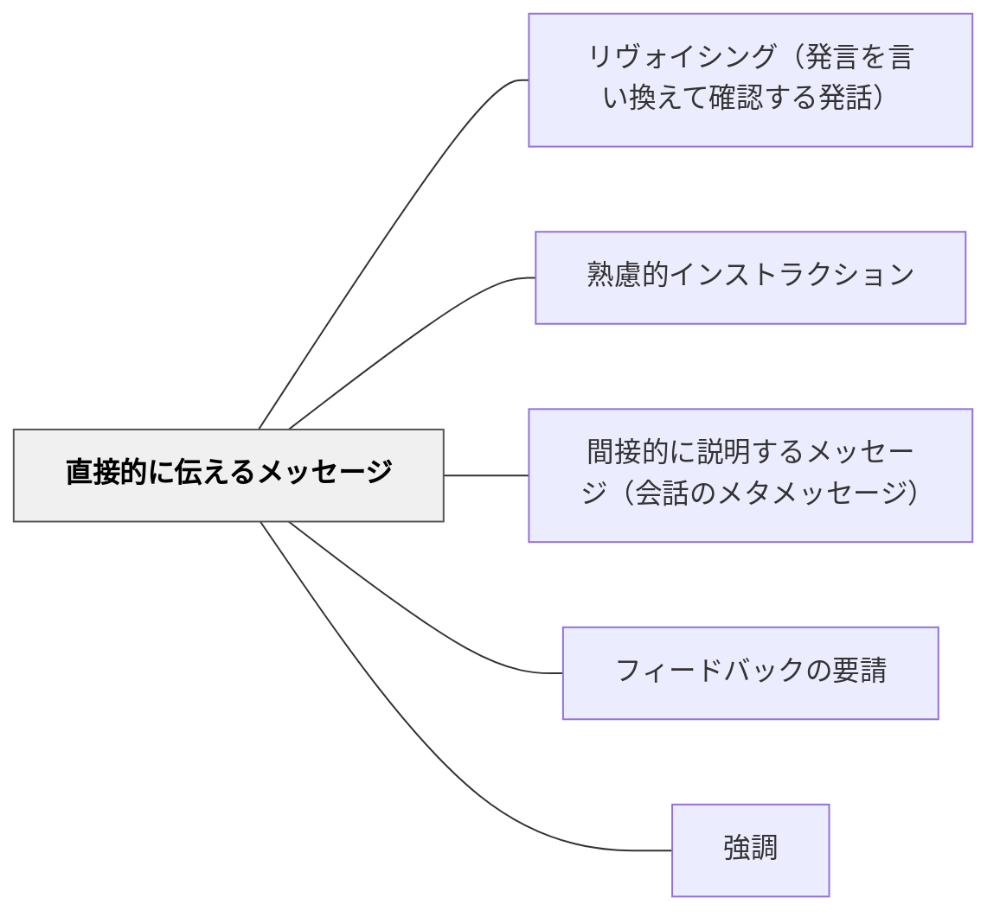

# 直接的に伝えるメッセージ

> 解釈の余地を残さず明示的に伝えることで、意図の誤解を防ぐ。

## 背景（Context）
教育の場では、教師の指示・説明・期待が学習者に正確に伝わることが重要である。伝えたつもりが伝わっていなかったり、意図と異なる受け取られ方をしたりすることは学習の妨げになる。コミュニケーション論では、意図を明示的・直接的に伝えるメッセージ形式が「直接的メッセージ」と呼ばれる。

## 問題（Problem）
遠回しな表現や暗示的な伝え方は、受け手の解釈に委ねる部分が大きく、指示の意図が学習者に届かないことがある。特に学習者が多様な文化的背景・コミュニケーション経験を持つ場合、間接的な伝え方では意図が伝わらないリスクが高まる。

## 力のかたち（Forces）
- 直接的な表現は明確で誤解が生まれにくいが、一方的・命令的に感じられることがある
- 指示内容が具体的であるほど、学習者は行動に移しやすい
- すべてを直接的に伝えると、学習者が自分で考える機会が失われる
- 文化・関係によっては直接的な表現が摩擦を生む場合もある

## 解決（Solution）
**「○○してください」「○○は禁止です」「今日の目標は○○です」のように、意図・期待・禁止事項を明示的・直接的に伝える。**

授業の冒頭で「今日のゴールは○○を理解することです」と明示する。グループワークの前に「役割分担は各自で決めてください。5分で決まらない場合はじゃんけんで決めること」のように、手順・条件・例外も具体的に述べる。何を求めているかが明確になることで、学習者は指示の解釈より課題そのものに集中できる。

## 結果（Consequences）
- 指示の意図が明確に伝わり、行動の迷いが減る
- 指示に対する共通理解が形成され、後の確認作業が減る
- 過度な直接的指示は学習者の自律的判断の機会を奪う恐れがある

## クラスター図

## Actionable Insight

- 授業の冒頭に「今日のゴールは○○を理解することです」と1文で明示する——目標が明確になることで学習者は指示の解釈より課題そのものに集中できる
- グループワーク前に「役割・時間・例外処理」まで具体的に述べてから始める——曖昧さを事前に排除することが「伝えたつもり」の誤解を防ぐ最速の方法
- 指示後に「今の指示でわからないことはある？」と確認する——確認の習慣が共通理解を保証し繰り返し指示の必要をなくす

## 出典

- 一つの教育のパタン・ランゲージ（岩井輝久）

## 関連パタン
- [[パタン/リヴォイシング（発言を言い換えて確認する発話）]]
- [[パタン/熟慮的インストラクション]] — 親パタン
- [[パタン/間接的に説明するメッセージ（会話のメタメッセージ）]] — 対比的なメッセージ形式
- [[パタン/フィードバックの要請]] — 指示後の確認技法
- [[パタン/強調]] — 重要点を際立たせる関連技法
