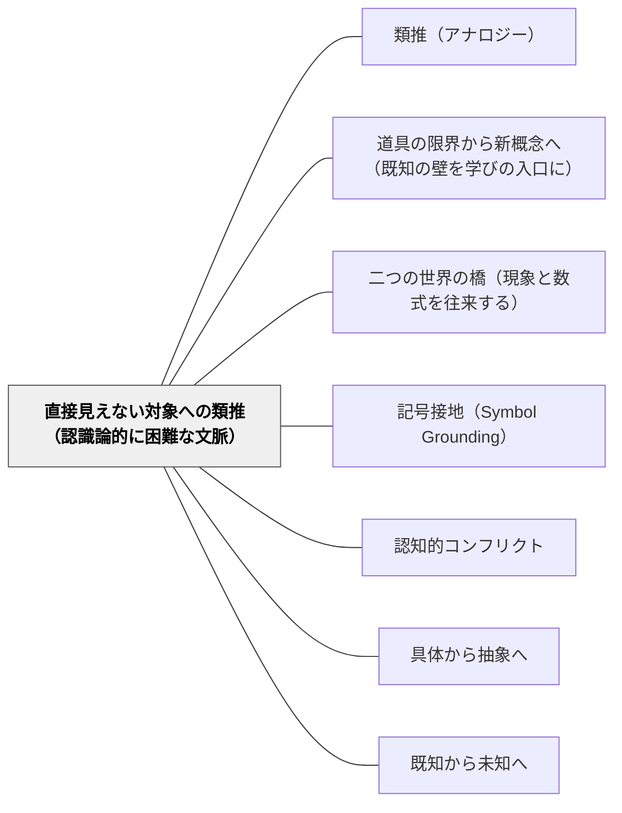

# 直接見えない対象への類推（認識論的に困難な文脈）

> 分子も、歴史の場面も、感情も、直接見ることはできない。見えない世界への唯一の認識的橋が、類推だ。

---

## [Pattern Connection]

### Nappo & Valente（2026）——認識論的に困難な文脈（epistemically impoverished contexts）

本パタンはNappo & Valente（2026）第4節「Epistemically Impoverished Contexts」の議論に基づく。

学習者が対象に直接アクセスできないとき、類推は「単なる比喩」ではなく**唯一の認識的橋**になる。この文脈には6種類がある：

| 種類 | 内容 | 教室の例 |
|---|---|---|
| **道具的** | 計測・観測できない（小さすぎる・大きすぎる） | 分子・細胞・宇宙・素粒子 |
| **時間的** | 過去または未来（直接経験できない） | 歴史的場面・恐竜・未来の気候 |
| **倫理的** | 実験が倫理的に不可能 | 人体実験・戦争の追体験 |
| **費用的** | コストが高すぎて実験不可能 | 宇宙探査・大規模自然災害 |
| **理論的** | 理論の空白があり直接説明できない | 意識・クオリア・生命の起源 |
| **計算論的** | 複雑すぎて直接計算・追跡できない | 天気予報・複雑系・大規模シミュレーション |

これらの文脈では「実際に見てみよう・やってみよう」という問いかけが原理的に不可能だ。類推が「橋」ではなく「唯一の橋」になる理由がここにある。

**特別支援教育との接続**：認知的アクセスが制限されている学習者にとって、抽象概念は「道具的に困難な文脈」に似た状況を生む。「電気は水みたい」という類推が視覚的・身体的に接地されていると、直接触れられない抽象概念への認識的橋になる。

**補強された点**：[[パタン/類推（アナロジー）]]の「類推は理解の足場」という記述に、「足場が唯一の橋になる状況の体系的分類」が加わる。

**波及するパタン**：[[パタン/道具の限界から新概念へ（既知の壁を学びの入口に）]]・[[パタン/二つの世界の橋（現象と数式を往来する）]]・[[パタン/記号接地（Symbol Grounding）]]・[[メタパタン/アブダクション（仮説形成）]]

→ [[文献/Analogical Reasoning in Science（Nappo & Valente）]]

---

## 背景（Context）

科学の授業で「分子が動く」「電子が流れる」と説明しても、学習者は分子も電子も見たことがない。歴史の授業で「江戸時代の農民の生活」を教えようとしても、タイムマシンはない。倫理の授業で「他者の痛みを理解する」ことを目標にしても、他者の感覚を直接経験することはできない。

このような「直接アクセスできない対象」を学ぶ場面は、教室の至るところにある。学習者が「なぜかわからない」と感じるのは知識が足りないのではなく、認識的な橋がない状態であることが多い。[[パタン/道具の限界から新概念へ（既知の壁を学びの入口に）]]が「既存の道具が機能しなくなる場面」を設計するのに対し、本パタンは「そもそも対象に直接触れることができない場面」を対象にする。

## 問題（Problem）

学習者が直接見たり経験したりできない対象（分子・歴史的場面・感情・宇宙・抽象概念）を学ぶとき、教師はどのように認識的なアクセスを提供できるか。

## 力のかたち（Forces）

- 直接体験が不可能な対象ほど、類推の設計が「授業の成否」を左右する
- 適切な類推がないと、学習者は言葉（記号）だけを暗記し、概念的理解に至らない
- 類推はあくまで「似ている」だけで「同じ」ではない——どこで崩れるかを意識しないと誤解が固定する
- 対象に直接アクセスできる方法（実験・観察・体験）があるなら、類推より直接経験を優先する
- 6種類の困難文脈は性質が異なる——それぞれに適した類推の種類がある

## 解決（Solution）

**対象に直接アクセスできない文脈を特定し、学習者の既有知識の中から「構造的に類似したソース（源領域）」を意図的に設計する。類推の有効範囲（どこまで成り立ち、どこで崩れるか）を授業の中で確認させる。**

---

### 6種類の文脈別の設計例

**道具的困難（分子・細胞・宇宙）**：
- 「分子はビー玉みたいなもの」→「ビー玉と分子のどこが違う？」でContrast（対比）
- 大きさ・スケールの類推は特に重要——「もし細胞が野球場の大きさなら、核は…」
- ラザフォードの原子モデル（太陽系との類推）が典型例——「電子が原子核を回る」と「惑星が太陽を回る」は属性は全く異なるが関係構造が同型

**時間的困難（歴史・未来）**：
- 「江戸時代の農民の生活は、現代の自給自足の生活に似ている」という類推の出発点
- 「今と違う点はどこか」を問うことでContrast（対比）——類推が批判的思考と同時に働く

**倫理的困難（実験不可能な場面）**：
- 「もし自分がその立場だったら？」→ 共感的類推
- 文学・物語がこの文脈での類推の最強の道具になる（ロールプレイ・ドラマ教育との接続）

**特別支援での応用**：
- 抽象的な数概念に直接アクセスできない学習者には、身体的に接地された類推が鍵
- 「かけ算は繰り返し足し算」「分数は半分に切ったケーキ」——具体的なソースを身体動作とセットで提供する
- 数の大小の感覚が育っていない場合は、「時間の長さ」「距離の遠近」など身体感覚が接地したソース領域を選ぶ

---

### 類推の崩れどころを設計する

有効な類推でも崩れる場所がある。その崩れを意図的に授業に組み込む：

1. 類推を提示し「どこが似ているか」を確認する（Abstraction）
2. 「では、どこが違うか・通用しなくなるか」を問う（Contrast）
3. 「崩れた部分を説明するには、何が必要か？」で新概念へ（→[[パタン/道具の限界から新概念へ（既知の壁を学びの入口に）]]）

この3ステップが「類推で理解した後に概念を深める」設計になる。

## 結果（Consequences）

- 直接見えない対象に「認識的に触れた」という感覚が、意欲的な学習を支える
- 類推の崩れどころを考えることで、批判的思考と概念的精密化が同時に育つ
- 特別支援の文脈では、抽象概念へのアクセス障壁を類推の設計で下げることができる
- ただし：不適切な類推は誤概念を固定する——崩れどころの確認なしに使い続けると逆効果

## 関連パタン

- [[パタン/類推（アナロジー）]] — 親パタン（類推の基本設計）
- [[パタン/道具の限界から新概念へ（既知の壁を学びの入口に）]] — 類推の崩れが新概念への入口になる（本パタンの後続）
- [[パタン/二つの世界の橋（現象と数式を往来する）]] — 構造マッピングの実装事例
- [[パタン/記号接地（Symbol Grounding）]] — 類推が成立するためには記号が身体に接地されている必要がある
- [[パタン/認知的コンフリクト]] — 類推の崩れが認知的コンフリクトを生む
- [[メタパタン/アブダクション（仮説形成）]] — 類推による仮説生成（発見的使用）
- [[パタン/具体から抽象へ]] — 具体的なソース（源領域）から抽象的なターゲットへ
- [[パタン/既知から未知へ]] — 認識的橋の基本方向

## クラスター図

## Actionable Insight

- 今週教える概念の中で「学習者が直接見ることができないもの」をリストアップする——それが類推を設計すべき場所
- 6種類の認識論的困難（道具的・時間的・倫理的・費用的・理論的・計算論的）のどれに当たるかを特定する——種類が違うと最適な類推も違う
- 「〇〇は〇〇みたい」という類推を提示した後「どこが似ていて、どこで通用しなくなるか」を必ず問う——崩れどころを探す問いが類推を批判的思考のツールにする
- 特別支援の子どもの「わからない」を「認識的橋がない状態」と捉え直す——どんな具体的なソースを用意すれば橋が架かるかを設計の問いにする

## 出典

- [[文献/Analogical Reasoning in Science（Nappo & Valente）]]

Nappo, D. & Valente, A. (2026). *Analogical Reasoning in Science*. Section 4: Epistemically Impoverished Contexts.
