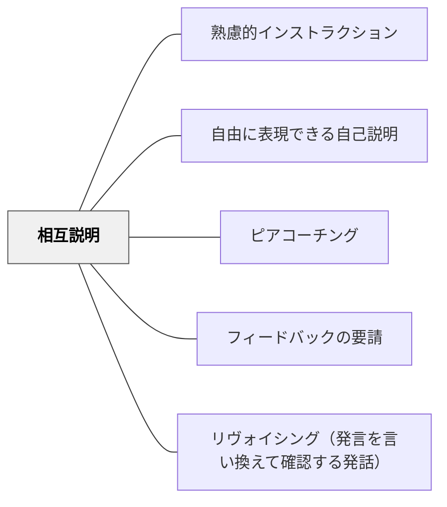

# 相互説明

> 学習者同士が説明し合うことで、語る側も聞く側も理解が深まる。

## 背景（Context）
教師が説明するだけでは、受け手は受動的になりがちである。学習者が自分の理解を他者に説明しようとするとき、理解の曖昧な部分が明確になる。教室や学習グループには、互いに教え合える関係性が存在している。

## 問題（Problem）
一方的な説明や講義では、学習者が本当に理解しているかどうかを確認しにくい。自分が「分かったつもり」でも、説明しようとすると言葉が出てこない場合がある。聞く側も、ただ聞いているだけでは理解が浅くなりやすい。

## 力のかたち（Forces）
- 説明する行為は理解を深めるが、機会が与えられないと起こらない
- 聞く側も相手の説明の正誤を判断しようとするため能動的になる
- ペアやグループという小さな単位は心理的安全性が高い
- 教師の説明より同士の説明の方が理解しやすいことがある

## 解決（Solution）
**「隣の人に説明してみてください」「グループで教え合ってください」と指示し、学習者同士で説明し合う機会を意図的に設ける。**
説明する側は「何を」「どのように」伝えるかを考えることで理解が整理される。聞く側は相手の説明を評価・補足しようとするため理解が問われる。ペアで交互に説明する形式や、知っている人が知らない人に教えるチュータリング形式など、状況に応じた形で取り入れる。活動後に全体で共有することで、多様な説明の仕方を学べる。

## 結果（Consequences）
- 説明できなかった部分が自分の理解のギャップとして可視化される
- 教師が全員の理解状況を把握する機会になる
- 学習者同士の関係性が強化され、協働的な学習文化が育まれる

## クラスター図

## Actionable Insight

- 授業中に「ペアで今の内容を交互に1分ずつ説明してみよう」を取り入れる——説明できない部分が自分の理解ギャップとして即座に可視化される
- 説明後に「聞いた側は、相手の説明で一番よかったところを1つ言おう」を添える——聞く側の能動的関与が高まり、相互説明が双方向の学習活動になる
- 「説明できなかった部分」を全体で共有する場を作る——個人の理解ギャップが集合的な学習課題として浮き彫りになり、次の指導に活かせる

## 出典

- 一つの教育のパタン・ランゲージ（岩井輝久）

## 関連パタン
- [[パタン/熟慮的インストラクション]] — 親パタン
- [[パタン/自由に表現できる自己説明]] — 自己説明の一形態
- [[パタン/ピアコーチング]] — 説明し合う文化の発展形
- [[パタン/フィードバックの要請]] — 説明後のフィードバック
- [[パタン/リヴォイシング（発言を言い換えて確認する発話）]] — 教師による発言の活用
